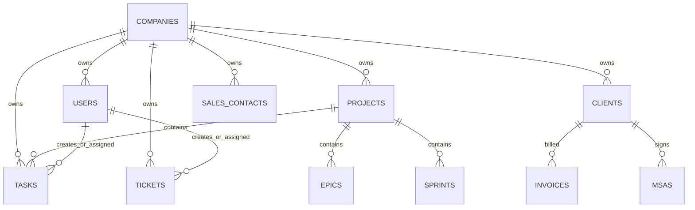

# Database Schema - SynTask

Database: `alphanexis_task_management`

This document is generated from Beanie `Document` models under `backend/app/models` and integration-owned models. Current code defines **58 unique MongoDB collection names** across **63 document classes**. The audit brief referenced 45 collections; this document uses the current code as the source of truth.

## Collection Summary

| Collection | Model Class(es) | Purpose |
|---|---|---|
| `automation_executions` | AutomationExecution | AutomationExecution persistence collection. |
| `automation_rules` | AutomationRule | AutomationRule persistence collection. |
| `billing_transactions` | BillingTransaction | Billing invoices, payment state, Razorpay metadata. |
| `changelogs` | ChangeLog | ChangeLog persistence collection. |
| `chat_messages` | ChatMessage | Chat message records. |
| `clients` | Client | Client CRM records and linked projects/documents. |
| `companies` | Company | Tenant/company registration and account metadata. |
| `company_subscriptions` | CompanySubscription | Company subscription state, module entitlements, usage counters. |
| `components` | Component | Component persistence collection. |
| `contact_sharing` | ContactSharing | Sales contact sharing permissions. |
| `conversations` | Conversation | Chat conversation metadata. |
| `epics` | Epic | Project epic records. |
| `invoices` | Invoice | Client invoice records, payments, tax, and PDF generation data. |
| `issue_links` | IssueLink | IssueLink persistence collection. |
| `issue_types` | IssueType | IssueType persistence collection. |
| `leave_requests` | LeaveRequest | Leave requests, reviewer assignment, and forwarding audit trail. |
| `meetings` | Meeting | Meeting scheduling and Zoom metadata. |
| `meta_integration_settings` | MetaIntegrationSettings | Tenant-scoped Meta connection state and encrypted tokens. |
| `meta_marketing_insights` | MetaMarketingInsight | Read-only tenant campaign performance snapshots. |
| `meta_sync_runs` | MetaSyncRun | Meta synchronization status, cursors, attempts, and redacted errors. |
| `meta_webhook_events` | MetaWebhookEvent | Durable inbound Meta event inbox with idempotency and correlation IDs. |
| `msas` | MSA | Master service agreements and signature workflow data. |
| `notifications` | Notification | In-app notification records. |
| `pages` | Page | Page persistence collection. |
| `payment_webhooks` | PaymentWebhook | Payment webhook audit records. |
| `projects` | Project | Project metadata, board columns, files, and settings. |
| `sales_business_categories` | BusinessCategory | BusinessCategory persistence collection. |
| `sales_categories` | SalesCategory | Sales product/contact category master data. |
| `sales_channels` | SalesChannel | Sales channel master data. |
| `sales_contacts` | SalesContact | Sales CRM contacts. |
| `sales_audits` | SalesAudit | Lead-scoped pre-conversion audit workspace and recommendations. |
| `sales_discoveries` | SalesDiscovery | Lead-scoped pre-conversion discovery workspace. |
| `sales_greeting_templates` | GreetingTemplate | GreetingTemplate persistence collection. |
| `sales_nationalities` | Nationality | Nationality persistence collection. |
| `sales_products` | SalesProduct | Sales product/service catalog entries. |
| `sales_prospects` | SalesProspect | Sales opportunity/prospect records. |
| `sales_reasons_for_lost` | ReasonForLost | ReasonForLost persistence collection. |
| `sales_stages` | SalesStage | Sales stage master data. |
| `sales_tags` | SalesTag | Sales tag master data. |
| `sprints` | Sprint | Project sprint records. |
| `subscription_plans` | SubscriptionPlan | Super-admin subscription plan catalog. |
| `subscriptions` | Subscription | Legacy company subscription metadata. |
| `task_comments` | TaskComment | Task comment records. |
| `tasks` | Task | Task records for projects, boards, assignments, deadlines, and comments. |
| `ticket_comments` | TicketComment | Support ticket comments. |
| `tickets` | Ticket | Support ticket records. |
| `time_logs` | TimeLog | TimeLog persistence collection. |
| `time_tracking_summaries` | TimeTrackingSummary | TimeTrackingSummary persistence collection. |
| `timesheet_entries` | TimesheetEntry | TimesheetEntry persistence collection. |
| `timesheet_summaries` | TimesheetSummary | TimesheetSummary persistence collection. |
| `usage_tracking` | UsageTracking | Monthly tenant usage counters. |
| `users` | User, SuperAdmin, Admin, Manager, Lead, Employee | Authentication identities, RBAC roles, module access, reporting hierarchy. |
| `versions` | Version | Version persistence collection. |
| `watchers` | Watcher | Watcher persistence collection. |
| `webhook_deliveries` | WebhookDelivery | WebhookDelivery persistence collection. |
| `webhooks` | Webhook | Webhook persistence collection. |
| `workflow_statuses` | WorkflowStatus | WorkflowStatus persistence collection. |
| `workflow_transitions` | WorkflowTransition | WorkflowTransition persistence collection. |
| `workflows` | Workflow | Workflow persistence collection. |

## Collections

### `automation_executions`

#### Model: `AutomationExecution`

Indexes: `['rule_id', 'company_id', 'status', 'executed_at']`

| Field | Type | Required | Indexed | Description |
|---|---|---|---|---|
| `id` | `Optional[ObjectId]` | No | Yes | Primary key |
| `revision_id` | `Optional[uuid.UUID]` | No | No | Model field |
| `rule_id` | `str` | Yes | Yes | Model field |
| `company_id` | `str` | Yes | Yes | Tenant scope key |
| `trigger_type` | `str` | Yes | No | Model field |
| `triggered_by` | `Optional[str]` | No | No | Model field |
| `entity_id` | `Optional[str]` | No | No | Model field |
| `entity_type` | `Optional[str]` | No | No | Model field |
| `status` | `str` | No | Yes | Model field |
| `error_message` | `Optional[str]` | No | No | Model field |
| `actions_executed` | `List[str]` | No | No | Model field |
| `actions_failed` | `List[str]` | No | No | Model field |
| `executed_at` | `datetime.datetime` | No | Yes | Model field |

### `automation_rules`

#### Model: `AutomationRule`

Indexes: `['company_id', 'project_id', 'trigger_type', 'is_active']`

| Field | Type | Required | Indexed | Description |
|---|---|---|---|---|
| `id` | `Optional[ObjectId]` | No | Yes | Primary key |
| `revision_id` | `Optional[uuid.UUID]` | No | No | Model field |
| `name` | `str` | Yes | No | Model field |
| `description` | `Optional[str]` | No | No | Model field |
| `company_id` | `Optional[str]` | No | Yes | Tenant scope key |
| `project_id` | `Optional[str]` | No | Yes | Model field |
| `trigger_type` | `<enum 'AutomationTriggerType` | Yes | Yes | Model field |
| `trigger_config` | `Dict[str, Any]` | No | No | Model field |
| `conditions` | `List[Dict[str, Any]]` | No | No | Model field |
| `actions` | `List[Dict[str, Any]]` | No | No | Model field |
| `is_active` | `bool` | No | Yes | Model field |
| `run_count` | `int` | No | No | Model field |
| `last_run_at` | `Optional[datetime.datetime]` | No | No | Model field |
| `stop_on_error` | `bool` | No | No | Model field |
| `continue_on_error` | `bool` | No | No | Model field |
| `created_at` | `datetime.datetime` | No | No | Creation timestamp |
| `updated_at` | `datetime.datetime` | No | No | Update timestamp |
| `created_by` | `str` | Yes | No | Model field |

### `billing_transactions`

#### Model: `BillingTransaction`

Indexes: `['company_id', 'subscription_id', 'invoice_number', 'payment_status', 'razorpay_payment_id', 'invoice_date']`

| Field | Type | Required | Indexed | Description |
|---|---|---|---|---|
| `id` | `Optional[ObjectId]` | No | Yes | Primary key |
| `revision_id` | `Optional[uuid.UUID]` | No | No | Model field |
| `company_id` | `Indexed` | Yes | Yes | Tenant scope key |
| `subscription_id` | `Optional[str]` | No | Yes | Model field |
| `invoice_number` | `Indexed` | Yes | Yes | Model field |
| `invoice_date` | `datetime.datetime` | No | Yes | Model field |
| `due_date` | `Optional[datetime.datetime]` | No | No | Model field |
| `amount` | `float` | No | No | Model field |
| `tax_amount` | `float` | No | No | Model field |
| `discount_amount` | `float` | No | No | Model field |
| `total_amount` | `float` | No | No | Model field |
| `currency` | `str` | No | No | Model field |
| `tax_rate` | `float` | No | No | Model field |
| `tax_type` | `Optional[str]` | No | No | Model field |
| `tax_id` | `Optional[str]` | No | No | Model field |
| `payment_status` | `<enum 'PaymentStatus` | No | Yes | Model field |
| `payment_method` | `Optional[app.models.billing_transaction.PaymentMethod]` | No | No | Model field |
| `payment_date` | `Optional[datetime.datetime]` | No | No | Model field |
| `razorpay_payment_id` | `Optional[str]` | No | Yes | Model field |
| `razorpay_order_id` | `Optional[str]` | No | No | Model field |
| `razorpay_invoice_id` | `Optional[str]` | No | No | Model field |
| `billing_period_start` | `Optional[datetime.datetime]` | No | No | Model field |
| `billing_period_end` | `Optional[datetime.datetime]` | No | No | Model field |
| `retry_count` | `int` | No | No | Model field |
| `last_retry_at` | `Optional[datetime.datetime]` | No | No | Model field |
| `next_retry_at` | `Optional[datetime.datetime]` | No | No | Model field |
| `notes` | `Optional[str]` | No | No | Model field |
| `failure_reason` | `Optional[str]` | No | No | Model field |
| `metadata` | `Dict[str, Any]` | No | No | Model field |
| `created_at` | `datetime.datetime` | No | No | Creation timestamp |
| `updated_at` | `datetime.datetime` | No | No | Update timestamp |

### `changelogs`

#### Model: `ChangeLog`

Indexes: `['task_id', 'company_id', 'user_id', 'created_at']`

| Field | Type | Required | Indexed | Description |
|---|---|---|---|---|
| `id` | `Optional[ObjectId]` | No | Yes | Primary key |
| `revision_id` | `Optional[uuid.UUID]` | No | No | Model field |
| `task_id` | `Indexed` | Yes | Yes | Model field |
| `company_id` | `str` | Yes | Yes | Tenant scope key |
| `user_id` | `str` | Yes | Yes | Model field |
| `user_name` | `str` | Yes | No | Model field |
| `field` | `str` | Yes | No | Model field |
| `field_type` | `str` | Yes | No | Model field |
| `old_value` | `Optional[Any]` | No | No | Model field |
| `new_value` | `Optional[Any]` | No | No | Model field |
| `old_string` | `Optional[str]` | No | No | Model field |
| `new_string` | `Optional[str]` | No | No | Model field |
| `metadata` | `Dict[str, Any]` | No | No | Model field |
| `created_at` | `datetime.datetime` | No | Yes | Creation timestamp |

### `chat_messages`

#### Model: `ChatMessage`

Indexes: `['conversation_id', 'company_id', 'sender_id', 'created_at']`

| Field | Type | Required | Indexed | Description |
|---|---|---|---|---|
| `id` | `Optional[ObjectId]` | No | Yes | Primary key |
| `revision_id` | `Optional[uuid.UUID]` | No | No | Model field |
| `conversation_id` | `Indexed` | Yes | Yes | Model field |
| `company_id` | `Indexed` | Yes | Yes | Tenant scope key |
| `sender_id` | `str` | Yes | Yes | Model field |
| `sender_name` | `str` | Yes | No | Model field |
| `sender_role` | `str` | Yes | No | Model field |
| `message_type` | `<enum 'MessageType` | No | No | Model field |
| `content` | `str` | Yes | No | Model field |
| `file_url` | `Optional[str]` | No | No | Model field |
| `file_name` | `Optional[str]` | No | No | Model field |
| `file_size` | `Optional[int]` | No | No | Model field |
| `file_type` | `Optional[str]` | No | No | Model field |
| `read_by` | `List[str]` | No | No | Model field |
| `read_at` | `dict` | No | No | Model field |
| `created_at` | `datetime.datetime` | No | Yes | Creation timestamp |
| `updated_at` | `datetime.datetime` | No | No | Update timestamp |
| `is_edited` | `bool` | No | No | Model field |
| `is_deleted` | `bool` | No | No | Model field |

### `clients`

#### Model: `Client`

Indexes: `['company_id', 'email', 'status', 'assigned_to', 'created_by']`

| Field | Type | Required | Indexed | Description |
|---|---|---|---|---|
| `id` | `Optional[ObjectId]` | No | Yes | Primary key |
| `revision_id` | `Optional[uuid.UUID]` | No | No | Model field |
| `name` | `str` | Yes | No | Model field |
| `company_id` | `Indexed` | Yes | Yes | Tenant scope key |
| `email` | `Optional[EmailStr]` | No | Yes | Model field |
| `contact` | `Optional[str]` | No | No | Model field |
| `alternate_contact` | `Optional[str]` | No | No | Model field |
| `address` | `Optional[str]` | No | No | Model field |
| `city` | `Optional[str]` | No | No | Model field |
| `state` | `Optional[str]` | No | No | Model field |
| `country` | `Optional[str]` | No | No | Model field |
| `zip_code` | `Optional[str]` | No | No | Model field |
| `status` | `<enum 'ClientStatus` | No | Yes | Model field |
| `company_name` | `Optional[str]` | No | No | Model field |
| `industry` | `Optional[str]` | No | No | Model field |
| `project_ids` | `List[str]` | No | No | Model field |
| `projects_budget` | `Dict[str, float]` | No | No | Model field |
| `projects_start_date` | `Dict[str, datetime.datetime]` | No | No | Model field |
| `projects_delivery_date` | `Dict[str, datetime.datetime]` | No | No | Model field |
| `documents` | `List[Dict[str, Any]]` | No | No | Model field |
| `notes` | `Optional[str]` | No | No | Model field |
| `tags` | `List[str]` | No | No | Model field |
| `assigned_to` | `Optional[str]` | No | Yes | Model field |
| `created_at` | `datetime.datetime` | No | No | Creation timestamp |
| `updated_at` | `datetime.datetime` | No | No | Update timestamp |
| `created_by` | `str` | Yes | Yes | Model field |

### `companies`

#### Model: `Company`

Indexes: `['name', 'email', 'status']`

| Field | Type | Required | Indexed | Description |
|---|---|---|---|---|
| `id` | `Optional[ObjectId]` | No | Yes | Primary key |
| `revision_id` | `Optional[uuid.UUID]` | No | No | Model field |
| `name` | `Indexed` | Yes | Yes | Model field |
| `email` | `Indexed` | Yes | Yes | Model field |
| `phone` | `Optional[str]` | No | No | Model field |
| `website` | `Optional[str]` | No | No | Model field |
| `address` | `Optional[str]` | No | No | Model field |
| `city` | `Optional[str]` | No | No | Model field |
| `state` | `Optional[str]` | No | No | Model field |
| `country` | `Optional[str]` | No | No | Model field |
| `zip_code` | `Optional[str]` | No | No | Model field |
| `industry` | `Optional[str]` | No | No | Model field |
| `company_size` | `Optional[str]` | No | No | Model field |
| `registration_number` | `Optional[str]` | No | No | Model field |
| `tax_id` | `Optional[str]` | No | No | Model field |
| `seats_requested` | `Optional[int]` | No | No | Model field |
| `admin_first_name` | `Optional[str]` | No | No | Model field |
| `admin_last_name` | `Optional[str]` | No | No | Model field |
| `admin_email` | `Optional[EmailStr]` | No | No | Model field |
| `contact_role` | `Optional[str]` | No | No | Model field |
| `notes` | `Optional[str]` | No | No | Model field |
| `requested_plan` | `Optional[app.models.company.SubscriptionPlan]` | No | No | Model field |
| `requested_billing_cycle` | `Optional[str]` | No | No | Model field |
| `payment_method_preference` | `Optional[str]` | No | No | Model field |
| `payment_reference` | `Optional[str]` | No | No | Model field |
| `status` | `<enum 'CompanyStatus` | No | Yes | Model field |
| `admin_id` | `Optional[str]` | No | No | Model field |
| `max_users` | `int` | No | No | Model field |
| `max_projects` | `int` | No | No | Model field |
| `max_storage_gb` | `int` | No | No | Model field |
| `created_at` | `datetime.datetime` | No | No | Creation timestamp |
| `updated_at` | `datetime.datetime` | No | No | Update timestamp |
| `approved_at` | `Optional[datetime.datetime]` | No | No | Model field |
| `approved_by` | `Optional[str]` | No | No | Model field |

### `company_subscriptions`

#### Model: `CompanySubscription`

Indexes: `['company_id', 'plan_id', 'status', 'razorpay_subscription_id']`

| Field | Type | Required | Indexed | Description |
|---|---|---|---|---|
| `id` | `Optional[ObjectId]` | No | Yes | Primary key |
| `revision_id` | `Optional[uuid.UUID]` | No | No | Model field |
| `company_id` | `Indexed` | Yes | Yes | Tenant scope key |
| `plan_id` | `Indexed` | Yes | Yes | Model field |
| `status` | `<enum 'CompanySubscriptionStatus` | No | Yes | Model field |
| `billing_cycle` | `str` | No | No | Model field |
| `amount` | `float` | No | No | Model field |
| `currency` | `str` | No | No | Model field |
| `start_date` | `datetime.datetime` | No | No | Model field |
| `end_date` | `Optional[datetime.datetime]` | No | No | Model field |
| `trial_start_date` | `Optional[datetime.datetime]` | No | No | Model field |
| `trial_end_date` | `Optional[datetime.datetime]` | No | No | Model field |
| `next_billing_date` | `Optional[datetime.datetime]` | No | No | Model field |
| `grace_period_end_date` | `Optional[datetime.datetime]` | No | No | Model field |
| `razorpay_subscription_id` | `Optional[str]` | No | Yes | Model field |
| `razorpay_customer_id` | `Optional[str]` | No | No | Model field |
| `payment_method` | `Optional[str]` | No | No | Model field |
| `last_payment_date` | `Optional[datetime.datetime]` | No | No | Model field |
| `last_payment_amount` | `Optional[float]` | No | No | Model field |
| `last_payment_status` | `Optional[str]` | No | No | Model field |
| `enabled_modules` | `List[str]` | No | No | Model field |
| `auto_renew` | `bool` | No | No | Model field |
| `cancelled_at` | `Optional[datetime.datetime]` | No | No | Model field |
| `cancellation_reason` | `Optional[str]` | No | No | Model field |
| `suspended_at` | `Optional[datetime.datetime]` | No | No | Model field |
| `suspension_reason` | `Optional[str]` | No | No | Model field |
| `current_users` | `int` | No | No | Model field |
| `current_managers` | `int` | No | No | Model field |
| `current_leads` | `int` | No | No | Model field |
| `current_employees` | `int` | No | No | Model field |
| `current_tasks` | `int` | No | No | Model field |
| `current_projects` | `int` | No | No | Model field |
| `current_tickets` | `int` | No | No | Model field |
| `current_storage_gb` | `float` | No | No | Model field |
| `current_api_requests_this_month` | `int` | No | No | Model field |
| `metadata` | `Dict[str, Any]` | No | No | Model field |
| `created_at` | `datetime.datetime` | No | No | Creation timestamp |
| `updated_at` | `datetime.datetime` | No | No | Update timestamp |

### `components`

#### Model: `Component`

Indexes: `['project_id', 'company_id', 'is_active']`

| Field | Type | Required | Indexed | Description |
|---|---|---|---|---|
| `id` | `Optional[ObjectId]` | No | Yes | Primary key |
| `revision_id` | `Optional[uuid.UUID]` | No | No | Model field |
| `name` | `str` | Yes | No | Model field |
| `description` | `Optional[str]` | No | No | Model field |
| `project_id` | `Indexed` | Yes | Yes | Model field |
| `company_id` | `str` | Yes | Yes | Tenant scope key |
| `lead_id` | `Optional[str]` | No | No | Model field |
| `assignee_type` | `str` | No | No | Model field |
| `is_active` | `bool` | No | Yes | Model field |
| `created_at` | `datetime.datetime` | No | No | Creation timestamp |
| `updated_at` | `datetime.datetime` | No | No | Update timestamp |
| `created_by` | `str` | Yes | No | Model field |

### `contact_sharing`

#### Model: `ContactSharing`

Indexes: `['contact_id', 'shared_with_user_id', 'company_id']`

| Field | Type | Required | Indexed | Description |
|---|---|---|---|---|
| `id` | `Optional[ObjectId]` | No | Yes | Primary key |
| `revision_id` | `Optional[uuid.UUID]` | No | No | Model field |
| `contact_id` | `str` | Yes | Yes | Model field |
| `shared_with_user_id` | `str` | Yes | Yes | Model field |
| `shared_by_user_id` | `str` | Yes | No | Model field |
| `access_level` | `str` | No | No | Model field |
| `company_id` | `Optional[str]` | No | Yes | Tenant scope key |
| `created_at` | `datetime.datetime` | No | No | Creation timestamp |

### `conversations`

#### Model: `Conversation`

Indexes: `['company_id', 'participants', 'created_by']`

| Field | Type | Required | Indexed | Description |
|---|---|---|---|---|
| `id` | `Optional[ObjectId]` | No | Yes | Primary key |
| `revision_id` | `Optional[uuid.UUID]` | No | No | Model field |
| `company_id` | `Indexed` | Yes | Yes | Tenant scope key |
| `participants` | `List[str]` | Yes | Yes | Model field |
| `created_by` | `str` | Yes | Yes | Model field |
| `last_message` | `Optional[str]` | No | No | Model field |
| `last_message_at` | `Optional[datetime.datetime]` | No | No | Model field |
| `last_message_by` | `Optional[str]` | No | No | Model field |
| `unread_count` | `dict` | No | No | Model field |
| `is_group` | `bool` | No | No | Model field |
| `group_name` | `Optional[str]` | No | No | Model field |
| `group_admins` | `List[str]` | No | No | Model field |
| `created_at` | `datetime.datetime` | No | No | Creation timestamp |
| `updated_at` | `datetime.datetime` | No | No | Update timestamp |

### `epics`

#### Model: `Epic`

Indexes: `['project_id', 'company_id', 'owner_id']`

| Field | Type | Required | Indexed | Description |
|---|---|---|---|---|
| `id` | `Optional[ObjectId]` | No | Yes | Primary key |
| `revision_id` | `Optional[uuid.UUID]` | No | No | Model field |
| `name` | `str` | Yes | No | Model field |
| `description` | `Optional[str]` | No | No | Model field |
| `project_id` | `Indexed` | Yes | Yes | Model field |
| `company_id` | `Indexed` | Yes | Yes | Tenant scope key |
| `created_by` | `str` | Yes | No | Model field |
| `owner_id` | `Optional[str]` | No | Yes | Model field |
| `status` | `str` | No | No | Model field |
| `start_date` | `Optional[datetime.datetime]` | No | No | Model field |
| `due_date` | `Optional[datetime.datetime]` | No | No | Model field |
| `progress_percentage` | `float` | No | No | Model field |
| `color` | `Optional[str]` | No | No | Model field |
| `created_at` | `datetime.datetime` | No | No | Creation timestamp |
| `updated_at` | `datetime.datetime` | No | No | Update timestamp |

### `invoices`

#### Model: `Invoice`

Indexes: `['company_id', 'invoice_number', 'client_id', 'invoice_type', 'status', 'invoice_date']`

| Field | Type | Required | Indexed | Description |
|---|---|---|---|---|
| `id` | `Optional[ObjectId]` | No | Yes | Primary key |
| `revision_id` | `Optional[uuid.UUID]` | No | No | Model field |
| `invoice_number` | `Indexed` | Yes | Yes | Model field |
| `company_id` | `Indexed` | Yes | Yes | Tenant scope key |
| `invoice_type` | `<enum 'InvoiceType` | No | Yes | Model field |
| `include_tax` | `bool` | No | No | Model field |
| `client_id` | `str` | Yes | Yes | Model field |
| `client_name` | `str` | Yes | No | Model field |
| `client_email` | `Optional[EmailStr]` | No | No | Model field |
| `client_contact` | `Optional[str]` | No | No | Model field |
| `client_address` | `Optional[str]` | No | No | Model field |
| `client_city` | `Optional[str]` | No | No | Model field |
| `client_state` | `Optional[str]` | No | No | Model field |
| `client_country` | `Optional[str]` | No | No | Model field |
| `client_zip_code` | `Optional[str]` | No | No | Model field |
| `client_company_name` | `Optional[str]` | No | No | Model field |
| `invoice_date` | `datetime.datetime` | No | Yes | Model field |
| `due_date` | `Optional[datetime.datetime]` | No | No | Model field |
| `items` | `List[Dict[str, Any]]` | No | No | Model field |
| `subtotal` | `float` | No | No | Model field |
| `tax_rate` | `Optional[float]` | No | No | Model field |
| `tax_amount` | `float` | No | No | Model field |
| `total_amount` | `float` | No | No | Model field |
| `currency` | `str` | No | No | Model field |
| `payments` | `List[Dict[str, Any]]` | No | No | Model field |
| `total_received` | `float` | No | No | Model field |
| `tds_amount` | `float` | No | No | Model field |
| `outstanding_amount` | `float` | No | No | Model field |
| `notes` | `Optional[str]` | No | No | Model field |
| `terms_and_conditions` | `Optional[str]` | No | No | Model field |
| `status` | `<enum 'InvoiceStatus` | No | Yes | Model field |
| `email_sent` | `bool` | No | No | Model field |
| `email_sent_at` | `Optional[datetime.datetime]` | No | No | Model field |
| `email_sent_to` | `Optional[str]` | No | No | Model field |
| `pdf_url` | `Optional[str]` | No | No | Model field |
| `project_id` | `Optional[str]` | No | No | Model field |
| `created_at` | `datetime.datetime` | No | No | Creation timestamp |
| `updated_at` | `datetime.datetime` | No | No | Update timestamp |
| `created_by` | `str` | Yes | No | Model field |

### `issue_links`

#### Model: `IssueLink`

Indexes: `['source_task_id', 'destination_task_id', 'company_id', 'link_type']`

| Field | Type | Required | Indexed | Description |
|---|---|---|---|---|
| `id` | `Optional[ObjectId]` | No | Yes | Primary key |
| `revision_id` | `Optional[uuid.UUID]` | No | No | Model field |
| `source_task_id` | `Indexed` | Yes | Yes | Model field |
| `destination_task_id` | `Indexed` | Yes | Yes | Model field |
| `company_id` | `str` | Yes | Yes | Tenant scope key |
| `link_type` | `<enum 'LinkType` | Yes | Yes | Model field |
| `is_outward` | `bool` | No | No | Model field |
| `created_at` | `datetime.datetime` | No | No | Creation timestamp |
| `created_by` | `str` | Yes | No | Model field |

### `issue_types`

#### Model: `IssueType`

Indexes: `['company_id', 'project_id', 'is_active']`

| Field | Type | Required | Indexed | Description |
|---|---|---|---|---|
| `id` | `Optional[ObjectId]` | No | Yes | Primary key |
| `revision_id` | `Optional[uuid.UUID]` | No | No | Model field |
| `name` | `str` | Yes | No | Model field |
| `description` | `Optional[str]` | No | No | Model field |
| `icon` | `Optional[str]` | No | No | Model field |
| `color` | `str` | No | No | Model field |
| `company_id` | `Optional[str]` | No | Yes | Tenant scope key |
| `project_id` | `Optional[str]` | No | Yes | Model field |
| `category` | `<enum 'IssueTypeCategory` | No | No | Model field |
| `is_active` | `bool` | No | Yes | Model field |
| `is_default` | `bool` | No | No | Model field |
| `order` | `int` | No | No | Model field |
| `created_at` | `datetime.datetime` | No | No | Creation timestamp |
| `updated_at` | `datetime.datetime` | No | No | Update timestamp |
| `created_by` | `str` | Yes | No | Model field |

### `leave_requests`

#### Model: `LeaveRequest`

Indexes: `['employee_id', 'company_id', 'employee_role', 'status', 'leave_type', 'start_date', 'end_date', 'pending_with_user_ids']`

| Field | Type | Required | Indexed | Description |
|---|---|---|---|---|
| `id` | `Optional[ObjectId]` | No | Yes | Primary key |
| `revision_id` | `Optional[uuid.UUID]` | No | No | Model field |
| `employee_id` | `Indexed` | Yes | Yes | Requester user id |
| `employee_role` | `Optional[str]` | No | Yes | Requester role at submission time |
| `company_id` | `Indexed` | Yes | Yes | Tenant scope key |
| `leave_type` | `<enum 'LeaveType` | Yes | No | Leave/WFH type |
| `start_date` | `datetime.datetime` | Yes | Yes | Leave start |
| `end_date` | `datetime.datetime` | Yes | Yes | Leave end |
| `reason` | `str` | Yes | No | Requester reason |
| `attachment_url` | `Optional[str]` | No | No | Attachment link |
| `attachment_public_id` | `Optional[str]` | No | No | Attachment cloud id |
| `status` | `<enum 'LeaveStatus` | No | Yes | pending/forwarded/approved/rejected/cancelled |
| `requested_by` | `str` | Yes | No | Requester user id |
| `reviewed_by` | `Optional[str]` | No | No | Approver/rejector user id |
| `reviewed_at` | `Optional[datetime.datetime]` | No | No | Approval/rejection timestamp |
| `review_comment` | `Optional[str]` | No | No | Approval/rejection note |
| `pending_with_user_ids` | `List[str]` | No | Yes | Current pending reviewer ids. Everyone with list visibility can view the request, but only these reviewers receive approve/reject actions. For forwarded leaves this is the set of reviewers the manager selected; for unforwarded employee/lead requests the assigned manager reviews them even when this field is empty (legacy data). |
| `forwarded_to_user_id` | `Optional[str]` | No | No | First selected forward reviewer (legacy single target) |
| `forwarded_to_user_ids` | `List[str]` | No | No | All reviewer ids selected by the manager when forwarding |
| `forwarded_by` | `Optional[str]` | No | No | Manager who forwarded the request |
| `forwarded_at` | `Optional[datetime.datetime]` | No | No | Forward timestamp |
| `forwarded_to_admin` | `bool` | No | No | Whether the request was forwarded to Admin/Sub Admin |
| `approval_history` | `List[Dict[str, Any]]` | No | No | Submitted/forwarded/approved/rejected/cancelled audit trail |
| `forward_comment` | `Optional[str]` | No | No | Reason provided when forwarding |
| `cancelled_at` | `Optional[datetime.datetime]` | No | No | Cancellation timestamp |
| `created_at` | `datetime.datetime` | No | No | Creation timestamp |
| `updated_at` | `datetime.datetime` | No | No | Update timestamp |

### `meetings`

#### Model: `Meeting`

Indexes: `['company_id', 'created_by', 'meeting_date', 'status']`

| Field | Type | Required | Indexed | Description |
|---|---|---|---|---|
| `id` | `Optional[ObjectId]` | No | Yes | Primary key |
| `revision_id` | `Optional[uuid.UUID]` | No | No | Model field |
| `title` | `str` | Yes | No | Model field |
| `description` | `Optional[str]` | No | No | Model field |
| `company_id` | `Indexed` | Yes | Yes | Tenant scope key |
| `created_by` | `str` | Yes | Yes | Model field |
| `host_id` | `str` | Yes | No | Model field |
| `participant_ids` | `List[str]` | No | No | Model field |
| `meeting_date` | `datetime.datetime` | Yes | Yes | Model field |
| `meeting_time` | `str` | Yes | No | Model field |
| `duration` | `int` | No | No | Model field |
| `zoom_meeting_id` | `Optional[str]` | No | No | Model field |
| `zoom_meeting_url` | `Optional[str]` | No | No | Model field |
| `zoom_start_url` | `Optional[str]` | No | No | Model field |
| `zoom_password` | `Optional[str]` | No | No | Model field |
| `host_video_enabled` | `bool` | No | No | Model field |
| `participant_video_enabled` | `bool` | No | No | Model field |
| `status` | `<enum 'MeetingStatus` | No | Yes | Model field |
| `created_at` | `datetime.datetime` | No | No | Creation timestamp |
| `updated_at` | `datetime.datetime` | No | No | Update timestamp |
| `started_at` | `Optional[datetime.datetime]` | No | No | Model field |
| `ended_at` | `Optional[datetime.datetime]` | No | No | Model field |

### `msas`

#### Model: `MSA`

Indexes: `['company_id', 'client_id', 'status', 'signature_token', 'created_by']`

| Field | Type | Required | Indexed | Description |
|---|---|---|---|---|
| `id` | `Optional[ObjectId]` | No | Yes | Primary key |
| `revision_id` | `Optional[uuid.UUID]` | No | No | Model field |
| `company_id` | `Indexed` | Yes | Yes | Tenant scope key |
| `client_id` | `Indexed` | Yes | Yes | Model field |
| `msa_number` | `Optional[str]` | No | No | Model field |
| `agreement_title` | `Optional[str]` | No | No | Model field |
| `effective_date` | `Optional[datetime.datetime]` | No | No | Model field |
| `company_name` | `str` | Yes | No | Model field |
| `company_address` | `Optional[str]` | No | No | Model field |
| `company_city` | `Optional[str]` | No | No | Model field |
| `company_state` | `Optional[str]` | No | No | Model field |
| `company_country` | `Optional[str]` | No | No | Model field |
| `company_zip_code` | `Optional[str]` | No | No | Model field |
| `company_cin` | `Optional[str]` | No | No | Model field |
| `company_logo_url` | `Optional[str]` | No | No | Model field |
| `header_background_color` | `Optional[str]` | No | No | Model field |
| `company_signatory_name` | `Optional[str]` | No | No | Model field |
| `company_signatory_email` | `Optional[EmailStr]` | No | No | Model field |
| `company_signature_file_url` | `Optional[str]` | No | No | Model field |
| `client_name` | `str` | Yes | No | Model field |
| `client_company_name` | `Optional[str]` | No | No | Model field |
| `client_address` | `Optional[str]` | No | No | Model field |
| `client_city` | `Optional[str]` | No | No | Model field |
| `client_state` | `Optional[str]` | No | No | Model field |
| `client_country` | `Optional[str]` | No | No | Model field |
| `client_zip_code` | `Optional[str]` | No | No | Model field |
| `client_identifier` | `Optional[str]` | No | No | Model field |
| `client_email` | `Optional[EmailStr]` | No | No | Model field |
| `client_contact` | `Optional[str]` | No | No | Model field |
| `content` | `str` | No | No | Model field |
| `staffing_company_signature` | `Optional[Dict[str, Any]]` | No | No | Model field |
| `client_signature` | `Optional[Dict[str, Any]]` | No | No | Model field |
| `stamp_image_url` | `Optional[str]` | No | No | Model field |
| `client_stamp_url` | `Optional[str]` | No | No | Model field |
| `status` | `<enum 'MSAStatus` | No | Yes | Model field |
| `email_sent` | `bool` | No | No | Model field |
| `email_sent_at` | `Optional[datetime.datetime]` | No | No | Model field |
| `email_sent_to` | `Optional[EmailStr]` | No | No | Model field |
| `signature_token` | `Optional[str]` | No | Yes | Model field |
| `signature_token_expires_at` | `Optional[datetime.datetime]` | No | No | Model field |
| `notes` | `Optional[str]` | No | No | Model field |
| `is_template` | `bool` | No | No | Model field |
| `template_name` | `Optional[str]` | No | No | Model field |
| `msa_type` | `str` | No | No | Model field |
| `created_at` | `datetime.datetime` | No | No | Creation timestamp |
| `updated_at` | `datetime.datetime` | No | No | Update timestamp |
| `created_by` | `str` | Yes | Yes | Model field |
| `completed_at` | `Optional[datetime.datetime]` | No | No | Model field |
| `sent_date` | `Optional[datetime.datetime]` | No | No | Model field |
| `signed_date` | `Optional[datetime.datetime]` | No | No | Model field |

### `notifications`

#### Model: `Notification`

Indexes: `['user_id', 'company_id', 'is_read', 'type', 'priority', 'scheduled_for']`

| Field | Type | Required | Indexed | Description |
|---|---|---|---|---|
| `id` | `Optional[ObjectId]` | No | Yes | Primary key |
| `revision_id` | `Optional[uuid.UUID]` | No | No | Model field |
| `user_id` | `Indexed` | Yes | Yes | Model field |
| `company_id` | `Optional[str]` | No | Yes | Tenant scope key |
| `type` | `<enum 'NotificationType` | Yes | Yes | Model field |
| `title` | `str` | Yes | No | Model field |
| `message` | `str` | Yes | No | Model field |
| `related_id` | `Optional[str]` | No | No | Model field |
| `related_type` | `Optional[str]` | No | No | Model field |
| `action_url` | `Optional[str]` | No | No | Model field |
| `metadata` | `Optional[Dict[str, Any]]` | No | No | Model field |
| `priority` | `str` | No | Yes | Notification priority: `info`, `medium`, `high`, or `critical` |
| `scheduled_for` | `Optional[datetime.datetime]` | No | Yes | Reminder due date bucket used for scheduled notification display |
| `toast_shown_at` | `Optional[datetime.datetime]` | No | No | Timestamp when a dashboard toast was acknowledged |
| `is_read` | `bool` | No | Yes | Model field |
| `read_at` | `Optional[datetime.datetime]` | No | No | Model field |
| `email_sent` | `bool` | No | No | Model field |
| `email_sent_at` | `Optional[datetime.datetime]` | No | No | Model field |
| `created_at` | `datetime.datetime` | No | No | Creation timestamp |

Reminder notifications store `metadata.reminder_key` as `entityType:entityId:userId:reminderType:YYYY-MM-DD`. A partial unique index on `(company_id, user_id, metadata.reminder_key)` applies only when `metadata.reminder_key` is a string, preventing duplicate reminder notifications while preserving tenant isolation and allowing legacy notifications without reminder metadata.

### `scheduled_jobs`

#### Model: `ScheduledJob`

Indexes: `['created_by', 'company_id', 'status', 'run_at', ('status', 'run_at'), ('company_id', 'status')]`

| Field | Type | Required | Indexed | Description |
|---|---|---|---|---|
| `id` | `ObjectId` | No | Yes | Primary key |
| `action_type` | `ScheduledJobActionType` | Yes | No | `CREATE_PROJECT` or `CREATE_TASK` |
| `payload` | `Dict[str, Any]` | Yes | No | Validated action payload reused by the existing project/task creation services |
| `run_at` | `datetime.datetime` | Yes | Yes | UTC execution time checked by the one-minute scheduler loop |
| `status` | `ScheduledJobStatus` | No | Yes | `PENDING`, `RUNNING`, `COMPLETED`, `FAILED`, or `CANCELLED` |
| `created_by` | `str` | Yes | Yes | User ID of the scheduler/creator |
| `company_id` | `Optional[str]` | No | Yes | Tenant scope key used for all list/action authorization |
| `retry_count` | `int` | No | No | Retry attempts tracked by the execution worker |
| `error` | `Optional[str]` | No | No | Last execution failure detail |
| `notes` | `Optional[str]` | No | No | User-provided schedule notes |
| `created_at` | `datetime.datetime` | No | No | Creation timestamp |
| `completed_at` | `Optional[datetime.datetime]` | No | No | Completion, failure terminal, or cancellation timestamp |

### `pages`

#### Model: `Page`

Indexes: `['company_id', 'project_id', 'created_by', 'status', 'parent_page_id', 'space_id']`

| Field | Type | Required | Indexed | Description |
|---|---|---|---|---|
| `id` | `Optional[ObjectId]` | No | Yes | Primary key |
| `revision_id` | `Optional[uuid.UUID]` | No | No | Model field |
| `title` | `str` | Yes | No | Model field |
| `content` | `str` | Yes | No | Model field |
| `company_id` | `Indexed` | Yes | Yes | Tenant scope key |
| `project_id` | `Optional[str]` | No | Yes | Model field |
| `created_by` | `str` | Yes | Yes | Model field |
| `created_by_name` | `Optional[str]` | No | No | Model field |
| `updated_by` | `Optional[str]` | No | No | Model field |
| `updated_by_name` | `Optional[str]` | No | No | Model field |
| `status` | `<enum 'PageStatus` | No | Yes | Model field |
| `template` | `Optional[str]` | No | No | Model field |
| `parent_page_id` | `Optional[str]` | No | Yes | Model field |
| `space_id` | `Optional[str]` | No | Yes | Model field |
| `labels` | `List[str]` | No | No | Model field |
| `attachments` | `List[str]` | No | No | Model field |
| `watchers` | `List[str]` | No | No | Model field |
| `created_at` | `datetime.datetime` | No | No | Creation timestamp |
| `updated_at` | `datetime.datetime` | No | No | Update timestamp |
| `published_at` | `Optional[datetime.datetime]` | No | No | Model field |

### `payment_webhooks`

#### Model: `PaymentWebhook`

Indexes: `['razorpay_event_id', 'event_type', 'status', 'company_id', 'razorpay_payment_id']`

| Field | Type | Required | Indexed | Description |
|---|---|---|---|---|
| `id` | `Optional[ObjectId]` | No | Yes | Primary key |
| `revision_id` | `Optional[uuid.UUID]` | No | No | Model field |
| `razorpay_event_id` | `Optional[str]` | No | Yes | Model field |
| `razorpay_entity` | `Optional[str]` | No | No | Model field |
| `event_type` | `<enum 'WebhookEventType` | Yes | Yes | Model field |
| `company_id` | `Optional[str]` | No | Yes | Tenant scope key |
| `subscription_id` | `Optional[str]` | No | No | Model field |
| `transaction_id` | `Optional[str]` | No | No | Model field |
| `razorpay_payment_id` | `Optional[str]` | No | Yes | Model field |
| `razorpay_subscription_id` | `Optional[str]` | No | No | Model field |
| `payload` | `Dict[str, Any]` | No | No | Model field |
| `status` | `<enum 'WebhookStatus` | No | Yes | Model field |
| `processed_at` | `Optional[datetime.datetime]` | No | No | Model field |
| `error_message` | `Optional[str]` | No | No | Model field |
| `retry_count` | `int` | No | No | Model field |
| `created_at` | `datetime.datetime` | No | No | Creation timestamp |
| `updated_at` | `datetime.datetime` | No | No | Update timestamp |

### `projects`

#### Model: `Project`

Indexes: `['company_id', 'key', 'project_id', 'status', 'lead_id', 'created_by', 'assigned_to', 'delivery_date']`

| Field | Type | Required | Indexed | Description |
|---|---|---|---|---|
| `id` | `Optional[ObjectId]` | No | Yes | Primary key |
| `revision_id` | `Optional[uuid.UUID]` | No | No | Model field |
| `name` | `str` | Yes | No | Model field |
| `key` | `Indexed` | Yes | Yes | Model field |
| `project_id` | `Optional[Indexed]` | No | Yes | Model field |
| `description` | `Optional[str]` | No | No | Model field |
| `company_id` | `Indexed` | Yes | Yes | Tenant scope key |
| `type` | `<enum 'ProjectType` | No | No | Model field |
| `status` | `<enum 'ProjectStatus` | No | Yes | Model field |
| `lead_id` | `Optional[str]` | No | Yes | Model field |
| `assigned_to` | `Optional[str]` | No | Yes | Model field |
| `assigned_by` | `Optional[str]` | No | No | Model field |
| `assigned_at` | `Optional[datetime.datetime]` | No | No | Model field |
| `team_member_ids` | `List[str]` | No | No | Model field |
| `default_assignee` | `Optional[str]` | No | No | Model field |
| `notification_settings` | `Dict[str, Any]` | No | No | Model field |
| `start_date` | `Optional[datetime.datetime]` | No | No | Model field |
| `delivery_date` | `Optional[datetime.datetime]` | No | Yes | Model field |
| `end_date` | `Optional[datetime.datetime]` | No | No | Model field |
| `avatar` | `Optional[str]` | No | No | Model field |
| `category` | `Optional[str]` | No | No | Model field |
| `files` | `List[Dict[str, Any]]` | No | No | Model field |
| `board_columns` | `List[Dict[str, Any]]` | No | No | Model field |
| `created_at` | `datetime.datetime` | No | No | Creation timestamp |
| `updated_at` | `datetime.datetime` | No | No | Update timestamp |
| `created_by` | `str` | Yes | Yes | Model field |

### `sales_business_categories`

#### Model: `BusinessCategory`

Indexes: `['company_id', 'deleted']`

| Field | Type | Required | Indexed | Description |
|---|---|---|---|---|
| `id` | `Optional[ObjectId]` | No | Yes | Primary key |
| `revision_id` | `Optional[uuid.UUID]` | No | No | Model field |
| `name` | `Indexed` | Yes | Yes | Model field |
| `company_id` | `Optional[str]` | No | Yes | Tenant scope key |
| `deleted` | `bool` | No | Yes | Model field |
| `created_at` | `datetime.datetime` | No | No | Creation timestamp |

### `sales_categories`

#### Model: `SalesCategory`

Indexes: `['company_id', 'name', 'deleted']`

| Field | Type | Required | Indexed | Description |
|---|---|---|---|---|
| `id` | `Optional[ObjectId]` | No | Yes | Primary key |
| `revision_id` | `Optional[uuid.UUID]` | No | No | Model field |
| `name` | `Indexed` | Yes | Yes | Model field |
| `company_id` | `Optional[str]` | No | Yes | Tenant scope key |
| `created_by` | `Optional[str]` | No | No | Model field |
| `deleted` | `bool` | No | Yes | Model field |
| `created_at` | `datetime.datetime` | No | No | Creation timestamp |
| `updated_at` | `datetime.datetime` | No | No | Update timestamp |

### `sales_channels`

#### Model: `SalesChannel`

Indexes: `['company_id', 'deleted']`

| Field | Type | Required | Indexed | Description |
|---|---|---|---|---|
| `id` | `Optional[ObjectId]` | No | Yes | Primary key |
| `revision_id` | `Optional[uuid.UUID]` | No | No | Model field |
| `name` | `Indexed` | Yes | Yes | Model field |
| `company_id` | `Optional[str]` | No | Yes | Tenant scope key |
| `deleted` | `bool` | No | Yes | Model field |
| `created_at` | `datetime.datetime` | No | No | Creation timestamp |

### `sales_contacts`

#### Model: `SalesContact`

Indexes: `['company_id', 'created_by', ('country_code', 'phone'), 'deleted', 'email', 'company_name']`

| Field | Type | Required | Indexed | Description |
|---|---|---|---|---|
| `id` | `Optional[ObjectId]` | No | Yes | Primary key |
| `revision_id` | `Optional[uuid.UUID]` | No | No | Model field |
| `first_name` | `str` | Yes | No | Model field |
| `last_name` | `str` | Yes | No | Model field |
| `country_code` | `str` | Yes | Yes | Model field |
| `phone` | `Indexed` | Yes | Yes | Model field |
| `email` | `Optional[EmailStr]` | No | Yes | Model field |
| `company_name` | `Optional[str]` | No | Yes | Model field |
| `gst_no` | `Optional[str]` | No | No | Model field |
| `brand_name` | `Optional[List[str]]` | No | No | Model field |
| `business_category` | `Optional[List[str]]` | No | No | Model field |
| `area` | `Optional[str]` | No | No | Model field |
| `address` | `Optional[str]` | No | No | Model field |
| `landmark` | `Optional[str]` | No | No | Model field |
| `google_map_link` | `Optional[str]` | No | No | Model field |
| `city` | `Optional[str]` | No | No | Model field |
| `state` | `Optional[str]` | No | No | Model field |
| `country` | `Optional[str]` | No | No | Model field |
| `zipcode` | `Optional[str]` | No | No | Model field |
| `designation` | `Optional[str]` | No | No | Model field |
| `channel` | `Optional[str]` | No | No | Model field |
| `relationship_type` | `Optional[str]` | No | No | Model field |
| `nationality` | `Optional[List[str]]` | No | No | Model field |
| `language` | `Optional[List[str]]` | No | No | Model field |
| `owner_name` | `Optional[str]` | No | No | Model field |
| `owner_contact_no` | `Optional[str]` | No | No | Model field |
| `tag` | `Optional[List[str]]` | No | No | Model field |
| `greeting_preference` | `Optional[str]` | No | No | Model field |
| `birthday` | `Optional[datetime.datetime]` | No | No | Model field |
| `anniversary` | `Optional[datetime.datetime]` | No | No | Model field |
| `company_id` | `Optional[str]` | No | Yes | Tenant scope key |
| `created_by` | `Optional[str]` | No | Yes | Model field |
| `deleted` | `bool` | No | Yes | Model field |
| `created_at` | `datetime.datetime` | No | No | Creation timestamp |
| `updated_at` | `datetime.datetime` | No | No | Update timestamp |

### `sales_greeting_templates`

#### Model: `GreetingTemplate`

Indexes: `['company_id', 'greeting_type', 'deleted']`

| Field | Type | Required | Indexed | Description |
|---|---|---|---|---|
| `id` | `Optional[ObjectId]` | No | Yes | Primary key |
| `revision_id` | `Optional[uuid.UUID]` | No | No | Model field |
| `greeting_type` | `str` | Yes | Yes | Model field |
| `message` | `str` | Yes | No | Model field |
| `company_id` | `Optional[str]` | No | Yes | Tenant scope key |
| `deleted` | `bool` | No | Yes | Model field |
| `created_at` | `datetime.datetime` | No | No | Creation timestamp |

### `sales_nationalities`

#### Model: `Nationality`

Indexes: `['company_id', 'deleted']`

| Field | Type | Required | Indexed | Description |
|---|---|---|---|---|
| `id` | `Optional[ObjectId]` | No | Yes | Primary key |
| `revision_id` | `Optional[uuid.UUID]` | No | No | Model field |
| `name` | `Indexed` | Yes | Yes | Model field |
| `company_id` | `Optional[str]` | No | Yes | Tenant scope key |
| `deleted` | `bool` | No | Yes | Model field |
| `created_at` | `datetime.datetime` | No | No | Creation timestamp |

### `sales_products`

#### Model: `SalesProduct`

Indexes: `['company_id', 'category_id', 'name', 'deleted']`

| Field | Type | Required | Indexed | Description |
|---|---|---|---|---|
| `id` | `Optional[ObjectId]` | No | Yes | Primary key |
| `revision_id` | `Optional[uuid.UUID]` | No | No | Model field |
| `name` | `Indexed` | Yes | Yes | Model field |
| `category_id` | `Optional[str]` | No | Yes | Model field |
| `rate` | `float` | No | No | Model field |
| `unit` | `str` | No | No | Model field |
| `state` | `Optional[str]` | No | No | Model field |
| `city` | `Optional[str]` | No | No | Model field |
| `company_id` | `Optional[str]` | No | Yes | Tenant scope key |
| `created_by` | `Optional[str]` | No | No | Model field |
| `deleted` | `bool` | No | Yes | Model field |
| `created_at` | `datetime.datetime` | No | No | Creation timestamp |
| `updated_at` | `datetime.datetime` | No | No | Update timestamp |

### `sales_discoveries`

#### Model: `SalesDiscovery`

Indexes: unique `('company_id', 'lead_id')`, plus `('company_id', 'status', 'updated_at')`.

| Field | Type | Required | Indexed | Description |
|---|---|---|---|---|
| `company_id` | `str` | Yes | Yes | Tenant scope key |
| `lead_id` | `str` | Yes | Yes | Existing `sales_prospects` lead reference |
| `status` | `SalesWorkspaceStatus` | No | Yes | `draft`, `in_progress`, or `completed` |
| `business_information` | `Dict[str, Any]` | No | No | Structured business profile; does not duplicate authoritative lead identity fields |
| `current_marketing` | `Dict[str, Any]` | No | No | Website/social/current activity and spend snapshot |
| `problems` | `Dict[str, Any]` | No | No | Selected pain points plus notes |
| `goals` | `Dict[str, Any]` | No | No | Primary goal, secondary goals, expected outcome, timeframe |
| `budget` | `Dict[str, Any]` | No | No | Budget context; `SalesProspect.budget` remains authoritative for numeric budget |
| `decision_maker` | `Dict[str, Any]` | No | No | Decision-maker process/details; `SalesProspect.decision_maker` remains authoritative for the primary name |
| `competitors` | `List[Dict[str, Any]]` | No | No | Structured competitor references |
| `timeline` | `Dict[str, Any]` | No | No | Start/decision/duration/urgency details; `SalesProspect.timeline` remains authoritative for the primary timeline |
| `summary` | `Dict[str, Any]` | No | No | Salesperson summary and recommended action |
| `completion` | `Dict[str, Any]` | No | No | Calculated percent/checklist snapshot |
| `version` | `int` | No | No | Incremented on partial update for quotation source snapshots |
| `created_by`, `updated_by`, `completed_by` | `Optional[str]` | No | No | User IDs for auditability |
| `created_at`, `updated_at`, `completed_at` | `datetime` | No | No | Lifecycle timestamps |

### `sales_audits`

#### Model: `SalesAudit`

Indexes: unique `('company_id', 'lead_id')`, plus `('company_id', 'status', 'updated_at')`.

| Field | Type | Required | Indexed | Description |
|---|---|---|---|---|
| `company_id` | `str` | Yes | Yes | Tenant scope key |
| `lead_id` | `str` | Yes | Yes | Existing `sales_prospects` lead reference |
| `status` | `SalesWorkspaceStatus` | No | Yes | `draft`, `in_progress`, or `completed` |
| `audit_source` | `str` | No | No | `manual` now; future-compatible with `ai` or `hybrid` |
| `website` | `Dict[str, Any]` | No | No | Website audit observations |
| `google_presence` | `Dict[str, Any]` | No | No | Google Business Profile/local visibility observations |
| `social_media` | `Dict[str, Any]` | No | No | Channel observations |
| `seo` | `Dict[str, Any]` | No | No | SEO findings designed for future crawler/AI population |
| `competitors` | `List[Dict[str, Any]]` | No | No | Competitor audit observations |
| `swot` | `Dict[str, Any]` | No | No | Strengths, weaknesses, opportunities, risks lists |
| `recommendations` | `List[Dict[str, Any]]` | No | No | Structured recommendation cards with priority, impact, suggested service, and proposal inclusion flag |
| `findings` | `List[Dict[str, Any]]` | No | No | Future-compatible finding records with source/confidence/review metadata |
| `completion` | `Dict[str, Any]` | No | No | Calculated percent/checklist snapshot |
| `version` | `int` | No | No | Incremented on partial update for quotation source snapshots |
| `created_by`, `updated_by`, `completed_by` | `Optional[str]` | No | No | User IDs for auditability |
| `created_at`, `updated_at`, `completed_at` | `datetime` | No | No | Lifecycle timestamps |

### `sales_prospects`

#### Model: `SalesProspect`

Indexes: includes a partial unique `('company_id', 'meta_lead_id')` index for Meta Lead Ads replay protection.

| Field | Type | Required | Indexed | Description |
|---|---|---|---|---|
| `id` | `Optional[ObjectId]` | No | Yes | Primary key |
| `revision_id` | `Optional[uuid.UUID]` | No | No | Model field |
| `first_name` | `str` | Yes | No | Model field |
| `last_name` | `str` | Yes | No | Model field |
| `prospect_name` | `str` | Yes | No | Model field |
| `country_code` | `str` | Yes | Yes | Model field |
| `phone` | `Optional[Indexed[str]]` | No | Yes | Model field. Optional so bulk file import can create rows without a mobile number (no unique index — duplicates allowed). |
| `email` | `Optional[str]` | No | No | Model field. Stored as a plain string on purpose — legacy/imported records may carry non-email values and reads must never 500. Write paths sanitize via `LeadEngine._sanitize_email`; invalid values are stored as `None`. Run `scripts/cleanup_invalid_lead_emails.py` once to clear existing dirty values. |
| `contact_id` | `Optional[str]` | No | Yes | Model field |
| `category_id` | `Optional[str]` | No | Yes | Model field |
| `product_ids` | `List[str]` | No | No | Model field |
| `interest_level` | `<enum 'InterestLevel` | No | No | Model field |
| `estimated_close_date` | `Optional[datetime.datetime]` | No | No | Model field |
| `assigned_to` | `str` | Yes | Yes | Model field |
| `assigned_by` | `Optional[str]` | No | Yes | Model field |
| `referred_by` | `Optional[str]` | No | No | User ID of the employee/manager who referred the lead (optional) |
| `current_stage` | `str` | No | Yes | Model field |
| `due_date` | `Optional[datetime.datetime]` | No | No | Model field |
| `due_time` | `Optional[str]` | No | No | Model field |
| `remark` | `Optional[str]` | No | No | Model field |
| `company_name` | `Optional[str]` | No | No | Model field |
| `relationship_type` | `Optional[str]` | No | No | Model field |
| `channel` | `Optional[str]` | No | No | Model field |
| `meta_lead_id` | `Optional[str]` | No | Yes | Tenant-scoped Meta replay key |
| `meta_campaign_id` | `Optional[str]` | No | No | Meta campaign attribution |
| `meta_adset_id` | `Optional[str]` | No | No | Meta ad-set attribution |
| `meta_ad_id` | `Optional[str]` | No | No | Meta ad attribution |
| `meta_form_id` | `Optional[str]` | No | No | Meta Lead Ads form attribution |
| `meta_created_time` | `Optional[datetime.datetime]` | No | No | Provider lead creation time |
| `meta_consent` | `Optional[bool]` | No | No | Provider consent value when supplied |
| `meta_attribution` | `Dict[str, Any]` | No | No | Provider attribution snapshot |
| `designation` | `Optional[str]` | No | No | Model field |
| `nationality` | `Optional[List[str]]` | No | No | Model field |
| `language` | `Optional[List[str]]` | No | No | Model field |
| `owner_name` | `Optional[str]` | No | No | Model field |
| `owner_contact_no` | `Optional[str]` | No | No | Model field |
| `tag` | `Optional[List[str]]` | No | No | Model field |
| `greeting_preference` | `Optional[str]` | No | No | Model field |
| `status` | `<enum 'ProspectStatus` | No | Yes | Model field |
| `closed_date` | `Optional[datetime.datetime]` | No | No | Model field |
| `closed_by` | `Optional[str]` | No | No | Model field |
| `reason_for_lost` | `Optional[str]` | No | No | Model field |
| `won_amount` | `Optional[float]` | No | No | Deal amount; also reused as Negotiation final agreed amount |
| `negotiation_status` | `Optional[str]` | No | No | Negotiation inner status (`negotiation_started`, `waiting_client`, `waiting_internal`, `discount_approval`, `final_offer`, `accepted`, `rejected`) |
| `negotiation_notes` | `Optional[str]` | No | No | Negotiation notes |
| `customer_counter_offer` | `Optional[float]` | No | No | Customer counter-offer amount |
| `discount` | `Optional[float]` | No | No | Negotiated discount amount |
| `final_scope` | `Optional[str]` | No | No | Final negotiated scope |
| `payment_terms` | `Optional[str]` | No | No | Final negotiated payment terms |
| `client_conditions` | `Optional[str]` | No | No | Client conditions captured during negotiation |
| `accepted_quotation_reference` | `Optional[str]` | No | No | Accepted quotation/document reference shown in Negotiation workspace |
| `company_id` | `Optional[str]` | No | Yes | Tenant scope key |
| `created_by` | `Optional[str]` | No | No | Model field |
| `deleted` | `bool` | No | Yes | Model field |
| `created_at` | `datetime.datetime` | No | No | Creation timestamp |
| `updated_at` | `datetime.datetime` | No | No | Update timestamp |

### `sales_reasons_for_lost`

#### Model: `ReasonForLost`

Indexes: `['company_id', 'deleted']`

| Field | Type | Required | Indexed | Description |
|---|---|---|---|---|
| `id` | `Optional[ObjectId]` | No | Yes | Primary key |
| `revision_id` | `Optional[uuid.UUID]` | No | No | Model field |
| `name` | `Indexed` | Yes | Yes | Model field |
| `company_id` | `Optional[str]` | No | Yes | Tenant scope key |
| `deleted` | `bool` | No | Yes | Model field |
| `created_at` | `datetime.datetime` | No | No | Creation timestamp |

### `sales_stages`

#### Model: `SalesStage`

Indexes: `['company_id', 'deleted', 'order']`

| Field | Type | Required | Indexed | Description |
|---|---|---|---|---|
| `id` | `Optional[ObjectId]` | No | Yes | Primary key |
| `revision_id` | `Optional[uuid.UUID]` | No | No | Model field |
| `name` | `Indexed` | Yes | Yes | Model field |
| `order` | `int` | No | Yes | Model field |
| `company_id` | `Optional[str]` | No | Yes | Tenant scope key |
| `is_default` | `bool` | No | No | Model field |
| `deleted` | `bool` | No | Yes | Model field |
| `created_at` | `datetime.datetime` | No | No | Creation timestamp |

### `sales_tags`

#### Model: `SalesTag`

Indexes: `['company_id', 'deleted']`

| Field | Type | Required | Indexed | Description |
|---|---|---|---|---|
| `id` | `Optional[ObjectId]` | No | Yes | Primary key |
| `revision_id` | `Optional[uuid.UUID]` | No | No | Model field |
| `name` | `Indexed` | Yes | Yes | Model field |
| `company_id` | `Optional[str]` | No | Yes | Tenant scope key |
| `deleted` | `bool` | No | Yes | Model field |
| `created_at` | `datetime.datetime` | No | No | Creation timestamp |

### `sprints`

#### Model: `Sprint`

Indexes: `['project_id', 'company_id', 'state', 'start_date', 'end_date']`

| Field | Type | Required | Indexed | Description |
|---|---|---|---|---|
| `id` | `Optional[ObjectId]` | No | Yes | Primary key |
| `revision_id` | `Optional[uuid.UUID]` | No | No | Model field |
| `name` | `str` | Yes | No | Model field |
| `project_id` | `Indexed` | Yes | Yes | Model field |
| `company_id` | `Indexed` | Yes | Yes | Tenant scope key |
| `goal` | `Optional[str]` | No | No | Model field |
| `start_date` | `datetime.datetime` | Yes | Yes | Model field |
| `end_date` | `datetime.datetime` | Yes | Yes | Model field |
| `state` | `str` | No | Yes | Model field |
| `team_member_ids` | `List[str]` | No | No | Model field |
| `completed_at` | `Optional[datetime.datetime]` | No | No | Model field |
| `created_at` | `datetime.datetime` | No | No | Creation timestamp |
| `updated_at` | `datetime.datetime` | No | No | Update timestamp |
| `created_by` | `str` | Yes | No | Model field |

### `subscription_plans`

#### Model: `SubscriptionPlan`

Indexes: `['name', 'status', 'display_order']`

| Field | Type | Required | Indexed | Description |
|---|---|---|---|---|
| `id` | `Optional[ObjectId]` | No | Yes | Primary key |
| `revision_id` | `Optional[uuid.UUID]` | No | No | Model field |
| `name` | `Indexed` | Yes | Yes | Model field |
| `description` | `Optional[str]` | No | No | Model field |
| `status` | `<enum 'PlanStatus` | No | Yes | Model field |
| `price_monthly` | `float` | No | No | Model field |
| `price_yearly` | `float` | No | No | Model field |
| `currency` | `str` | No | No | Model field |
| `max_users` | `Optional[int]` | No | No | Model field |
| `max_managers` | `Optional[int]` | No | No | Model field |
| `max_leads` | `Optional[int]` | No | No | Model field |
| `max_employees` | `Optional[int]` | No | No | Model field |
| `max_tasks` | `Optional[int]` | No | No | Model field |
| `max_projects` | `Optional[int]` | No | No | Model field |
| `max_tickets` | `Optional[int]` | No | No | Model field |
| `max_storage_gb` | `Optional[int]` | No | No | Model field |
| `max_api_requests_per_month` | `Optional[int]` | No | No | Model field |
| `enabled_modules` | `List[str]` | No | No | Model field |
| `has_trial` | `bool` | No | No | Model field |
| `trial_days` | `int` | No | No | Model field |
| `grace_period_days` | `int` | No | No | Model field |
| `allow_upgrade` | `bool` | No | No | Model field |
| `allow_downgrade` | `bool` | No | No | Model field |
| `proration_enabled` | `bool` | No | No | Model field |
| `display_order` | `int` | No | Yes | Model field |
| `is_popular` | `bool` | No | No | Model field |
| `features` | `List[str]` | No | No | Model field |
| `metadata` | `Dict[str, Any]` | No | No | Model field |
| `created_at` | `datetime.datetime` | No | No | Creation timestamp |
| `updated_at` | `datetime.datetime` | No | No | Update timestamp |
| `created_by` | `Optional[str]` | No | No | Model field |
| `deleted` | `bool` | No | No | Model field |

### `subscriptions`

#### Model: `Subscription`

Indexes: `['company_id', 'status', 'plan']`

| Field | Type | Required | Indexed | Description |
|---|---|---|---|---|
| `id` | `Optional[ObjectId]` | No | Yes | Primary key |
| `revision_id` | `Optional[uuid.UUID]` | No | No | Model field |
| `company_id` | `Indexed` | Yes | Yes | Tenant scope key |
| `plan` | `<enum 'SubscriptionPlan` | No | Yes | Model field |
| `status` | `<enum 'SubscriptionStatus` | No | Yes | Model field |
| `amount` | `float` | No | No | Model field |
| `currency` | `str` | No | No | Model field |
| `billing_cycle` | `str` | No | No | Model field |
| `start_date` | `datetime.datetime` | No | No | Model field |
| `end_date` | `Optional[datetime.datetime]` | No | No | Model field |
| `trial_end_date` | `Optional[datetime.datetime]` | No | No | Model field |
| `next_billing_date` | `Optional[datetime.datetime]` | No | No | Model field |
| `payment_method` | `Optional[str]` | No | No | Model field |
| `last_payment_date` | `Optional[datetime.datetime]` | No | No | Model field |
| `last_payment_amount` | `Optional[float]` | No | No | Model field |
| `stripe_subscription_id` | `Optional[str]` | No | No | Model field |
| `razorpay_subscription_id` | `Optional[str]` | No | No | Model field |
| `current_users` | `int` | No | No | Model field |
| `current_projects` | `int` | No | No | Model field |
| `current_storage_gb` | `float` | No | No | Model field |
| `auto_renew` | `bool` | No | No | Model field |
| `cancelled_at` | `Optional[datetime.datetime]` | No | No | Model field |
| `created_at` | `datetime.datetime` | No | No | Creation timestamp |
| `updated_at` | `datetime.datetime` | No | No | Update timestamp |

### `task_comments`

#### Model: `TaskComment`

Indexes: `['task_id', 'user_id', 'company_id']`

| Field | Type | Required | Indexed | Description |
|---|---|---|---|---|
| `id` | `Optional[ObjectId]` | No | Yes | Primary key |
| `revision_id` | `Optional[uuid.UUID]` | No | No | Model field |
| `task_id` | `Indexed` | Yes | Yes | Model field |
| `company_id` | `str` | Yes | Yes | Tenant scope key |
| `user_id` | `str` | Yes | Yes | Model field |
| `user_name` | `str` | Yes | No | Model field |
| `content` | `str` | Yes | No | Model field |
| `attachments` | `List[str]` | No | No | Model field |
| `mentioned_users` | `List[str]` | No | No | Model field |
| `created_at` | `datetime.datetime` | No | No | Creation timestamp |
| `updated_at` | `datetime.datetime` | No | No | Update timestamp |
| `is_edited` | `bool` | No | No | Model field |

### `tasks`

#### Model: `Task`

Indexes: `['company_id', 'created_by', 'assigned_to', 'status', 'priority', 'project_id']`

| Field | Type | Required | Indexed | Description |
|---|---|---|---|---|
| `id` | `Optional[ObjectId]` | No | Yes | Primary key |
| `revision_id` | `Optional[uuid.UUID]` | No | No | Model field |
| `title` | `str` | Yes | No | Model field |
| `description` | `Optional[str]` | No | No | Model field |
| `company_id` | `Indexed` | Yes | Yes | Tenant scope key |
| `project_id` | `Optional[str]` | No | Yes | Model field |
| `created_by` | `str` | Yes | Yes | Model field |
| `assigned_to` | `Optional[str]` | No | Yes | Model field |
| `assigned_by` | `Optional[str]` | No | No | Model field |
| `status` | `<enum 'TaskStatus` | No | Yes | Model field |
| `priority` | `<enum 'TaskPriority` | No | Yes | Model field |
| `due_date` | `Optional[datetime.datetime]` | No | No | Model field |
| `start_date` | `Optional[datetime.datetime]` | No | No | Model field |
| `completed_at` | `Optional[datetime.datetime]` | No | No | Model field |
| `attachments` | `List[str]` | No | No | Model field |
| `tags` | `List[str]` | No | No | Model field |
| `parent_task_id` | `Optional[str]` | No | No | Model field |
| `epic_id` | `Optional[str]` | No | No | Model field |
| `sprint_id` | `Optional[str]` | No | No | Model field |
| `story_points` | `Optional[int]` | No | No | Model field |
| `estimated_hours` | `Optional[float]` | No | No | Model field |
| `actual_hours` | `Optional[float]` | No | No | Model field |
| `workflow_id` | `Optional[str]` | No | No | Model field |
| `issue_type_id` | `Optional[str]` | No | No | Model field |
| `component_id` | `Optional[str]` | No | No | Model field |
| `fix_version_id` | `Optional[str]` | No | No | Model field |
| `affects_version_ids` | `List[str]` | No | No | Model field |
| `resolution` | `Optional[str]` | No | No | Model field |
| `resolved_at` | `Optional[datetime.datetime]` | No | No | Model field |
| `resolved_by` | `Optional[str]` | No | No | Model field |
| `created_at` | `datetime.datetime` | No | No | Creation timestamp |
| `updated_at` | `datetime.datetime` | No | No | Update timestamp |

### `ticket_comments`

#### Model: `TicketComment`

Indexes: `['ticket_id', 'user_id', 'company_id']`

| Field | Type | Required | Indexed | Description |
|---|---|---|---|---|
| `id` | `Optional[ObjectId]` | No | Yes | Primary key |
| `revision_id` | `Optional[uuid.UUID]` | No | No | Model field |
| `ticket_id` | `Indexed` | Yes | Yes | Model field |
| `company_id` | `str` | Yes | Yes | Tenant scope key |
| `user_id` | `str` | Yes | Yes | Model field |
| `user_name` | `str` | Yes | No | Model field |
| `user_role` | `str` | Yes | No | Model field |
| `content` | `str` | Yes | No | Model field |
| `attachments` | `List[str]` | No | No | Model field |
| `is_internal` | `bool` | No | No | Model field |
| `created_at` | `datetime.datetime` | No | No | Creation timestamp |
| `updated_at` | `datetime.datetime` | No | No | Update timestamp |
| `is_edited` | `bool` | No | No | Model field |

### `tickets`

#### Model: `Ticket`

Indexes: `['ticket_number', 'company_id', 'created_by', 'assigned_to', 'status', 'priority', 'type']`

| Field | Type | Required | Indexed | Description |
|---|---|---|---|---|
| `id` | `Optional[ObjectId]` | No | Yes | Primary key |
| `revision_id` | `Optional[uuid.UUID]` | No | No | Model field |
| `ticket_number` | `Indexed` | Yes | Yes | Model field |
| `title` | `str` | Yes | No | Model field |
| `description` | `str` | Yes | No | Model field |
| `company_id` | `Indexed` | Yes | Yes | Tenant scope key |
| `created_by` | `str` | Yes | Yes | Model field |
| `created_by_name` | `str` | Yes | No | Model field |
| `created_by_email` | `str` | Yes | No | Model field |
| `assigned_to` | `Optional[str]` | No | Yes | Model field |
| `assigned_by` | `Optional[str]` | No | No | Model field |
| `assigned_at` | `Optional[datetime.datetime]` | No | No | Model field |
| `type` | `<enum 'TicketType` | No | Yes | Model field |
| `status` | `<enum 'TicketStatus` | No | Yes | Model field |
| `priority` | `<enum 'TicketPriority` | No | Yes | Model field |
| `attachments` | `List[str]` | No | No | Model field |
| `tags` | `List[str]` | No | No | Model field |
| `resolution` | `Optional[str]` | No | No | Model field |
| `resolved_at` | `Optional[datetime.datetime]` | No | No | Model field |
| `resolved_by` | `Optional[str]` | No | No | Model field |
| `closed_at` | `Optional[datetime.datetime]` | No | No | Model field |
| `due_date` | `Optional[datetime.datetime]` | No | No | Model field |
| `first_response_at` | `Optional[datetime.datetime]` | No | No | Model field |
| `escalated` | `bool` | No | No | Model field |
| `escalated_to` | `Optional[str]` | No | No | Model field |
| `escalated_at` | `Optional[datetime.datetime]` | No | No | Model field |
| `created_at` | `datetime.datetime` | No | No | Creation timestamp |
| `updated_at` | `datetime.datetime` | No | No | Update timestamp |

### `time_logs`

#### Model: `TimeLog`

Indexes: `['task_id', 'user_id', 'company_id', 'date']`

| Field | Type | Required | Indexed | Description |
|---|---|---|---|---|
| `id` | `Optional[ObjectId]` | No | Yes | Primary key |
| `revision_id` | `Optional[uuid.UUID]` | No | No | Model field |
| `task_id` | `Indexed` | Yes | Yes | Model field |
| `company_id` | `str` | Yes | Yes | Tenant scope key |
| `user_id` | `str` | Yes | Yes | Model field |
| `user_name` | `str` | Yes | No | Model field |
| `hours` | `float` | Yes | No | Model field |
| `minutes` | `Optional[int]` | No | No | Model field |
| `date` | `datetime.datetime` | Yes | Yes | Model field |
| `started_at` | `Optional[datetime.datetime]` | No | No | Model field |
| `ended_at` | `Optional[datetime.datetime]` | No | No | Model field |
| `description` | `Optional[str]` | No | No | Model field |
| `is_billable` | `bool` | No | No | Model field |
| `billing_rate` | `Optional[float]` | No | No | Model field |
| `created_at` | `datetime.datetime` | No | No | Creation timestamp |
| `updated_at` | `datetime.datetime` | No | No | Update timestamp |

### `time_tracking_summaries`

#### Model: `TimeTrackingSummary`

Indexes: `['task_id', 'company_id']`

| Field | Type | Required | Indexed | Description |
|---|---|---|---|---|
| `id` | `Optional[ObjectId]` | No | Yes | Primary key |
| `revision_id` | `Optional[uuid.UUID]` | No | No | Model field |
| `task_id` | `Indexed` | Yes | Yes | Model field |
| `company_id` | `str` | Yes | Yes | Tenant scope key |
| `total_hours` | `float` | No | No | Model field |
| `total_billable_hours` | `float` | No | No | Model field |
| `total_entries` | `int` | No | No | Model field |
| `last_logged_at` | `Optional[datetime.datetime]` | No | No | Model field |
| `updated_at` | `datetime.datetime` | No | No | Update timestamp |

### `timesheet_entries`

#### Model: `TimesheetEntry`

Indexes: `['company_id', 'user_id', 'date', 'project_id', 'task_id', 'status']`

| Field | Type | Required | Indexed | Description |
|---|---|---|---|---|
| `id` | `Optional[ObjectId]` | No | Yes | Primary key |
| `revision_id` | `Optional[uuid.UUID]` | No | No | Model field |
| `company_id` | `Indexed` | Yes | Yes | Tenant scope key |
| `user_id` | `Indexed` | Yes | Yes | Model field |
| `date` | `datetime.date` | Yes | Yes | Model field |
| `project_id` | `Optional[str]` | No | Yes | Model field |
| `project_name` | `Optional[str]` | No | No | Model field |
| `task_id` | `Optional[str]` | No | Yes | Model field |
| `task_title` | `Optional[str]` | No | No | Model field |
| `assigned_on` | `Optional[datetime.date]` | No | No | Model field |
| `closed_on` | `Optional[datetime.date]` | No | No | Model field |
| `hours_spent` | `float` | No | No | Model field |
| `hours_spent_today` | `float` | No | No | Model field |
| `is_meeting` | `bool` | No | No | Model field |
| `is_miscellaneous` | `bool` | No | No | Model field |
| `meeting_title` | `Optional[str]` | No | No | Model field |
| `miscellaneous_description` | `Optional[str]` | No | No | Model field |
| `status` | `<enum 'TimesheetStatus` | No | Yes | Model field |
| `notification_manager_id` | `Optional[str]` | No | No | Model field |
| `created_at` | `datetime.datetime` | No | No | Creation timestamp |
| `updated_at` | `datetime.datetime` | No | No | Update timestamp |

### `timesheet_summaries`

#### Model: `TimesheetSummary`

Indexes: `[[('company_id', 1), ('user_id', 1), ('date', 1)], 'company_id', 'user_id', 'date', 'status']`

| Field | Type | Required | Indexed | Description |
|---|---|---|---|---|
| `id` | `Optional[ObjectId]` | No | Yes | Primary key |
| `revision_id` | `Optional[uuid.UUID]` | No | No | Model field |
| `company_id` | `Indexed` | Yes | Yes | Tenant scope key |
| `user_id` | `Indexed` | Yes | Yes | Model field |
| `date` | `datetime.date` | Yes | Yes | Model field |
| `total_hours` | `float` | No | No | Model field |
| `total_entries` | `int` | No | No | Model field |
| `status` | `<enum 'TimesheetStatus` | No | Yes | Model field |
| `created_at` | `datetime.datetime` | No | No | Creation timestamp |
| `updated_at` | `datetime.datetime` | No | No | Update timestamp |

### `usage_tracking`

#### Model: `UsageTracking`

Indexes: `[('company_id', 'period_year', 'period_month'), 'company_id']`

| Field | Type | Required | Indexed | Description |
|---|---|---|---|---|
| `id` | `Optional[ObjectId]` | No | Yes | Primary key |
| `revision_id` | `Optional[uuid.UUID]` | No | No | Model field |
| `company_id` | `Indexed` | Yes | Yes | Tenant scope key |
| `period_month` | `int` | Yes | Yes | Model field |
| `period_year` | `int` | Yes | Yes | Model field |
| `total_users` | `int` | No | No | Model field |
| `total_managers` | `int` | No | No | Model field |
| `total_leads` | `int` | No | No | Model field |
| `total_employees` | `int` | No | No | Model field |
| `total_tasks` | `int` | No | No | Model field |
| `total_projects` | `int` | No | No | Model field |
| `total_tickets` | `int` | No | No | Model field |
| `storage_used_gb` | `float` | No | No | Model field |
| `api_requests_count` | `int` | No | No | Model field |
| `warnings_sent` | `Dict[str, Any]` | No | No | Model field |
| `created_at` | `datetime.datetime` | No | No | Creation timestamp |
| `updated_at` | `datetime.datetime` | No | No | Update timestamp |

### `users`

#### Model: `User`

Indexes: `['email', 'company_id', 'role', 'status', 'reports_to', 'created_by']`

| Field | Type | Required | Indexed | Description |
|---|---|---|---|---|
| `id` | `Optional[ObjectId]` | No | Yes | Primary key |
| `revision_id` | `Optional[uuid.UUID]` | No | No | Model field |
| `email` | `Indexed` | Yes | Yes | Model field |
| `password_hash` | `str` | Yes | No | Model field |
| `first_name` | `str` | Yes | No | Model field |
| `last_name` | `str` | Yes | No | Model field |
| `role` | `<enum 'UserRole` | Yes | Yes | Model field |
| `status` | `<enum 'UserStatus` | No | Yes | Model field |
| `modules` | `List[str]` | No | No | Model field |
| `active_module` | `Optional[str]` | No | No | Model field |
| `phone` | `Optional[str]` | No | No | Model field |
| `avatar` | `Optional[str]` | No | No | Model field |
| `company_id` | `Optional[str]` | No | Yes | Tenant scope key |
| `reports_to` | `Optional[str]` | No | Yes | Model field |
| `created_by` | `Optional[str]` | No | Yes | Model field |
| `created_at` | `datetime.datetime` | No | No | Creation timestamp |
| `updated_at` | `datetime.datetime` | No | No | Update timestamp |
| `last_login` | `Optional[datetime.datetime]` | No | No | Model field |
| `is_email_verified` | `bool` | No | No | Model field |
| `two_factor_enabled` | `bool` | No | No | Model field |
| `two_factor_secret` | `Optional[str]` | No | No | Model field |
| `password_reset_token` | `Optional[str]` | No | No | Model field |
| `password_reset_token_expires_at` | `Optional[datetime.datetime]` | No | No | Model field |
| `password_reset_token_used` | `bool` | No | No | Model field |
| `notification_preferences` | `dict` | No | No | Model field |

#### Model: `SuperAdmin`

Indexes: `['email', 'company_id', 'role', 'status', 'reports_to', 'created_by']`

| Field | Type | Required | Indexed | Description |
|---|---|---|---|---|
| `id` | `Optional[ObjectId]` | No | Yes | Primary key |
| `revision_id` | `Optional[uuid.UUID]` | No | No | Model field |
| `email` | `Indexed` | Yes | Yes | Model field |
| `password_hash` | `str` | Yes | No | Model field |
| `first_name` | `str` | Yes | No | Model field |
| `last_name` | `str` | Yes | No | Model field |
| `role` | `<enum 'UserRole` | No | Yes | Model field |
| `status` | `<enum 'UserStatus` | No | Yes | Model field |
| `modules` | `List[str]` | No | No | Model field |
| `active_module` | `Optional[str]` | No | No | Model field |
| `phone` | `Optional[str]` | No | No | Model field |
| `avatar` | `Optional[str]` | No | No | Model field |
| `company_id` | `Optional[str]` | No | Yes | Tenant scope key |
| `reports_to` | `Optional[str]` | No | Yes | Model field |
| `created_by` | `Optional[str]` | No | Yes | Model field |
| `created_at` | `datetime.datetime` | No | No | Creation timestamp |
| `updated_at` | `datetime.datetime` | No | No | Update timestamp |
| `last_login` | `Optional[datetime.datetime]` | No | No | Model field |
| `is_email_verified` | `bool` | No | No | Model field |
| `two_factor_enabled` | `bool` | No | No | Model field |
| `two_factor_secret` | `Optional[str]` | No | No | Model field |
| `password_reset_token` | `Optional[str]` | No | No | Model field |
| `password_reset_token_expires_at` | `Optional[datetime.datetime]` | No | No | Model field |
| `password_reset_token_used` | `bool` | No | No | Model field |
| `notification_preferences` | `dict` | No | No | Model field |
| `permissions` | `List[str]` | No | No | Model field |

#### Model: `Admin`

Indexes: `['email', 'company_id', 'role', 'status', 'reports_to', 'created_by']`

| Field | Type | Required | Indexed | Description |
|---|---|---|---|---|
| `id` | `Optional[ObjectId]` | No | Yes | Primary key |
| `revision_id` | `Optional[uuid.UUID]` | No | No | Model field |
| `email` | `Indexed` | Yes | Yes | Model field |
| `password_hash` | `str` | Yes | No | Model field |
| `first_name` | `str` | Yes | No | Model field |
| `last_name` | `str` | Yes | No | Model field |
| `role` | `<enum 'UserRole` | No | Yes | Model field |
| `status` | `<enum 'UserStatus` | No | Yes | Model field |
| `modules` | `List[str]` | No | No | Model field |
| `active_module` | `Optional[str]` | No | No | Model field |
| `phone` | `Optional[str]` | No | No | Model field |
| `avatar` | `Optional[str]` | No | No | Model field |
| `company_id` | `Optional[str]` | No | Yes | Tenant scope key |
| `reports_to` | `Optional[str]` | No | Yes | Model field |
| `created_by` | `Optional[str]` | No | Yes | Model field |
| `created_at` | `datetime.datetime` | No | No | Creation timestamp |
| `updated_at` | `datetime.datetime` | No | No | Update timestamp |
| `last_login` | `Optional[datetime.datetime]` | No | No | Model field |
| `is_email_verified` | `bool` | No | No | Model field |
| `two_factor_enabled` | `bool` | No | No | Model field |
| `two_factor_secret` | `Optional[str]` | No | No | Model field |
| `password_reset_token` | `Optional[str]` | No | No | Model field |
| `password_reset_token_expires_at` | `Optional[datetime.datetime]` | No | No | Model field |
| `password_reset_token_used` | `bool` | No | No | Model field |
| `notification_preferences` | `dict` | No | No | Model field |
| `permissions` | `List[str]` | No | No | Model field |
| `department` | `Optional[str]` | No | No | Model field |

#### Model: `Manager`

Indexes: `['email', 'company_id', 'role', 'status', 'reports_to', 'created_by']`

| Field | Type | Required | Indexed | Description |
|---|---|---|---|---|
| `id` | `Optional[ObjectId]` | No | Yes | Primary key |
| `revision_id` | `Optional[uuid.UUID]` | No | No | Model field |
| `email` | `Indexed` | Yes | Yes | Model field |
| `password_hash` | `str` | Yes | No | Model field |
| `first_name` | `str` | Yes | No | Model field |
| `last_name` | `str` | Yes | No | Model field |
| `role` | `<enum 'UserRole` | No | Yes | Model field |
| `status` | `<enum 'UserStatus` | No | Yes | Model field |
| `modules` | `List[str]` | No | No | Model field |
| `active_module` | `Optional[str]` | No | No | Model field |
| `phone` | `Optional[str]` | No | No | Model field |
| `avatar` | `Optional[str]` | No | No | Model field |
| `company_id` | `Optional[str]` | No | Yes | Tenant scope key |
| `reports_to` | `Optional[str]` | No | Yes | Model field |
| `created_by` | `Optional[str]` | No | Yes | Model field |
| `created_at` | `datetime.datetime` | No | No | Creation timestamp |
| `updated_at` | `datetime.datetime` | No | No | Update timestamp |
| `last_login` | `Optional[datetime.datetime]` | No | No | Model field |
| `is_email_verified` | `bool` | No | No | Model field |
| `two_factor_enabled` | `bool` | No | No | Model field |
| `two_factor_secret` | `Optional[str]` | No | No | Model field |
| `password_reset_token` | `Optional[str]` | No | No | Model field |
| `password_reset_token_expires_at` | `Optional[datetime.datetime]` | No | No | Model field |
| `password_reset_token_used` | `bool` | No | No | Model field |
| `notification_preferences` | `dict` | No | No | Model field |
| `permissions` | `List[str]` | No | No | Model field |
| `department` | `Optional[str]` | No | No | Model field |
| `team_name` | `Optional[str]` | No | No | Model field |

#### Model: `Lead`

Indexes: `['email', 'company_id', 'role', 'status', 'reports_to', 'created_by']`

| Field | Type | Required | Indexed | Description |
|---|---|---|---|---|
| `id` | `Optional[ObjectId]` | No | Yes | Primary key |
| `revision_id` | `Optional[uuid.UUID]` | No | No | Model field |
| `email` | `Indexed` | Yes | Yes | Model field |
| `password_hash` | `str` | Yes | No | Model field |
| `first_name` | `str` | Yes | No | Model field |
| `last_name` | `str` | Yes | No | Model field |
| `role` | `<enum 'UserRole` | No | Yes | Model field |
| `status` | `<enum 'UserStatus` | No | Yes | Model field |
| `modules` | `List[str]` | No | No | Model field |
| `active_module` | `Optional[str]` | No | No | Model field |
| `phone` | `Optional[str]` | No | No | Model field |
| `avatar` | `Optional[str]` | No | No | Model field |
| `company_id` | `Optional[str]` | No | Yes | Tenant scope key |
| `reports_to` | `Optional[str]` | No | Yes | Model field |
| `created_by` | `Optional[str]` | No | Yes | Model field |
| `created_at` | `datetime.datetime` | No | No | Creation timestamp |
| `updated_at` | `datetime.datetime` | No | No | Update timestamp |
| `last_login` | `Optional[datetime.datetime]` | No | No | Model field |
| `is_email_verified` | `bool` | No | No | Model field |
| `two_factor_enabled` | `bool` | No | No | Model field |
| `two_factor_secret` | `Optional[str]` | No | No | Model field |
| `password_reset_token` | `Optional[str]` | No | No | Model field |
| `password_reset_token_expires_at` | `Optional[datetime.datetime]` | No | No | Model field |
| `password_reset_token_used` | `bool` | No | No | Model field |
| `notification_preferences` | `dict` | No | No | Model field |
| `permissions` | `List[str]` | No | No | Model field |
| `team_name` | `Optional[str]` | No | No | Model field |
| `department` | `Optional[str]` | No | No | Model field |
| `managed_employee_ids` | `List[str]` | No | No | Model field |

#### Model: `Employee`

Indexes: `['email', 'company_id', 'role', 'status', 'reports_to', 'created_by']`

| Field | Type | Required | Indexed | Description |
|---|---|---|---|---|
| `id` | `Optional[ObjectId]` | No | Yes | Primary key |
| `revision_id` | `Optional[uuid.UUID]` | No | No | Model field |
| `email` | `Indexed` | Yes | Yes | Model field |
| `password_hash` | `str` | Yes | No | Model field |
| `first_name` | `str` | Yes | No | Model field |
| `last_name` | `str` | Yes | No | Model field |
| `role` | `<enum 'UserRole` | No | Yes | Model field |
| `status` | `<enum 'UserStatus` | No | Yes | Model field |
| `modules` | `List[str]` | No | No | Model field |
| `active_module` | `Optional[str]` | No | No | Model field |
| `phone` | `Optional[str]` | No | No | Model field |
| `avatar` | `Optional[str]` | No | No | Model field |
| `company_id` | `Optional[str]` | No | Yes | Tenant scope key |
| `reports_to` | `Optional[str]` | No | Yes | Model field |
| `created_by` | `Optional[str]` | No | Yes | Model field |
| `created_at` | `datetime.datetime` | No | No | Creation timestamp |
| `updated_at` | `datetime.datetime` | No | No | Update timestamp |
| `last_login` | `Optional[datetime.datetime]` | No | No | Model field |
| `is_email_verified` | `bool` | No | No | Model field |
| `two_factor_enabled` | `bool` | No | No | Model field |
| `two_factor_secret` | `Optional[str]` | No | No | Model field |
| `password_reset_token` | `Optional[str]` | No | No | Model field |
| `password_reset_token_expires_at` | `Optional[datetime.datetime]` | No | No | Model field |
| `password_reset_token_used` | `bool` | No | No | Model field |
| `notification_preferences` | `dict` | No | No | Model field |
| `permissions` | `List[str]` | No | No | Model field |
| `lead_id` | `Optional[str]` | No | No | Model field |
| `department` | `Optional[str]` | No | No | Model field |
| `designation` | `Optional[str]` | No | No | Model field |

### `versions`

#### Model: `Version`

Indexes: `['project_id', 'company_id', 'status', 'released']`

| Field | Type | Required | Indexed | Description |
|---|---|---|---|---|
| `id` | `Optional[ObjectId]` | No | Yes | Primary key |
| `revision_id` | `Optional[uuid.UUID]` | No | No | Model field |
| `name` | `str` | Yes | No | Model field |
| `description` | `Optional[str]` | No | No | Model field |
| `project_id` | `Indexed` | Yes | Yes | Model field |
| `company_id` | `str` | Yes | Yes | Tenant scope key |
| `start_date` | `Optional[datetime.datetime]` | No | No | Model field |
| `release_date` | `Optional[datetime.datetime]` | No | No | Model field |
| `released` | `bool` | No | Yes | Model field |
| `archived` | `bool` | No | No | Model field |
| `status` | `<enum 'VersionStatus` | No | Yes | Model field |
| `created_at` | `datetime.datetime` | No | No | Creation timestamp |
| `updated_at` | `datetime.datetime` | No | No | Update timestamp |
| `created_by` | `str` | Yes | No | Model field |

### `watchers`

#### Model: `Watcher`

Indexes: `[('task_id', 'user_id'), 'company_id']`

| Field | Type | Required | Indexed | Description |
|---|---|---|---|---|
| `id` | `Optional[ObjectId]` | No | Yes | Primary key |
| `revision_id` | `Optional[uuid.UUID]` | No | No | Model field |
| `task_id` | `Indexed` | Yes | Yes | Model field |
| `user_id` | `Indexed` | Yes | Yes | Model field |
| `company_id` | `str` | Yes | Yes | Tenant scope key |
| `created_at` | `datetime.datetime` | No | No | Creation timestamp |

### `webhook_deliveries`

#### Model: `WebhookDelivery`

Indexes: `['webhook_id', 'company_id', 'delivered_at', 'success']`

| Field | Type | Required | Indexed | Description |
|---|---|---|---|---|
| `id` | `Optional[ObjectId]` | No | Yes | Primary key |
| `revision_id` | `Optional[uuid.UUID]` | No | No | Model field |
| `webhook_id` | `Indexed` | Yes | Yes | Model field |
| `company_id` | `str` | Yes | Yes | Tenant scope key |
| `event` | `str` | Yes | No | Model field |
| `payload` | `Dict[str, Any]` | Yes | No | Model field |
| `url` | `str` | Yes | No | Model field |
| `status_code` | `Optional[int]` | No | No | Model field |
| `response_body` | `Optional[str]` | No | No | Model field |
| `success` | `bool` | No | Yes | Model field |
| `error_message` | `Optional[str]` | No | No | Model field |
| `delivered_at` | `datetime.datetime` | No | Yes | Model field |
| `response_time_ms` | `Optional[float]` | No | No | Model field |

### `webhooks`

#### Model: `Webhook`

Indexes: `['company_id', 'project_id', 'is_active']`

| Field | Type | Required | Indexed | Description |
|---|---|---|---|---|
| `id` | `Optional[ObjectId]` | No | Yes | Primary key |
| `revision_id` | `Optional[uuid.UUID]` | No | No | Model field |
| `name` | `str` | Yes | No | Model field |
| `url` | `str` | Yes | No | Model field |
| `company_id` | `Optional[str]` | No | Yes | Tenant scope key |
| `project_id` | `Optional[str]` | No | Yes | Model field |
| `events` | `List[app.models.webhook.WebhookEvent]` | No | No | Model field |
| `secret` | `Optional[str]` | No | No | Model field |
| `headers` | `Dict[str, str]` | No | No | Model field |
| `is_active` | `bool` | No | Yes | Model field |
| `verify_ssl` | `bool` | No | No | Model field |
| `success_count` | `int` | No | No | Model field |
| `failure_count` | `int` | No | No | Model field |
| `last_triggered_at` | `Optional[datetime.datetime]` | No | No | Model field |
| `created_at` | `datetime.datetime` | No | No | Creation timestamp |
| `updated_at` | `datetime.datetime` | No | No | Update timestamp |
| `created_by` | `str` | Yes | No | Model field |

### `workflow_statuses`

#### Model: `WorkflowStatus`

Indexes: `['key', 'company_id', 'project_id']`

| Field | Type | Required | Indexed | Description |
|---|---|---|---|---|
| `id` | `Optional[ObjectId]` | No | Yes | Primary key |
| `revision_id` | `Optional[uuid.UUID]` | No | No | Model field |
| `name` | `str` | Yes | No | Model field |
| `key` | `Indexed` | Yes | Yes | Model field |
| `company_id` | `Optional[str]` | No | Yes | Tenant scope key |
| `project_id` | `Optional[str]` | No | Yes | Model field |
| `description` | `Optional[str]` | No | No | Model field |
| `color` | `str` | No | No | Model field |
| `icon` | `Optional[str]` | No | No | Model field |
| `category` | `str` | No | No | Model field |
| `order` | `int` | No | No | Model field |
| `created_at` | `datetime.datetime` | No | No | Creation timestamp |
| `updated_at` | `datetime.datetime` | No | No | Update timestamp |

### `workflow_transitions`

#### Model: `WorkflowTransition`

Indexes: `['company_id', 'project_id', 'from_status', 'to_status']`

| Field | Type | Required | Indexed | Description |
|---|---|---|---|---|
| `id` | `Optional[ObjectId]` | No | Yes | Primary key |
| `revision_id` | `Optional[uuid.UUID]` | No | No | Model field |
| `name` | `str` | Yes | No | Model field |
| `from_status` | `str` | Yes | Yes | Model field |
| `to_status` | `str` | Yes | Yes | Model field |
| `company_id` | `Optional[str]` | No | Yes | Tenant scope key |
| `project_id` | `Optional[str]` | No | Yes | Model field |
| `conditions` | `List[Dict[str, Any]]` | No | No | Model field |
| `validators` | `List[Dict[str, Any]]` | No | No | Model field |
| `post_functions` | `List[Dict[str, Any]]` | No | No | Model field |
| `screen` | `Optional[str]` | No | No | Model field |
| `created_at` | `datetime.datetime` | No | No | Creation timestamp |
| `updated_at` | `datetime.datetime` | No | No | Update timestamp |

### `workflows`

#### Model: `Workflow`

Indexes: `['company_id', 'project_id', 'is_active']`

| Field | Type | Required | Indexed | Description |
|---|---|---|---|---|
| `id` | `Optional[ObjectId]` | No | Yes | Primary key |
| `revision_id` | `Optional[uuid.UUID]` | No | No | Model field |
| `name` | `str` | Yes | No | Model field |
| `description` | `Optional[str]` | No | No | Model field |
| `company_id` | `Optional[str]` | No | Yes | Tenant scope key |
| `project_id` | `Optional[str]` | No | Yes | Model field |
| `status_ids` | `List[str]` | No | No | Model field |
| `transition_ids` | `List[str]` | No | No | Model field |
| `initial_status` | `str` | Yes | No | Model field |
| `is_active` | `bool` | No | Yes | Model field |
| `is_default` | `bool` | No | No | Model field |
| `created_at` | `datetime.datetime` | No | No | Creation timestamp |
| `updated_at` | `datetime.datetime` | No | No | Update timestamp |
| `created_by` | `str` | Yes | No | Model field |

## Relationships Diagram

## FK Convention
Foreign keys are stored as plain strings, usually referencing MongoDB ObjectId values. Project URLs and legacy task records support the logical `project_id`; new and migrated tasks also store `project_object_id` so project-board lookups can use the normalized MongoDB project reference.

## Indexes Defined
Indexes are listed under each model above. Most tenant-owned collections include `company_id`; high-volume task, ticket, chat, usage, timesheet, sales, and billing collections define additional lookup indexes.

## Missing Indexes and Technical Debt
No automated index audit exists yet. Phase 6 should review compound indexes for common dashboard, board, ticket, sales report, and time tracking queries.
