# SynTask Phase 2 — AI Agent Scope, Guardrails, Workflows and User Stories

> **Product direction:** SynTask should become an **AI Operating System for digital marketing agencies**, not a collection of disconnected AI tools.
>
> **Basis:** This Phase 2 design is aligned with the implemented Phase 1 functional domains: tenant and role management, recruitment, CRM and pipeline, clients, projects and tasks, meetings, notifications, content calendar, creative review, reports, finance, attendance, EOD, dashboard, and the existing AI provider/logging framework.

---

## Table of Contents

1. [Executive Recommendation](#1-executive-recommendation)
2. [What Phase 2 Should Build](#2-what-phase-2-should-build)
3. [What Phase 2 Should Avoid](#3-what-phase-2-should-avoid)
4. [Phase 1 Stabilization Required Before Agent Automation](#4-phase-1-stabilization-required-before-agent-automation)
5. [Agent Operating Model](#5-agent-operating-model)
6. [Agent Responsibility Boundaries](#6-agent-responsibility-boundaries)
7. [Recommended Delivery Order](#7-recommended-delivery-order)
8. [Cross-Agent System Workflow](#8-cross-agent-system-workflow)
9. [Recruitment Agent](#9-recruitment-agent)
10. [Lead Qualification Agent](#10-lead-qualification-agent)
11. [Sales Outreach Agent](#11-sales-outreach-agent)
12. [Content Writer Agent](#12-content-writer-agent)
13. [Campaign Planner Agent](#13-campaign-planner-agent)
14. [SEO Strategy Agent](#14-seo-strategy-agent)
15. [Project Planning Agent](#15-project-planning-agent)
16. [Client Reporting Agent](#16-client-reporting-agent)
17. [Performance Tracking Agent](#17-performance-tracking-agent)
18. [AI Agency Manager](#18-ai-agency-manager)
19. [End-to-End Multi-Agent User Journeys](#19-end-to-end-multi-agent-user-journeys)
20. [Shared Functional Requirements](#20-shared-functional-requirements)
21. [Success Metrics](#21-success-metrics)
22. [Final Phase 2 Scope Recommendation](#22-final-phase-2-scope-recommendation)

---

# 1. Executive Recommendation

The proposed ten agents are directionally correct, but they should **not** be implemented as ten independent chatbot screens.

SynTask should implement:

1. A shared, tenant-safe agent runtime.
2. Ten specialized agent roles using the same runtime.
3. Structured inputs and outputs instead of unrestricted chat-only responses.
4. Human approval before external communication or high-impact changes.
5. Complete audit history for every recommendation and action.
6. Reusable client, brand, campaign, employee, candidate, lead, and project context.
7. Event-based and scheduled agent runs.
8. Outcome measurement so the system learns which recommendations were useful.

The strongest Phase 2 positioning is:

> **SynTask observes agency operations, explains changes, recommends actions, and helps authorized people execute those actions through governed AI agents.**

## Core daily loop

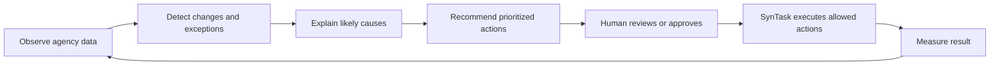

## Recommended autonomy model

| Action type | Phase 2 behavior |
|---|---|
| Read and summarize authorized data | May run automatically |
| Score, classify, detect, prioritize | May run automatically, with explanation and confidence |
| Draft content, emails, plans, questions, or reports | May run automatically as a draft |
| Create internal draft tasks or recommendations | Allowed, preferably in a review queue |
| Assign users, change deadlines, move stages | Human approval required by default |
| Send external email or WhatsApp | Human approval required |
| Publish client content | Human approval required |
| Reject candidates | Human decision required |
| Change ad budget or launch campaigns | Not autonomous in Phase 2 |
| Hire, fire, invoice, refund, sign contracts | Never decided autonomously by an agent |

---

# 2. What Phase 2 Should Build

## 2.1 Shared AI Agent Platform

Build the following once and reuse it for all agents:

- Agent registry and agent-specific permissions.
- Tenant-isolated context retrieval.
- Client and brand knowledge profiles.
- Structured prompt and output versioning.
- Agent run history.
- Source references for recommendations.
- Confidence and data-quality indicators.
- Human approval inbox.
- Allowed action/tool registry.
- Idempotent execution and retry handling.
- Scheduled and event-triggered runs.
- Cost, token, and usage limits by tenant and agent.
- Feedback capture: accepted, edited, rejected, successful, unsuccessful.
- Agent performance dashboards.
- Sensitive-data masking and retention rules.

## 2.2 Structured Agent Workspaces

Each agent should have more than a chat box. Its workspace should contain:

- Agent objective.
- Current input context.
- Missing-data warnings.
- Recommendations or generated output.
- Explanation and evidence.
- Confidence level.
- Proposed actions.
- Approval status.
- Execution result.
- Outcome and feedback.

## 2.3 Client and Brand Knowledge

Marketing agents require a controlled knowledge profile for each client:

- Business overview.
- Products and services.
- Target audiences.
- Brand voice and prohibited language.
- Approved claims.
- Competitors.
- Geographic markets.
- Channel rules.
- Legal/compliance restrictions.
- Previous campaigns and performance.
- Approved assets and references.

Without this, the Content Writer, Campaign Planner, Client Reporting, and AI Agency Manager will produce generic or risky output.

## 2.4 Data Connector Layer

Phase 2 should provide a consistent connector model for external campaign data. At minimum, design for:

- Advertising platforms.
- Web analytics.
- Search performance.
- Social media insights.
- Email marketing performance.
- CRM activities.
- SynTask project, task, time, finance, HR, and client data.

A connector must expose:

- Account/client ownership.
- Last successful synchronization time.
- Data freshness.
- Authentication status.
- Metric definitions.
- Error state.
- Historical data range.

## 2.5 Approval and Action Center

All important agent-generated actions should appear in one central queue:

```text
Agent recommendation
→ Proposed action
→ Authorized reviewer
→ Approve / edit / reject
→ Execution
→ Audit record
→ Outcome tracking
```

Examples:

- Approve an outreach email.
- Approve candidate shortlist.
- Approve task plan creation.
- Approve campaign plan.
- Approve client report.
- Accept a performance correction plan.

## 2.6 Explainability

Every score or recommendation should answer:

1. What data was used?
2. What important data was missing?
3. What rule or pattern affected the result?
4. How confident is the agent?
5. What is the expected business impact?
6. What action is recommended?

---

# 3. What Phase 2 Should Avoid

## 3.1 Product-Level Mistakes

Avoid:

- Ten separate chatbots with duplicated logic and memory.
- A generic “Ask SynTask anything” experience as the primary product.
- Agents with overlapping responsibilities.
- Agents that generate text but do not connect to SynTask workflows.
- Agents without measurable business outcomes.
- Building the AI Agency Manager before reliable departmental agents and metrics exist.
- Claiming autonomous operation when actions still need humans.
- Adding many low-value generators instead of completing core workflows.

## 3.2 Autonomy Risks

Do not allow Phase 2 agents to independently:

- Reject or hire candidates.
- Send unrestricted bulk outreach.
- Change a CRM lead to Won or Lost.
- Publish client content.
- Modify ad spend.
- Change invoices or payment records.
- Sign agreements.
- Delete operational records.
- Reassign many employees without approval.
- Make disciplinary or compensation decisions.

## 3.3 Data and Security Risks

Avoid:

- Cross-tenant context or memory leakage.
- Training or retaining client data without explicit policy.
- Sending entire databases to an AI model.
- Agent access based only on UI visibility.
- Storing secrets in prompts or logs.
- Displaying protected candidate attributes in ranking decisions.
- Using employee surveillance data as a simplistic productivity score.
- Mixing one client’s campaign data into another client’s report.

## 3.4 Quality Risks

Avoid:

- Scores without reasons.
- Recommendations without source metrics.
- Causal claims based only on correlation.
- Fabricated search volume, campaign results, customer quotes, or competitor facts.
- Generic content that ignores brand instructions.
- Automatically hiding negative performance from client reports.
- AI-created tasks with no owner, estimate, dependency, or acceptance criteria.

## 3.5 Integration Risks

Avoid:

- LinkedIn browser automation or behavior that may violate platform rules.
- WhatsApp outreach without consent, approved templates, and opt-out handling.
- Scraping search engines at scale instead of using authorized data providers.
- Silent connector failure that produces reports from stale data.
- Duplicate messages caused by non-idempotent retries.

## 3.6 Features Better Deferred Beyond Phase 2

Defer:

- Autonomous ad-budget optimization.
- Autonomous campaign launch and publishing.
- Voice sales calling agents.
- Automatic candidate rejection based solely on AI.
- Fully autonomous multi-agent negotiation.
- Agent marketplace or user-created arbitrary agents.
- Predictive churn models presented as guaranteed outcomes.
- Complex reinforcement learning from sparse agency data.
- Unrestricted browser-operating agents.

---

# 4. Phase 1 Stabilization Required Before Agent Automation

Phase 2 depends on reliable Phase 1 workflows. The following known Phase 1 gaps should be fixed before agents start taking actions.

## 4.1 Must-Fix Platform Gaps

1. **Notification delivery:** The generic notification worker currently behaves as a placeholder. Agent alerts and approval requests require reliable delivery.
2. **Automation trigger mismatch:** Task status-change automation must use one consistent trigger contract.
3. **Unsupported automation actions:** The action engine must execute only actions actually supported by the platform.
4. **Webhook dispatch:** Configured outbound webhooks need a real event dispatcher if external automation is expected.
5. **Action transactions and idempotency:** Multi-record agent actions must not create duplicate tasks, meetings, emails, or CRM activities after retry.
6. **2FA enforcement:** Configured 2FA should be enforced during authentication before expanding executive and client-data access.
7. **Audit history:** Existing AI logs should be extended to include context version, proposed action, approval, execution, and result.
8. **Data consistency:** Conflicting time systems and operational metrics should have canonical definitions before being used by the Performance Tracking Agent.
9. **Timezone handling:** Agency, client, candidate, meeting, and reporting schedules must use tenant/user timezones rather than fixed assumptions.
10. **Connector health:** External-data agents must never treat stale or failed synchronization as current data.

## 4.2 Functional Readiness Gate

An agent should not execute actions until all of these are true:

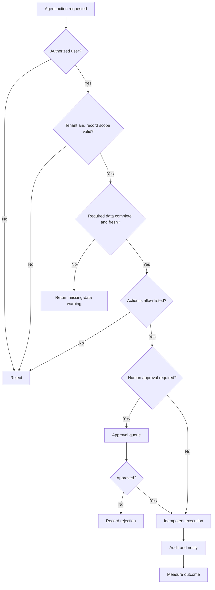

---

# 5. Agent Operating Model

## 5.1 Four Agent Modes

### Advisory Agent

Reads data and recommends an action. It does not modify records.

Examples:

- Lead score.
- Candidate ranking.
- Performance anomaly explanation.
- SEO opportunity list.

### Drafting Agent

Creates reviewable content but does not send or publish it.

Examples:

- Email draft.
- Interview questions.
- Blog draft.
- Client report draft.

### Workflow Agent

Proposes structured internal changes and executes them after approval.

Examples:

- Create project tasks.
- Route lead ownership.
- Schedule interview.
- Create follow-up reminders.

### Monitoring Agent

Runs on a schedule or event, detects changes, and alerts users.

Examples:

- Stale lead detection.
- KPI anomaly detection.
- Deadline risk.
- Client-report schedule.

## 5.2 Required Agent Run States

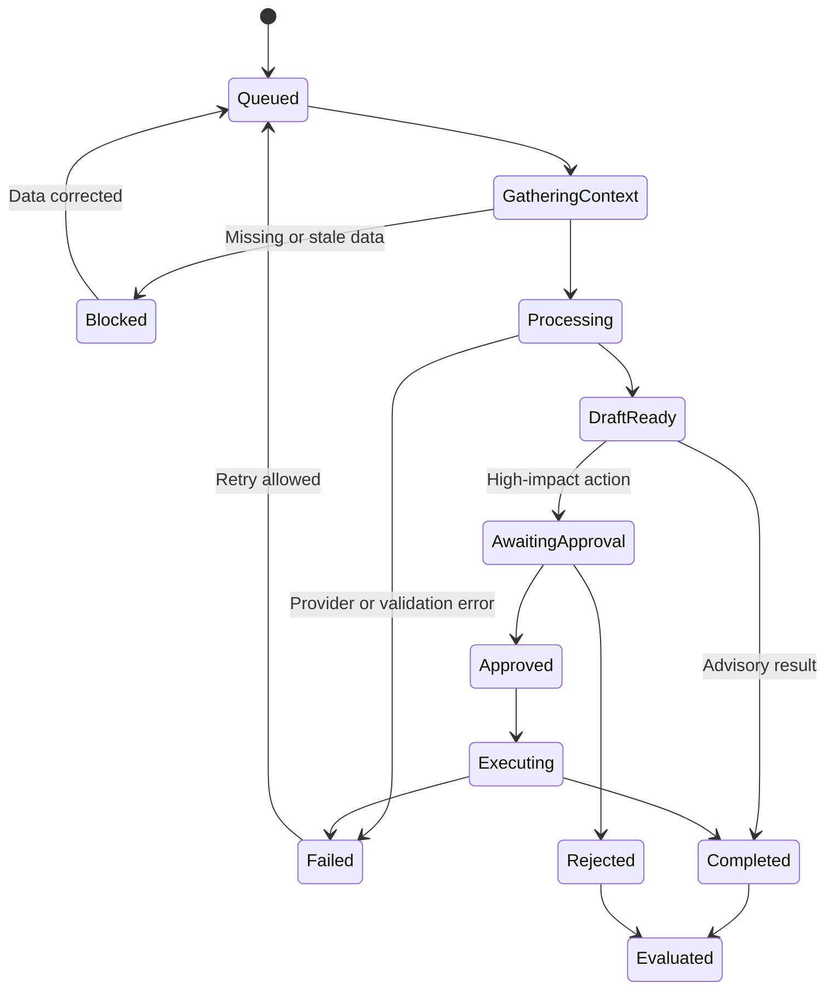

## 5.3 Required Output Contract

Every agent output should include:

- `summary`
- `recommendations`
- `evidence`
- `missing_data`
- `confidence`
- `risk_level`
- `proposed_actions`
- `approval_required`
- `source_record_references`
- `expires_at` for time-sensitive outputs

---

# 6. Agent Responsibility Boundaries

| Agent | Owns | Must not own |
|---|---|---|
| Recruitment Agent | Candidate screening support, ranking, interview and offer workflow assistance | Final rejection, hiring decision, compensation approval |
| Lead Qualification Agent | Fit/intent scoring, completeness, priority, routing recommendation | Outreach copy, final Won/Lost decision |
| Sales Outreach Agent | Channel-specific draft and follow-up sequence | Lead scoring methodology, unrestricted sending |
| Content Writer Agent | Content asset drafts and repurposing | Campaign strategy, publishing approval |
| Campaign Planner Agent | Marketing strategy, channels, milestones, asset plan | Detailed employee allocation and final task scheduling |
| SEO Strategy Agent | Organic-search research and prioritization | General paid campaign planning, direct website changes |
| Project Planning Agent | Work breakdown, dependencies, owners, deadlines, delivery risks | Marketing strategy or client-facing performance interpretation |
| Client Reporting Agent | Client-ready narrative and report package | Canonical KPI calculation or anomaly engine |
| Performance Tracking Agent | KPI definitions, comparisons, anomalies, operational recommendations | External client communication |
| AI Agency Manager | Cross-department synthesis and executive prioritization | Reimplementing every specialist or executing unrestricted changes |

## Key separation rules

1. **Performance Tracking calculates and detects; Client Reporting communicates.**
2. **Campaign Planner decides marketing work; Project Planning operationalizes delivery.**
3. **Lead Qualification decides priority; Sales Outreach drafts communication.**
4. **Content Writer creates assets; Campaign Planner decides which assets are needed.**
5. **AI Agency Manager consumes validated specialist outputs; it should not independently invent departmental metrics.**

---

# 7. Recommended Delivery Order

Building all ten agents at once will create incomplete integrations and inconsistent quality. Use staged delivery.

## Foundation — Agent Platform

Build first:

- Agent registry and permissions.
- Tenant-safe context service.
- Approval center.
- Action audit.
- Event and scheduled triggers.
- Data freshness and source references.
- Evaluation and feedback.
- Usage and cost control.

## Wave 1 — Existing SynTask Data, Fastest Value

1. Lead Qualification Agent.
2. Recruitment Agent.
3. Project Planning Agent.
4. Content Writer Agent.

These agents can use significant Phase 1 data immediately and can begin as advisory/drafting agents.

## Wave 2 — Controlled Execution and Communication

5. Sales Outreach Agent.
6. Campaign Planner Agent.
7. Client Reporting Agent.

These require stronger approval, messaging, brand context, report templates, and connector readiness.

## Wave 3 — External Intelligence and Continuous Monitoring

8. SEO Strategy Agent.
9. Performance Tracking Agent.

These depend heavily on external platform connectors, canonical metric definitions, historical data, and data freshness.

## Wave 4 — Flagship Executive Layer

10. AI Agency Manager.

The AI Agency Manager should be released only after specialist agents and performance data are reliable. Its first release should be read-only and recommendation-focused.

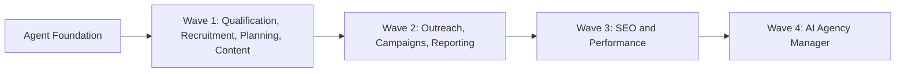

---

# 8. Cross-Agent System Workflow

## 8.1 Agent Runtime

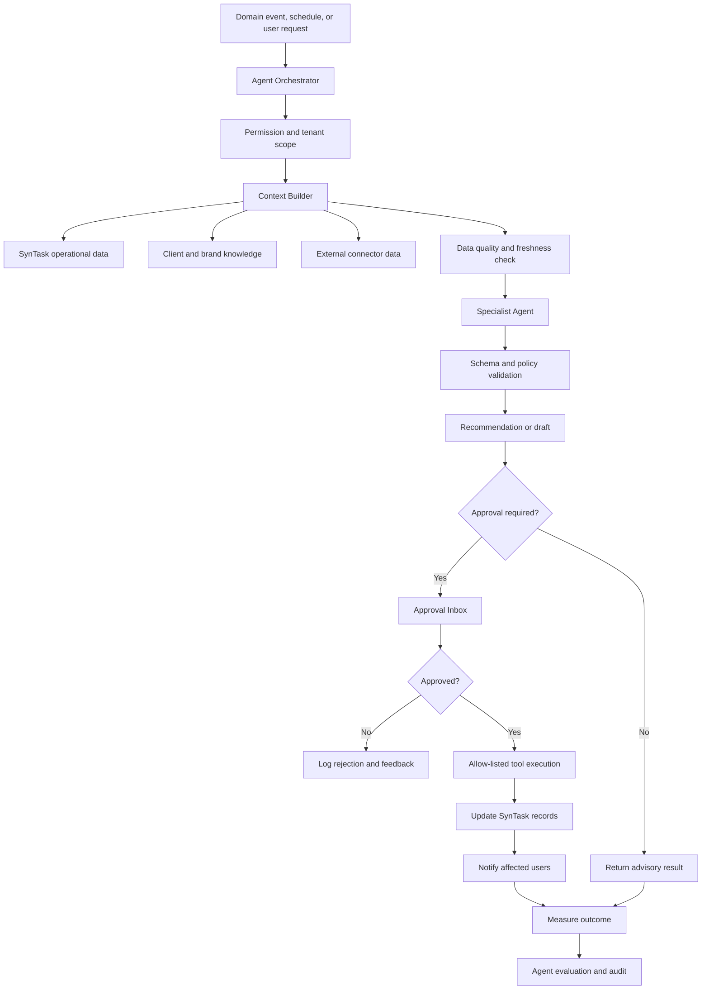

## 8.2 Relationship Map

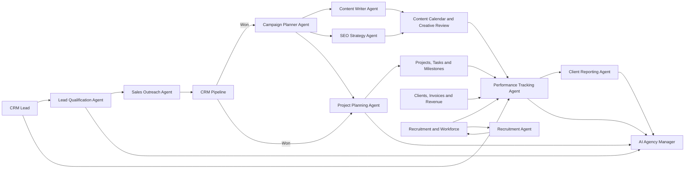

---

# 9. Recruitment Agent

## 9.1 Purpose

Reduce recruiter effort across resume screening, candidate prioritization, interview preparation, scheduling, communication, and offer-stage coordination while preserving human hiring decisions.

## 9.2 Primary Users

- Recruiter.
- HR Manager.
- Hiring Manager.
- Interviewer.
- Department Head.

## 9.3 Phase 1 Features Used

- Jobs and job lifecycle.
- Public applications.
- Candidates and applications.
- Resume inbox and duplicate detection.
- Candidate stages.
- Interviews and feedback.
- Offers.
- Meetings/calendar.
- Email and notifications.
- Employee conversion.

## 9.4 Inputs

- Approved job description and required skills.
- Candidate resume and application.
- Screening questions.
- Candidate stage and prior feedback.
- Interviewer availability.
- Hiring policy and scoring rubric.

## 9.5 Outputs

- Eligibility result.
- Candidate score and rank.
- Evidence-based strengths and gaps.
- Missing-information list.
- Interview question set.
- Recommended next stage.
- Draft candidate communication.
- Proposed interview schedule.
- Offer-stage checklist.

## 9.6 Workflow Diagram

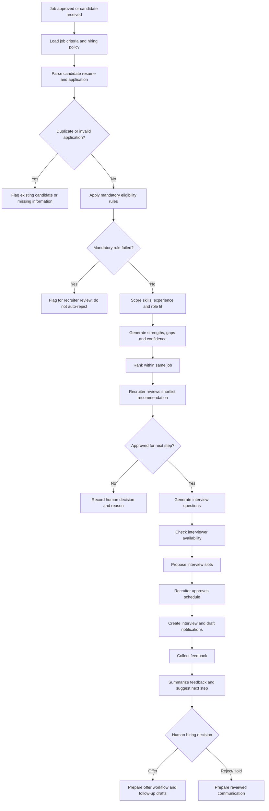

## 9.7 User Stories

### Recruiter

- As a recruiter, I can run AI screening for new candidates so that I do not manually read every resume first.
- As a recruiter, I can see why each candidate received a score so that I can challenge or override the recommendation.
- As a recruiter, I can compare candidates only against the same approved job criteria so that rankings remain relevant.
- As a recruiter, I can see missing candidate information so that I can request it before deciding.
- As a recruiter, I can approve, edit, or reject the recommended shortlist.
- As a recruiter, I can generate personalized follow-up or rejection drafts without sending them automatically.

### Hiring Manager

- As a hiring manager, I can review the top candidates with strengths, concerns, and evidence so that I can select interviewees efficiently.
- As a hiring manager, I can change the scoring rubric for an approved job so that the agent reflects current hiring priorities.
- As a hiring manager, I can see where the agent has low confidence so that a person reviews the resume carefully.

### Interviewer

- As an interviewer, I can receive role-specific interview questions based on the candidate’s experience and identified gaps.
- As an interviewer, I can receive a structured scorecard so that feedback is consistent across candidates.
- As an interviewer, I can submit feedback and receive a neutral summary without losing my original comments.

### HR Manager

- As an HR manager, I can view screening acceptance rates, overrides, time saved, and hiring outcomes so that I can evaluate agent quality.
- As an HR manager, I can prevent sensitive or protected attributes from being used in screening.
- As an HR manager, I can audit every recommendation and human decision.

## 9.8 Decision Logic

- A candidate must be evaluated only against the selected job.
- Mandatory requirements and weighted preferences must be separate.
- Missing data must reduce confidence rather than be treated as a negative fact.
- Candidate ranking must exclude protected characteristics.
- Duplicate application rules from Phase 1 remain authoritative.
- A low score must not automatically reject a candidate.
- Human feedback overrides the agent recommendation.
- Interview scheduling requires participant eligibility and timezone-safe availability.
- Offer generation requires an explicit human hiring decision.

## 9.9 Human Approval Points

- Shortlist acceptance.
- Candidate stage change.
- Interview scheduling.
- External email.
- Rejection.
- Offer creation and terms.
- Employee conversion.

## 9.10 What to Avoid

- Automatic candidate rejection.
- Ranking based on name, gender, age, photograph, location proxies, or other protected traits.
- Treating resume keywords as proof of competence.
- Hiding confidence or missing information.
- Automatically changing job requirements after applications arrive.
- Sending candidate messages without recruiter review.
- Presenting the agent as the final hiring authority.

## 9.11 Success Metrics

- Time from application to first review.
- Recruiter hours saved.
- Percentage of screened candidates reviewed by humans.
- Shortlist acceptance/override rate.
- Interview-to-offer conversion.
- Candidate response time.
- Bias and consistency audit results.

---

# 10. Lead Qualification Agent

## 10.1 Purpose

Prioritize leads based on fit, intent, completeness, engagement, and sales readiness so that sales teams spend time on the highest-value opportunities.

## 10.2 Primary Users

- Sales Representative.
- Sales Manager.
- Business Development Manager.
- Agency Owner.

## 10.3 Phase 1 Features Used

- CRM lead creation/import.
- Phone-based duplicate detection.
- Lead owner and assignment.
- Fixed pipeline.
- CRM activities, notes, deals, proposals, and timeline.
- Notifications and dashboard.
- Existing AI sales context.

## 10.4 Inputs

- Lead profile and source.
- Service interest.
- Budget or deal value.
- Industry, company size, and geography.
- Contact engagement and activities.
- Proposal and meeting history.
- Data completeness.
- Agency ideal-client profile.

## 10.5 Outputs

- Qualification score.
- Fit score.
- Intent score.
- Urgency score.
- Data-completeness score.
- Score explanation.
- Confidence.
- Recommended owner.
- Recommended next action.
- Suggested follow-up deadline.

## 10.6 Workflow Diagram

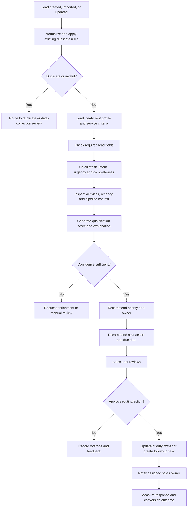

## 10.7 User Stories

### Sales Representative

- As a sales representative, I can see which leads need attention first so that I focus on the best opportunities.
- As a sales representative, I can understand why a lead is considered hot, warm, or low priority.
- As a sales representative, I can see which details are missing so that I can qualify the lead correctly.
- As a sales representative, I can receive a recommended next action and follow-up date.
- As a sales representative, I can override the score and explain why so that the model can be evaluated.

### Sales Manager

- As a sales manager, I can define an ideal-client profile by service, budget, industry, geography, and company type.
- As a sales manager, I can configure scoring weights without changing CRM pipeline rules.
- As a sales manager, I can review unassigned, stale, high-value, and low-confidence leads.
- As a sales manager, I can approve suggested routing to the least-loaded or best-matched sales owner.
- As a sales manager, I can compare qualification scores with actual conversion outcomes.

### Agency Owner

- As an agency owner, I can see the number and value of qualified opportunities so that I understand near-term pipeline quality.
- As an agency owner, I can see which lead sources produce the highest-quality opportunities.

## 10.8 Decision Logic

- Existing tenant-level duplicate rules must run before qualification.
- The fixed CRM pipeline remains authoritative.
- Score does not automatically move a lead to Qualified, Won, or Lost.
- Missing data reduces confidence and completeness; it must not be invented.
- High value alone does not equal high intent.
- Stale activity can reduce urgency but should not erase strong fit.
- Routing must respect eligible users, hierarchy, tenant scope, capacity, and service expertise.
- A score must be recalculated when important lead or activity data changes.
- Old scores must show their calculation time and expiration/freshness.

## 10.9 Human Approval Points

- Owner reassignment.
- Pipeline stage change.
- Follow-up task creation when it affects another employee.
- Marking a lead disqualified.
- High-volume routing changes.

## 10.10 What to Avoid

- Black-box hot/warm/cold labels.
- Automatically moving leads through the pipeline.
- Treating email opens as strong purchase intent.
- Using unverified external data as fact.
- Scoring with fields that are unavailable for most leads.
- Optimizing only for deal value and ignoring service fit.
- Hiding low-confidence results.

## 10.11 Success Metrics

- Speed to first response for qualified leads.
- Qualified-to-meeting conversion.
- Meeting-to-proposal conversion.
- Score-to-Won correlation.
- Sales override rate.
- Stale-lead reduction.
- Lead distribution fairness and workload balance.

---

# 11. Sales Outreach Agent

## 11.1 Purpose

Create personalized, consistent, compliant outreach and follow-up drafts while ensuring sales representatives remain responsible for external communication.

## 11.2 Primary Users

- Sales Representative.
- Sales Manager.
- Account Executive.

## 11.3 Phase 1 Features Used

- CRM lead and company context.
- Activities, notes, proposals, files, and deals.
- Pipeline history.
- Meetings.
- Notifications.
- Tasks and reminders.
- Email center/history where suitable.

## 11.4 Inputs

- Qualified lead context.
- Lead source and service interest.
- Previous communication and activities.
- Agency offering and approved claims.
- Communication channel.
- Sales-person identity and tone.
- Consent and opt-out status.
- Follow-up policy.

## 11.5 Outputs

- Personalized email draft.
- WhatsApp draft.
- LinkedIn message draft.
- Follow-up sequence.
- Subject-line variants.
- Recommended call-to-action.
- Recommended follow-up schedule.
- Stale-lead alerts.

## 11.6 Workflow Diagram

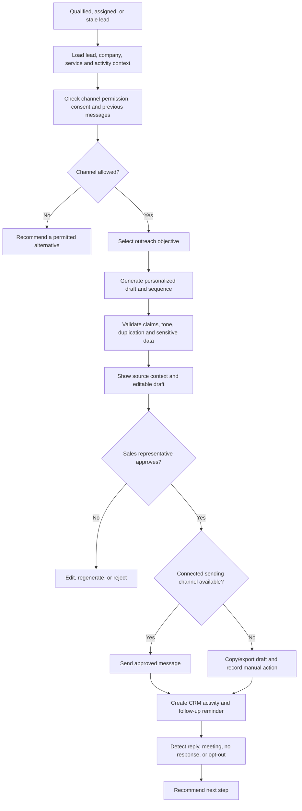

## 11.7 User Stories

### Sales Representative

- As a sales representative, I can generate an outreach draft using the lead’s actual context so that the message is not generic.
- As a sales representative, I can choose email, WhatsApp, or LinkedIn format so that the draft matches the channel.
- As a sales representative, I can edit the draft before sending.
- As a sales representative, I can generate a follow-up sequence with appropriate spacing.
- As a sales representative, I can see stale leads that have no next action.
- As a sales representative, I can stop a sequence when the lead responds, opts out, or changes stage.
- As a sales representative, I can log manually sent communication as a CRM activity.

### Sales Manager

- As a sales manager, I can configure approved claims, tone, templates, frequency limits, and opt-out language.
- As a sales manager, I can require approval for new representatives or high-value accounts.
- As a sales manager, I can inspect response and meeting rates by sequence and channel.
- As a sales manager, I can prevent messages from being sent outside permitted hours or regions.

## 11.8 Decision Logic

- The agent must not message a duplicate, closed, Lost, Won, opted-out, or invalid lead unless policy explicitly allows it.
- The message objective must match the current pipeline stage.
- Follow-ups stop on response, opt-out, meeting booking, Won, Lost, or manual stop.
- Claims must come from approved agency/service knowledge.
- The agent must not invent familiarity, referrals, case studies, or performance results.
- WhatsApp requires consent and compliant templates where applicable.
- Automated LinkedIn browser behavior should not be part of Phase 2.
- External sending is approval-gated.
- Every sent message must create an activity and retain the approved final text.

## 11.9 Human Approval Points

- First outbound message.
- Every externally sent message by default.
- Bulk sequence activation.
- Messaging high-value or sensitive accounts.
- Any claim not already approved.

## 11.10 What to Avoid

- Unrestricted auto-send.
- Fake personalization.
- Excessive follow-up frequency.
- Sending the same copy to many leads.
- Ignoring opt-outs or consent.
- Hallucinated case studies or client results.
- LinkedIn automation that violates platform rules.
- Creating activities without confirming message delivery/manual send.

## 11.11 Success Metrics

- Draft-to-send time.
- Response rate.
- Positive response rate.
- Meeting-booked rate.
- Opt-out and complaint rate.
- Sequence-stop accuracy.
- Percentage of drafts substantially edited by users.

---

# 12. Content Writer Agent

## 12.1 Purpose

Generate high-quality first drafts and channel adaptations using client-specific brand knowledge, campaign context, and human review.

## 12.2 Primary Users

- Content Writer.
- Social Media Manager.
- Copywriter.
- Marketing Manager.
- Account Manager.

## 12.3 Phase 1 Features Used

- Marketing content calendar.
- Campaign and client metadata.
- Projects and tasks.
- Creative review.
- Files and approved assets.
- Existing AI marketing support.
- Notifications and approval workflows.

## 12.4 Inputs

- Client and brand profile.
- Campaign objective.
- Audience.
- Channel and content type.
- Offer and approved claims.
- Keywords and SEO requirements.
- Existing assets.
- Deadline and content-calendar status.

## 12.5 Outputs

- Blog draft.
- Social caption.
- Ad copy.
- Email copy.
- Landing-page copy.
- Script or carousel copy.
- Multiple variants.
- Cross-channel repurposing.
- Revision summary.

## 12.6 Workflow Diagram

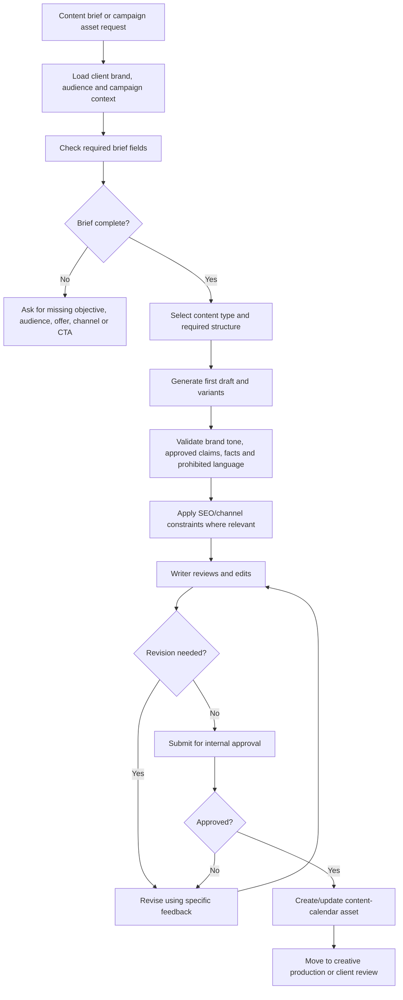

## 12.7 User Stories

### Content Writer

- As a content writer, I can generate a first draft from a structured brief so that I start from useful copy rather than a blank page.
- As a content writer, I can select blog, caption, ad, email, landing page, script, or custom format.
- As a content writer, I can request multiple clearly different angles rather than superficial wording changes.
- As a content writer, I can repurpose an approved long-form asset into channel-specific variants.
- As a content writer, I can provide section-level feedback and regenerate only the selected part.
- As a content writer, I can compare generated text with brand rules and prohibited language.

### Marketing Manager

- As a marketing manager, I can maintain approved brand voice, claims, audience, competitor, and compliance instructions for each client.
- As a marketing manager, I can see whether a draft used all required brief information.
- As a marketing manager, I can approve, request changes, or reject an AI-assisted draft.
- As a marketing manager, I can track how much generated content is accepted, edited, or rejected.

### Account Manager

- As an account manager, I can attach client feedback to a draft so that revisions use the exact requested changes.
- As an account manager, I can ensure one client’s knowledge is never used for another client.

## 12.8 Decision Logic

- Client context is mandatory for client-specific content.
- Missing factual information must be requested or visibly marked, never invented.
- Approved claims have priority over generated claims.
- Channel length, formatting, CTA, and compliance rules must be applied.
- Repurposed content must preserve factual meaning but adapt structure to the target channel.
- Draft status is not equivalent to approval, scheduling, or publishing.
- Client feedback and internal feedback must remain distinguishable.
- Existing content-calendar transition rules remain authoritative.

## 12.9 Human Approval Points

- Internal content approval.
- Client review submission.
- Final approval.
- Scheduling and publishing.
- Use of new factual claims or offers.

## 12.10 What to Avoid

- One generic prompt for every client.
- Direct publishing.
- Fabricated statistics, testimonials, or guarantees.
- Copying a living writer’s distinctive style on request.
- Reusing confidential client information.
- Keyword stuffing.
- Treating AI output as plagiarism-free or legally approved without checks.
- Generating many low-quality variants to create an illusion of productivity.

## 12.11 Success Metrics

- Time from brief to first draft.
- Draft acceptance rate.
- Average revision rounds.
- Percentage of text retained after human edit.
- Brand-compliance error rate.
- Content delivered on time.
- Performance of approved AI-assisted assets compared with baseline.

---

# 13. Campaign Planner Agent

## 13.1 Purpose

Turn a client objective into a structured campaign plan containing audience, message, channels, assets, milestones, dependencies, measurement, and delivery handoff.

## 13.2 Primary Users

- Marketing Strategist.
- Campaign Manager.
- Account Manager.
- Project Manager.
- Agency Owner.

## 13.3 Phase 1 Features Used

- Clients and client workspace.
- CRM Won conversion.
- Projects, milestones, tasks, and templates.
- Marketing content calendar.
- Meetings and kickoff.
- Creative review.
- AI marketing support.

## 13.4 Inputs

- Client goal.
- Offer/product/service.
- Target audience.
- Budget range.
- Dates and market.
- Approved channels.
- Previous performance.
- Brand and compliance constraints.
- Team capacity.

## 13.5 Outputs

- Campaign objective and KPI plan.
- Audience and message framework.
- Channel recommendation.
- Asset list.
- Campaign phases.
- Milestones and dependencies.
- Risk register.
- Measurement plan.
- Project Planning Agent handoff.

## 13.6 Workflow Diagram

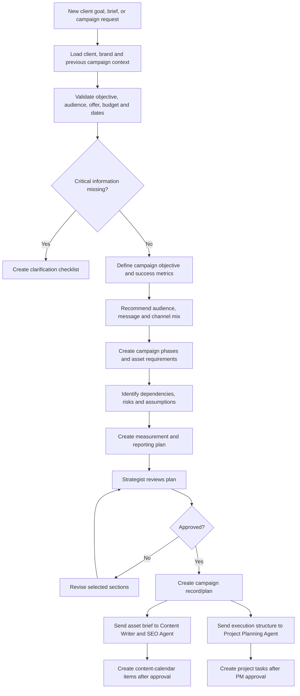

## 13.7 User Stories

### Marketing Strategist

- As a strategist, I can convert a client goal into a structured campaign proposal so that planning is faster and more consistent.
- As a strategist, I can see the assumptions and missing inputs before accepting a plan.
- As a strategist, I can compare multiple channel scenarios without automatically committing budget.
- As a strategist, I can define the KPI and measurement plan before work begins.
- As a strategist, I can edit individual sections rather than regenerate the whole plan.

### Account Manager

- As an account manager, I can start a campaign plan from a Won lead, client brief, or kickoff notes.
- As an account manager, I can see which client approvals and assets are needed.
- As an account manager, I can convert an approved plan into a client-readable summary.

### Project Manager

- As a project manager, I can receive an approved campaign structure and convert it into delivery tasks.
- As a project manager, I can reject unrealistic timelines or missing dependencies before task creation.

### Agency Owner

- As an agency owner, I can see planned campaigns, expected value, required capacity, and major risks.

## 13.8 Decision Logic

- A campaign must have an objective, target audience, offer, time window, and measurement plan.
- The agent may recommend a budget split but must not modify or spend budget.
- Historical performance can influence recommendations only when data is fresh and comparable.
- Unsupported channels must be labeled as suggestions, not available integrations.
- Asset requirements should be sent to the Content Writer Agent; delivery scheduling should be sent to the Project Planning Agent.
- Client approval and internal approval remain separate.
- Plan updates should version rather than silently replace the approved plan.

## 13.9 Human Approval Points

- Campaign strategy.
- Budget allocation.
- Client-facing proposal.
- Creation of large task plans.
- Content asset list.
- Launch decision.

## 13.10 What to Avoid

- Treating a campaign plan as guaranteed performance.
- Auto-launching campaigns.
- Auto-changing budgets.
- Recommending every channel without prioritization.
- Ignoring capacity and dependencies.
- Creating tasks before the strategy is approved.
- Mixing campaign strategy with detailed employee performance management.

## 13.11 Success Metrics

- Time from brief to approved plan.
- Percentage of plans requiring major rework.
- On-time campaign kickoff.
- Missing-task and dependency rate.
- Planned-versus-actual asset completion.
- Campaign goal and KPI coverage.

---

# 14. SEO Strategy Agent

## 14.1 Purpose

Use verified search and website data to identify organic-growth opportunities, prioritize actions, and connect SEO recommendations to content and project execution.

## 14.2 Primary Users

- SEO Specialist.
- Content Strategist.
- Marketing Manager.
- Account Manager.

## 14.3 Phase 1 Features Used

- Clients.
- Marketing content calendar.
- Projects and tasks.
- Content Writer Agent handoff.
- Reports and client reporting.
- File/document storage.

## 14.4 Required External Inputs

- Search performance data.
- Website analytics.
- Website crawl/page inventory.
- Keyword and competitor data from authorized sources.
- Conversion events.
- Backlink data where available.

## 14.5 Outputs

- Keyword clusters.
- Search-intent classification.
- Page optimization opportunities.
- Content gaps.
- Technical issue priorities.
- Internal-link recommendations.
- Opportunity impact/effort score.
- Content briefs.
- Trend and ranking alerts.

## 14.6 Workflow Diagram

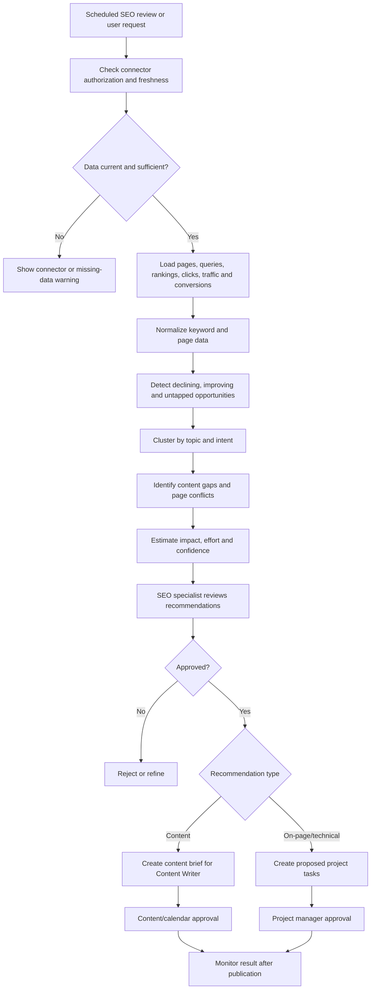

## 14.7 User Stories

### SEO Specialist

- As an SEO specialist, I can see which pages and queries are gaining or losing performance.
- As an SEO specialist, I can receive keyword clusters based on search intent and existing site coverage.
- As an SEO specialist, I can identify pages competing for the same query.
- As an SEO specialist, I can prioritize recommendations by expected impact, effort, and confidence.
- As an SEO specialist, I can approve an opportunity before creating a content brief or technical task.
- As an SEO specialist, I can see which data source and date support every recommendation.

### Content Strategist

- As a content strategist, I can receive an SEO brief with audience intent, topic coverage, internal-link targets, and measurable goal.
- As a content strategist, I can send an approved SEO brief to the Content Writer Agent.

### Account Manager

- As an account manager, I can explain SEO progress to a client using verified trends rather than raw ranking tables.
- As an account manager, I can see when connector data is stale or incomplete before sharing a report.

## 14.8 Decision Logic

- Search volume and competition values must come from a named source.
- Stale connector data must be clearly marked and must reduce confidence.
- A ranking decline is not automatically caused by a specific change.
- Recommendations must distinguish content, on-page, technical, authority, and measurement issues.
- The agent must not make direct website changes in Phase 2.
- Keyword recommendations must consider search intent and business relevance, not volume alone.
- Existing pages must be checked before recommending new content.
- Results should be monitored after implementation using a defined comparison window.

## 14.9 Human Approval Points

- Keyword strategy.
- Content brief creation.
- Technical task creation.
- Website changes.
- Client-facing explanation.

## 14.10 What to Avoid

- Fabricated keyword metrics.
- Large-scale search-engine scraping.
- Keyword stuffing.
- Automatically changing website content or metadata.
- Guaranteeing ranking improvements.
- Treating every ranking movement as meaningful.
- Ignoring branded versus non-branded traffic.
- Creating new content that cannibalizes existing pages.

## 14.11 Success Metrics

- Organic clicks and qualified conversions.
- Number of implemented recommendations.
- Time from opportunity to task/content brief.
- Non-branded visibility.
- Content-gap closure.
- Recommendation acceptance rate.
- Post-implementation uplift versus baseline.

---

# 15. Project Planning Agent

## 15.1 Purpose

Convert approved work into executable tasks, milestones, ownership suggestions, dependencies, acceptance criteria, and risk controls.

## 15.2 Primary Users

- Project Manager.
- Team Lead.
- Delivery Manager.
- Account Manager.
- Department Manager.

## 15.3 Phase 1 Features Used

- Projects and project templates.
- Milestones.
- Tasks, subtasks, dependencies, estimates, and priorities.
- Board, epics, sprints, and backlog.
- Users, hierarchy, project membership, and workload.
- Calendar and meetings.
- Time logs, EOD, and deadlines.
- Dashboard and reports.

## 15.4 Inputs

- Approved campaign or project brief.
- Scope and deliverables.
- Dates and milestones.
- Available team members and skills.
- Current workload.
- Historical task durations.
- Dependencies and client approvals.
- Project template.

## 15.5 Outputs

- Work breakdown structure.
- Milestones.
- Tasks and subtasks.
- Acceptance criteria.
- Estimates.
- Dependency graph.
- Owner suggestions.
- Deadline suggestions.
- Risk list.
- Missing-work warnings.

## 15.6 Workflow Diagram

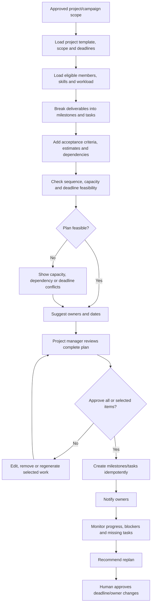

## 15.7 User Stories

### Project Manager

- As a project manager, I can convert an approved scope into milestones, tasks, dependencies, and acceptance criteria.
- As a project manager, I can review all proposed tasks before any record is created.
- As a project manager, I can approve only selected tasks.
- As a project manager, I can see capacity and dependency conflicts before accepting dates.
- As a project manager, I can receive suggested owners based on project membership, skills, and workload.
- As a project manager, I can detect missing tasks, unowned work, and impossible dependencies.
- As a project manager, I can request a replan when scope or dates change.

### Team Lead

- As a team lead, I can review estimates and owner suggestions for my team.
- As a team lead, I can override an estimate or assignment with a reason.
- As a team lead, I can receive alerts when a dependency is blocking downstream work.

### Team Member

- As a team member, I can see why a task was assigned, its acceptance criteria, dependencies, and expected outcome.
- As a team member, I can flag an inaccurate estimate or missing prerequisite.

### Account Manager

- As an account manager, I can see which client approvals or assets block delivery.

## 15.8 Decision Logic

- Only accessible, active projects can receive tasks.
- Only eligible project members can be suggested as owners.
- Workload suggestions must use defined capacity, not attendance surveillance alone.
- A task must have a deliverable, owner or unassigned reason, estimate, deadline logic, and acceptance criteria.
- Dependencies must not create cycles.
- The plan must distinguish internal work from client-dependent work.
- Agent-created records must use an idempotency key so retries do not duplicate them.
- Replanning must not silently change existing dates or owners.
- Existing project/task permission rules remain authoritative.

## 15.9 Human Approval Points

- Bulk task creation.
- Assignment.
- Deadline setting or change.
- Milestone creation.
- Replanning existing work.
- Cross-department resource requests.

## 15.10 What to Avoid

- Creating hundreds of low-value tasks.
- Assigning employees without manager approval.
- Using attendance hours as the only capacity measure.
- Changing due dates automatically.
- Ignoring existing work and approved extensions.
- Generating vague tasks with no completion criteria.
- Creating circular dependencies.
- Assuming historical duration is always applicable.

## 15.11 Success Metrics

- Planning time saved.
- Percentage of generated tasks accepted.
- Missing-task rate after kickoff.
- Deadline adherence.
- Dependency-related delay reduction.
- Estimate accuracy.
- Reassignment and replan frequency.

---

# 16. Client Reporting Agent

## 16.1 Purpose

Turn validated campaign and operational data into clear, client-ready weekly and monthly reports that explain results, risks, actions, and next steps.

## 16.2 Primary Users

- Account Manager.
- Client Success Manager.
- Marketing Manager.
- Agency Owner.
- Analyst.

## 16.3 Phase 1 Features Used

- Clients and client workspace.
- Projects and tasks.
- CRM and meetings.
- Invoices and revenue where relevant.
- Marketing content calendar.
- Reports and exports.
- Files and email.
- Notifications.

## 16.4 Required External Inputs

- Advertising metrics.
- Analytics and conversion metrics.
- Social performance.
- Search/SEO metrics.
- Email campaign metrics.
- Client targets and reporting period.

## 16.5 Outputs

- Weekly report draft.
- Monthly report draft.
- Executive summary.
- KPI table.
- Wins, risks, and trends.
- Planned versus actual delivery.
- Plain-language explanations.
- Recommended next actions.
- Data-quality disclosures.
- Exportable document/dashboard package.

## 16.6 Workflow Diagram

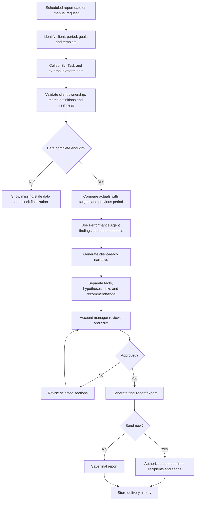

## 16.7 User Stories

### Account Manager

- As an account manager, I can generate a report for a selected client and period.
- As an account manager, I can see exactly which platforms and date ranges supplied each metric.
- As an account manager, I can see missing or stale data before presenting the report.
- As an account manager, I can edit the narrative while preserving the original source metrics.
- As an account manager, I can choose the level of technical detail appropriate for the client.
- As an account manager, I can approve the final recipient list before sending.

### Marketing Manager

- As a marketing manager, I can verify performance explanations and recommendations before they reach the client.
- As a marketing manager, I can add campaign context that is not visible in raw data.

### Agency Owner

- As an agency owner, I can standardize report templates while allowing client-specific KPIs.
- As an agency owner, I can monitor report preparation time, delivery punctuality, and client engagement.

### Client Success Manager

- As a client success manager, I can see recurring risks, unaddressed actions, and client decisions from previous reports.

## 16.8 Decision Logic

- Each report belongs to exactly one client and tenant.
- Metric definitions and timezones must be consistent across comparisons.
- Facts, calculations, hypotheses, and recommendations must be visibly separated.
- The agent may explain likely reasons but must not present correlation as confirmed causation.
- Missing data must be disclosed, not silently omitted.
- Negative results must not be hidden.
- Source metrics should be locked from free-text editing; commentary can be edited.
- External sending requires final approval and confirmed recipients.
- A generated report must retain its source snapshot for auditability.

## 16.9 Human Approval Points

- KPI selection.
- Performance explanation.
- Recommendations.
- Final report.
- Recipient list and sending.

## 16.10 What to Avoid

- Automatically sending reports.
- Mixing data between clients.
- Unsourced explanations.
- Reporting stale data as current.
- Cherry-picking only positive results.
- Comparing incompatible attribution windows.
- Allowing the language model to recalculate canonical metrics independently.
- Overloading clients with operational details that do not affect their goals.

## 16.11 Success Metrics

- Report preparation time.
- On-time report delivery.
- Data correction rate.
- Manager edit rate.
- Client engagement and response.
- Action-item completion from reports.
- Reporting-related client satisfaction.

---

# 17. Performance Tracking Agent

## 17.1 Purpose

Continuously track defined KPIs, compare planned and actual performance, detect meaningful anomalies, identify likely contributing factors, and recommend corrective action.

## 17.2 Primary Users

- Operations Manager.
- Marketing Manager.
- Project Manager.
- Sales Manager.
- HR Manager.
- Agency Owner.

## 17.3 Phase 1 Features Used

- Dashboard and operational briefing.
- CRM pipeline and activities.
- Projects, tasks, deadlines, time, and EOD.
- Attendance and leave where appropriate.
- Recruitment funnel.
- Clients, invoices, payments, and ledger.
- Content calendar and creative workflow.
- Notifications and reports.

## 17.4 Required External Inputs

- Ad, analytics, social, search, and email campaign metrics.
- Client goals and target values.
- Historical baseline.
- Metric definitions and attribution windows.

## 17.5 Outputs

- KPI status.
- Planned-versus-actual comparison.
- Significant anomalies.
- Trend summaries.
- Likely contributing factors.
- Confidence and evidence.
- Risk or opportunity severity.
- Recommended corrective action.
- Owner and follow-up suggestion.

## 17.6 Workflow Diagram

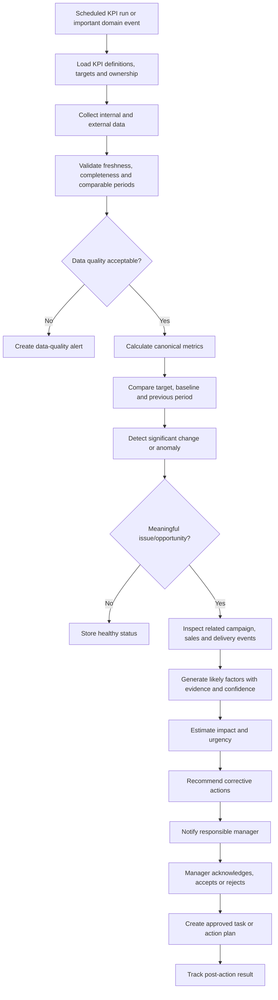

## 17.7 User Stories

### Operations Manager

- As an operations manager, I can define canonical KPIs with targets, owners, frequency, and alert thresholds.
- As an operations manager, I can see planned versus actual delivery across clients and departments.
- As an operations manager, I can receive alerts only when changes are material.
- As an operations manager, I can see the evidence and confidence behind each explanation.
- As an operations manager, I can assign an accepted corrective action and track its outcome.

### Marketing Manager

- As a marketing manager, I can detect campaign drops, unusual spend, conversion changes, and content delays.
- As a marketing manager, I can distinguish data-quality problems from real performance problems.
- As a marketing manager, I can compare similar periods and campaigns using consistent metric definitions.

### Sales Manager

- As a sales manager, I can track lead response, stage conversion, stale leads, pipeline velocity, and forecast risk.
- As a sales manager, I can see whether a problem is caused by lead quality, follow-up, stage delay, or incomplete data.

### Project Manager

- As a project manager, I can see deadline, dependency, workload, and scope risks before delivery is missed.

### Agency Owner

- As an agency owner, I can see cross-department risks and opportunities without reading every operational dashboard.

## 17.8 Decision Logic

- KPI definitions must be configured and versioned; the agent must not invent them.
- Planned and actual values must use compatible periods and units.
- A threshold breach should account for normal variability and data volume.
- Data-quality failures must not be interpreted as business-performance failures.
- Likely causes must be labeled as hypotheses unless directly supported.
- Employee attendance must not be converted into a simplistic productivity score.
- Alerts should be deduplicated and suppressed until the metric materially changes or the previous alert is resolved.
- Corrective actions require an owner, due date, expected impact, and review date.
- Performance Tracking should calculate the canonical result used by Client Reporting and the AI Agency Manager.

## 17.9 Human Approval Points

- KPI definitions and targets.
- Alert thresholds.
- Root-cause acceptance.
- Corrective task creation.
- Employee-related performance conclusions.
- Client-facing use of findings.

## 17.10 What to Avoid

- Alert fatigue.
- One threshold for every client.
- Vanity-metric optimization.
- Punitive employee scoring.
- Claiming causation without evidence.
- Recalculating metrics differently in different agents.
- Treating stale connector data as zero performance.
- Hiding the impact of small sample sizes.

## 17.11 Success Metrics

- Time to detect meaningful issues.
- False-positive alert rate.
- Alert acknowledgment time.
- Corrective-action completion.
- Recovery after accepted actions.
- Data-quality incident detection.
- Reduction in missed deadlines and preventable campaign losses.

---

# 18. AI Agency Manager

## 18.1 Purpose

Provide agency leadership with a daily cross-department operating brief answering:

1. What changed?
2. Why did it likely change?
3. What should leadership do next?

This is the flagship SynTask agent, but it should primarily orchestrate and summarize validated outputs from specialist agents.

## 18.2 Primary Users

- Agency Owner.
- CEO.
- COO.
- Department Head.
- Senior Operations Manager.

## 18.3 Phase 1 and Phase 2 Features Used

- Dashboard and operational briefing.
- CRM and sales pipeline.
- Clients, revenue, invoices, and ledger.
- Projects, tasks, deadlines, and workload.
- Recruitment and workforce.
- Content calendar and campaigns.
- Client reporting.
- Performance Tracking Agent.
- All specialist agent recommendations.
- Notifications, tasks, and meetings.

## 18.4 Inputs

- Validated KPI statuses.
- Specialist agent findings.
- Today/yesterday/period changes.
- Revenue and pipeline changes.
- Client health indicators.
- Delivery risks.
- Capacity and recruitment risks.
- Campaign performance.
- Open approvals and unresolved actions.

## 18.5 Outputs

- Daily executive brief.
- Top risks.
- Top opportunities.
- Important changes.
- Likely explanations with evidence.
- Prioritized next actions.
- Decisions requiring leadership.
- Delegation suggestions.
- Follow-up status from previous briefs.

## 18.6 Workflow Diagram

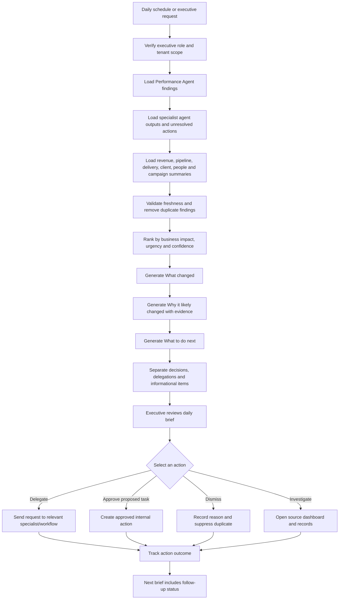

## 18.7 User Stories

### Agency Owner / CEO

- As an agency owner, I can receive a daily brief of important changes across revenue, clients, campaigns, projects, and people.
- As an agency owner, I can see the source and confidence behind every major explanation.
- As an agency owner, I can separate urgent decisions from informational updates.
- As an agency owner, I can see what changed since the previous brief rather than the same static dashboard every day.
- As an agency owner, I can see unresolved risks and whether previous recommendations were completed.
- As an agency owner, I can open the underlying client, campaign, lead, project, task, invoice, or candidate record.
- As an agency owner, I can delegate a recommended action to the relevant manager or specialist agent.
- As an agency owner, I can dismiss an irrelevant finding and provide a reason.

### COO / Operations Manager

- As an operations leader, I can view cross-department dependencies and workload risks.
- As an operations leader, I can convert approved recommendations into tracked actions.
- As an operations leader, I can filter the brief by department, client, impact, urgency, and confidence.

### Department Head

- As a department head, I can receive a scoped version containing only the departments and records I am authorized to see.

## 18.8 Decision Logic

- The AI Agency Manager must use specialist outputs and canonical metrics rather than recalculate everything independently.
- Every recommendation must link to evidence.
- Duplicate risks across agents must be merged into one issue.
- Priority should combine financial impact, client impact, delivery impact, urgency, reversibility, and confidence.
- Low-confidence explanations must be labeled.
- The manager may delegate to another agent but may not bypass that agent’s approval rules.
- Role and hierarchy restrictions still apply; “executive” does not automatically mean cross-tenant access.
- Read-only daily briefing should be the first release.
- High-impact actions remain human decisions.

## 18.9 Human Approval Points

- Every delegated record-changing action.
- Client communication.
- Budget changes.
- Staffing changes.
- Candidate decisions.
- Revenue, invoice, contract, or payment actions.
- Bulk changes across departments.

## 18.10 What to Avoid

- An unrestricted super-agent with direct write access.
- Replacing specialist agents with one generic prompt.
- Repeating every dashboard metric.
- Unsourced “why” explanations.
- Ranking employees from surveillance signals.
- Automatically firing, hiring, reassigning, invoicing, or changing budgets.
- Cross-client or cross-tenant leakage.
- Overloading leadership with dozens of low-impact alerts.

## 18.11 Success Metrics

- Daily/weekly executive usage.
- Percentage of briefs containing at least one accepted action.
- Time from risk detection to owner assignment.
- Duplicate/irrelevant finding rate.
- Completion rate of accepted recommendations.
- Leadership time saved.
- Reduction in missed high-impact issues.

---

# 19. End-to-End Multi-Agent User Journeys

## 19.1 Lead to Campaign Delivery

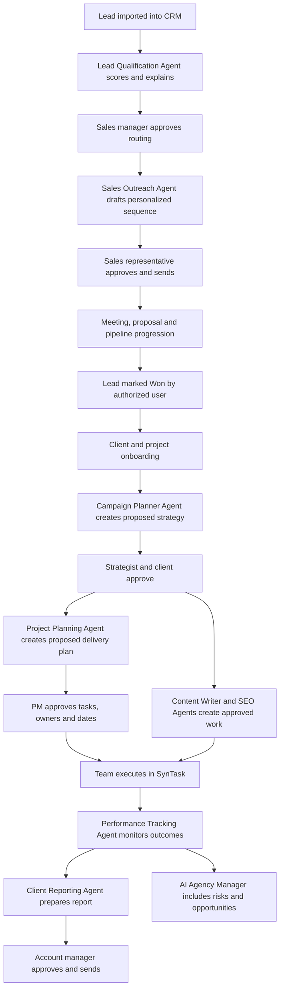

## 19.2 Recruitment to Employee Onboarding

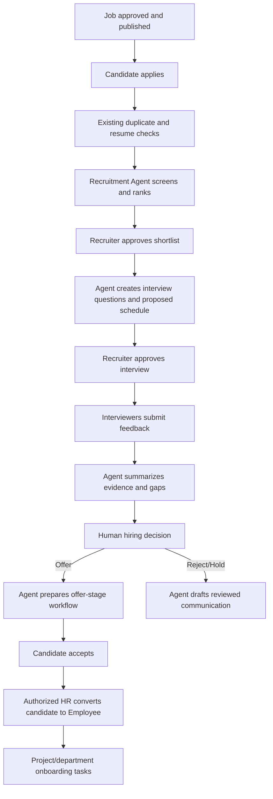

## 19.3 Daily Agency Operations

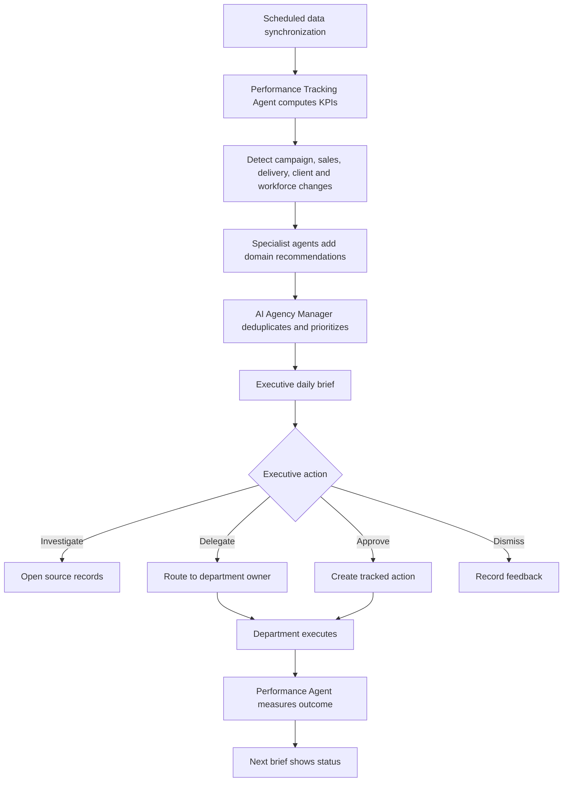

## 19.4 Campaign Performance Recovery

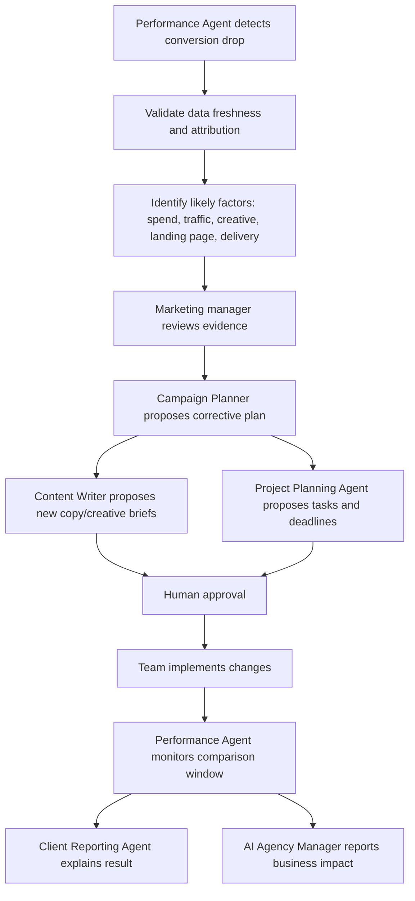

---

# 20. Shared Functional Requirements

## 20.1 Permissions and Tenant Isolation

- Every context query must apply the same tenant, role, hierarchy, project, client, and ownership rules as the source feature.
- An agent must never gain broader access than the requesting user.
- Scheduled agents must run using an explicit service identity and configured scope.
- All source records used by an output must be auditable.

## 20.2 Human-in-the-Loop

The approval inbox should support:

- Approve.
- Edit and approve.
- Reject with reason.
- Reassign approver.
- Expire.
- Request more information.
- Compare versions.
- Bulk approval only for low-risk homogeneous items.

## 20.3 Agent Memory

Use three separate memory scopes:

1. **Run memory:** Temporary context for one execution.
2. **Record memory:** Approved facts attached to a client, lead, candidate, project, or campaign.
3. **User preference memory:** Tone, report detail, and working preferences.

Never use global uncontrolled memory across tenants or clients.

## 20.4 Data Freshness

Every output using changing data should show:

- Last synchronized time.
- Reporting period.
- Missing sources.
- Failed connectors.
- Whether the output is safe to act on.

## 20.5 Audit Record

Each run should retain:

- Agent and version.
- Trigger.
- Requesting/service user.
- Tenant and scope.
- Source record references.
- Data timestamps.
- Generated result.
- Confidence.
- Proposed actions.
- Approval identity and time.
- Final edited content.
- Execution status.
- Outcome and feedback.

## 20.6 Failure Handling

```mermaid
flowchart TD
    A[Agent run] --> B{Context available?}
    B -- No --> C[Blocked with missing-data guidance]
    B -- Yes --> D{Provider succeeds?}
    D -- No --> E{Safe fallback available?}
    E -- Yes --> F[Use fallback and mark reduced confidence]
    E -- No --> G[Fail without executing action]
    D -- Yes --> H{Output schema valid?}
    H -- No --> I[Repair once or fail]
    H -- Yes --> J{Action policy valid?}
    J -- No --> K[Return recommendation only]
    J -- Yes --> L[Approval or execution]
    L --> M{Execution succeeds?}
    M -- No --> N[Retry idempotently or require manual resolution]
    M -- Yes --> O[Audit and measure]
```

## 20.7 Cost Controls

- Per-tenant monthly AI allowance.
- Per-agent budgets.
- Maximum context size.
- Caching of unchanged summaries.
- Cheaper models for classification and extraction.
- Higher-quality models only for complex planning or client-ready writing.
- Batch processing for scheduled monitoring.
- Cost visibility for administrators.

## 20.8 Evaluation

Each agent needs a domain-specific evaluation set before release.

Evaluate:

- Factual grounding.
- Permission compliance.
- Tenant isolation.
- Schema validity.
- Recommendation relevance.
- Bias/safety.
- Human acceptance.
- Outcome quality.
- Cost and latency.
- Failure behavior.

---

# 21. Success Metrics

## 21.1 Product-Level Phase 2 KPIs

| Goal | Suggested KPI |
|---|---|
| Increase revenue efficiency | Qualified lead response time, meeting rate, proposal rate, conversion rate |
| Reduce repetitive work | Human hours saved by workflow |
| Improve delivery | On-time task/milestone completion, missing-dependency reduction |
| Improve content throughput | Brief-to-draft time, approval cycle time, accepted-draft rate |
| Improve hiring | Application-to-review time, shortlist quality, interview coordination time |
| Improve reporting | Report preparation time, on-time delivery, data-correction rate |
| Improve operational control | Time to detect risk, action completion, false-positive alert rate |
| Build trust | Approval rate, override rate, explanation usefulness, audit coverage |
| Control AI cost | Cost per accepted output and cost per completed workflow |

## 21.2 Do Not Measure Success Only By

- Number of prompts.
- Number of generated words.
- Number of agent runs.
- Number of alerts.
- Number of generated tasks.

High usage without accepted outcomes can indicate poor agent quality.

---

# 22. Final Phase 2 Scope Recommendation

## Build

Phase 2 should build:

1. One shared governed agent platform.
2. A central approval and action center.
3. Client and brand knowledge profiles.
4. Reliable event, notification, and connector infrastructure.
5. Lead Qualification, Recruitment, Project Planning, and Content Writer agents first.
6. Sales Outreach, Campaign Planner, and Client Reporting after approval and communication controls are ready.
7. SEO Strategy and Performance Tracking after external-data connectors and canonical KPIs are reliable.
8. AI Agency Manager last, beginning as a read-only executive intelligence layer.

## Avoid

Phase 2 should avoid:

1. Ten disconnected chatbots.
2. Unrestricted autonomous actions.
3. Automatic hiring, rejection, publishing, sending, budget changes, or pipeline closure.
4. Scores and explanations without evidence.
5. Cross-client or cross-tenant context leakage.
6. Duplicate responsibilities between agents.
7. Reports and recommendations based on stale or incomplete data.
8. Building the AI Agency Manager before specialist outputs are trustworthy.

## Final Product Positioning

> **SynTask is the AI Operating System for digital marketing agencies. It connects sales, hiring, planning, content, delivery, performance, reporting, and executive decision-making through specialized, governed AI agents.**

The strongest differentiator is not that SynTask can generate content. It is that SynTask can create a continuous operational loop:

```text
Observe
→ Explain
→ Recommend
→ Approve
→ Execute
→ Measure
→ Improve
```

That loop should be the defining principle of Phase 2.
