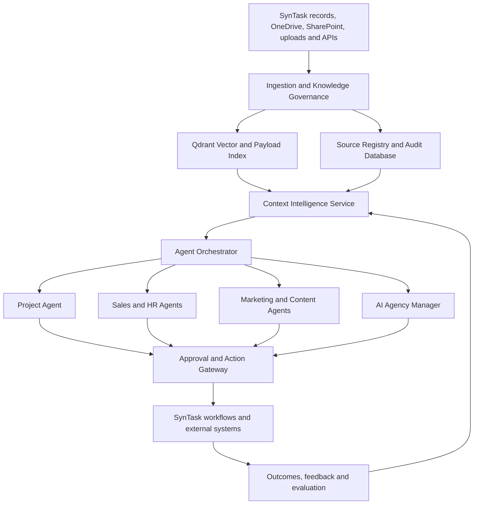
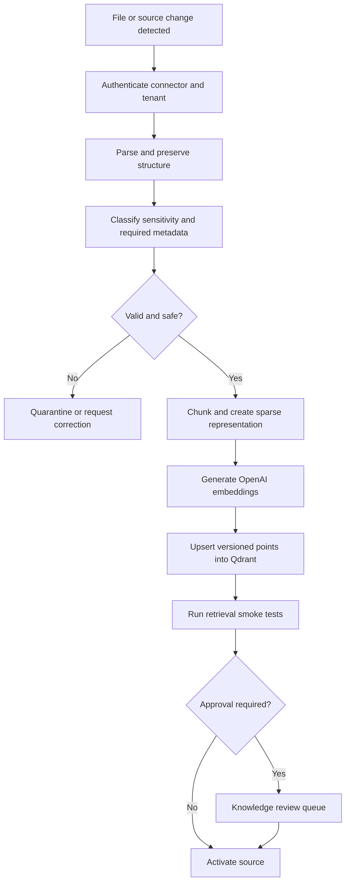
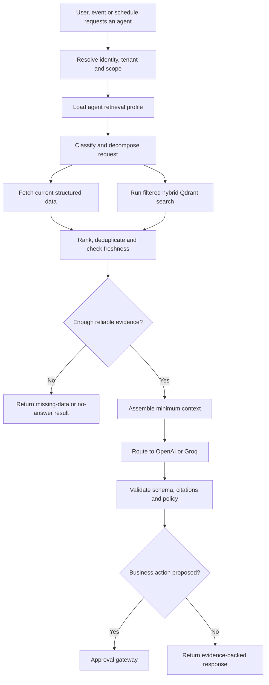
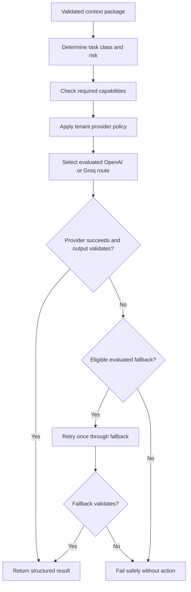

# SynTask Central RAG and Context Intelligence Layer

## Functional Requirements Document (FRD)

| Document field | Value |
|---|---|
| Product | SynTask — AI Operating System for Digital Marketing Agencies |
| Feature | Central RAG and Context Intelligence Layer |
| Document type | Functional Requirements Document |
| Version | 1.0 |
| Status | Draft for product and engineering review |
| Date | 18 July 2026 |
| Related document | `SynTask_Phase_2_AI_Agents_Workflows_and_User_Stories.md` |
| Primary vector platform | Qdrant |
| AI providers | OpenAI and Groq |

---

## 1. Executive Summary

SynTask requires a central, governed Retrieval-Augmented Generation (RAG) capability that supplies accurate, permission-aware and personalized context to every AI agent. This layer will support the Project Agent, Sales Agent, HR and Recruitment Agent, Digital Marketing Agents, Content Writer Agent, Performance Tracking Agent, Client Reporting Agent and the future AI Agency Manager.

The feature will be called the **SynTask Context Intelligence Layer**. It is not an unrestricted super-agent. It is a shared knowledge and context service that:

1. Ingests and indexes approved organizational knowledge.
2. Retrieves relevant information using semantic, keyword and structured search.
3. Enforces tenant, role, department, client, project and record permissions before retrieval.
4. Builds a different context package for each agent and user.
5. Provides citations, source freshness, confidence and missing-data warnings.
6. Routes AI tasks between OpenAI and Groq according to capability, latency, quality, risk and cost.
7. Records every retrieval, generation, approval and outcome for audit and evaluation.

The Agent Orchestrator remains responsible for selecting specialist agents. The approval and action layer remains responsible for record changes and external communication. RAG supplies evidence; it does not independently execute business actions.

---

## 2. Product Objective

### 2.1 Problem Statement

Without a central knowledge layer, each SynTask agent would use separate prompts, duplicate context and inconsistent data. This would cause:

- Generic responses that do not reflect the company, department, client or project.
- Cross-client or cross-tenant data leakage risk.
- Answers based on stale documents.
- Conflicting guidance across agents.
- High token usage caused by repeatedly loading excessive context.
- Recommendations without sources or audit evidence.
- Difficult evaluation and improvement of agent quality.

### 2.2 Product Goal

Create one secure and reusable Context Intelligence Layer that allows every authorized agent to answer and act using the most relevant, current and authoritative knowledge available within its permitted scope.

### 2.3 Product Positioning

> SynTask provides each authorized employee with a personalized departmental AI workforce, powered by a shared, tenant-isolated and evidence-grounded Context Intelligence Layer.

### 2.4 Core Principles

1. **Permission before retrieval:** unauthorized content must never be retrieved or sent to an AI provider.
2. **Evidence before confidence:** important claims must link to source evidence.
3. **Live data from live systems:** current task, revenue, lead, attendance and campaign values must come from structured systems, not stale embeddings.
4. **Personalized but governed:** user preferences may change tone or detail, but cannot override company policy.
5. **Human control:** high-impact or external actions require approval.
6. **Provider independence:** agent behavior must not depend on one hard-coded model ID.
7. **Measurable quality:** retrieval and generated outputs must be evaluated using a maintained test set.

---

## 3. Scope

### 3.1 In Scope

- Central knowledge-source registry.
- Document ingestion, parsing, classification, chunking and indexing.
- Qdrant dense and sparse/hybrid retrieval.
- Metadata and access-control filtering.
- Retrieval from approved SynTask records and external document sources.
- Company, department, client, project, record, user and agent context scopes.
- Query classification, decomposition and context assembly.
- Source citations and evidence display.
- Document versioning, expiry, archival and deletion propagation.
- Contradiction, freshness and missing-data warnings.
- Agent-specific retrieval profiles.
- Controlled run, record, user-preference and outcome memory.
- OpenAI and Groq provider routing and fallback.
- Structured output validation.
- Retrieval and AI usage audit logs.
- Administrative knowledge-management screens.
- Feedback, evaluation and RAG quality dashboards.
- Human approval integration for proposed business actions.
- Initial support for the agents defined in the Phase 2 AI Agent document.

### 3.2 Out of Scope for the First Release

- Unrestricted autonomous business actions.
- Autonomous hiring, candidate rejection, publishing, invoicing or budget changes.
- Cross-tenant global memory or cross-client learning.
- Training foundation models on customer data.
- Full knowledge-graph or GraphRAG implementation.
- Unrestricted public-web browsing by agents.
- Automatic acceptance of every uploaded document as trusted knowledge.
- Voice-agent knowledge retrieval.
- Direct model access to Qdrant credentials or production databases.
- Replacing SynTask's transactional database with Qdrant.

---

## 4. Stakeholders and User Roles

| Role | Responsibilities in this feature |
|---|---|
| Employee | Ask questions and use authorized departmental agents |
| Project Member | Use project knowledge within assigned projects |
| Project Manager | Manage project knowledge, validate plans and review project-agent evidence |
| Department Head | Approve department knowledge and monitor departmental agent quality |
| Sales User | Use approved sales, service, lead and client context |
| HR/Recruiter | Use protected HR, job and candidate context within HR permissions |
| Marketing/Content User | Use client brand, campaign, channel and content knowledge |
| Knowledge Manager | Add, classify, approve, version and retire knowledge sources |
| Tenant Administrator | Configure sources, access policies, provider budgets and retention |
| Security/Compliance Reviewer | Audit access, provider usage, sensitive-data handling and deletion |
| Agent Owner | Configure an agent's purpose, sources, tools, output schema and evaluation set |
| Executive | Consume scoped, evidence-backed cross-department summaries |
| Service Identity | Run approved scheduled agents with an explicit tenant and scope |

---

## 5. Functional Architecture



### 5.1 Responsibility Boundaries

| Component | Owns | Must not own |
|---|---|---|
| Context Intelligence Layer | Retrieval, permissions, evidence, freshness, context assembly | Business action execution |
| Qdrant | Vector/sparse indexes and filterable payload | Authoritative transactional records |
| Agent Orchestrator | Agent selection, workflow state and agent hand-off | Bypassing access or approval rules |
| Specialist Agent | Domain reasoning and structured recommendations | Context outside its configured scope |
| Provider Router | OpenAI/Groq selection, fallback, retry and budgets | Business permissions |
| Approval Gateway | Human review and allow-listed execution | Generating unsupported business decisions |
| SynTask Database | Users, permissions and current operational records | Semantic document search |

---

## 6. Knowledge and Personalization Model

### 6.1 Context Hierarchy

The context service must evaluate knowledge in the following order:

| Authority order | Scope | Examples |
|---:|---|---|
| 1 | Company policy | Legal rules, security rules, approved services, communication standards |
| 2 | Department policy | HR policy, sales playbook, marketing SOP, project-delivery standards |
| 3 | Client knowledge | Contract constraints, brand voice, approved claims, audience, competitors |
| 4 | Project or record context | Project brief, task, campaign, candidate, lead or meeting |
| 5 | User context | Role, permissions, timezone, language and approved preferences |
| 6 | Agent profile | Objective, allowed sources, tools, output schema and restrictions |
| 7 | Run context | Current request and temporary conversation state |

### 6.2 Conflict Rules

- Higher-authority approved policy overrides lower-authority preferences.
- More specific knowledge may override general knowledge only when its authority level allows it.
- Active versions override superseded versions.
- Approved sources rank above unapproved or draft sources.
- When two active sources of equal authority conflict, the system must show a conflict warning and avoid presenting either as certain.
- An expired document must not be used for an actionable recommendation unless explicitly requested and clearly labeled as historical.

### 6.3 Personalization Rules

- Personalization must be assembled at request time; separate model training per employee is not required.
- User preference memory may control tone, language, output length and report detail.
- User memory must not grant additional permissions.
- A user's preference cannot override compliance, brand or action-approval rules.
- Sensitive HR or finance context must not be used merely because it would improve personalization.

---

## 7. Functional Requirements

Priority uses MoSCoW classification: Must, Should, Could and Won't for the first release.

### 7.1 Knowledge Source and Ingestion Requirements

| ID | Requirement | Priority | Acceptance criteria |
|---|---|---|---|
| FR-KNW-001 | The system shall maintain a registry of all knowledge sources. | Must | Each source has an ID, tenant, owner, type, status, connector, sensitivity, timestamps and retention policy. |
| FR-KNW-002 | The system shall ingest approved files from manual upload and configured connectors. | Must | Authorized users can submit supported files and see ingestion status. |
| FR-KNW-003 | The system shall support PDF, DOCX, PPTX, XLSX, CSV, TXT, HTML and Markdown in the initial release. | Must | A test document of every supported type is parsed and searchable without losing its source identity. |
| FR-KNW-004 | The ingestion pipeline shall preserve document structure where possible. | Must | Titles, headings, sections, list items, tables and page/slide references are stored with chunks. |
| FR-KNW-005 | The system shall apply configurable semantic chunking. | Must | Chunks respect headings and maximum size; no chunk is indexed without source and scope metadata. |
| FR-KNW-006 | The system shall generate embeddings through the configured OpenAI embedding model. | Must | Every active text chunk has an embedding version and model identifier. |
| FR-KNW-007 | The system shall support sparse representation for keyword-sensitive hybrid retrieval. | Must | Exact names, IDs, codes and phrases can be found even when semantic similarity is weak. |
| FR-KNW-008 | The system shall validate mandatory metadata before activating a source. | Must | A source without tenant, confidentiality, owner, scope or approval status cannot become searchable. |
| FR-KNW-009 | The system shall detect duplicate and unchanged content using a checksum. | Must | Re-uploading unchanged content does not create duplicate active chunks or duplicate embedding cost. |
| FR-KNW-010 | The system shall version changed documents. | Must | The new version becomes active only after successful indexing; previous versions remain auditable but are excluded from normal retrieval. |
| FR-KNW-011 | The system shall expose ingestion states. | Must | States include queued, parsing, classifying, indexing, active, partially failed, failed, stale, archived and deleted. |
| FR-KNW-012 | The system shall provide retry and re-index controls. | Must | An authorized user can retry a failed source without duplicating active points. |
| FR-KNW-013 | The system shall synchronize updates and deletions from connected sources. | Must | Deleted or access-revoked content becomes unavailable within the defined freshness SLA. |
| FR-KNW-014 | The system shall quarantine suspected malicious or prompt-injection content. | Must | Quarantined content is excluded from agent retrieval until reviewed. |
| FR-KNW-015 | The system should support OCR for scanned documents and images. | Should | OCR output is labeled as extracted text and retains page/image references. |
| FR-KNW-016 | The system shall allow authorized knowledge approval and retirement. | Must | Draft sources are not used for normal answers until approved; retired sources are excluded while remaining auditable. |

### 7.2 Metadata Requirements

Each Qdrant point and corresponding source record must support the following metadata where applicable:

```text
tenant_id
company_id
department_id
client_id
project_id
record_type
record_id
user_id
agent_types
document_id
document_version
chunk_id
document_type
title
section
source_uri
source_system
source_owner_id
confidentiality_level
allowed_roles
allowed_user_ids
approval_status
effective_from
effective_until
created_at
updated_at
indexed_at
freshness_ttl
language
checksum
embedding_model
embedding_version
deletion_status
```

| ID | Requirement | Priority | Acceptance criteria |
|---|---|---|---|
| FR-MET-001 | `tenant_id` shall be mandatory and immutable for every indexed point. | Must | Attempts to insert a point without a tenant or change its tenant are rejected and audited. |
| FR-MET-002 | Filterable scope fields shall use Qdrant payload indexes. | Must | Tenant, department, client, project, confidentiality, status and expiry filters are covered by indexes. |
| FR-MET-003 | The metadata schema shall support source-level and chunk-level references. | Must | Every citation can resolve from a generated statement to its source and location. |
| FR-MET-004 | Metadata schema changes shall be versioned. | Must | The application can identify and migrate points created under an older schema. |

### 7.3 Retrieval Requirements

| ID | Requirement | Priority | Acceptance criteria |
|---|---|---|---|
| FR-RET-001 | The system shall authenticate the user or service identity before retrieval. | Must | Anonymous or invalid identities receive no knowledge results. |
| FR-RET-002 | Tenant and authorization filters shall be applied before search results are returned. | Must | Cross-tenant and unauthorized-record test queries return zero restricted chunks. |
| FR-RET-003 | The system shall classify each request as document retrieval, structured-data lookup, combined retrieval or unsupported. | Must | The selected route is recorded in the run log. |
| FR-RET-004 | The system shall use structured tools for current transactional values. | Must | Current task, lead, invoice, attendance and KPI values are fetched from their authoritative APIs or database services. |
| FR-RET-005 | The system shall support hybrid dense and sparse retrieval in Qdrant. | Must | Evaluation queries requiring concepts and exact terms retrieve both categories of results. |
| FR-RET-006 | The system shall fuse and rerank retrieval candidates. | Must | The final context uses a deterministic configured fusion/reranking policy and records candidate scores. |
| FR-RET-007 | The system shall support query rewriting and decomposition for multi-part questions. | Should | Rewritten subqueries are retained in the audit trace and remain within original permissions. |
| FR-RET-008 | The system shall rank by semantic relevance, lexical match, source authority, approval, specificity and freshness. | Must | Expired or low-authority content cannot outrank applicable active policy solely due to vector similarity. |
| FR-RET-009 | The system shall deduplicate overlapping chunks. | Must | The generated context does not contain materially identical passages from the same document version. |
| FR-RET-010 | The context builder shall respect a configurable token budget. | Must | Oversized result sets are compressed or trimmed without dropping mandatory policy context. |
| FR-RET-011 | The system shall return source citations with every evidence-backed answer. | Must | Citations open the authorized source or SynTask record and identify the relevant section/page when available. |
| FR-RET-012 | The system shall report missing, stale and failed sources. | Must | The response identifies data gaps and whether the result is safe to act on. |
| FR-RET-013 | The system shall detect material conflicts among retrieved sources. | Must | Conflicting active sources produce a warning and are listed separately. |
| FR-RET-014 | The system shall provide a grounded no-answer response when evidence is insufficient. | Must | The model does not invent an answer and suggests the missing source or next step. |
| FR-RET-015 | The system shall prevent retrieved content from modifying system or agent instructions. | Must | Prompt-injection evaluation content cannot override the configured agent profile or tool policy. |
| FR-RET-016 | The system should support multilingual queries and cross-language retrieval. | Should | Supported-language tests retrieve the same authorized source when meaning is equivalent. |

### 7.4 Agent Context and Personalization Requirements

| ID | Requirement | Priority | Acceptance criteria |
|---|---|---|---|
| FR-CTX-001 | Each agent shall have a versioned retrieval profile. | Must | The profile defines objective, sources, filters, priorities, forbidden sources, tools, schema and approval rules. |
| FR-CTX-002 | The system shall assemble context according to the hierarchy in Section 6. | Must | A run log identifies which scopes contributed to the final context. |
| FR-CTX-003 | The same query may produce different authorized contexts for different users. | Must | Two users with different roles receive results consistent with their access and preferences. |
| FR-CTX-004 | Company and compliance instructions shall be injected as mandatory context. | Must | Agent outputs cannot omit applicable active policy when producing actionable recommendations. |
| FR-CTX-005 | Agent prompts shall be centrally versioned. | Must | Every run records the agent, prompt, retrieval-profile and output-schema versions. |
| FR-CTX-006 | Each agent shall receive only the minimum context required for its task. | Must | Context logs show no unrelated department, client or project content. |
| FR-CTX-007 | The system shall support user preferences for tone, language and detail. | Should | An authorized saved preference changes presentation but not facts, policies or permissions. |
| FR-CTX-008 | Department and client terminology shall be supported. | Should | Approved terms and names are preferred over generic wording in generated drafts. |
| FR-CTX-009 | The Project Agent shall be scoped to the selected project and authorized dependencies. | Must | It cannot retrieve content from unassigned projects unless the user has broader permission. |
| FR-CTX-010 | Department agents shall use their own source allow-lists. | Must | HR, Sales and Marketing agents cannot retrieve one another's restricted sources by default. |

### 7.5 Memory Requirements

| ID | Requirement | Priority | Acceptance criteria |
|---|---|---|---|
| FR-MEM-001 | The system shall support temporary run memory. | Must | Run memory expires according to policy and is not automatically added to organizational knowledge. |
| FR-MEM-002 | The system shall support approved record memory. | Must | A fact can be linked to a client, lead, candidate, project or campaign with source and approval data. |
| FR-MEM-003 | The system shall support explicit user-preference memory. | Should | Users can review, update and delete their preferences. |
| FR-MEM-004 | The system shall support outcome memory for accepted recommendations. | Should | Outcome records identify the recommendation, action, result and evaluation period. |
| FR-MEM-005 | The system shall not create cross-tenant or uncontrolled global memory. | Must | Security tests confirm no memory is retrieved outside its tenant and configured scope. |
| FR-MEM-006 | Sensitive memory shall follow retention and deletion rules. | Must | Deleting an eligible source or user removes or anonymizes associated memory according to policy. |

### 7.6 OpenAI and Groq Provider Requirements

| ID | Requirement | Priority | Acceptance criteria |
|---|---|---|---|
| FR-AI-001 | The system shall use a provider abstraction instead of direct model calls throughout domain code. | Must | OpenAI or Groq can be selected by configuration without changing agent business logic. |
| FR-AI-002 | Model IDs shall be environment/configuration driven. | Must | A model can be changed through approved configuration and the change is versioned. |
| FR-AI-003 | OpenAI shall be the default embedding provider for the initial release. | Must | Embedding model, dimensions and version are recorded for every indexed vector. |
| FR-AI-004 | The router shall select a generation provider by capability, quality, latency, risk and cost policy. | Must | Every run records the selected provider and routing reason. |
| FR-AI-005 | Groq should be preferred for approved low-latency tasks. | Should | Classification, extraction, summarization or drafting tasks use Groq when the configured model passes the task evaluation. |
| FR-AI-006 | OpenAI should be preferred for approved high-complexity or high-risk reasoning tasks. | Should | Complex planning or client-ready tasks use the configured OpenAI route when required by policy. |
| FR-AI-007 | The system shall validate all agent outputs against a defined schema. | Must | Invalid outputs receive one controlled repair attempt or fail without executing an action. |
| FR-AI-008 | The system shall implement eligible provider fallback. | Must | A retryable provider failure routes to an evaluated alternative when capability and data policy permit. |
| FR-AI-009 | Fallback shall not silently reduce required safety or schema guarantees. | Must | If the alternative lacks a required capability, the run fails safely and explains the limitation. |
| FR-AI-010 | Embedding-provider failure shall queue new indexing work. | Must | Existing indexed content remains searchable; new/changed documents remain pending rather than using incompatible vectors. |
| FR-AI-011 | The system shall implement timeouts, retry limits and circuit breakers. | Must | Provider outages do not cause unlimited retries or duplicate agent actions. |
| FR-AI-012 | Token and monetary usage shall be captured by tenant, agent, provider and run. | Must | Administrators can view usage and configure monthly or per-agent limits. |
| FR-AI-013 | Provider-bound data shall be minimized. | Must | Only authorized selected chunks and necessary instructions are sent to the provider. |
| FR-AI-014 | Provider safety and data policies shall be configurable by tenant. | Should | A tenant can disable a provider or restrict specific data classifications from being sent to it. |

### 7.7 Security and Tenant Isolation Requirements

| ID | Requirement | Priority | Acceptance criteria |
|---|---|---|---|
| FR-SEC-001 | The application shall derive tenant identity from authenticated server-side context. | Must | A client-supplied tenant ID cannot override the authenticated tenant. |
| FR-SEC-002 | Qdrant queries shall always contain the authorized tenant filter or tenant shard routing. | Must | Missing tenant scope causes the request to fail closed. |
| FR-SEC-003 | Department, client, project, record and confidentiality filters shall mirror SynTask permissions. | Must | Retrieval authorization tests match source-feature authorization results. |
| FR-SEC-004 | Qdrant shall not be directly accessible from the browser. | Must | All searches pass through the authenticated Context Intelligence API. |
| FR-SEC-005 | Secrets shall be stored outside prompts, documents and logs. | Must | Secret-scanning tests find no provider or database keys in stored run content. |
| FR-SEC-006 | Data shall be encrypted in transit and at rest. | Must | Production configuration passes infrastructure security verification. |
| FR-SEC-007 | Sensitive fields shall be masked when not required for the agent task. | Must | PII test cases show only the minimum authorized fields in provider payloads and logs. |
| FR-SEC-008 | HR candidate ranking shall exclude protected characteristics. | Must | Evaluation traces prove protected fields were not included in ranking context. |
| FR-SEC-009 | Access changes shall invalidate affected retrieval caches. | Must | Revoked access prevents retrieval within the security freshness SLA. |
| FR-SEC-010 | Scheduled agents shall use explicit service identities and scopes. | Must | No scheduled run executes with an unrestricted or implicit global identity. |
| FR-SEC-011 | The system shall maintain an immutable audit record for security-relevant events. | Must | Auditors can trace source access, provider request, output, approval and execution identity. |

### 7.8 Citations, Explainability and Output Requirements

Every agent response using the Context Intelligence Layer must implement the following logical contract:

```json
{
  "summary": "string",
  "answer": "string",
  "recommendations": [],
  "evidence": [],
  "citations": [],
  "missing_data": [],
  "conflicts": [],
  "data_freshness": [],
  "confidence": 0.0,
  "risk_level": "low | medium | high | critical",
  "proposed_actions": [],
  "approval_required": true,
  "retrieval_scope": {},
  "expires_at": null
}
```

| ID | Requirement | Priority | Acceptance criteria |
|---|---|---|---|
| FR-OUT-001 | Important factual claims shall have citations. | Must | Citation coverage meets the release threshold in Section 15. |
| FR-OUT-002 | Citations shall respect source permissions. | Must | A citation link cannot expose a source to a user who loses access after generation. |
| FR-OUT-003 | Confidence shall reflect evidence quality and completeness. | Must | Missing or conflicting evidence reduces confidence according to the configured rubric. |
| FR-OUT-004 | Time-sensitive outputs shall include freshness and expiry information. | Must | Reports and recommendations identify source timestamps and `expires_at` where applicable. |
| FR-OUT-005 | Proposed actions shall be separated from informational content. | Must | The approval gateway receives only validated, allow-listed action objects. |
| FR-OUT-006 | Generated output shall identify whether it is a draft. | Must | Emails, reports, plans and content are visibly marked as draft until approved. |

### 7.9 Approval and Action Requirements

| ID | Requirement | Priority | Acceptance criteria |
|---|---|---|---|
| FR-ACT-001 | RAG retrieval shall be read-only. | Must | The context service has no direct business-record mutation capability. |
| FR-ACT-002 | Agents shall submit record-changing proposals to the approval gateway. | Must | High-impact actions cannot execute directly from generated text. |
| FR-ACT-003 | The approval gateway shall validate the user's current permission at approval time. | Must | An approval fails if the approver's access was revoked after proposal creation. |
| FR-ACT-004 | Approved executions shall be idempotent. | Must | Retrying the same action does not create duplicate tasks, emails, meetings or records. |
| FR-ACT-005 | Final edited content shall be audited separately from the initial AI draft. | Must | The audit log shows generated, edited, approved and executed versions. |

### 7.10 Administration and Knowledge Governance Requirements

| ID | Requirement | Priority | Acceptance criteria |
|---|---|---|---|
| FR-ADM-001 | Administrators shall view knowledge sources by status and scope. | Must | Filters include tenant, department, client, project, source type, owner and status. |
| FR-ADM-002 | Knowledge Managers shall review extracted content and metadata before approval. | Must | A reviewer can inspect representative chunks and correct scope metadata. |
| FR-ADM-003 | Administrators shall view connector health and last synchronization. | Must | Failed and stale connectors appear with remediation guidance. |
| FR-ADM-004 | Administrators shall configure retention, freshness and source-authority rules. | Must | Rule changes are versioned and audited. |
| FR-ADM-005 | Agent Owners shall configure retrieval profiles through governed settings. | Must | Invalid or overly broad source rules are rejected by validation. |
| FR-ADM-006 | Administrators shall see AI and retrieval cost by tenant and agent. | Must | Usage reports can be filtered by date, provider, model, agent and outcome. |
| FR-ADM-007 | Administrators shall be able to disable a source, agent, provider or connector. | Must | Disablement takes effect for new runs without code deployment. |

### 7.11 Audit, Feedback and Evaluation Requirements

| ID | Requirement | Priority | Acceptance criteria |
|---|---|---|---|
| FR-EVL-001 | Every run shall record retrieval and generation trace metadata. | Must | Trace includes identity, scope, query route, source IDs, versions, scores, provider, model, prompt/profile versions, output and latency. |
| FR-EVL-002 | Users shall provide useful/not useful feedback and an optional reason. | Must | Feedback is linked to the exact output version and agent run. |
| FR-EVL-003 | Users shall be able to report an incorrect or unsafe citation. | Must | Reports enter an administrator review queue with source and run context. |
| FR-EVL-004 | Each agent shall have a versioned domain evaluation set. | Must | Release pipelines can run evaluation cases for retrieval, grounding, schema, permission and safety. |
| FR-EVL-005 | The system shall measure retrieval quality separately from generation quality. | Must | Dashboards show Recall@K/precision metrics separately from answer/citation metrics. |
| FR-EVL-006 | The system shall compare provider routes using the same evaluation cases. | Must | A provider/model cannot become a default route until it meets that task's thresholds. |
| FR-EVL-007 | Feedback shall not automatically modify production prompts or knowledge. | Must | Changes require review, versioning and rollback capability. |
| FR-EVL-008 | Administrators shall monitor latency, error, fallback and no-answer rates. | Must | Metrics can be filtered by tenant, agent, provider and date. |

---

## 8. Core Workflows

### 8.1 Knowledge Ingestion Workflow



### 8.2 Agent Retrieval Workflow



### 8.3 Provider Routing Workflow



---

## 9. User Stories and Acceptance/Success Criteria

### US-RAG-001 — Employee asks an evidence-backed question

**As an** employee, **I want** to ask a departmental agent a question and receive an answer based on authorized company knowledge **so that** I can work without manually searching many documents.

**Acceptance criteria**

1. Given an authenticated employee, when the employee asks a supported question, then only authorized sources are searched.
2. The response contains an answer, citations, confidence and freshness information.
3. Clicking a citation opens the source only if the user still has access.
4. If evidence is insufficient, the system identifies what is missing instead of inventing an answer.

### US-RAG-002 — Project Agent receives project-specific context

**As a** project member, **I want** the Project Agent to understand my assigned project's brief, scope, tasks, decisions and dependencies **so that** its plans are specific to the project.

**Acceptance criteria**

1. The agent retrieves the selected project's active knowledge and current structured records.
2. Company delivery policy is included when applicable.
3. Unassigned project content is excluded unless the user has explicit broader permission.
4. Proposed tasks include evidence, owner requirements, dependencies and acceptance criteria.
5. Creating or changing tasks requires the existing approval policy.

### US-RAG-003 — Sales Agent personalizes an outreach draft

**As a** sales representative, **I want** the Sales Agent to use the approved sales playbook, service catalogue, lead history and my writing preferences **so that** the draft is relevant and personal.

**Acceptance criteria**

1. The agent uses the representative's authorized lead and account history.
2. Another representative's restricted leads are not retrievable.
3. Personal tone preferences do not override legal, pricing or communication policy.
4. Unsupported product claims are excluded or flagged.
5. The draft is not sent without human approval.

### US-RAG-004 — HR Agent uses protected knowledge safely

**As an** HR user, **I want** the HR Agent to retrieve approved hiring policy, job requirements and authorized candidate records **so that** screening support remains consistent and auditable.

**Acceptance criteria**

1. Only HR-authorized users can retrieve protected candidate material.
2. Candidate ranking excludes protected characteristics and unrelated personal data.
3. Missing candidate information reduces confidence rather than being treated as a negative fact.
4. Every recommendation identifies the job criteria and evidence used.
5. The system cannot automatically reject or hire a candidate.

### US-RAG-005 — Marketing Agent understands the client brand

**As a** marketing strategist, **I want** the Marketing Agent to use approved client brand, audience, campaign and channel knowledge **so that** recommendations are client-specific.

**Acceptance criteria**

1. Only the selected client's content is retrieved.
2. Brand voice, prohibited language, approved claims and geographic constraints are included.
3. Current campaign metrics come from the configured live connector or SynTask record.
4. Stale connector data is clearly flagged.
5. Recommendations include citations and do not change campaign budget automatically.

### US-RAG-006 — Content Agent creates a grounded draft

**As a** content team member, **I want** the Content Agent to create a draft using the approved brief and client knowledge **so that** the draft follows brand requirements.

**Acceptance criteria**

1. The agent retrieves the approved brief and active brand profile.
2. Factual claims are sourced or marked for verification.
3. Conflicting brand instructions produce a warning.
4. The output is marked as a draft.
5. Publishing remains a human-approved action.

### US-RAG-007 — Department Head governs department knowledge

**As a** department head, **I want** to approve and retire departmental knowledge **so that** agents use the correct operating procedures.

**Acceptance criteria**

1. The department head can review parsed sections, scope and sensitivity before approval.
2. Draft knowledge is excluded from production retrieval by default.
3. Approval, rejection, replacement and retirement are audited.
4. An active replacement excludes the superseded version from normal retrieval.

### US-RAG-008 — Knowledge Manager resolves ingestion failures

**As a** knowledge manager, **I want** to see parsing and indexing failures with remediation guidance **so that** searchable knowledge remains complete.

**Acceptance criteria**

1. Each source displays its current state and most recent successful stage.
2. The failure message distinguishes connector, parsing, metadata, embedding and Qdrant errors.
3. Retrying is idempotent.
4. A partially indexed version cannot silently replace the previous active version.

### US-RAG-009 — Administrator enforces tenant and scope isolation

**As a** tenant administrator, **I want** all retrieval to follow SynTask permissions **so that** agents never expose unauthorized data.

**Acceptance criteria**

1. Tenant identity is derived from the authenticated server context.
2. Requests without valid scope fail closed.
3. Department, client, project and confidentiality changes propagate to retrieval.
4. Security logs identify blocked retrieval attempts without exposing restricted content.

### US-RAG-010 — User controls personalization memory

**As a** user, **I want** to review and change saved AI preferences **so that** personalization remains transparent and under my control.

**Acceptance criteria**

1. The user can view, update and delete eligible preferences.
2. The system identifies which preference influenced a response when relevant.
3. Deleting a preference prevents its use in future runs within the configured SLA.
4. Preferences cannot add access rights.

### US-RAG-011 — User reports an incorrect answer

**As a** user, **I want** to report an incorrect answer or citation **so that** the knowledge or agent can be improved.

**Acceptance criteria**

1. Feedback is linked to the exact run, model, prompt version and sources.
2. The user can select incorrect, outdated, irrelevant, unsafe or access problem.
3. Administrators can review aggregated failure patterns.
4. Feedback does not automatically change production knowledge or prompts.

### US-RAG-012 — System falls back between OpenAI and Groq

**As a** SynTask user, **I want** eligible AI requests to continue during a provider issue **so that** temporary failures do not stop normal work.

**Acceptance criteria**

1. The primary route has a configured timeout and retry limit.
2. Fallback occurs only to a model evaluated for the same task and schema.
3. The run records the primary failure and fallback provider.
4. If required capabilities are unavailable, the request fails safely without executing an action.

### US-RAG-013 — Source deletion propagates to agents

**As a** compliance reviewer, **I want** deleted or access-revoked knowledge to stop appearing in agent results **so that** retention and privacy obligations are respected.

**Acceptance criteria**

1. Deletion creates an auditable tombstone or deletion event.
2. Associated active Qdrant points are deleted or disabled within the security freshness SLA.
3. Retrieval caches containing the source are invalidated.
4. Future citations cannot expose the removed content.

### US-RAG-014 — Executive receives a governed cross-department brief

**As an** executive, **I want** the AI Agency Manager to summarize validated specialist findings **so that** I can prioritize risks and opportunities.

**Acceptance criteria**

1. The manager consumes validated specialist outputs and canonical metrics.
2. Duplicate findings are merged while preserving their evidence.
3. The brief respects the executive's tenant and department scope.
4. Every major finding includes source, freshness and confidence.
5. Delegated actions still follow the target specialist's approval rules.

### US-RAG-015 — Administrator monitors value and cost

**As a** tenant administrator, **I want** to compare quality, usage and cost by agent and provider **so that** I can optimize the AI budget without reducing reliability.

**Acceptance criteria**

1. The dashboard shows runs, tokens, estimated cost, latency, errors, fallbacks and accepted outputs.
2. Data can be filtered by agent, provider, model and time period.
3. Per-agent and tenant budgets can trigger warnings or configured limits.
4. Model-route changes require evaluation evidence and versioned approval.

---

## 10. Agent Retrieval Profiles

Every agent must define a profile using the following structure:

```yaml
agent_id: sales_outreach
version: 1
objective: Create evidence-grounded sales communication drafts
allowed_scopes:
  - company
  - sales_department
  - authorized_lead
  - authorized_client
allowed_sources:
  - company_sales_policy
  - approved_service_catalogue
  - sales_playbook
  - crm_activity
source_priority:
  - company_policy
  - client_or_lead_record
  - department_playbook
  - approved_example
forbidden_sources:
  - restricted_hr
  - unrelated_client
  - unauthorized_finance
allowed_tools:
  - read_lead
  - read_crm_activity
  - create_email_draft
approval_required:
  - send_email
memory_scopes:
  - run
  - lead_record
  - user_preferences
output_schema: sales_outreach_v1
```

### 10.1 Minimum Agent Profiles for Release

1. Project Planning Agent.
2. Lead Qualification Agent.
3. Sales Outreach Agent.
4. Recruitment/HR Agent.
5. Content Writer Agent.
6. Campaign Planner Agent.
7. SEO Strategy Agent.
8. Performance Tracking Agent.
9. Client Reporting Agent.
10. AI Agency Manager, initially read-only.

---

## 11. Data Storage and Ownership

### 11.1 Systems of Record

| Data | System of record |
|---|---|
| Users, roles, tenants and business records | Existing SynTask transactional database |
| Source files | Approved tenant document source such as OneDrive/SharePoint or SynTask-managed storage |
| Embeddings, sparse vectors and searchable payload | Qdrant |
| Source registry, versions, approvals and audit | Existing SynTask transactional database |
| Temporary job state and cache | Existing queue/cache infrastructure |
| Provider configuration and secrets | Secure secrets/configuration service |

### 11.2 Customer Data Ownership Options

| Deployment model | Behavior | Product implication |
|---|---|---|
| Tenant-owned index | Qdrant and source storage run in the customer's controlled environment | Strongest match for “Your data is yours” |
| Dedicated managed tenant | SynTask manages a dedicated encrypted tenant deployment | Strong isolation with operational responsibility for SynTask |
| Shared multitenant cluster | Tenants share infrastructure with mandatory tenant payload/shard isolation | Lowest infrastructure overhead, but requires the strongest automated isolation tests |

The final commercial architecture must clearly disclose that embeddings and indexed chunks are derived customer data. A claim that SynTask stores no customer data is only accurate if the vector index and source content remain in the customer's controlled environment and SynTask retains only permitted operational metadata.

---

## 12. Technical Stack

| Layer | Selected technology | Responsibility |
|---|---|---|
| Vector database | Qdrant | Dense vectors, sparse vectors, payload filters, hybrid search and tenant-aware partitioning |
| Embeddings | OpenAI Embeddings API | Generate versioned text embeddings for semantic retrieval |
| High-complexity AI | OpenAI Responses API through provider adapter | Complex reasoning, planning and high-quality structured generation |
| Low-latency AI | Groq API through provider adapter | Evaluated classification, extraction, summarization and drafting routes |
| Agent orchestration | Existing SynTask backend service | Identity, scope, provider routing, context building, agent state and action proposal |
| Transactional data | Existing SynTask database | Users, RBAC, business records, source registry, approvals, audit and outcomes |
| Jobs and caching | Existing SynTask queue/cache layer | Ingestion jobs, schedules, retry, rate limiting and short-lived authorized cache |
| Document sources | OneDrive/SharePoint, SynTask uploads and approved APIs | Company, department, client and project source files |
| Observability | Existing logging/metrics stack plus AI traces | Latency, errors, retrieval quality, provider usage, security and cost |

### 12.1 Technical Decisions

- Qdrant collections should be organized by embedding configuration rather than creating a collection for every small tenant.
- Tenant payload fields must be indexed and included in every request; large or high-security tenants may use dedicated shards or clusters.
- Dense and sparse candidate sets should be fused using an evaluated Qdrant hybrid-search method such as Reciprocal Rank Fusion.
- Qdrant must be accessed only from server-side services.
- OpenAI embeddings are the initial embedding standard. Changing embedding model or dimensions requires a new versioned index and controlled migration.
- OpenAI and Groq generation APIs must be hidden behind a common internal interface, while provider-specific capability checks remain explicit.
- Model names must not be hard-coded into agent domain logic.
- Structured output support must be tested per provider/model. JSON parsing alone is not sufficient for a high-impact action.
- Provider fallback must be based on an evaluation matrix, not only API compatibility.

### 12.2 Provider Routing Matrix

| Task class | Preferred route | Alternate route | Conditions |
|---|---|---|---|
| Embedding generation | OpenAI | Queue for retry | Do not mix incompatible embedding spaces in one active index |
| Query classification | Groq | OpenAI | Groq model must meet schema and classification evaluation thresholds |
| Metadata extraction | Groq | OpenAI | Sensitive-data policy and structured-output capability must permit route |
| Basic summarization | Groq | OpenAI | Source-grounding evaluation must pass |
| Email/content draft | Groq or OpenAI by agent policy | Evaluated alternate | Client risk, language quality and schema decide route |
| Complex project/campaign planning | OpenAI | Evaluated Groq reasoning model | Fallback only after domain evaluation passes |
| Executive/client-ready report | OpenAI | Evaluated Groq route | Requires citation, tone and factual-grounding thresholds |
| High-impact action proposal | OpenAI or evaluated Groq strict-output route | Safe failure | Must validate schema and always require relevant approval |

---

## 13. Non-Functional Requirements

| ID | Requirement | Initial target |
|---|---|---|
| NFR-PERF-001 | Filtered Qdrant retrieval latency | p95 at or below 2.5 seconds under agreed production load |
| NFR-PERF-002 | First streamed AI response token | p95 at or below 5 seconds for standard interactive requests |
| NFR-PERF-003 | Complete standard response | p95 at or below 12 seconds, excluding approved long-running workflows |
| NFR-ING-001 | Search availability after source update | 95% of eligible documents of 10 MB or less active within 5 minutes |
| NFR-SEC-001 | Cross-tenant leakage | Zero leakage in automated isolation suite and release testing |
| NFR-SEC-002 | Access revocation | Revoked content unavailable within 5 minutes; critical revocation may bypass cache immediately |
| NFR-DEL-001 | Source deletion propagation | Deleted source excluded from retrieval within 15 minutes |
| NFR-AVL-001 | Context service availability | 99.5% monthly for initial production release, excluding planned maintenance |
| NFR-REL-001 | Duplicate action execution | Zero duplicates in idempotency test suite |
| NFR-OBS-001 | Trace coverage | 100% of production agent runs have required trace metadata |
| NFR-COST-001 | Cost attribution | At least 99% of billable provider usage attributed to tenant and agent |
| NFR-PRV-001 | Data minimization | Provider payload contains only selected authorized context required by the task |
| NFR-ACC-001 | Accessibility | Administrative and citation UI meets the product's adopted WCAG target |
| NFR-I18N-001 | Time and language | Timezone-aware timestamps; initial English support with architecture ready for multilingual retrieval |

---

## 14. Error and Edge-Case Handling

| Scenario | Required behavior |
|---|---|
| No relevant source | Return a grounded no-answer response and identify missing knowledge |
| Source is stale | Show warning, timestamp and whether the output is safe to act on |
| Two policies conflict | Show both authorized sources, reduce confidence and request human resolution |
| User loses access during a session | Re-authorize before retrieval, citation access or action approval |
| Qdrant unavailable | Do not fabricate context; fail or use only explicitly safe structured sources |
| OpenAI generation unavailable | Use evaluated Groq fallback when policy and capability allow |
| Groq generation unavailable | Use evaluated OpenAI fallback when policy and budget allow |
| OpenAI embedding unavailable | Queue new indexing work; do not create vectors in an incompatible space |
| Invalid AI schema | Repair once through the configured policy or fail without proposing executable action |
| Connector authorization expired | Mark source stale/failed, notify owner and exclude unsafe-to-use content |
| Deleted document remains in cache | Invalidate by source/version and deny at citation-time authorization |
| Prompt injection found in source | Quarantine or treat content as data only; never follow its instructions |
| Oversized context | Rank, deduplicate and compress while retaining mandatory policies and citations |
| Unsupported file | Reject with supported-format guidance; do not mark as indexed |

---

## 15. Product Success Criteria and Release Gates

### 15.1 Mandatory Release Gates

| Area | Metric | Release threshold |
|---|---|---|
| Tenant isolation | Unauthorized cross-tenant results | 0 across the full automated isolation suite |
| Permission enforcement | Unauthorized source retrieval attempts blocked | 100% in authorization test set |
| Retrieval relevance | Recall@10 on approved gold dataset | At least 85% overall and no critical agent below its agreed floor |
| Citation precision | Citations that support the associated claim | At least 95% |
| Citation coverage | Material factual claims with at least one valid citation | At least 90% |
| Groundedness | Supported answer statements | At least 90% on domain evaluation set |
| No-answer behavior | Correct refusal when evidence is insufficient | At least 90% precision |
| Structured output | Valid output contract | At least 99% after permitted repair; 100% before an action enters approval |
| Prompt-injection resistance | Test attacks prevented from changing policy or tools | 100% of critical attack cases |
| Deletion/access freshness | Compliance with NFR-SEC-002 and NFR-DEL-001 | At least 99% in test and pilot monitoring |
| Auditability | Runs containing mandatory trace fields | 100% |
| Provider fallback | Eligible simulated outages resolved through evaluated fallback | At least 99% |

### 15.2 Pilot Product Success Targets

Measured during the first agreed pilot period:

- At least 70% of rated responses are marked useful or accepted with minor edits.
- At least 30% reduction in time spent locating approved information for pilot workflows.
- At least 25% reduction in time required to prepare selected drafts or plans.
- Fewer than 5% of rated outputs are reported as using outdated or irrelevant primary evidence.
- At least 90% of users can identify why an answer was produced using the displayed citations and explanation.
- AI cost per accepted output is visible and trends downward after routing and caching optimization.
- No confirmed cross-tenant, cross-client or unauthorized departmental disclosure.

### 15.3 Agent-Specific Success Measures

| Agent | Suggested success measures |
|---|---|
| Project Agent | Accepted plan rate, missing-dependency reduction, planning time saved |
| Lead Qualification Agent | Score explanation usefulness, override rate, response-time improvement |
| Sales Outreach Agent | Draft acceptance/edit rate, time to approved follow-up, policy violations |
| Recruitment Agent | Screening time saved, shortlist override rate, bias/safety audit results |
| Content Writer Agent | Brief-to-draft time, brand compliance, approval-cycle reduction |
| Campaign Planner Agent | Accepted plan rate, completeness, unsupported-claim rate |
| SEO Strategy Agent | Evidence quality, accepted recommendations, fabricated-metric rate |
| Performance Agent | Anomaly precision, false-positive rate, detection time |
| Client Reporting Agent | Report preparation time, citation accuracy, correction rate |
| AI Agency Manager | Accepted priority rate, duplicate finding rate, leadership time saved |

---

## 16. Test Strategy

### 16.1 Required Test Suites

1. Unit tests for metadata, filters, routing and output validation.
2. Integration tests for document parsing, embedding, Qdrant indexing and search.
3. Tenant, department, client, project and record isolation tests.
4. Retrieval relevance tests using a versioned gold dataset.
5. Structured-data versus document-routing tests.
6. Citation precision and coverage tests.
7. Prompt-injection and malicious-document tests.
8. PII and protected-attribute exclusion tests.
9. Provider outage, timeout, fallback and circuit-breaker tests.
10. Model and prompt regression evaluations.
11. Connector update, access-revocation and deletion propagation tests.
12. Load and latency tests using representative tenant filters.
13. Approval and idempotent action execution tests.
14. Cost attribution and tenant-budget tests.

### 16.2 Evaluation Dataset Requirements

Each specialist agent's evaluation set must contain:

- Straightforward answerable questions.
- Exact-name, code and phrase searches.
- Semantic/paraphrased questions.
- Questions requiring combined structured and unstructured data.
- Multi-step questions requiring query decomposition.
- Questions with no supporting evidence.
- Conflicting and expired-source cases.
- Unauthorized cross-tenant and cross-department requests.
- Prompt-injection documents.
- Sensitive-data and protected-attribute cases.
- Provider-specific schema and fallback cases.

---

## 17. Delivery Plan

### Foundation — Security and Knowledge Model

- Source registry and metadata schema.
- Qdrant deployment and tenant strategy.
- Authenticated Context Intelligence API.
- OpenAI embedding pipeline.
- Ingestion status, versioning and deletion.
- Audit trace foundation.

### MVP — Governed Retrieval

- Manual upload and first approved connector.
- Dense and sparse hybrid search.
- Permission filters and source citations.
- Freshness, conflicts and grounded no-answer.
- Admin knowledge review.
- Gold evaluation dataset.

### Wave 1 — First Specialist Agents

- Project Planning Agent.
- Lead Qualification Agent.
- Recruitment Agent.
- Content Writer Agent.
- OpenAI/Groq provider routing and cost reporting.

### Wave 2 — Communication and Client Context

- Sales Outreach Agent.
- Campaign Planner Agent.
- Client Reporting Agent.
- Client brand profiles and approval integration.

### Wave 3 — Continuous Intelligence

- SEO Strategy Agent.
- Performance Tracking Agent.
- External KPI connectors and outcome memory.

### Wave 4 — Executive Intelligence

- Read-only AI Agency Manager.
- Cross-agent finding deduplication.
- Executive prioritization and delegated, approval-governed actions.

---

## 18. Dependencies and Assumptions

### 18.1 Dependencies

- Stable SynTask tenant, role, hierarchy, client, project and record permissions.
- Reliable notification and approval infrastructure.
- Idempotent action execution.
- Canonical metric definitions for performance agents.
- Valid OpenAI, Groq and Qdrant configuration.
- Secure secret management.
- Document-source connector permissions and change notifications/polling.
- Observability and cost collection.

### 18.2 Assumptions

- Existing SynTask authentication remains the identity authority.
- Existing business databases remain authoritative for live operational data.
- A Knowledge Manager or designated owner approves sensitive production knowledge.
- Each tenant can configure data retention and permitted AI providers.
- Model and provider availability will change; configuration and evaluation determine production routes.
- The initial production language is English unless product scope states otherwise.

---

## 19. Risks and Mitigations

| Risk | Impact | Mitigation |
|---|---|---|
| Cross-tenant retrieval | Critical data breach | Fail-closed server scope, Qdrant tenant payload/shards, automated negative tests |
| Stale documents | Incorrect actions | Freshness TTL, connector health, expiry and warnings |
| Prompt injection in documents | Policy/tool manipulation | Content quarantine, instruction/data separation and adversarial evaluation |
| Provider outage | Workflow interruption | Timeouts, circuit breakers and evaluated fallback |
| Provider capability mismatch | Invalid or unsafe output | Capability matrix, schema validation and safe failure |
| Embedding migration | Mixed incompatible vectors | Versioned collections/index aliases and controlled re-index |
| Excessive token cost | Poor unit economics | Retrieval budget, caching, deduplication, model routing and usage limits |
| Generic personalization | Low adoption | Layered company, department, client, project and user context |
| Over-personalization | Privacy or policy violations | Minimal context, explicit memory and policy precedence |
| Incorrect source authority | Conflicting answers | Approval workflow, authority ranking and conflict warning |
| Deleted data remains retrievable | Compliance failure | Tombstones, Qdrant deletion, cache invalidation and verification jobs |

---

## 20. Traceability Matrix

| Product objective | Primary requirements | User stories | Success measures |
|---|---|---|---|
| Secure tenant-aware retrieval | FR-RET-001–002, FR-SEC-001–011 | US-RAG-009, US-RAG-013 | Zero leakage, 100% permission enforcement |
| Accurate grounded answers | FR-RET-005–014, FR-OUT-001–004 | US-RAG-001, US-RAG-011 | Recall@10, groundedness, citation precision |
| Personalized specialist agents | FR-CTX-001–010, FR-MEM-001–006 | US-RAG-002–006, US-RAG-010 | Acceptance rate and time saved |
| Governed knowledge lifecycle | FR-KNW-001–016, FR-ADM-001–007 | US-RAG-007–008, US-RAG-013 | Freshness, ingestion success, outdated-answer rate |
| Resilient multi-provider AI | FR-AI-001–014 | US-RAG-012, US-RAG-015 | Fallback success, schema validity, latency and cost |
| Safe business execution | FR-ACT-001–005 | US-RAG-002–006, US-RAG-014 | Approval coverage and zero duplicate actions |
| Continuous quality improvement | FR-EVL-001–008 | US-RAG-011, US-RAG-015 | Useful-rating rate, regression pass rate and cost per accepted output |

---

## 21. Product Decisions Required Before Implementation

1. Will Qdrant be shared multitenant, dedicated per enterprise tenant or customer-hosted?
2. Which document source is included in the MVP: manual upload, OneDrive, SharePoint or both?
3. Which data classifications may be sent to OpenAI and Groq for each tenant?
4. Which OpenAI embedding model and vector dimensions will become the first index standard?
5. Which generation models pass evaluation for each task class?
6. Which four specialist agents will be included in the first RAG-enabled release?
7. Who may approve company, department, client and project knowledge?
8. What retention and deletion policies apply to chunks, traces, prompts and user memory?
9. What production latency, scale and availability tier is commercially required?
10. Will “Your data is yours” mean customer-owned source storage only, or customer-owned vector index as well?

---

## 22. Definition of Done

The Central RAG and Context Intelligence Layer is complete for its first production release when:

1. Mandatory functional and non-functional requirements are implemented.
2. The security and tenant-isolation release gates pass with zero leakage.
3. The approved gold evaluation set meets retrieval, grounding and citation thresholds.
4. OpenAI/Groq routing and safe fallback are evaluated for every enabled task class.
5. Source updates, access revocation and deletion meet freshness targets.
6. At least the approved Wave 1 agents use versioned retrieval profiles and structured outputs.
7. All high-impact actions pass through the approval gateway.
8. Administrators can govern sources, agents, providers, budgets and retention.
9. Audit and cost attribution cover all production runs.
10. Product, engineering, QA, security and business owners approve the production-readiness review.

---

## 23. Technical References

- [Qdrant filtering](https://qdrant.tech/documentation/search/filtering/)
- [Qdrant multitenancy](https://qdrant.tech/documentation/manage-data/multitenancy/)
- [Qdrant hybrid queries](https://qdrant.tech/documentation/search/hybrid-queries/)
- [OpenAI embeddings](https://developers.openai.com/api/docs/guides/embeddings)
- [OpenAI structured outputs](https://developers.openai.com/api/docs/guides/structured-outputs)
- [Groq OpenAI compatibility](https://console.groq.com/docs/openai)
- [Groq structured outputs](https://console.groq.com/docs/structured-outputs)

