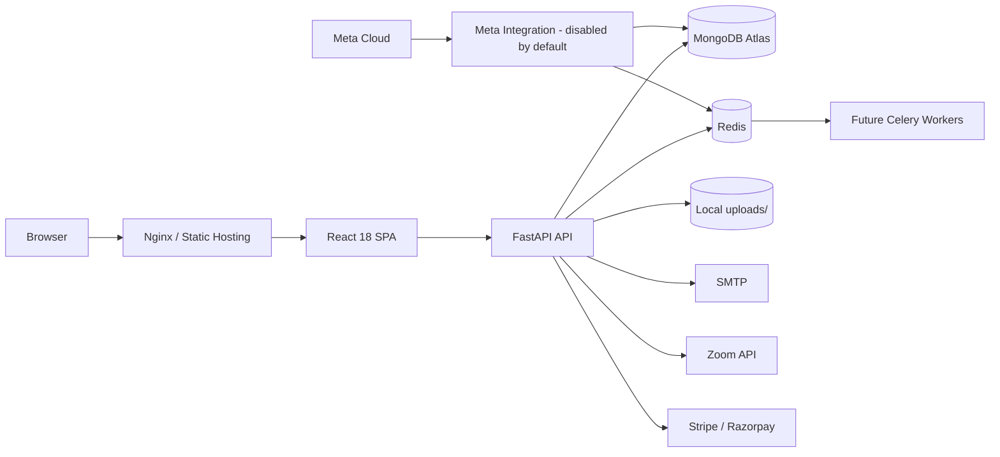
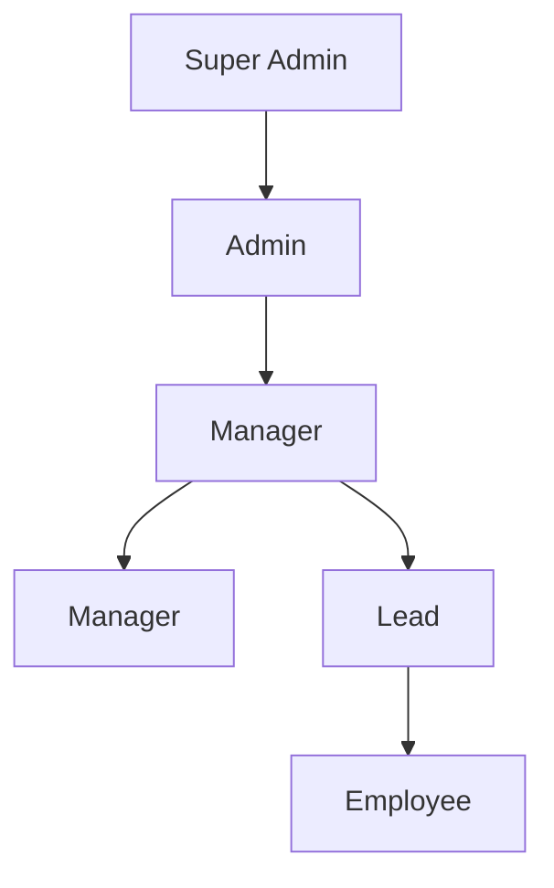
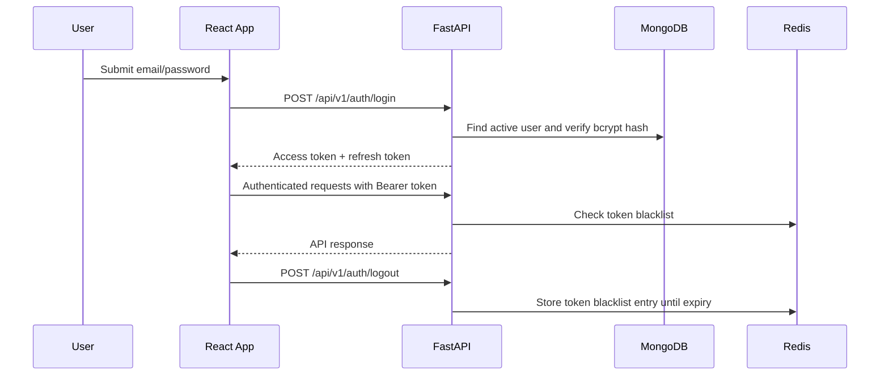
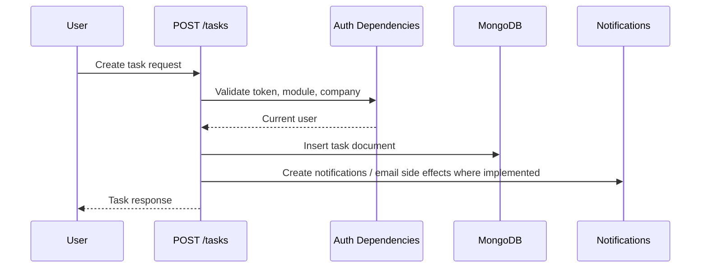

# Architecture Overview - SynTask

## System Architecture Diagram

See the standalone diagram in [docs/diagrams/architecture.md](docs/diagrams/architecture.md).

## Multi-Tenancy Design
SynTask uses a single MongoDB database with tenant isolation through `company_id`. Tenant-owned collections such as projects, tasks, tickets, clients, invoices, meetings, sales records, and usage records include a `company_id` field. API handlers use the authenticated user returned by `get_current_user()` and helper dependencies in `backend/app/api/dependencies.py` to enforce company access.

Request bodies are not trusted for tenant ownership. Endpoints generally derive tenant scope from the current user and role. Super admins are the exception and can operate across tenants for company, plan, billing, and usage administration.

## Role Hierarchy

| Role | Purpose | Enforcement |
|---|---|---|
| Super Admin | Platform and tenant administration | `get_current_super_admin`, model `can_create_role()` |
| Admin | Company administration | `get_current_company_admin` |
| Manager | Team management | `get_current_company_admin_or_lead`, hierarchy helpers |
| Lead | Employee management | hierarchy helpers |
| Employee | Assigned task/ticket execution | authenticated endpoint access |

Project/task delivery access is company-scoped before role rules apply. Company Admin and Super Admin can list and manage all company tasks. Managers can list all company projects and tasks, but task detail edits and assignment changes are limited to tasks whose `department_id` matches the manager's `department_id`; negative tests cover cross-department edit denial. Employees list tasks assigned to them and can see projects that contain those assigned tasks, but task/project detail editing is disabled except for allowed task progress/status, comments, and attachments.

## Authentication Flow

Access tokens expire according to `ACCESS_TOKEN_EXPIRE_MINUTES`; refresh tokens use `REFRESH_TOKEN_EXPIRE_DAYS`. Logout blacklists the access token and an optional refresh token in Redis.

## Module Access Control
<<<<<<< HEAD
Users have a `modules: List[str]` field such as `["task"]` or `["task", "sales"]`. The `require_module("task")` dependency gates most task-management route groups in `backend/app/api/v1/router.py`. Chat route groups accept `chat`, `task`, or `tasks_projects` module access because chat is global workspace communication; endpoint logic still enforces same-company participants and group membership. Sales endpoints perform endpoint-level authorization.
=======
Users have a `modules: List[str]` field. Canonical module IDs are `tasks_projects`, `tickets`, `chat`, `meetings_calendar`, `invoicing_ledger`, `sales_crm`, `attendance_leaves`, `recruitment`, `reports`, and `ai_agents`. Backend `require_module(...)` dependencies gate protected route groups; the legacy `task` ID remains compatible with `tasks_projects`.

The local `admin@demo.com` fixture receives every canonical module when `backend/create_demo_admin.py` creates or updates it. This is development-only fixture access and does not bypass role, tenant, hierarchy, ownership, or resource authorization. Existing sessions must sign in again after the fixture is updated so client auth state reflects the new module list.
>>>>>>> 027439c7720c0fda09fadcd5e3d4230db711fd26

## Key Design Patterns
### Beanie ODM
Document models live in `backend/app/models`. They define collection names, indexes, enums, and document fields.

### Async-First Backend
FastAPI endpoints, Motor, Beanie, Redis, and background helpers are async-first.

### Dependency Injection
Authentication, role gates, module gates, and company access checks are implemented as FastAPI dependencies.

### Meta Integration Foundation
Meta support lives under `backend/app/integrations/meta` rather than CRM controllers. Phase 1 adds tenant-scoped settings, durable webhook inbox, sync-run, and marketing-insight documents. Deployment-wide Meta credentials come from environment variables; tenant tokens are encrypted with the existing Fernet helper before database storage. `META_INTEGRATION_ENABLED` defaults to `False`, and tenant settings default disabled, so deploying the foundation changes no CRM behavior.

Tenant mapping is anchored by unique `company_id` and Page/Form indexes. Super-admin configuration requires explicit tenant selection; company admins cannot select another tenant. Existing outbound `Webhook` and `WebhookDelivery` models remain unchanged because inbound Meta events have different signature, idempotency, retry, and processing lifecycles.

### Background Tasks
Startup launches the deadline checker from `app.core.deadline_checker`, the centralized reminder scheduler from `app.services.reminder_service`, and the one-minute scheduled-job runner from `app.services.scheduling_service`. The reminder scheduler runs hourly in-process, scans incomplete assigned tasks and unpublished assigned content with due dates up to three days ahead plus overdue records, and writes company-scoped notifications with duplicate keys in notification metadata. The scheduled-job runner locks due `scheduled_jobs` records atomically before invoking the existing project/task creation services, then records notifications and timeline events. Celery and Redis dependencies are present, but Celery workers are not yet wired as the primary background execution path.

## Current Architecture Limitations
- Phase 3 introduced a service layer for users, projects, tasks, sprints, epics, files, notifications, email, and automation. Some legacy endpoint modules still contain business logic and should continue moving behind services incrementally.
- The legacy monolithic `projects.py` endpoint has been decomposed into a package under `backend/app/api/v1/endpoints/projects/`. Other large modules such as chat, users, tickets, MSA, and sales reports remain candidates for future decomposition.
- Chat uses REST-style endpoints, not WebSocket.
- File storage is local `uploads/`; S3 configuration exists but is optional and not the default storage path.
- Project routes accept the logical `project_id` or MongoDB `_id` for compatibility. Tasks now include `project_object_id` for normalized project lookups while legacy `project_id` values remain supported.

## Data Flow: Task Creation

## Database Collections
The database reference in [backend/DATABASE_SCHEMA.md](backend/DATABASE_SCHEMA.md) is generated from Beanie models. Major domains include users, companies, subscriptions, projects, tasks, tickets, clients, invoices, MSAs, chat, meetings, time tracking, timesheets, sales CRM, workflows, automation, webhooks, notifications, and usage tracking.

## File Storage
Uploads are stored under `backend/uploads` or subdirectories such as clients, projects, MSA, and avatars. File type validation uses byte signatures for common allowed file types. AWS S3 settings exist for future object storage migration.
