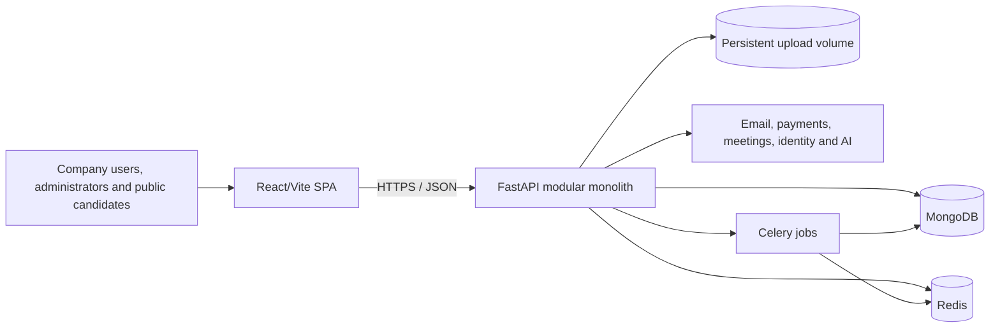
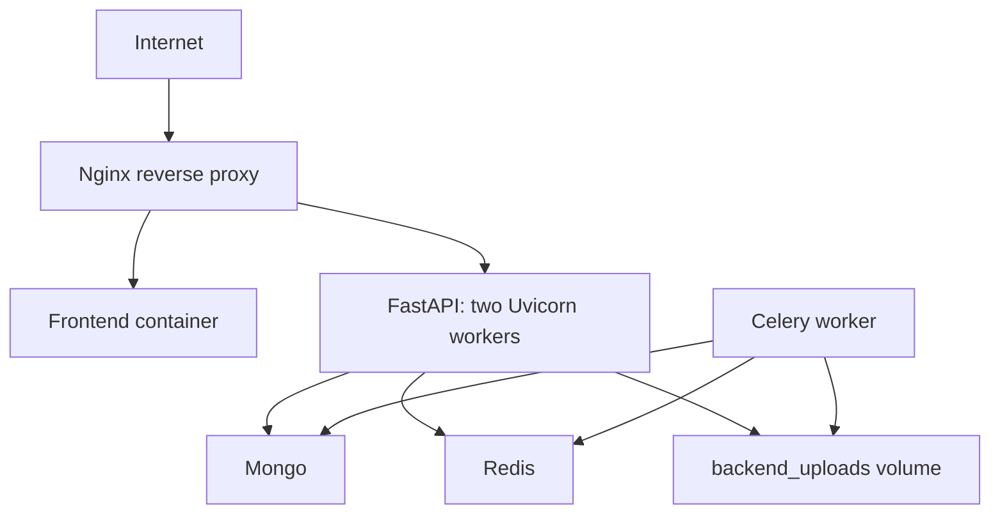
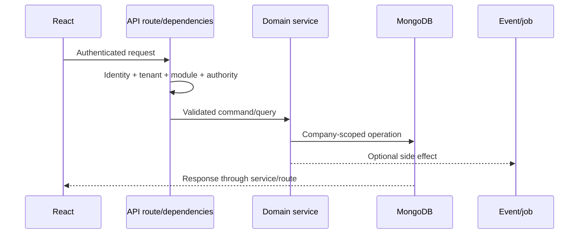

# SynTask Detailed Architecture

Status: current-state baseline from repository analysis  
Last reviewed: 2026-07-17

## Scope and evidence

This describes implementation visible in the repository. Production configuration, live data, provider accounts, performance, restoration, and operations require environment evidence. See [NFRs](NON_FUNCTIONAL_REQUIREMENTS.md).

## System context

**Observed:** APIs mount at `/api/v1`; React contains authenticated, public careers/signing, and super-admin routes. Compose defines frontend, API, worker, MongoDB, Redis, and Nginx.

**Target:** managed/replicated data services, object storage, TLS/load balancing, centralized telemetry, controlled scheduler ownership, and tested recovery.

## Deployment view

Production Compose does not provide TLS, a separate scheduler, external backup, multi-host storage, or replicated data services. These are go-live requirements, not implied capabilities.

## Backend architecture

One FastAPI deployable contains identity/companies, projects/tasks, CRM/sales, attendance/workforce, recruitment, finance/clients, collaboration/notifications, AI/creative/knowledge, and platform-administration domains.

Legacy routes still contain some orchestration. New reusable rules should live in domain/application services without bypassing security dependencies.

## Tenancy and authorization

The shared database/collection approach relies on `company_id`. Decisions evaluate active identity, tenant, enabled module, role/hierarchy, resource ownership/membership, project-scoped effective role, action, and state. Tenant-owned queries should filter by record ID and tenant together.

Project/task authorization uses `app.services.project_permissions` as the source of truth for effective project roles. Permission priority is organization-level management, assigned project Lead from the current project record, project member, then no access. Employee users assigned as `Project.lead_id` keep their global Employee role but receive Lead permissions only for that project; each protected request reloads the project and recalculates permissions, so replacement or removal takes effect immediately. Task mutations verify the task's stored project and reject forged cross-project identifiers.

Negative cross-tenant tests are mandatory for records, search, export, files, jobs, notifications, caches, and AI retrieval. Redis-backed revocation has a documented fail-open limitation; production must approve fail-closed or controlled degradation.

## Data rules

- Index tenant plus frequent status/user/project filters.
- Standardize timestamps and actor fields.
- Document logical IDs versus MongoDB `_id` compatibility.
- Use resumable, observable migrations/backfills.
- Use transactions or compensation/idempotency for financial changes.
- Define retention, deletion, and orphan cleanup.

See [database schema](../../backend/DATABASE_SCHEMA.md).

## Jobs and integrations

Jobs require tenant context, idempotency, bounded retries, terminal-failure visibility, and correlation IDs. Email/Brevo, Stripe/Razorpay, Zoom, storage, Google, and AI boundaries must define scopes, timeouts, rate limits, signatures, shared data, retries, and degraded behavior.

## Frontend

React 18/Vite uses React Router, Zustand, React Query, and Axios. Route/module guards improve usability but are not security. React Query should own server state; Zustand should focus on session/view state.

## Principal risks

| Priority | Risk | Required response |
|---|---|---|
| Critical | Inconsistent authorization across many routes | Central policies and permission/isolation tests |
| High | Local uploads constrain multi-host scaling | Object storage and migration plan |
| High | Single data services/no restore evidence | Managed/replicated services and restore drill |
| High | Financial/provider callbacks | Signatures, idempotency, audit, reconciliation |
| Medium | Mixed route/service organization | Incremental boundaries and ADRs |
| Medium | Manual API/schema docs drift | Version OpenAPI and automate checks |
| Medium | AI context/action risk | Scoped retrieval, confirmation, evaluation, audit |

Record durable decisions using [ADRs](decisions/README.md).

