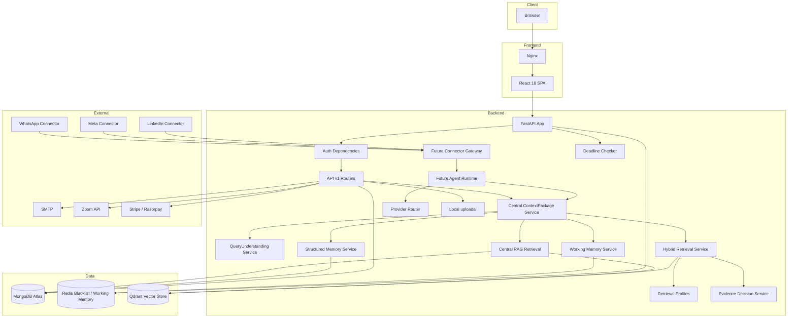
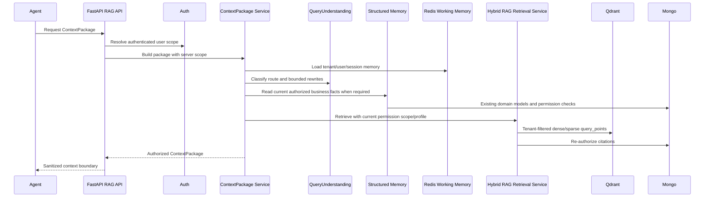
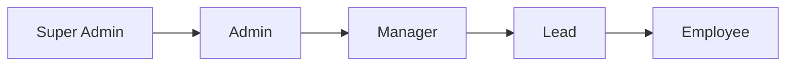
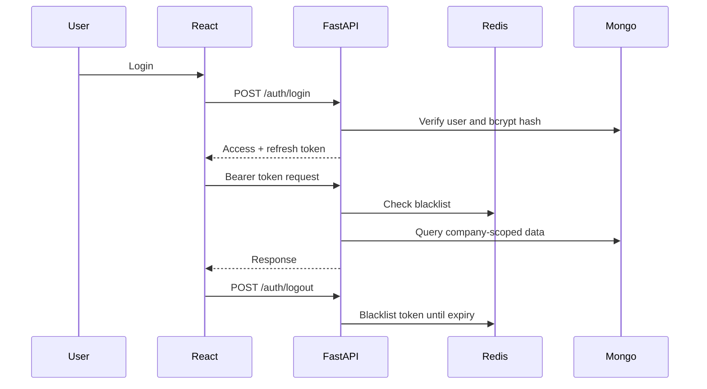
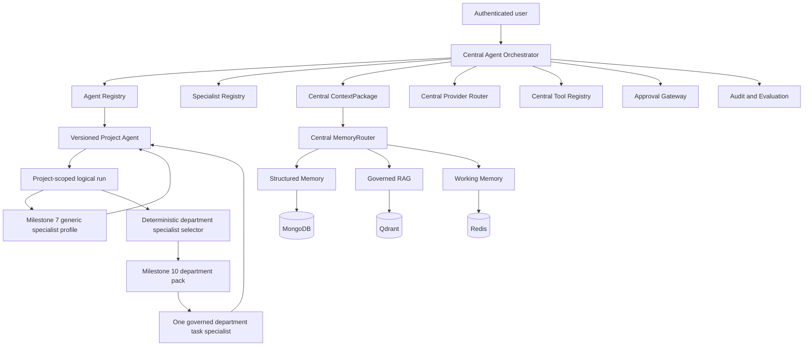
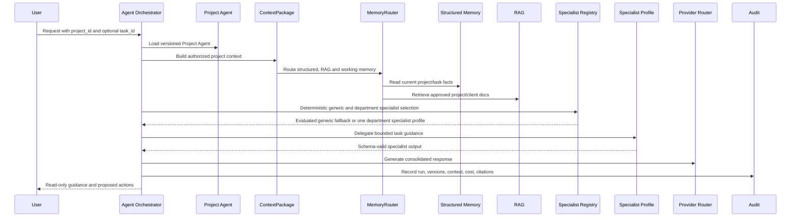
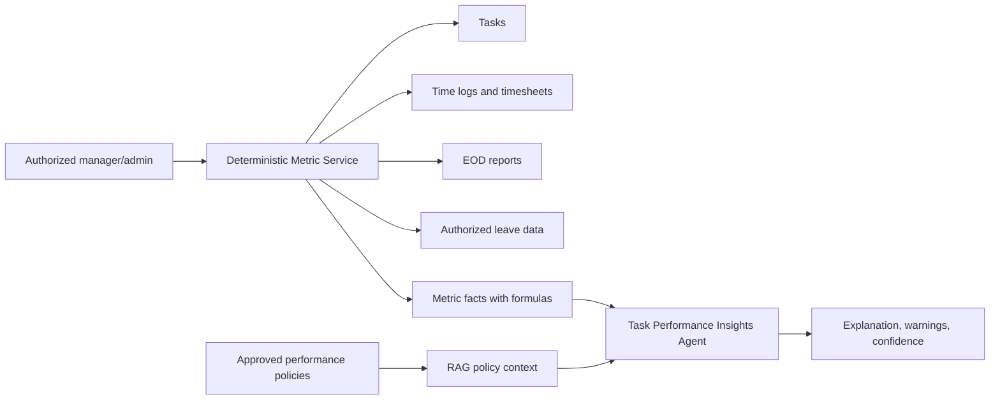
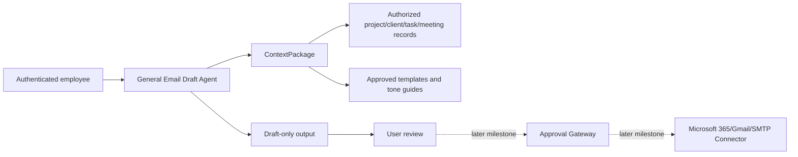

# SynTask Architecture Diagram

```mermaid
flowchart TB
    subgraph Client
        Browser[Browser]
    end

    subgraph Frontend
        Nginx[Nginx]
        React[React 18 SPA]
    end

    subgraph Backend
        FastAPI[FastAPI App]
        Auth[Auth Dependencies]
        Routers[API v1 Routers]
        ContextPackage[Central ContextPackage Service]
        QueryUnderstanding[QueryUnderstanding Service]
        StructuredMemory[Structured Memory Service]
        WorkingMemory[Working Memory Service]
        RAG[Central RAG Retrieval]
        HybridRAG[Hybrid Retrieval Service]
        Profiles[Retrieval Profiles]
        Evidence[Evidence Decision Service]
        ProviderRouter[Provider Router]
        AgentRuntime[Future Agent Runtime]
        ConnectorGateway[Future Connector Gateway]
        Uploads[Local uploads/]
        Deadline[Deadline Checker]
    end

    subgraph Data
        Mongo[(MongoDB Atlas)]
        Redis[(Redis Blacklist / Working Memory)]
        Qdrant[(Qdrant Vector Store)]
    end

    subgraph External
        SMTP[SMTP]
        Zoom[Zoom API]
        Payments[Stripe / Razorpay]
        WhatsApp[WhatsApp Connector]
        Meta[Meta Connector]
        LinkedIn[LinkedIn Connector]
    end

    Browser --> Nginx --> React
    React --> FastAPI
    FastAPI --> Auth --> Routers
    Routers --> ContextPackage
    ContextPackage --> QueryUnderstanding
    ContextPackage --> StructuredMemory
    ContextPackage --> WorkingMemory
    ContextPackage --> RAG
    ContextPackage --> HybridRAG
    HybridRAG --> Profiles
    HybridRAG --> Evidence
    AgentRuntime --> ContextPackage
    AgentRuntime --> ProviderRouter
    ConnectorGateway --> AgentRuntime
    WorkingMemory --> Redis
    RAG --> Qdrant
    HybridRAG --> Qdrant
    RAG --> Mongo
    StructuredMemory --> Mongo
    Routers --> Mongo
    FastAPI --> Redis
    Routers --> Uploads
    FastAPI --> Deadline
    Routers --> SMTP
    Routers --> Zoom
    Routers --> Payments
    WhatsApp --> ConnectorGateway
    Meta --> ConnectorGateway
    LinkedIn --> ConnectorGateway
```

```mermaid
sequenceDiagram
    participant Agent
    participant API as FastAPI RAG API
    participant Auth
    participant CP as ContextPackage Service
    participant QU as QueryUnderstanding
    participant SM as Structured Memory
    participant WM as Redis Working Memory
    participant RAG as Hybrid RAG Retrieval Service
    participant Qdrant
    participant Mongo

    Agent->>API: Request ContextPackage
    API->>Auth: Resolve authenticated user scope
    API->>CP: Build package with server scope
    CP->>WM: Load tenant/user/session memory
    CP->>QU: Classify route and bounded rewrites
    CP->>SM: Read current authorized business facts when required
    SM->>Mongo: Existing domain models and permission checks
    CP->>RAG: Retrieve with current permission scope/profile
    RAG->>Qdrant: Tenant-filtered dense/sparse query_points
    RAG->>Mongo: Re-authorize citations
    CP-->>API: Authorized ContextPackage
    API-->>Agent: Sanitized context boundary
```

```mermaid
flowchart LR
    SuperAdmin[Super Admin] --> Admin[Admin]
    Admin --> Manager[Manager]
    Manager --> Lead[Lead]
    Lead --> Employee[Employee]
```

```mermaid
sequenceDiagram
    participant User
    participant React
    participant API as FastAPI
    participant Redis
    participant Mongo

    User->>React: Login
    React->>API: POST /auth/login
    API->>Mongo: Verify user and bcrypt hash
    API-->>React: Access + refresh token
    React->>API: Bearer token request
    API->>Redis: Check blacklist
    API->>Mongo: Query company-scoped data
    API-->>React: Response
    React->>API: POST /auth/logout
    API->>Redis: Blacklist token until expiry
```

```mermaid
flowchart TB
    User[Authenticated user] --> Orchestrator[Central Agent Orchestrator]
    Orchestrator --> Registry[Agent Registry]
    Orchestrator --> SpecialistRegistry[Specialist Registry]
    Orchestrator --> ContextPackage[Central ContextPackage]
    ContextPackage --> MemoryRouter[Central MemoryRouter]
    MemoryRouter --> StructuredMemory[Structured Memory]
    MemoryRouter --> RAG[Governed RAG]
    MemoryRouter --> WorkingMemory[Working Memory]
    Orchestrator --> ProviderRouter[Central Provider Router]
    Orchestrator --> ToolRegistry[Central Tool Registry]
    Orchestrator --> ApprovalGateway[Approval Gateway]
    Orchestrator --> Audit[Audit and Evaluation]

    Registry --> ProjectAgent[Versioned Project Agent]
    ProjectAgent --> LogicalRun[Project-scoped logical run]
    LogicalRun --> GenericSpecialist[Milestone 7 generic specialist profile]
    LogicalRun --> DepartmentSelector[Deterministic department specialist selector]
    DepartmentSelector --> DepartmentPack[Milestone 10 department pack]
    DepartmentPack --> DepartmentSpecialist[One governed department task specialist]
    GenericSpecialist --> ProjectAgent
    DepartmentSpecialist --> ProjectAgent

    StructuredMemory --> Mongo[(MongoDB)]
    RAG --> Qdrant[(Qdrant)]
    WorkingMemory --> Redis[(Redis)]
```

```mermaid
sequenceDiagram
    participant User
    participant Orchestrator as Agent Orchestrator
    participant PA as Project Agent
    participant CP as ContextPackage
    participant MR as MemoryRouter
    participant SM as Structured Memory
    participant RAG
    participant SR as Specialist Registry
    participant SP as Specialist Profile
    participant PR as Provider Router
    participant Audit

    User->>Orchestrator: Request with project_id and optional task_id
    Orchestrator->>PA: Load versioned Project Agent
    Orchestrator->>CP: Build authorized project context
    CP->>MR: Route structured, RAG and working memory
    MR->>SM: Read current project/task facts
    MR->>RAG: Retrieve approved project/client docs
    Orchestrator->>SR: Deterministic generic and department specialist selection
    SR-->>Orchestrator: Evaluated generic fallback or one department specialist profile
    Orchestrator->>SP: Delegate bounded task guidance
    SP-->>Orchestrator: Schema-valid specialist output
    Orchestrator->>PR: Generate consolidated response
    Orchestrator->>Audit: Record run, versions, context, cost, citations
    Orchestrator-->>User: Read-only guidance and proposed actions
```

```mermaid
flowchart LR
    Manager[Authorized manager/admin] --> Metrics[Deterministic Metric Service]
    Metrics --> Tasks[Tasks]
    Metrics --> Time[Time logs and timesheets]
    Metrics --> EOD[EOD reports]
    Metrics --> Leave[Authorized leave data]
    Metrics --> MetricOutput[Metric facts with formulas]
    MetricOutput --> InsightsAgent[Task Performance Insights Agent]
    PolicyDocs[Approved performance policies] --> RAGPolicy[RAG policy context]
    RAGPolicy --> InsightsAgent
    InsightsAgent --> Explanation[Explanation, warnings, confidence]
```

```mermaid
flowchart LR
    Employee[Authenticated employee] --> EmailAgent[General Email Draft Agent]
    EmailAgent --> ContextPackage[ContextPackage]
    ContextPackage --> Records[Authorized project/client/task/meeting records]
    ContextPackage --> Templates[Approved templates and tone guides]
    EmailAgent --> Draft[Draft-only output]
    Draft --> Review[User review]
    Review -. later milestone .-> Approval[Approval Gateway]
    Approval -. later milestone .-> EmailConnector[Microsoft 365/Gmail/SMTP Connector]
```
