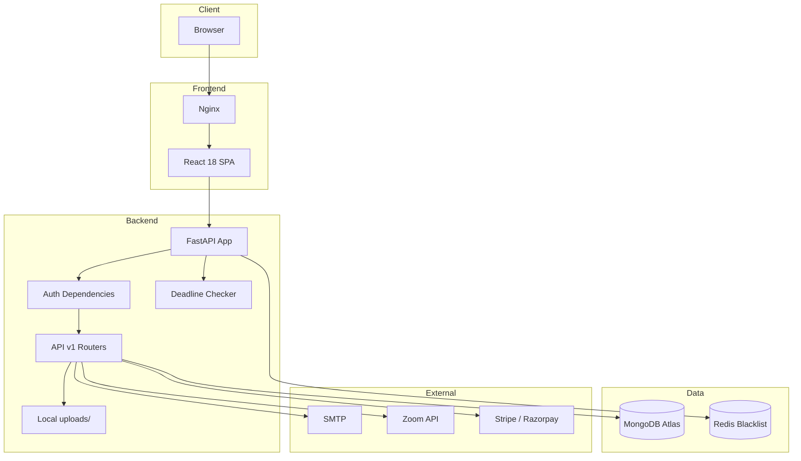
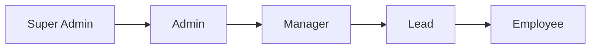
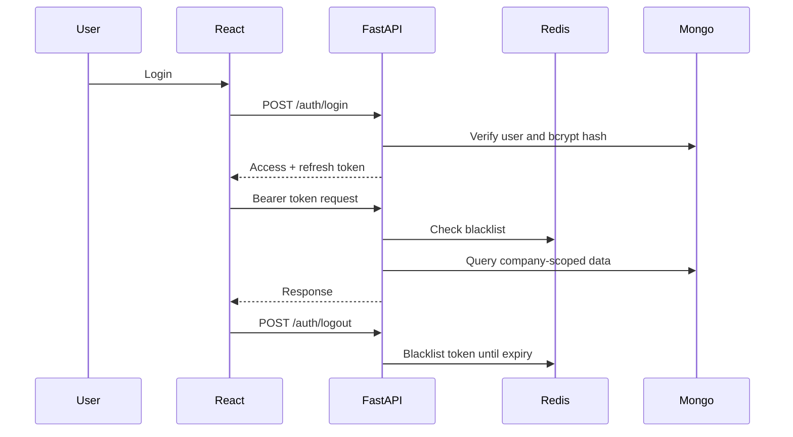

# SynTask Architecture Diagram

```mermaid
flowchart TB
    subgraph Client
        Browser[Browser]
    end

    subgraph Frontend
        Nginx[Nginx]
        React[React 18 SPA]
    end

    subgraph Backend
        FastAPI[FastAPI App]
        Auth[Auth Dependencies]
        Routers[API v1 Routers]
        Uploads[Local uploads/]
        Deadline[Deadline Checker]
    end

    subgraph Data
        Mongo[(MongoDB Atlas)]
        Redis[(Redis Blacklist)]
    end

    subgraph External
        SMTP[SMTP]
        Zoom[Zoom API]
        Payments[Stripe / Razorpay]
    end

    Browser --> Nginx --> React
    React --> FastAPI
    FastAPI --> Auth --> Routers
    Routers --> Mongo
    FastAPI --> Redis
    Routers --> Uploads
    FastAPI --> Deadline
    Routers --> SMTP
    Routers --> Zoom
    Routers --> Payments
```

```mermaid
flowchart LR
    SuperAdmin[Super Admin] --> Admin[Admin]
    Admin --> Manager[Manager]
    Manager --> Lead[Lead]
    Lead --> Employee[Employee]
```

```mermaid
sequenceDiagram
    participant User
    participant React
    participant API as FastAPI
    participant Redis
    participant Mongo

    User->>React: Login
    React->>API: POST /auth/login
    API->>Mongo: Verify user and bcrypt hash
    API-->>React: Access + refresh token
    React->>API: Bearer token request
    API->>Redis: Check blacklist
    API->>Mongo: Query company-scoped data
    API-->>React: Response
    React->>API: POST /auth/logout
    API->>Redis: Blacklist token until expiry
```
