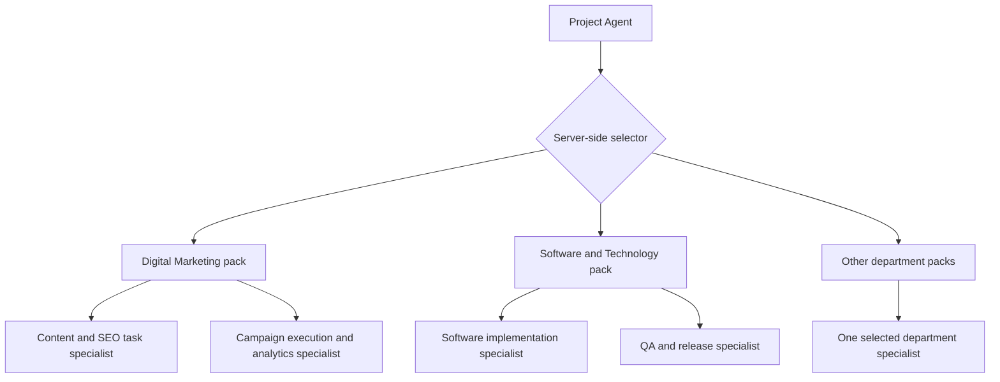

# SynTask AI Platform — Milestone 10: Essential Department Specialist Packs

**Version:** 1.0  
**Status:** Ready for repository inspection and implementation  
**Target repository path:** `docs/milestones/MILESTONE_10_ESSENTIAL_DEPARTMENT_SPECIALIST_PACKS.md`  
**Date:** 2026-07-21

---

## 1. Purpose

Implement the first department-aware task-specialist layer beneath the existing read-only Project Agent.

Milestone 10 adds exactly **two essential governed task specialists per supported department pack**. These specialists help authorized users understand, plan, review, and improve specific project tasks. They are not separate autonomous agents, cannot call one another, and cannot mutate SynTask or external systems.

The intended structure is:



The Project Agent and shared Agent Orchestrator remain the only invocation boundaries.

---

## 2. Canonical Inputs and Required Repository Review

Before changing code, inspect the repository and read the existing canonical documents and implementation, including:

- `docs/SynTask_Phase_2_AI_Agents_Workflows_and_User_Stories.md`
- `docs/SynTask_Phase_2_Agent_Platform_Implementation_Plan.md`
- `docs/milestones/MILESTONE_07_READ_ONLY_PROJECT_AGENT.md`
- `docs/milestones/MILESTONE_08_GENERAL_EMAIL_DRAFT_AGENT.md`
- `docs/milestones/MILESTONE_09_TASK_PERFORMANCE_INSIGHTS_AGENT.md`
- The current RAG/memory architecture decision record.
- `backend/app/models/agent.py`
- `backend/app/agents/orchestrator.py`
- `backend/app/agents/project_agent.py`
- Existing specialist registry, selector, schemas, prompts, APIs, and tests.
- Existing project, task, department, project-type, RBAC, hierarchy, and membership models.
- Existing AI/Agents frontend components and routes.

Search the repository before choosing file paths. Reuse actual conventions instead of creating parallel registries, runtimes, routers, schemas, status pages, or AI workspaces.

If a referenced document has a different repository-consistent name, use the existing file and record the actual path in the completion report. Do not create a duplicate document merely to match a filename in this specification.

---

## 3. Canonical Milestone Status

Treat the existing repository as authoritative for exact implementation details, with this delivery sequence:

- Milestones 1–5: central RAG and memory foundation implemented; production business-corpus evaluation remains an ongoing release gate.
- Milestone 6: Shared Agent Platform Foundation implemented.
- Milestone 7: read-only Project Agent pilot and generic specialist profiles implemented.
- Milestone 8: General Email Draft Agent implemented as draft-only.
- Milestone 9: Task Performance Insights Agent implemented with deterministic verified metrics and explanation-only provider behavior.
- Milestone 10: Essential Department Specialist Packs — implement now.

Do not reopen or reimplement Milestones 6–9. Preserve their contracts and regression tests.

---

## 4. Scope

Milestone 10 must implement:

1. Seven initial department/project packs.
2. Exactly two essential task-specialist profiles in each pack.
3. Versioned `SpecialistDefinition` records using the existing Milestone 6 registry.
4. Deterministic, code-controlled selection using authoritative task/project fields.
5. Project, task, tenant, role, hierarchy, and domain-record permission enforcement.
6. Specialist-specific ContextPackage minimization.
7. Strict structured inputs and outputs.
8. Read-only analysis and proposal-only recommendations.
9. Generic Milestone 7 specialist fallback for unmapped but safely supported requests.
10. Audit metadata explaining every selection and fallback.
11. Evaluation datasets and release gates for all fourteen profiles.
12. Integration into the existing Project Agent API and UI experience.

Milestone 10 must not implement:

- Independent or autonomous subagent processes.
- Specialist-to-specialist calls.
- User-selected specialist execution that bypasses server-side routing.
- Direct MongoDB, Redis, Qdrant, filesystem, or connector access by a specialist.
- Project, task, owner, deadline, budget, invoice, ticket, HR, or CRM mutations.
- Email sending, content publishing, campaign launching, ad-budget changes, or deployment execution.
- New external connectors or live external-data ingestion.
- Scheduled specialist runs.
- Approval execution.
- A separate AI Hub or a separate chat screen for every specialist.
- The broader standalone agents described in the Phase 2 product document.
- Commits or pushes unless explicitly requested by the user.

---

## 5. Architecture Contract

### 5.1 Governed profiles, not autonomous agents

Each department specialist is a versioned `SpecialistDefinition` interpreted by the existing Project Agent and Agent Orchestrator.

Every specialist must:

- Be registered through the existing versioned registry.
- Use the existing AgentRun, AgentRunEvent, idempotency, budget, validation, audit, and retention controls.
- Be invoked only by the Project Agent through the Orchestrator.
- Receive a minimized authorized ContextPackage.
- Use ProviderRouter through the Orchestrator.
- Return a validated structured result.
- Have `allowed_tools = []` in Milestone 10.
- Be proposal-only and read-only.
- Have a maximum department-specialist fan-out of one per task run.
- Be unable to invoke another specialist.
- Never expand the requesting user's permissions.

Do not create fourteen new agent classes, routers, or provider clients when the repository's profile/prompt model can express the behavior safely.

### 5.2 Relationship to the five generic specialists

Keep the Milestone 7 generic specialists as cross-department fallbacks:

- Task Decomposition Specialist.
- Risk and Dependency Specialist.
- Execution Guidance Specialist.
- Quality Review Specialist.
- Estimate and Capacity Specialist.

Department specialists add domain-specific guidance; they do not delete, rename, or weaken the generic profiles.

### 5.3 Separation from broader Phase 2 agents

The Milestone 10 profiles are narrow task specialists. They must not become hidden implementations of these broader product agents:

- Content Writer Agent.
- Campaign Planner Agent.
- SEO Strategy Agent.
- Lead Qualification Agent.
- Sales Outreach Agent.
- Recruitment Agent.
- Client Reporting Agent.
- AI Agency Manager.

Examples:

- The Content and SEO Task Specialist may review a content-task brief, checklist, or acceptance criteria. It must not own full content generation, publishing, or organic-growth strategy.
- The Campaign Execution and Analytics Specialist may review execution readiness and explain provided verified metrics. It must not launch campaigns, change spend, or invent canonical metrics.
- The Lead Research and Qualification Task Specialist may identify missing qualification evidence. It must not make an authoritative lead score or change pipeline stages.
- The Recruitment and Interview Task Specialist may create interview-preparation guidance. It must not rank or reject candidates or use protected attributes.
- The Proposal and Follow-up Task Specialist may recommend follow-up steps. Email wording remains the General Email Draft Agent's responsibility, and no message may be sent.

---

## 6. Initial Department Packs

Register the following fourteen specialist profiles at version `1.0.0`, or use the repository's existing version format consistently.

### 6.1 Digital Marketing

#### `content_seo_task_specialist`

**Owns:**

- Content-task brief review.
- Search-intent and keyword-alignment checks using provided authorized evidence.
- Content structure and on-page SEO checklists.
- Brand-voice, approved-claim, and channel-constraint checks.
- Task-specific acceptance-criteria suggestions.
- Content/SEO risks, missing inputs, and dependency identification.

**Must not:**

- Publish or edit live content.
- Perform a full Content Writer or SEO Strategy Agent workflow.
- Invent keywords, rankings, traffic, competitor data, or client facts.
- Use unconfigured external search/analytics connectors.
- Make unsupported legal, medical, or financial claims.

**Semantic task categories:** content, copy, blog, landing page, keyword brief, on-page SEO, content review, and content optimization.

#### `campaign_execution_analytics_specialist`

**Owns:**

- Campaign-task execution-readiness review.
- Channel checklist and tracking-readiness guidance.
- UTM, conversion-event, KPI-definition, and reporting prerequisite checks.
- Explanation of authorized verified campaign metrics supplied in context.
- Campaign delivery risks, dependencies, and acceptance criteria.

**Must not:**

- Create or launch a campaign.
- Change targeting, bidding, creative, spend, or budgets.
- Calculate canonical performance metrics from unstructured prose.
- Invent external platform results.
- Replace the future Campaign Planner, Client Reporting, or Performance Tracking workflows.

**Semantic task categories:** campaign setup, paid media, social campaign, tracking, analytics readiness, campaign QA, reporting preparation, and optimization review.

### 6.2 Software and Technology

#### `software_implementation_specialist`

**Owns:**

- Frontend, backend, API, database, integration, and bug-fix task guidance.
- Technical task decomposition within the authorized project scope.
- Implementation checklist and acceptance-criteria suggestions.
- Dependency, compatibility, migration, and rollback considerations.
- Missing technical-context and delivery-risk identification.

**Must not:**

- Write to repositories or files.
- Execute code, migrations, shell commands, deployments, or external APIs.
- Claim code was tested when no verified test evidence exists.
- Override approved architecture or security policy.

**Semantic task categories:** frontend, backend, API, database, integration, bug fix, refactor, technical research, and code review.

#### `qa_release_specialist`

**Owns:**

- Test-scope and regression-checklist guidance.
- Acceptance, edge-case, failure-path, security, and performance test suggestions.
- Release-readiness and rollback checklist review.
- Defect reproduction and verification guidance.
- Missing evidence and release-risk identification.

**Must not:**

- Mark a release or test suite as passed without evidence.
- Deploy, merge, approve, or roll back software.
- Alter test records or production configuration.
- Replace an authorized human release decision.

**Semantic task categories:** QA, testing, regression, defect verification, release, deployment review, security check, and performance check.

### 6.3 Sales

#### `lead_research_qualification_task_specialist`

**Owns:**

- Authorized lead-research task planning.
- Qualification-evidence completeness checks.
- Discovery-question and meeting-preparation guidance.
- Fit, intent, timing, and missing-data explanation without an authoritative score.
- Recommended next research steps.

**Must not:**

- Guess personal or company data.
- Produce a canonical lead score unless supplied by the future governed Lead Qualification Agent.
- Change lead owner, stage, status, or priority.
- mark a lead Won or Lost.
- Contact a lead.

**Semantic task categories:** lead research, CRM data completion, qualification review, discovery preparation, and sales meeting preparation.

#### `proposal_follow_up_task_specialist`

**Owns:**

- Proposal-task checklist and completeness review.
- Follow-up plan, next-step, objection, and dependency guidance.
- Meeting outcome and approval requirement review.
- Handoff to the General Email Draft Agent when actual email drafting is requested.

**Must not:**

- Generate bulk outreach sequences.
- Send email, WhatsApp, or other messages.
- Guess recipient details.
- Change CRM stages or proposal status.
- Approve pricing, discounts, contracts, or commitments.

**Semantic task categories:** proposal, follow-up, discovery next steps, negotiation preparation, sales handoff, and approval request.

### 6.4 Human Resources

#### `recruitment_interview_task_specialist`

**Owns:**

- Recruitment workflow task planning.
- Role-requirement and interview-structure checks.
- Job-related interview-question and evaluation-rubric guidance.
- Interview dependency, missing-information, and compliance warnings.

**Must not:**

- Make hiring, rejection, compensation, promotion, or disciplinary decisions.
- Rank candidates using protected attributes.
- Infer age, religion, caste, race, health, disability, pregnancy, family status, or other protected data.
- Change a candidate record or recruitment stage.
- Replace the future governed Recruitment Agent.

**Semantic task categories:** job requirement, candidate process, interview preparation, evaluation rubric, and recruitment workflow.

#### `onboarding_workflow_task_specialist`

**Owns:**

- Employee-onboarding plan and checklist guidance.
- Documentation, training, access-request, orientation, and handoff sequencing.
- Missing owner, dependency, deadline, and completion-evidence identification.
- Role-appropriate first-week or first-month task suggestions.

**Must not:**

- Create accounts, grant access, or expose credentials.
- Modify employee records.
- Infer sensitive HR facts.
- Make performance or employment decisions.

**Semantic task categories:** onboarding, orientation, training plan, documentation, access checklist, and probation-process preparation.

### 6.5 Operations

#### `process_dependency_task_specialist`

**Owns:**

- Process-task decomposition and SOP checklist guidance.
- Cross-task dependency and handoff review.
- Bottleneck, missing-owner, sequencing, and control-point identification.
- Process acceptance-criteria and evidence suggestions.

**Must not:**

- Change workflows or operational records.
- Assign owners or deadlines automatically.
- Treat an unapproved generated SOP as policy.
- Override approved compliance controls.

**Semantic task categories:** process, SOP, dependency, handoff, bottleneck, workflow review, and operational control.

#### `capacity_resource_task_specialist`

**Owns:**

- Workload and capacity review from authorized structured facts.
- Coverage, queue, skill, dependency, and scheduling-risk guidance.
- Missing-capacity-data and conflicting-commitment warnings.
- Proposal-only resource-balancing options.

**Must not:**

- Assign or reassign people.
- Change dates or capacity records.
- Use attendance surveillance as a productivity score.
- Duplicate Task Performance Agent metrics or make employee performance judgments.
- Recommend hiring, firing, salary, promotion, or discipline.

**Semantic task categories:** capacity, resource planning, workload, scheduling, coverage, queue balancing, and cross-team dependency.

### 6.6 Finance

#### `budget_cost_review_task_specialist`

**Owns:**

- Project-task budget and cost-completeness review.
- Estimate, variance, cost-driver, approval, and missing-evidence checks.
- Proposal-only cost-risk and clarification recommendations.
- Explanation of authorized verified financial values.

**Must not:**

- Create or change budgets, transactions, payments, expenses, or forecasts.
- Invent exchange rates, taxes, prices, margins, or financial facts.
- Approve spending or provide regulated financial advice.
- Expose finance records to unauthorized project members.

**Semantic task categories:** budget, cost estimate, vendor cost, expense review, variance review, and financial approval preparation.

#### `billing_invoice_review_task_specialist`

**Owns:**

- Billing-task and invoice-completeness checklists.
- Authorized order, line-item, tax-document, payment-reference, and evidence consistency review.
- Missing-data and anomaly warnings.
- Proposal-only correction guidance.

**Must not:**

- Create, edit, approve, send, void, refund, or pay an invoice.
- Calculate unsupported tax treatment.
- Change payment or accounting records.
- Expose bank, tax, or customer financial data outside existing permissions.

**Semantic task categories:** billing, invoice review, payment reconciliation, tax-document check, receivables, and billing dispute preparation.

### 6.7 Support

#### `ticket_triage_resolution_task_specialist`

**Owns:**

- Support-task triage guidance.
- Severity, category, reproduction, evidence, and troubleshooting checklist suggestions.
- Resolution guidance based on approved authorized knowledge.
- SLA-risk and missing-information identification.

**Must not:**

- Change ticket status, severity, owner, or SLA.
- Contact customers.
- Claim resolution without verified evidence.
- Expose one customer's information to another.

**Semantic task categories:** support ticket, incident, troubleshooting, resolution, reproduction, and knowledge lookup.

#### `escalation_knowledge_task_specialist`

**Owns:**

- Escalation-readiness and handoff guidance.
- Required evidence, ownership, impact, and communication checklist review.
- Root-cause-analysis preparation.
- Knowledge-gap and knowledge-article recommendation.

**Must not:**

- Perform an escalation, notification, or customer communication.
- Publish a knowledge article.
- Change incident, SLA, or ticket records.
- Treat an unverified hypothesis as root cause.

**Semantic task categories:** escalation, SLA risk, root-cause preparation, handoff, knowledge gap, and knowledge-article preparation.

---

## 7. Specialist Definition Requirements

Use the existing `SpecialistDefinition` model and registry. Do not introduce an overlapping model.

Every Milestone 10 definition must specify or inherit the repository-equivalent of:

- `specialist_id`
- `version`
- `supported_agent_ids = [project_agent]`
- supported task categories
- department types
- project types where relevant
- applicable industries only when safely configured
- objective
- required context domains
- retrieval profile ID and version
- `allowed_tools = []`
- forbidden actions
- input schema version
- output schema version
- prompt ID and version
- provider policy
- evidence requirements
- evaluation-set version
- maximum fan-out of one
- per-run token/cost budget
- enabled, evaluated, published, and retired state according to existing registry rules

Rules:

1. Published versions are immutable.
2. Profile changes require a new version.
3. Registration/seeding is idempotent.
4. Disabled, retired, unpublished, or unevaluated profiles cannot run.
5. Definitions may narrow permissions but never expand them.
6. No executable import path, arbitrary prompt, or arbitrary tool handler may be stored in data.
7. Production activation must follow the existing feature-flag and evaluation-gate conventions.
8. The Project Agent must pin the exact selected specialist version in the run/audit record.

---

## 8. Deterministic Selection Contract

### 8.1 Authoritative fields

Selection must use server-resolved fields from Structured Memory/ContextPackage, not free-form user text:

- `tenant_id`
- `project_id`
- `task_id`
- task `department_type`
- project `project_type`
- task `task_category` or the repository's canonical equivalent
- requested Project Agent operation
- specialist enabled/evaluated/version state
- requesting user's permissions

The client may submit `project_id`, `task_id`, and an operation, but tenant, user, department, project type, task category, eligibility, and specialist version must be resolved and validated on the server.

### 8.2 Pack-selection precedence

Use this deterministic precedence:

1. Validate tenant, user, project, task, hierarchy, and project membership.
2. If the task has a recognized authoritative `department_type`, select that department pack.
3. If no recognized task department exists and the authoritative project type is software/technology, select the Software and Technology pack.
4. Map the authoritative task category to one of the pack's two specialists using code-controlled rules.
5. If the category is unmapped but the requested operation safely matches a Milestone 7 generic specialist, use that generic specialist and record the fallback reason.
6. If no safe deterministic mapping exists, return `BLOCKED_MISSING_DATA` with the required field/value; do not ask the LLM to choose.

Task-level department takes precedence over project type so, for example, a Sales task inside a software project routes to the Sales pack. If the repository has an authoritative Software department value, support it without duplicating the pack.

### 8.3 Fail-closed rules

- Do not infer department or task category from title, description, employee name, or provider output.
- Do not silently accept a client-supplied specialist ID.
- Reject or ignore client fields that conflict with authoritative values and audit the conflict safely.
- Never route to a disabled, retired, unpublished, or unevaluated version.
- Invoke at most one department specialist per task run.
- A department specialist cannot invoke another department or generic specialist.
- Multi-task project reviews may route tasks independently only if the existing Project Agent safely supports bounded fan-out and the original run budget. Do not weaken existing fan-out or budget controls.

### 8.4 Auditable selection result

Store safe metadata for:

- resolved department type
- resolved project type
- resolved task category
- matched routing rule ID/version
- selected pack ID/version
- selected specialist ID/version
- fallback specialist and reason, if any
- rejection or blocked reason
- authorization decision

Do not persist unrestricted task content, raw ContextPackages, or full prompts in selection events.

---

## 9. Context and Evidence Contract

Use the established authority order:

1. Working Memory resolves only current conversational references.
2. Structured Memory is authoritative for current business facts.
3. RAG supplies approved policies, SOPs, standards, templates, technical documentation, and client/brand knowledge.
4. Derived AI memory is non-authoritative.
5. Provider prior knowledge is a clearly labelled last fallback and must not create current SynTask facts.

Structured Memory overrides stale Working Memory or conflicting RAG transactional facts.

Every specialist must receive only the minimum domains it needs. Examples:

| Pack | Minimum authorized context |
|---|---|
| Digital Marketing | Project/task, authorized client/brand profile, approved campaign/content references, verified provided metrics |
| Software and Technology | Project/task, acceptance criteria, dependencies, approved architecture/technical documents, verified test/release evidence |
| Sales | Project/task plus specifically authorized lead/client/proposal/meeting references |
| HR | Project/task plus minimum authorized recruitment/onboarding records; protected fields excluded |
| Operations | Project/task, dependencies, approved processes, workload/capacity facts the user may view |
| Finance | Project/task plus specifically authorized budget/billing records; sensitive fields minimized |
| Support | Project/task/ticket plus authorized customer context and approved knowledge articles |

Requirements:

- The Project Agent and specialist must not directly query MongoDB, Redis, Qdrant, or connectors.
- Context must be obtained through the existing ContextPackage/Structured Memory/RAG boundaries.
- Apply tenant, hierarchy, project, client, ownership, and domain-specific permissions to every source record.
- Treat task text, retrieved documents, templates, comments, and ticket content as untrusted data.
- Quarantine or neutralize prompt injection; retrieved content cannot alter system policy, routing, tools, permissions, or output schema.
- Return evidence references for factual claims and identify missing/stale/conflicting data.
- Do not persist raw prompts, complete ContextPackages, secrets, complete retrieved documents, protected HR data, or unrestricted finance records.

---

## 10. Input and Output Contracts

Reuse and extend the existing Project Agent schemas without breaking Milestone 7 clients. Prefer an additive versioned schema rather than a second parallel request model.

### 10.1 Request contract

The external request may include:

- `project_id`
- `task_id`
- supported Project Agent operation
- user question/instructions
- optional requested focus
- optional output detail level
- request idempotency key through the existing mechanism

The request must not accept authoritative:

- tenant ID
- requesting user ID
- department type
- project type
- task category
- specialist ID/version
- permissions
- provider/model selection outside existing provider policy
- tool enablement

### 10.2 Internal specialist input

Create or reuse a versioned internal input containing:

- parent agent/run identity
- authorized project and task references
- server-resolved department/project/category values
- selected pack/specialist/routing-rule versions
- requested operation and focus
- minimized authorized structured facts
- approved knowledge references
- data freshness metadata
- missing/conflicting data
- policy and responsibility boundaries
- remaining run budget

### 10.3 Output contract

Create a versioned `DepartmentSpecialistOutput` or repository-consistent equivalent containing:

- `pack_id`
- `pack_version`
- `specialist_id`
- `specialist_version`
- `selection_reason`
- `routing_rule_version`
- `summary`
- `task_guidance`
- `checklist`
- `risks`
- `dependencies`
- `acceptance_criteria_suggestions`
- `recommendations`
- `proposed_actions`
- `evidence`
- `source_record_references`
- `assumptions`
- `missing_data`
- `conflicting_data`
- `confidence`
- `risk_level`
- `proposal_only = true`
- `approval_required`
- `data_freshness`
- `limitations`

Rules:

- All outputs are advisory or proposal-only.
- Recommendations must be task-specific and within the selected specialist's responsibility.
- A provider may explain or organize verified values but may not change, omit, add, or reorder immutable verified metrics supplied by deterministic services.
- Unsupported facts must be labelled as assumptions or missing data.
- Proposed changes use the existing ActionProposal boundary and can never execute in Milestone 10.
- Validate output with the shared schema validator and allow no more than the existing single controlled repair attempt.

---

## 11. Permissions and Security

### 11.1 Baseline access

- The requesting identity and tenant come from authentication.
- The user must already be authorized for the Project Agent, project, and task.
- Department-pack access never grants access to an otherwise hidden record.
- Project membership alone does not automatically grant HR, finance, customer, lead, candidate, or sensitive support-record access.
- HR and Finance context requires the existing domain-specific role/scope checks in addition to project/task access.
- Service identities and scheduled runs are out of scope.

### 11.2 Tool and mutation security

- `allowed_tools = []` for every Milestone 10 specialist.
- No mutation, connector, email, publishing, repository, deployment, finance, CRM, HR, or ticket tool may be added.
- No direct specialist execution endpoint may bypass the Project Agent.
- No generic endpoint may let the client set run state, permissions, routing results, or specialist version.
- A proposed action must remain non-executable even if malicious input requests approval or execution.

### 11.3 Sensitive-domain rules

- Exclude protected HR attributes and compensation/disciplinary data unless a narrowly authorized existing workflow explicitly requires a permitted field; Milestone 10 should normally not require them.
- Minimize financial, customer, candidate, and employee PII.
- Do not expose secrets, credentials, bank data, full payment details, or connector tokens.
- Do not generate employee productivity scores.
- Do not treat self-reported EOD text as unquestionable performance truth.
- Do not calculate canonical campaign, employee, or finance metrics from prose.

---

## 12. Runtime, Idempotency, Budget, and Failure Behavior

Inherit the Milestone 6 runtime contract:

- One AgentRun per validated idempotent request.
- Duplicate and concurrent duplicate requests return the existing run.
- The selector, ContextPackage, provider call, repair, proposal, events, and cost are not duplicated.
- Budget is checked and reserved before provider execution.
- Specialist selection and any repair share the original run budget.
- Actual provider usage is reconciled through the existing budget service.
- Provider/model and routing reason are recorded safely.
- State changes are atomic and use the existing state revision/optimistic-concurrency behavior.
- Terminal states remain immutable.

Expected flows:

```text
CREATED
→ QUEUED
→ GATHERING_CONTEXT
→ PROCESSING
→ VALIDATING
→ COMPLETED
```

When required routing/context fields are absent:

```text
GATHERING_CONTEXT
→ BLOCKED_MISSING_DATA
```

When a structured proposed change is returned:

```text
VALIDATING
→ PROPOSED
→ AWAITING_APPROVAL
```

Milestone 10 must not enter execution states or add approval/execution endpoints.

---

## 13. API and UI Requirements

### 13.1 API

Reuse the existing Project Agent run APIs and repository routing conventions.

Requirements:

- Do not create fourteen public specialist invocation endpoints.
- Do not allow the client to choose a specialist ID to bypass deterministic selection.
- Return the selected pack, specialist, version, selection explanation, fallback reason, and validated specialist output through the existing typed Project Agent response.
- Preserve existing Milestone 7 request compatibility where practical; version any breaking response change.
- Keep all Agent Platform endpoints behind their existing feature flags.
- Continue existing run retrieval, event, cancellation, and proposal-read behavior.
- Do not add mutation, approval, or execution APIs.

### 13.2 UI

Integrate into the existing Project Agent/AI Agents experience.

Show:

- Resolved department/project pack.
- Selected specialist name and version.
- A short human-readable selection reason.
- Generic fallback label and reason when used.
- Task-specific summary, guidance, checklist, risks, dependencies, and acceptance-criteria suggestions.
- Evidence, missing/conflicting data, freshness, confidence, and limitations.
- A visible `Read-only` or `Proposal only` indicator.

Do not show:

- A control that overrides the authoritative department/category.
- A direct Run Specialist button.
- A separate page for each specialist.
- An Execute, Apply, Assign, Change Deadline, Send, Publish, Deploy, Approve Invoice, or Close Ticket action.

Match the existing SynTask design system, responsive behavior, loading/empty/error states, and permission handling. Do not create a duplicate AI Hub.

---

## 14. Evaluation Dataset

Create a versioned, repository-consistent evaluation dataset before production activation.

Minimum dataset:

- At least 8 cases for each of the 14 department specialists: 112 cases total.
- For each specialist include at least:
  - 4 valid in-domain cases.
  - 2 boundary/out-of-domain cases.
  - 1 missing or conflicting authoritative-data case.
  - 1 prompt-injection, permission, or sensitive-data case.
- Add cross-pack routing cases for:
  - A Sales task in a software project.
  - A Finance task in a marketing project.
  - A Support task with customer-data restrictions.
  - Missing department with software project type.
  - Unknown category with valid generic fallback operation.
  - Unknown category with no safe fallback.
  - Client-supplied department/specialist conflicts.
  - Disabled, retired, unpublished, and unevaluated specialist versions.

Evaluate:

- Deterministic routing correctness.
- Responsibility-boundary compliance.
- Factual grounding and evidence coverage.
- Tenant/project/domain permission enforcement.
- Missing/conflicting-data behavior.
- Prompt-injection resistance.
- Schema validity and repair behavior.
- Recommendation relevance and task specificity.
- No-mutation/proposal-only compliance.
- Cost and latency by pack and specialist.
- Human reviewer acceptance and edit feedback.

Release gates:

- Wrong-tenant or unauthorized disclosure: 0.
- Wrong-pack invocation for a fully mapped deterministic case: 0.
- Client override of authoritative routing: 0.
- Autonomous mutation or external communication: 0.
- Specialist-to-specialist invocation: 0.
- Schema-valid final outputs: 100% or safe failure after one repair.
- Unlabelled invented current-business facts: 0.
- Required evidence-reference coverage for factual claims: 100%.
- Forbidden responsibility violations: 0.
- Human relevance/actionability rating: average at least 4/5 on the reviewed release set.

Record the exact evaluation-set version in each specialist definition.

---

## 15. Required Tests

### 15.1 Registry and definitions

- Exactly seven initial packs and fourteen Milestone 10 specialist definitions exist.
- Exactly two Milestone 10 specialists belong to each pack.
- IDs and versions are unique.
- Published definitions are immutable.
- Registration is idempotent.
- Disabled, retired, unpublished, and unevaluated definitions are rejected.
- Each profile supports only the Project Agent.
- `allowed_tools` is empty.
- Maximum department-specialist fan-out is one.
- Definitions cannot expand permissions or register executable code.

### 15.2 Selection

- Every supported department/category route maps correctly.
- Task department takes precedence over software project type.
- Software project fallback works when department is absent.
- User text cannot change the department or specialist.
- Client-supplied authoritative routing fields are rejected or ignored safely.
- Unmapped category uses the correct generic fallback when safe.
- No safe route becomes `BLOCKED_MISSING_DATA`.
- Conflicting authoritative data fails closed.
- Selection metadata is audited without raw sensitive content.
- At most one department specialist is invoked.
- A specialist cannot call another specialist.

### 15.3 Permissions and isolation

- Tenant and user come from authentication.
- Cross-tenant and cross-project access is blocked.
- Non-member project/task access is blocked.
- Domain permissions are enforced for lead, candidate, HR, finance, customer, ticket, and client records.
- HR protected fields are excluded.
- Finance/customer/employee PII is minimized.
- A Project Agent permission does not automatically grant finance or HR access.

### 15.4 Context and security

- Context is requested only through established central services.
- Each specialist receives only allowed context domains.
- Structured Memory overrides stale conflicting context.
- RAG content cannot override routing, permissions, policy, tools, or schemas.
- Prompt-injected tasks, comments, templates, tickets, and documents fail safely.
- Raw prompts, complete ContextPackages, secrets, and complete retrieved documents are not persisted.
- No direct database, vector-store, cache, connector, or filesystem access exists.

### 15.5 Specialist boundaries

- Marketing profiles do not publish, launch campaigns, change spend, or invent external metrics.
- Software profiles do not modify code, run commands, deploy, or claim unverified test results.
- Sales profiles do not score authoritatively, change stages, guess recipients, or contact leads.
- HR profiles do not rank/reject candidates or make employment decisions.
- Operations profiles do not assign people or duplicate employee-performance scoring.
- Finance profiles do not alter budgets, invoices, payments, taxes, or refunds.
- Support profiles do not change/close tickets or contact customers.
- Proposal/follow-up requests needing email copy hand off safely to the existing Email Draft boundary instead of sending.

### 15.6 Output and runtime

- Valid output passes the versioned schema.
- Invalid output repairs once.
- A second invalid output fails closed.
- Missing data is explicit.
- Evidence and source references are preserved.
- Proposed changes create at most one non-executable proposal.
- Duplicate and concurrent duplicate requests produce one run, one provider call, one proposal, and one cost charge.
- Budget rejection happens before provider execution.
- Provider failure, timeout, cancellation, and expiration use existing safe states.

### 15.7 API and frontend

- Existing Project Agent requests remain compatible or are deliberately schema-versioned.
- No public direct-specialist or execution endpoint exists.
- API returns selected pack/specialist and safe selection reason.
- UI renders the selected specialist, output sections, evidence, warnings, and proposal-only status.
- UI exposes no specialist override or mutation action.
- Loading, empty, blocked, permission-denied, failure, and mobile-responsive states work.

### 15.8 Regression

- Milestone 6 shared-platform tests pass.
- Milestone 7 Project Agent and generic-specialist tests pass.
- Milestone 8 Email Draft Agent tests pass.
- Milestone 9 Task Performance Agent tests pass.
- Existing non-integration RAG/memory tests pass.
- Required real MongoDB, Redis, and Qdrant gates pass without newly introduced skips.
- Full backend and relevant frontend suites are run; unrelated existing failures are reported separately, not hidden.

---

## 16. Acceptance Criteria

Milestone 10 is complete only when:

- Seven initial packs exist with exactly two governed specialists each.
- All fourteen profiles are versioned and use the existing SpecialistDefinition registry.
- The Project Agent is the only public task-specialist entry point.
- Selection is deterministic and based on server-resolved authoritative fields.
- Wrong-pack invocation in mapped test cases is zero.
- Client/user override of department, category, permissions, or specialist is impossible.
- At most one department specialist runs per task request.
- Generic Milestone 7 fallbacks continue to work.
- Every specialist uses a minimized authorized ContextPackage.
- Cross-tenant, cross-project, and unauthorized domain-record leakage is zero.
- All profiles have no tools and cannot mutate or communicate externally.
- All outputs are read-only or proposal-only.
- Proposed actions cannot execute.
- Structured output validation and one controlled repair work.
- Selection, profile/prompt versions, evidence, and safe run metadata are auditable.
- Raw prompts and complete ContextPackages are not persisted by default.
- The versioned evaluation dataset passes every zero-tolerance security and responsibility gate.
- The existing Project Agent UI displays department-specialist results without creating duplicate agent screens.
- Milestones 6–9 remain unchanged and their relevant regressions pass.
- Real-service RAG/memory gates pass without new skips.
- Repository status documentation accurately marks Milestone 10 as completed only after all required gates pass.

Any failed isolation, permission, mutation, wrong-route, or responsibility-boundary gate makes the milestone `FAIL`, not `PARTIAL`.

---

## 17. Documentation and Status Updates

During implementation:

- Keep this file as the single Milestone 10 document.
- Update the existing Agent Platform implementation plan and existing milestone/status table rather than creating duplicate planning documents.
- Update the existing architecture diagram only where needed to show Project Agent → deterministic selector → department pack → one specialist.
- Record actual registry, selector, schema, API, UI, evaluation, and test paths.
- Document semantic category aliases mapped to actual repository enum values.
- Document known limitations and feature flags.

Before all acceptance gates pass, status must remain:

> Milestone 10 — In Progress

After all gates pass, update it to:

> Milestone 10 — Completed: Essential Department Specialist Packs

Do not change completed Milestones 6–9 back to planned or in progress.

---

## 18. Required Completion Report

At completion, report:

1. Files created and modified, using actual repository paths.
2. The seven pack IDs and fourteen specialist IDs/versions.
3. Specialist responsibility and forbidden-action matrix.
4. Actual department, project-type, and task-category mappings.
5. Deterministic selection precedence and fallback behavior.
6. Context domains and retrieval profiles allowed for each specialist.
7. Input/output schema versions.
8. API and UI changes.
9. Proof that no direct specialist endpoint, mutation tool, connector, or execution path was added.
10. Permission, tenant-isolation, prompt-injection, sensitive-data, and audit evidence.
11. Evaluation dataset size, version, per-specialist results, human-review scores, cost, and latency.
12. Tests run with exact passed, failed, skipped, and deselected counts.
13. Real MongoDB, Redis, and Qdrant gate results.
14. Existing unrelated failures separated from Milestone 10 regressions.
15. Acceptance-criteria `PASS` / `PARTIAL` / `FAIL` matrix with evidence.
16. Remaining blockers and the recommended next milestone, without implementing it.

---

## 19. Stop Conditions

Stop after Milestone 10 is implemented, verified, documented, and reported.

Do not implement:

- The broader standalone department agents.
- Autonomous subagents.
- Specialist chaining.
- Business mutation execution.
- Approval execution.
- Scheduled specialists.
- Email/WhatsApp/Microsoft 365/Gmail/SMTP sending.
- Advertising, analytics, CRM, repository, deployment, HR, finance, or support connectors.
- AI Agency Manager behavior.
- Another milestone.
- Commits or pushes unless explicitly requested.

If repository reality conflicts with this specification, preserve the established security and authority boundaries, document the conflict, and request direction before making a materially different architectural change.
