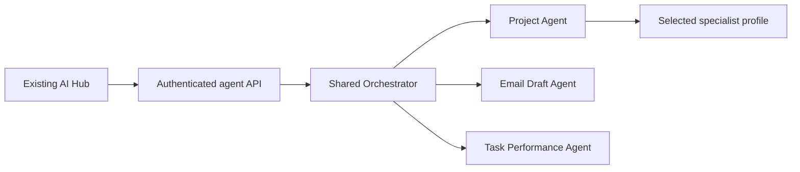

# SynTask AI Platform — Milestone 11: Agent Backend-to-Frontend Integration

**Version:** 1.0  
**Status:** Ready for repository inspection and implementation  
**Target repository path:** `docs/milestones/MILESTONE_11_AGENT_BACKEND_TO_FRONTEND_INTEGRATION.md`  
**Date:** 2026-07-23

---

## 1. Purpose

Connect the implemented, governed SynTask agent capabilities to the existing frontend AI Hub through their real authenticated backend contracts. This is an integration, verification, and missing-wiring milestone—not a new-agent or frontend-rewrite milestone.

Public AI Hub capabilities:

1. Read-only Project Agent.
2. General Email Draft Agent.
3. Task Performance Insights Agent.

Department specialists are accessible only through the Project Agent. They must not receive public routes, screens, or direct invocation endpoints.

---

## 2. Required Repository Review and Preconditions

Before modifying code, inspect the actual repository paths and read:

- `docs/SynTask_Phase_2_AI_Agents_Workflows_and_User_Stories.md`
- `docs/SynTask_Phase_2_Agent_Platform_Implementation_Plan.md`
- `docs/milestones/MILESTONE_07_READ_ONLY_PROJECT_AGENT.md`
- `docs/milestones/MILESTONE_08_GENERAL_EMAIL_DRAFT_AGENT.md`
- `docs/milestones/MILESTONE_09_TASK_PERFORMANCE_INSIGHTS_AGENT.md`
- `docs/milestones/MILESTONE_10_ESSENTIAL_DEPARTMENT_SPECIALIST_PACKS.md`
- `backend/app/models/agent.py`
- `backend/app/agents/*`
- `backend/app/api/v1/endpoints/agents.py`
- `backend/tests/agents/*`
- Existing frontend AI Hub routes, components, API client, authentication, RBAC, feature flags, and design-system components.

Do not trust documentation status alone. Verify every claimed capability through implementation and tests.

### 2.1 Precondition gate

Confirm that Milestones 7–10 have passed their required acceptance gates.

If Milestone 10 is not implemented or does not pass its gates:

- Do not claim Milestone 10 is complete.
- Do not implement department specialist packs as part of this milestone.
- Do not fake their frontend metadata.
- Stop and report the exact incomplete Milestone 10 work.

If a prior milestone is only partly wired, repair only its integration gap while preserving its approved scope and contracts.

---

## 3. Canonical Boundaries

Milestone 11 must:

- Reuse the existing AI Hub, shared agent runtime, API/request layer, design system, and frontend conventions.
- Use actual typed backend request/response contracts; do not fabricate fields or replacement endpoints.
- Preserve tenant isolation, RBAC, hierarchy, feature flags, budgets, idempotency, audit events, ContextPackage authority rules, and output validation.
- Keep Project Agent read-only and proposal-only.
- Keep Email Draft Agent draft-only.
- Keep Task Performance verified metrics deterministic and immutable.
- Keep department specialist selection server-controlled and internal to Project Agent.

Milestone 11 must not:

- Create new agents, runtimes, public specialist endpoints, separate specialist screens, or duplicate AI Hubs.
- Implement connectors, email sending, scheduling, approval execution, automation, or business mutations.
- Add project/task controls that create, update, assign, move, or delete records.
- Allow frontend-supplied authoritative tenant or user identity.
- Expose raw prompts, complete ContextPackages, protected fields, or unauthorized records.
- Commit or push unless explicitly requested by the user.

---

## 4. Integration Audit

Before code changes, create a repository-grounded integration matrix. For every capability, record:

| Field | Required evidence |
|---|---|
| Agent/capability | Exact implemented name and version |
| Backend definition | Actual registry/model location |
| Endpoint | Existing API path and method |
| Request/response schema | Actual schema/class/type |
| Required role | Enforced backend permission |
| Feature flag | Actual configuration and behavior |
| Frontend entry point | Existing route/component |
| Wiring status | Complete, Partial, Missing, or Incorrect |
| Required correction | Minimal, evidence-based change |

Audit: Project Agent, Email Draft Agent, Task Performance Agent, and Project Agent specialist metadata/fallback display. Modify only incomplete or incorrect integration.

---

## 5. Shared Frontend Requirements

Use shared AI Hub components or carefully extend existing reusable components for:

- Loading, submission, completed, blocked, and failed states aligned to real `AgentRun` states.
- Idempotency-key handling and duplicate-click prevention.
- Permission-denied, missing-context, provider-failure, and schema-validation errors.
- Evidence/source references, missing-data warnings, confidence, audit/run references, and proposal-only labels.
- Responsive layout, keyboard access, visible focus, accessible labels, and meaningful error messages.

Use the existing frontend API layer. Do not add competing per-agent clients. Authentication supplies identity; frontend input must never be treated as authority for `tenant_id`, `user_id`, role, record permission, or department selection.

---

## 6. Project Agent Workspace

Wire the existing Project Agent UI to its real API. Support only repository-confirmed inputs and operations.

Render, when returned by the real contract:

- Authorized project and task context.
- Selected operation.
- Selected generic or department specialist.
- Department pack and specialist version.
- Recommendations, risks, dependencies, checklist/guidance, and proposed actions.
- Missing information, evidence/source references, confidence, and read-only/proposal-only status.
- Generic fallback reason where applicable.

The UI must not let a user directly select or invoke an internal specialist, unless the Milestone 10 backend contract explicitly permits a constrained operation choice. The server remains authoritative for routing. Do not add task/project mutation controls.

---

## 7. General Email Draft Workspace

Wire the Email Draft Agent to its real backend contract and display a clear, editable draft.

Provide, only where supported by the backend:

- Email type.
- Authorized recipient/context selection.
- Purpose and instructions.
- Tone, language, and detail level.
- Generate Draft, editable subject/body, Copy Draft, and Regenerate Draft.
- Missing-information, sensitive-data, external-recipient, and attachment warnings.

Every output must visibly display `DRAFT` status. Do not add Send, Schedule, SMTP, Gmail, Microsoft 365, automatic recipient lookup outside authorized records, or recipient-email guessing.

---

## 8. Task Performance Workspace

Wire the Task Performance Insights Agent to its real backend contract and restrict access to the actual authorized manager, administrator, and team-lead roles.

Clearly separate in the UI:

1. Immutable verified metrics.
2. Metric definitions, periods, source references, freshness, and confidence.
3. Missing/conflicting data and exclusions.
4. Employee-reported EOD context.
5. AI explanation.
6. Explicitly labeled hypotheses.
7. Proposal-only recommendations.

Frontend output or user editing must never replace canonical metric values. Do not introduce employee scoring, disciplinary recommendations, pay decisions, hiring/firing, promotions, or other prohibited employment decisions.

---

## 9. Permissions, Safety, and Feature Flags

Frontend visibility is a usability layer only; backend authorization remains mandatory. Prove through tests and review:

- Cross-tenant and cross-project access are rejected.
- Unauthorized performance access is rejected.
- Disabled agents are hidden where appropriate and rejected by the backend.
- Department specialists cannot be directly invoked.
- Protected data is neither fetched nor rendered.
- Raw ContextPackages/prompts are not exposed.
- Email drafts never expose a Send action.
- No screen creates automatic business mutations.

---

## 10. API Contract Requirements

Use working endpoints where they exist. Do not invent replacement routes merely for UI convenience.

Implement typed request/response mappings that cover existing supported behavior for:

- Authenticated request submission.
- Idempotency keys and duplicate-request recovery.
- AgentRun creation and real run-status retrieval.
- Validated results and existing event/audit metadata.
- Structured errors.
- Cancellation only if an existing authorized backend contract supports it.

---

## 11. Tests and Verification

Add or update tests for:

- AI Hub visibility, feature flags, and role-based access.
- Project Agent request submission and result rendering.
- Department-specialist metadata and generic-fallback rendering.
- Email Draft generation, editable output, DRAFT label, and absence of Send behavior.
- Immutable Task Performance metric rendering and contextual labeling.
- Evidence, warnings, confidence, loading, blocked, failed, and completed states.
- Duplicate-submission prevention and idempotency behavior.
- Unauthorized, cross-project, and cross-tenant responses.
- Frontend/backend request and response schema compatibility.
- Accessibility and responsive behavior.
- Regression protection for Milestones 6–10.

Run and report:

- Focused backend agent tests.
- Frontend component/integration tests.
- Frontend build and lint.
- Relevant end-to-end tests against a real backend where configured.
- Full backend suite.
- Existing real-service RAG tests where configured.

Report passed, failed, and skipped counts honestly; label existing unrelated failures separately and do not claim a clean release when they remain.

---

## 12. Acceptance Criteria

Milestone 11 passes only when:

- The three public agents are available through the existing AI Hub where enabled and authorized.
- Frontend contracts match real backend schemas and render only returned/validated data.
- Department specialists remain internal to Project Agent and direct invocation is zero.
- No duplicate AI Hub or specialist screens exist.
- Project Agent remains read-only/proposal-only.
- Email Draft remains DRAFT-only and Send capability is zero.
- Performance metrics remain deterministic and immutable.
- Feature flags and authorization work in both frontend and backend.
- Cross-tenant leakage, protected-data exposure, and automatic business mutations are zero.
- Relevant agent, frontend, integration, backend, and configured RAG tests pass, subject to explicitly documented unrelated pre-existing failures.

---

## 13. Required Completion Report

At completion, provide:

1. Integration audit matrix with evidence.
2. Files created and modified.
3. Frontend routes/components and backend endpoints used.
4. Request/response schema mappings.
5. Feature-flag and role behavior.
6. Project Agent and specialist-routing flow.
7. Email Draft no-send safety proof.
8. Task Performance metric-integrity proof.
9. Test commands and passed/failed/skipped counts.
10. Existing unrelated failures and production blockers.
11. Acceptance criteria PASS/PARTIAL/FAIL matrix.

Stop after Milestone 11. Do not begin a subsequent milestone.