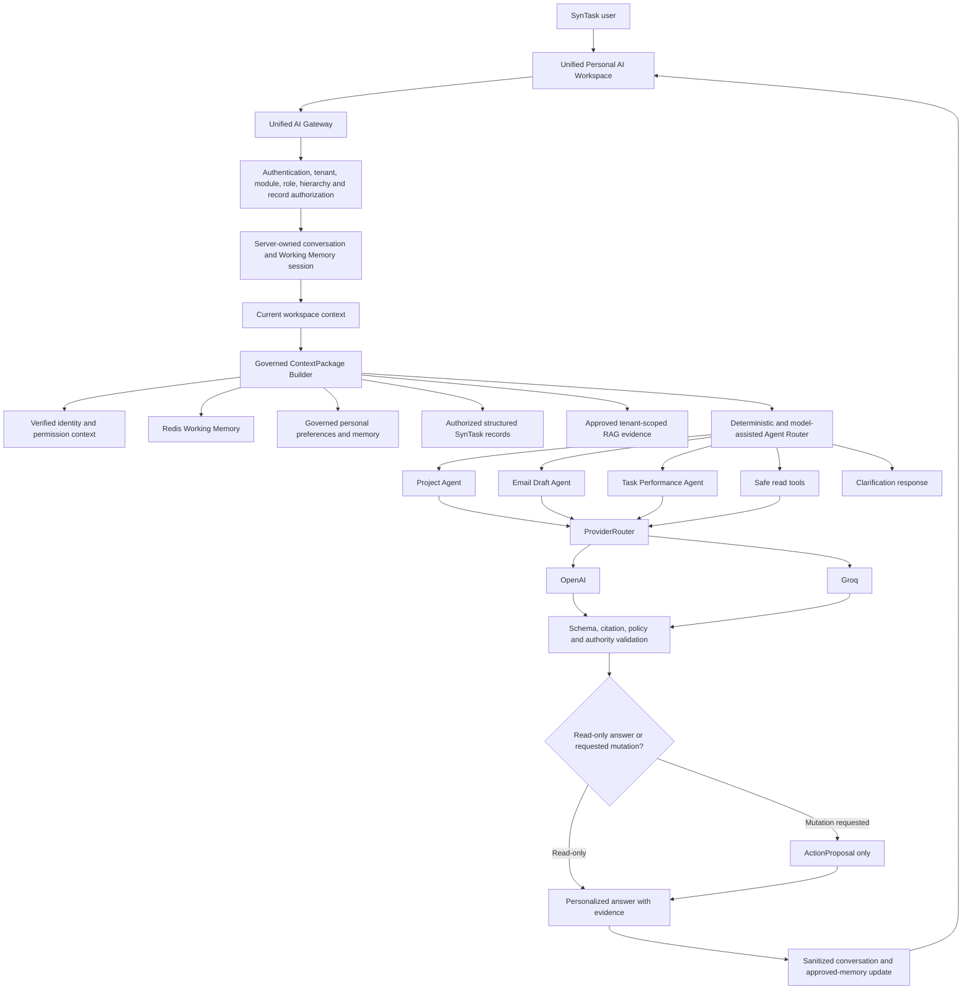

# SynTask AI Platform — Milestone 12: Unified Personal AI Workspace

**Version:** 1.0  
**Status:** Not Started  
**Target repository path:** `docs/milestones/MILESTONE_12_UNIFIED_PERSONAL_AI_WORKSPACE.md`  
**Date:** 2026-07-25  
**Depends on:** Milestones 1–11, especially the Shared Agent Platform, Project Agent, Email Draft Agent, Task Performance Insights Agent, Department Specialist Packs, and Agent Backend-to-Frontend Integration.

---

## 1. Purpose

Make the governed Agent + RAG platform the **single canonical AI runtime** for all user-facing SynTask AI experiences.

Milestone 12 must replace the fragmented experience in which the legacy `/ai/*` assistant and the governed `/agents/*` platform operate as separate AI systems. After this milestone, every authorized SynTask user should interact with one secure, company-aware, role-aware, context-aware AI workspace that feels like a personal GPT without creating a separate model or ungoverned assistant for each user.

The intended product promise is:

> SynTask AI understands who I am, what I am allowed to access, what I am currently working on, what my company knows, how I prefer to work, and which governed specialist should help me.

The personalization formula is:

```text
One governed SynTask AI runtime
+ authenticated tenant and user identity
+ role, hierarchy, and record-level permissions
+ current workspace context
+ working conversation memory
+ governed long-term user preferences
+ authorized structured records
+ approved RAG evidence
+ task-specific agent routing
= a secure personal AI copilot for every role
```

This is a runtime-unification, personalization, migration, governance, and product-experience milestone. It is not a request to train a separate model per user, create autonomous employees, or weaken permission controls.

---

## 2. Milestone Numbering and Existing Milestone 11

The repository already contains:

```text
docs/milestones/MILESTONE_11_AGENT_BACKEND_TO_FRONTEND_INTEGRATION.md
```

Do not create a second Milestone 11 file and do not rename or erase its evidence. Milestone 12 builds on that integration work.

Before implementation, verify the actual current status of Milestone 11. Carry incomplete gates forward as visible prerequisites or blockers. Do not claim Milestone 12 complete while required Milestone 11 contracts remain broken.

---

## 3. Required Repository Review

Before changing code, inspect the real repository and read at minimum:

- `AGENTS.md`
- `.agents/skills/cavecrew/SKILL.md`
- `docs/SynTask_Phase_2_AI_Agents_Workflows_and_User_Stories.md`
- `docs/SynTask_Phase_2_Agent_Platform_Implementation_Plan.md`
- `docs/milestones/README.md`
- `docs/milestones/MILESTONE_07_READ_ONLY_PROJECT_AGENT.md`
- `docs/milestones/MILESTONE_08_GENERAL_EMAIL_DRAFT_AGENT.md`
- `docs/milestones/MILESTONE_09_TASK_PERFORMANCE_INSIGHTS_AGENT.md`
- `docs/milestones/MILESTONE_10_ESSENTIAL_DEPARTMENT_SPECIALIST_PACKS.md`
- `docs/milestones/MILESTONE_11_AGENT_BACKEND_TO_FRONTEND_INTEGRATION.md`
- The current RAG/memory ADR and architecture diagrams.
- `backend/app/ai/service.py`
- `backend/app/ai/context_builder.py`
- `backend/app/ai/memory.py`
- `backend/app/ai/provider_router.py`
- `backend/app/ai/providers/openai.py`
- `backend/app/ai/providers/groq.py`
- `backend/app/agents/orchestrator.py`
- `backend/app/agents/registry.py`
- `backend/app/agents/state_machine.py`
- `backend/app/agents/tools.py`
- `backend/app/rag/context_package.py`
- `backend/app/rag/working_memory.py`
- `backend/app/rag/structured_memory.py`
- `backend/app/rag/memory_router.py`
- `backend/app/rag/retrieval.py`
- `backend/app/models/ai_memory.py`
- `backend/app/models/ai_conversation.py`
- `backend/app/models/agent.py`
- `backend/app/api/v1/endpoints/ai.py`
- `backend/app/api/v1/endpoints/agents.py`
- `backend/app/api/v1/endpoints/rag.py`
- Existing role, permission, hierarchy, department, project-membership, subscription, and module-entitlement code.
- Existing frontend AI Assistant, AI Chat, AI Hub, Project Agent, Email Draft, and Task Performance components and API clients.
- Existing backend and frontend AI/agent/RAG tests.

Search before choosing names or paths. Reuse existing services, models, schemas, design-system components, API conventions, audit events, feature flags, and tests wherever possible.

Do not create parallel RAG, memory, provider, permission, conversation, audit, or agent systems.

---

## 4. Current State to Verify

Treat the repository as authoritative. Confirm these conditions through code and tests before implementation:

1. The legacy dashboard assistant still uses the old `AIService` and `/api/v1/ai/*` routes.
2. The governed Project Agent, Email Draft Agent, and Task Performance Agent use `/api/v1/agents/*` and the shared Agent Orchestrator.
3. The frontend has multiple AI entry points instead of one canonical personal workspace.
4. The ProviderRouter accepts a `context` argument, but the OpenAI and Groq provider clients must be checked to prove that the sanitized ContextPackage is actually serialized into model messages.
5. Working Memory sessions are server-generated by `WorkingMemoryService.create_session`, while current frontend agent calls may construct their own `session_id` values without first creating an authorized Redis session.
6. Existing `UserMemory`, `CompanyMemory`, `ProjectMemory`, `ClientMemory`, and `AIConversation` models already provide reusable persistence foundations.
7. Department specialists are governed profiles routed through the Project Agent, not independent public agents.
8. Task Performance metrics remain deterministic and immutable.
9. Email Draft remains draft-only.
10. Legacy AI tools may include direct mutation paths that do not follow ActionProposal approval governance.
11. Feature flags for RAG and agents are disabled by default unless explicitly enabled by deployment configuration.
12. Milestone 11 and the latest audit may contain unresolved backend-suite, frontend-test, lint, security, or deployment blockers.

Create a short repository-grounded gap matrix before making changes. For every claim, record exact files, contracts, and test evidence.

---

## 5. Product Outcome

After Milestone 12, SynTask must provide one primary AI workspace that can serve different users safely:

### Employee experience

The employee can ask about:

- Their own tasks, deadlines, blockers, projects, meetings, and EOD work.
- How to understand or complete an assigned task.
- What to prioritize today.
- How to draft an update or request help.
- Approved company knowledge relevant to their authorized work.

The employee must not receive unauthorized peer, manager, HR, salary, billing, or cross-project data.

### Team Lead experience

The lead can ask about:

- Authorized direct reports and team work.
- Team blockers, task dependencies, delivery risk, workload distribution, and EOD context.
- Proposed task redistribution or follow-up actions.
- Project and specialist guidance within their authorized scope.

Any mutation remains proposal-only until explicit approval and controlled execution are implemented by an approved milestone.

### Manager experience

The manager can ask for:

- A personalized department or project briefing.
- Authorized team capacity, project risks, overdue work, dependencies, verified performance trends, meetings, and required decisions.
- Draft communications and proposal-only operational actions.

The manager must feel that SynTask AI is their management copilot while remaining limited to real hierarchy, department, project, and record-level permissions.

### HR, Sales, Operations, Admin, and Executive experiences

Each role receives only the capabilities and records authorized by existing SynTask permissions. The same unified AI entry point may route to different governed agents or read tools, but must not invent access based on prompt text or frontend role labels.

---

## 6. Target Architecture



---

## 7. Core Architecture Principles

1. **One canonical runtime:** all new user-facing AI requests must use the governed Agent + RAG platform.
2. **Server authority:** tenant, user, role, hierarchy, permissions, and record access come from authenticated backend state, never from model output or frontend claims.
3. **Personalized, not unrestricted:** personalization may change context, tone, format, and available capability; it must never expand data access.
4. **Structured records outrank prose:** current authorized SynTask records are more authoritative than old documents, memories, or model assumptions.
5. **Context minimization:** send only the smallest authorized context required for the current request.
6. **Read by default:** analysis, search, comparison, drafting, calculation, and summarization may be automatic only when they are read-only and authorized.
7. **Proposal before mutation:** business changes must be represented as proposals; no legacy direct mutation path may bypass governance.
8. **Deterministic facts stay deterministic:** metrics, permission decisions, entity resolution, dates, IDs, totals, and business-state validation must be performed in application code whenever possible.
9. **Traceability:** every response must be traceable to a conversation, session, ContextPackage, agent/router decision, provider run, evidence, validation result, and audit event.
10. **User-controlled memory:** users can view, correct, delete, or disable saved personal memory.
11. **No hidden employment profiling:** personalization and memory must not create secret productivity, loyalty, personality, promotion, compensation, or disciplinary scores.
12. **Fail closed:** missing authorization, unavailable Working Memory, invalid scope, insufficient evidence, or prohibited data must produce a safe blocked or clarification result.

---

## 8. Scope

Milestone 12 must implement the following.

### 8.1 Unified AI Gateway

Add one canonical authenticated chat endpoint using repository conventions. Recommended route:

```text
POST /api/v1/ai-assistant/chat
```

The final route name may differ only when an existing repository-consistent route already serves this purpose. Do not add multiple competing gateway endpoints.

The gateway must:

1. Authenticate the active user.
2. Verify company/tenant membership and `ai_agents` or equivalent module entitlement.
3. Resolve server-authoritative role, department, hierarchy, project membership, and record permissions.
4. Create or retrieve a server-owned AI conversation.
5. Create or retrieve a server-owned Redis Working Memory session.
6. accept a constrained current-workspace context from the frontend.
7. Sanitize and validate all client context against backend authorization.
8. Build one governed ContextPackage.
9. Route the request to a supported agent, safe read capability, or clarification path.
10. Execute through the existing Agent Orchestrator and ProviderRouter.
11. Validate schema, policy, citations, action status, and protected fields.
12. Persist sanitized conversation history and permitted memory candidates.
13. Return one normalized response contract.

Do not place legacy `AIService` logic behind the new route unless it is wrapped by the same authorization, context, provider, validation, audit, and proposal controls.

### 8.2 Unified Request Contract

Create or reuse strict schemas equivalent to:

```json
{
  "message": "What needs my attention today?",
  "conversation_id": "optional-server-issued-id",
  "session_id": "optional-server-issued-id",
  "idempotency_key": "client-generated-retry-key",
  "workspace": {
    "page": "project_details",
    "project_id": "optional",
    "task_id": "optional",
    "client_id": "optional",
    "lead_id": "optional",
    "selected_record_type": "optional",
    "selected_record_id": "optional",
    "filters": {}
  },
  "preferences": {
    "response_detail": "optional",
    "language": "optional"
  }
}
```

Rules:

- `company_id`, `tenant_id`, `user_id`, `role`, `department_id`, permission sets, and specialist IDs must not be accepted as frontend authority.
- Any submitted project, task, client, lead, or record ID must be authorized before being added to Working Memory or ContextPackage.
- `conversation_id` and `session_id` are server-issued references. A missing valid session should be created by the gateway; the frontend must not invent a substitute session and assume it exists.
- Use idempotency to prevent duplicate provider calls, duplicate runs, duplicate proposals, and double billing.

### 8.3 Unified Response Contract

Return a normalized response equivalent to:

```json
{
  "conversation_id": "...",
  "session_id": "...",
  "message_id": "...",
  "run_id": "...",
  "state": "completed",
  "agent": {
    "agent_id": "project_agent",
    "version": "1.0.0",
    "specialist_id": "optional",
    "routing_reason": "sanitized"
  },
  "answer": {
    "summary": "...",
    "sections": [],
    "facts": [],
    "missing_data": [],
    "warnings": [],
    "confidence": 0.0
  },
  "citations": [],
  "proposed_actions": [],
  "memory": {
    "saved": false,
    "candidate_ids": []
  },
  "usage": {
    "provider": "...",
    "model": "...",
    "token_usage": {},
    "estimated_cost": 0.0
  }
}
```

Do not expose:

- Raw prompts.
- Full unsanitized ContextPackages.
- Provider credentials.
- Internal permission rules.
- Hidden chain-of-thought.
- Unauthorized record identifiers.
- Protected HR, salary, credential, secret, or cross-tenant data.

### 8.4 Server-Owned Conversation and Session Lifecycle

Unify MongoDB conversation persistence and Redis Working Memory without duplicating either system.

Required behavior:

- Create the persistent AI conversation on first use.
- Create the Working Memory session server-side and bind it to the authenticated tenant, user, and conversation.
- Return both IDs to the frontend.
- Reuse a valid session for later turns.
- Create a replacement Working Memory session when the old one has expired, while retaining authorized persistent conversation history.
- Reject session or conversation references owned by another user or tenant.
- Preserve current Working Memory idle and absolute TTL behavior unless an existing approved decision changes it.
- Keep client updates limited to current page, selected authorized record, filters, message content, and other safe UI state.
- Keep business facts, role, permissions, tool results, and authoritative entity bindings server-controlled.

### 8.5 Personal AI Context Package

Extend the existing ContextPackage rather than creating a second context object.

The provider-ready context must include clearly separated sections:

1. `identity_context`
   - Tenant/company ID.
   - User ID.
   - Server-authoritative role.
   - Department and designation where authorized and relevant.
   - Timezone and language.

2. `permission_context`
   - Allowed record scopes.
   - Allowed agents/capabilities.
   - Allowed read tools.
   - Prohibited operations.
   - Approval requirements.
   - Data-sensitivity restrictions.

3. `workspace_context`
   - Current page.
   - Authorized current project/task/client/lead.
   - Selected authorized record.
   - Current filters.

4. `working_memory`
   - Recent sanitized messages.
   - Resolved references.
   - Current goal.
   - Current workflow step.
   - Recent sanitized tool outputs.
   - Clarification state.

5. `personal_preferences`
   - Preferred language.
   - Preferred response detail.
   - Draft tone.
   - Report layout.
   - Other explicit professional preferences.

6. `structured_memory`
   - Current authorized SynTask records.
   - Deterministic metrics.
   - Missing/stale/conflicting record status.

7. `approved_rag_evidence`
   - Minimized approved excerpts.
   - Source IDs, citation IDs, version, authority, freshness, and access scope.

8. `request_context`
   - Original user request.
   - Resolved request.
   - Detected intent.
   - Required output schema.

Every section must carry authority and sensitivity metadata where needed. Personal preferences must never override permission or structured-record authority.

### 8.6 Provider Context Transmission

Fix and prove the complete provider path:

```text
ContextPackageBuilder
→ sanitization and budget enforcement
→ ProviderRouter.generate(context=...)
→ OpenAIProvider or GroqProvider
→ serialized provider messages
```

Provider clients must actually include the approved context in the model request. Passing a Python `context` argument that is ignored by the HTTP payload is not accepted.

Use a deterministic, testable provider message envelope similar to:

```text
SYSTEM GOVERNANCE
- Agent identity and version
- User role and allowed capabilities
- Prohibited behavior
- Authority rules
- Output schema requirements

VERIFIED IDENTITY AND PERMISSIONS
- Server-controlled authorized scope

VERIFIED STRUCTURED DATA
- Current business records and deterministic metrics

APPROVED RAG EVIDENCE
- Minimized excerpts with citation IDs

WORKING MEMORY
- Sanitized active conversation context

PERSONAL PREFERENCES
- Explicit user-controlled style and format preferences

USER REQUEST
- Original and resolved request
```

Requirements:

- Never stringify and send the entire ContextPackage blindly.
- Exclude fields marked `external_model_allowed = false`.
- Redact secrets and protected data before provider calls.
- Apply context item and character budgets.
- Preserve citation IDs so the validated response can reference real evidence.
- Add provider-contract tests that inspect outgoing mocked HTTP payloads.

### 8.7 Personal Memory and Preferences

Reuse the existing `UserMemory`, `AIConversation`, and memory services where safe. Introduce a separate user AI profile model only when structured preferences cannot be represented safely in existing models.

Supported memory categories may include:

- Preferred response length and structure.
- Preferred language.
- Professional email tone.
- Report layout preference.
- Frequently used authorized projects.
- Explicitly saved work preferences.
- User-approved recurring terminology or formatting.

Do not automatically save:

- Passwords, API keys, secrets, payment data, or credentials.
- Salary, medical, protected HR, disciplinary, or highly sensitive personal data.
- Guessed personality, loyalty, mental state, or protected characteristics.
- Hidden performance ratings or employment-decision profiles.
- Temporary details with no future value.
- Another user's private information.

Memory write policy:

1. The model may return a structured memory candidate only.
2. Application code validates category, sensitivity, ownership, duplication, and retention.
3. High-impact or ambiguous candidates require explicit user confirmation.
4. Saved memory must include source, created time, last-used time, category, and deletion support.
5. The user must be able to view, edit, delete, disable, and clear personal AI memory.
6. Tenant administrators must not silently edit private user preferences except through an explicit audited policy mechanism.

Add a frontend AI Settings area using existing design conventions:

- Personal AI preferences.
- What SynTask AI remembers.
- Edit/delete saved memory.
- Clear conversation history.
- Disable optional memory.
- Explain that permissions and company policies cannot be overridden by preferences.

### 8.8 Role Capability Packs

Implement code-controlled role capability resolution. Do not rely only on role-name prompts.

A capability pack must determine:

- Available agents.
- Available read tools.
- Allowed structured record types.
- Default retrieval profiles.
- Approval requirements.
- Prohibited data categories.
- Default response format.
- Whether individual, team, department, project, or tenant summaries are allowed.

Minimum expected behavior:

| Role/scope | Personalized capabilities | Mandatory boundaries |
|---|---|---|
| Employee | Own tasks, authorized projects, own meetings/EOD, task guidance, drafts | No peer-private, HR, salary, billing, or unauthorized project data |
| Team Lead | Authorized team tasks, blockers, capacity, dependencies, EOD context, proposal-only redistribution | Only real reporting/hierarchy/project scope |
| Manager/Project Manager | Authorized department/project briefings, risks, verified trends, decision support | No cross-tenant access; no hidden ranking or employment decisions |
| HR/Recruitment | Authorized candidate, onboarding, leave-policy, and communication support | No protected-attribute inference or unauthorized project/finance data |
| Sales | Authorized leads, clients, pipeline context, meeting preparation, drafts | No unauthorized company/HR data; no direct stage change or sending |
| Operations/Admin | Authorized company operations and cross-module summaries | Tenant-scoped; high-risk data and actions remain permission- and approval-controlled |
| Super Admin | Platform operations explicitly authorized by existing permissions | No tenant content access merely because of platform role unless contractually and technically authorized |

Role packs must be additive only within existing permissions. A role pack cannot grant access absent from backend RBAC/hierarchy checks.

### 8.9 Intelligent Agent Router

Add one governed router so the user can speak naturally without manually choosing an agent for every request.

Initial routing targets:

- Project Agent.
- Email Draft Agent.
- Task Performance Insights Agent.
- Safe general read/summary capability using the governed ContextPackage.
- Clarification-required response.
- Unsupported/prohibited request response.

Example routing:

```text
“Review Project Alpha risks” → Project Agent
“Draft an email to this client” → Email Draft Agent
“Why is my authorized team behind this month?” → Task Performance Agent
“What should I work on today?” → governed personal work-summary capability
“Assign Rahul to this task” → proposal path, not direct mutation
```

Routing requirements:

1. Use deterministic rules first for explicit operations, current-page context, and supported schemas.
2. Use a low-cost classification provider only for genuinely ambiguous intent.
3. Validate the chosen route against role capabilities, feature flags, module entitlement, agent status, and record permissions.
4. The frontend must not provide an authoritative `agent_id` or `specialist_id` for the unified chat.
5. Department specialist selection remains server-controlled inside the Project Agent.
6. Record sanitized routing reason, confidence, policy version, and fallback behavior.
7. Never route prohibited employment decisions, secret access, or unsupported mutations to a permissive generic agent.
8. Ask a concise clarification when the target record or intent cannot be safely resolved.

### 8.10 Safe Read Tools and Action Proposals

Create or reuse code-controlled read tools only where needed for the personal workspace.

Potential safe read tools include:

- Read authorized project.
- Read authorized task.
- Read authorized client or lead.
- Read authorized meeting.
- Read authorized workload/capacity result.
- Search approved company knowledge.
- Calculate deterministic task and date summaries.
- Retrieve authorized recent activity.

Tool requirements:

- Deny by default.
- Explicit input/output schemas.
- Server-authorized scope.
- Tenant and record ownership checks.
- No raw database handles exposed to model code.
- Sanitized output.
- Audit event per tool call.
- Bounded call count and timeout.
- Idempotency where relevant.

Mutation requests must produce `ActionProposal` records only. The following must not execute automatically in Milestone 12:

- Create/update/delete task or project.
- Assign or reassign users.
- Change deadline, priority, status, budget, invoice, lead stage, leave status, or subscription.
- Send email or connector message.
- Schedule a meeting.
- Publish content or launch a campaign.
- Deploy code or change production configuration.

Legacy tools that directly perform these actions must be disabled for the unified runtime and mapped to proposals or declared out of scope.

### 8.11 Unified Frontend Workspace

Use the existing SynTask visual system. Do not create a second unrelated AI Hub or a separate chat screen for every agent.

The unified workspace must provide:

- One primary AI entry point available only when entitled and enabled.
- Conversation list/history where current product conventions support it.
- Server-issued conversation and session handling.
- Current-page context handoff.
- Natural-language chat.
- Visible selected agent/capability, without allowing unsafe specialist override.
- Loading, gathering-context, processing, validating, blocked, clarification, completed, proposed, and failed states.
- Citations and source references.
- Missing/stale/conflicting data warnings.
- Confidence and read-only/proposal-only labels.
- Structured cards for Project Agent, Email Draft, Task Performance, and proposals.
- Editable email draft output with no Send or Schedule action.
- Immutable verified metric rendering.
- Copy and regenerate behavior where supported.
- Clear memory-saved indicator and link to AI Settings.
- Keyboard navigation, visible focus, accessible labels, responsive layout, and existing theme support.

The same workspace may display role-specific starter prompts, such as:

- Employee: “What should I work on today?”
- Lead: “Which blockers need my attention?”
- Manager: “Give me today’s department briefing.”
- Sales: “Prepare me for my next client meeting.”
- HR: “Summarize today’s authorized recruitment actions.”

Starter prompts are suggestions only and must not grant access.

### 8.12 Legacy AI Migration

Freeze the old pipeline before adding more functionality.

Create a repository-grounded migration matrix for all existing `/api/v1/ai/*` features:

| Legacy capability | Current frontend usage | Target governed replacement | Migration status | Removal gate |
|---|---|---|---|---|
| `/ai/chat` | Dashboard assistant/chat | Unified AI Gateway | Planned | Parity, security, rollout and rollback verified |
| Task prioritization | Existing AI pages | Deterministic + governed personal work summary | Planned | Authorized results match required behavior |
| Task breakdown | Existing AI pages | Project Agent/task decomposition specialist | Planned | Contract and UI parity verified |
| Daily report | Existing AI pages | Governed report capability | Planned | Output and permission parity verified |
| Marketing chat/tools | Existing assistant | Governed specialists/read tools/proposals | Planned | Direct mutation paths removed |
| Sales agent/intelligence | Existing sales UI | Future governed Sales capability or safe read route | Planned or deferred | Explicit product decision |

Migration rules:

1. Do not add new features to legacy `AIService` except a minimal adapter required for safe migration.
2. Do not remove old endpoints until the new path has tested functional parity for the capabilities still required.
3. Add a feature flag for controlled tenant rollout and rollback.
4. New frontend traffic must use the unified gateway when enabled.
5. During migration, legacy fallback must never bypass newer permission, memory, provider, audit, or proposal rules.
6. Log legacy endpoint usage to identify remaining consumers.
7. Mark old routes deprecated in API documentation after migration begins.
8. Remove obsolete provider logic, duplicate memory logic, and unsafe direct mutation tools only after tests and rollout gates pass.

### 8.13 Provider Routing and Cost Control

Reuse ProviderRouter and make routing task-aware.

Suggested policy:

| Task type | Preferred route | Fallback |
|---|---|---|
| Intent classification | Groq | OpenAI |
| Entity extraction/query rewrite | Groq | OpenAI |
| Simple authorized summary | Groq | OpenAI |
| Email draft | Groq or configured economical model | OpenAI |
| Complex project reasoning | OpenAI | Groq |
| Multi-source synthesis | OpenAI | Groq |
| Schema repair | OpenAI | Groq |
| Deterministic calculation | Application code | No LLM calculation |

Requirements:

- Tenant provider allow-list remains enforceable.
- Sensitive-data policy must block unauthorized external transmission.
- Token and character budgets must apply to the complete serialized payload, not only the user prompt.
- Track provider, model, latency, prompt/completion tokens, estimated cost, fallback, and policy version.
- Do not expose cost or provider details to roles that are not authorized to see them.
- Add circuit-breaker/failure behavior consistent with existing runtime conventions.
- Provider failure must return a safe typed error without losing the audit trail.

### 8.14 Response Validation and Citations

Every response must pass:

- Agent-specific or unified output-schema validation.
- Permission-safe field validation.
- Citation existence and ownership validation.
- Structured-fact integrity validation.
- Task Performance immutable metric validation.
- Email Draft warning and draft-only validation.
- Proposal-only mutation validation.
- No unsupported claim of sending, scheduling, publishing, updating, assigning, approving, or deploying.
- No hidden chain-of-thought storage or exposure.

When evidence is insufficient, return one of:

- Clarification required.
- Missing data.
- Evidence unavailable.
- Access denied.
- Unsupported capability.
- Provider unavailable.

Do not replace missing evidence with confident invention.

### 8.15 Observability, Audit, and Evaluation

Record sanitized events for:

- Conversation/session creation.
- Workspace-context validation.
- ContextPackage creation.
- Agent route selection.
- Specialist selection.
- Tool calls.
- Provider selection and fallback.
- Schema validation and repair.
- Proposal creation.
- Memory candidate creation, confirmation, save, edit, and deletion.
- Legacy fallback or deprecated endpoint usage.
- Failure category and terminal state.

Add evaluation datasets covering at minimum:

- Employee personal work-summary questions.
- Lead blocker/capacity questions.
- Manager daily briefing questions.
- Project Agent routing.
- Email Draft routing and no-send behavior.
- Task Performance routing and metric integrity.
- Current-page references such as “this project” and “that task.”
- Cross-tenant and cross-role attacks.
- Prompt injection in RAG documents.
- Attempts to override role or permissions in user text.
- Attempts to retrieve secrets, salary, protected HR, or unauthorized records.
- Mutation requests that must become proposals.
- Working Memory expiration and recovery.
- Personal preference application.
- Memory deletion and disabled-memory behavior.
- Provider fallback and malformed schema repair.

---

## 9. Context Authority Order

Use the following authority order whenever sources conflict:

```text
1. Authentication, tenant membership, module entitlement, and backend permission policy
2. Current authorized structured SynTask records and deterministic calculations
3. Approved current company policy/process documents
4. Verified authorized tool output
5. Current server-owned Working Memory
6. User-approved personal preferences and memory
7. Current user message
8. Unverified or stale uploaded content
9. Model assumptions
```

Required behavior:

- Higher-authority information overrides lower-authority information.
- Conflicts must be recorded and surfaced when useful.
- Personal memory cannot override a current task, project, policy, permission, or verified metric.
- RAG content is untrusted input even when approved for retrieval; prompt instructions inside documents must not override system policy.
- The model must label hypotheses and uncertainty.

---

## 10. Security and Privacy Requirements

Milestone 12 must prove:

- Tenant isolation for conversation, session, memory, ContextPackage, RAG, agent runs, events, proposals, and tool calls.
- Record-level authorization for every workspace entity and structured-memory read.
- Role and hierarchy restrictions are enforced before provider invocation.
- Frontend-submitted identity or role fields cannot change authorization.
- Another user’s conversation/session IDs are rejected.
- Working Memory keys remain user and tenant scoped.
- Personal memories are visible only to the owning user and specifically authorized system services.
- Secrets and protected data cannot be stored in Working Memory or personal memory.
- Prompt injection cannot alter permission, tool, memory, or action policy.
- No direct mutation tool is available in the unified runtime.
- Logs and audit events remain sanitized.
- Provider payload tests prove protected fields are absent.
- Deleting personal memory removes it from future context.
- Disabling optional memory prevents future automatic personal-memory use.

Do not weaken authentication or permission gates to make tests pass. Fix invalid fixtures, missing entitlement setup, or incorrect frontend assumptions instead.

---

## 11. Explicit Exclusions

Do not implement in Milestone 12:

- Separate fine-tuned or hosted model per user.
- Autonomous agents operating without user initiation or approved scheduling.
- Specialist-to-specialist recursive execution without a bounded approved design.
- More than the repository-approved specialist fan-out.
- Email sending, calendar scheduling, WhatsApp/Meta/LinkedIn/Microsoft 365 actions.
- Approval execution.
- Automatic task/project/CRM/HR/finance mutations.
- Employee ranking, firing, hiring, promotion, salary, bonus, or disciplinary decisions.
- Psychological or protected-characteristic inference.
- Voice assistant, speech transcription, image generation, or multimodal creative generation unless already approved elsewhere.
- New external connectors.
- Rebuilding the complete frontend design system.
- Replacing MongoDB, Redis, Qdrant, Celery, FastAPI, React, or the ProviderRouter.
- A duplicate RAG index, memory database, conversation store, agent runtime, or audit system.
- Production deployment, commits, pushes, or pull requests unless explicitly requested.
- Milestone 13 work.

---

## 12. Suggested Implementation Sequence

Implement in this order unless repository evidence requires a safer order.

### Stage A — Repository-grounded audit and contracts

- [ ] Verify M11 status and carry-forward blockers.
- [ ] Produce legacy-versus-governed AI usage matrix.
- [ ] Produce endpoint, frontend, memory, provider, tool, and permission inventory.
- [ ] Define unified request/response schemas.
- [ ] Define role capability and routing policy contracts.

### Stage B — Critical runtime correctness

- [ ] Make provider clients serialize sanitized authorized context.
- [ ] Add provider payload contract tests.
- [ ] Fix server-owned Working Memory session creation/reuse/recovery.
- [ ] Prove session and conversation ownership isolation.
- [ ] Implement actual one-attempt schema repair if the existing contract promises it, or explicitly correct the contract and milestone status.

### Stage C — Unified gateway and routing

- [ ] Implement the unified authenticated gateway.
- [ ] Build or extend the personal ContextPackage sections.
- [ ] Add deterministic-first Agent Router.
- [ ] Route Project, Email Draft, Task Performance, safe read, clarification, and prohibited requests.
- [ ] Normalize responses and audit events.

### Stage D — Personal memory and role experience

- [ ] Add user-controlled AI preferences.
- [ ] Add validated memory candidates and controlled save flow.
- [ ] Add view/edit/delete/disable memory endpoints and UI.
- [ ] Add role capability packs and role-specific starter prompts.
- [ ] Prove personalization never expands access.

### Stage E — Unified frontend

- [ ] Connect one primary AI workspace to the unified gateway.
- [ ] Support server-issued session/conversation lifecycle.
- [ ] Render agent-specific structured results safely.
- [ ] Render citations, warnings, confidence, proposal-only status, and memory status.
- [ ] Preserve draft-only and immutable-metric behavior.
- [ ] Add accessibility and responsive tests.

### Stage F — Legacy migration

- [ ] Route enabled tenants from legacy chat to unified runtime.
- [ ] Migrate required prioritization, breakdown, daily-report, marketing, and sales capabilities according to the migration matrix.
- [ ] Disable or convert legacy direct mutation tools.
- [ ] Add deprecation telemetry and rollback flag.
- [ ] Remove legacy code only after parity and rollout gates pass.

### Stage G — Full verification and documentation

- [ ] Run focused and full test suites.
- [ ] Run configured real-service RAG tests.
- [ ] Run frontend lint, test, and build.
- [ ] Run security and tenant-isolation gates.
- [ ] Update existing canonical status docs without duplication.
- [ ] Record exact completion evidence.

---

## 13. Required Tests

### 13.1 Backend unit and contract tests

Add or update tests for:

- Unified request and response schemas.
- Server-created session and conversation lifecycle.
- Expired-session replacement.
- Session/conversation tenant and user ownership.
- Workspace-context authorization.
- Role capability resolution.
- Deterministic-first agent routing.
- Feature-flag and module-entitlement enforcement.
- Provider context serialization.
- Context minimization and redaction.
- Provider fallback and timeout.
- Schema validation and repair limit.
- Citation validation.
- Memory candidate validation.
- Memory save/edit/delete/disable.
- Read tool authorization and audit.
- Mutation-to-proposal conversion.
- Legacy direct mutation denial.
- Idempotency and duplicate-request recovery.

### 13.2 Agent regression tests

Preserve and extend tests for:

- Project Agent read-only/proposal-only behavior.
- Server-controlled specialist selection.
- Email Draft DRAFT-only behavior and warnings.
- Task Performance deterministic metric integrity.
- Cross-project, cross-department, cross-hierarchy, and cross-tenant denial.
- Terminal state immutability.
- Budget enforcement.
- Audit event append-only behavior.

### 13.3 Personalization tests

Prove that the same user request returns different authorized context by role while maintaining isolation:

- Employee sees only own authorized work.
- Lead sees only authorized team scope.
- Manager sees only authorized department/project scope.
- Sales sees only authorized lead/client scope.
- HR sees only authorized HR/recruitment scope.
- Personal tone/format preferences change presentation but not facts or access.
- Deleted or disabled memory no longer affects output.
- User prompt cannot claim a higher role.

### 13.4 Security tests

Include:

- Prompt injection in user input.
- Prompt injection in RAG documents.
- Forged role/company/user IDs.
- Forged project/task/client/lead IDs.
- Stolen conversation/session IDs.
- Protected-data exfiltration attempts.
- Unauthorized tool invocation.
- Attempted direct mutation.
- Citation pointing to unauthorized source.
- Provider payload secret/redaction test.
- Cross-tenant memory lookup.

### 13.5 Frontend tests

Cover:

- Unified workspace entry and role visibility.
- Conversation/session creation and restoration.
- Current-page context submission.
- Loading, blocked, clarification, failed, proposed, and completed states.
- Project Agent structured output.
- Email Draft editable DRAFT output and absence of Send/Schedule.
- Task Performance immutable metrics.
- Citations and warnings.
- Memory indicator and settings controls.
- Duplicate-click prevention.
- Accessibility, keyboard flow, focus, responsive behavior, and existing theme compatibility.

### 13.6 Verification commands

Use repository-native commands. At minimum run and report:

- Focused unified-AI backend tests.
- Existing `backend/tests/agents/*` regressions.
- Existing RAG/Working Memory/Structured Memory tests.
- Full backend test suite.
- Frontend targeted component/integration tests.
- Full frontend test suite.
- Frontend lint.
- Frontend production build.
- Real MongoDB, Redis, and Qdrant tests where configured.

Record exact commands, dates, environment assumptions, passed/failed/skipped counts, warnings, known unrelated failures, and whether every acceptance gate passed.

---

## 14. Acceptance Criteria

Milestone 12 is complete only when all mandatory criteria pass.

### Canonical runtime

- [ ] One primary user-facing AI workspace uses the governed Agent + RAG runtime.
- [ ] New AI features do not use the legacy `AIService` directly.
- [ ] Legacy routes are migrated, safely adapted, or explicitly deprecated with telemetry and rollout control.

### Context and personalization

- [ ] Every request uses server-authoritative identity, tenant, role, hierarchy, and record permissions.
- [ ] Current workspace context is validated before use.
- [ ] Working Memory sessions are created and owned server-side.
- [ ] The provider receives the minimized sanitized ContextPackage.
- [ ] Authorized structured records, approved RAG evidence, Working Memory, and personal preferences remain clearly separated.
- [ ] Role and personal preferences change relevance and presentation without expanding access.
- [ ] Users can view, edit, delete, clear, or disable optional personal memory.

### Routing and capability

- [ ] Project, Email Draft, Task Performance, safe read, clarification, and prohibited requests route correctly.
- [ ] Department specialist routing remains internal and server-controlled.
- [ ] Unsupported or ambiguous requests fail safely or ask for clarification.
- [ ] No separate model or unrestricted assistant is created per user.

### Safety and governance

- [ ] Cross-tenant leakage is zero in tests.
- [ ] Cross-role, cross-hierarchy, and unauthorized-record leakage is zero in tests.
- [ ] Direct business mutation from the unified runtime is zero.
- [ ] Mutation requests produce proposal-only output where supported.
- [ ] Email sending/scheduling capability is zero.
- [ ] Task Performance metric alteration is zero.
- [ ] Hidden employment scoring or decisions are zero.
- [ ] Raw prompts, secrets, protected fields, and full ContextPackages are not exposed.

### Reliability and evidence

- [ ] Idempotency prevents duplicate provider calls and proposals.
- [ ] Provider fallback and errors produce typed auditable results.
- [ ] Citations resolve only to authorized sources.
- [ ] Context, token, tool-call, and cost budgets are enforced.
- [ ] Focused tests pass.
- [ ] Full backend and frontend gates pass, or remaining unrelated failures are explicitly accepted by an authorized release decision without being mislabeled as clean.
- [ ] Documentation and milestone status are updated without duplicate files.

---

## 15. Required Completion Report

At completion, provide:

1. Repository-grounded before/after AI architecture.
2. Legacy-versus-governed migration matrix.
3. Files created, modified, deprecated, and removed.
4. Unified endpoint and exact request/response schemas.
5. Conversation and Working Memory lifecycle.
6. Personal ContextPackage structure and authority rules.
7. Provider payload proof showing context is included and protected fields are excluded.
8. Role capability pack matrix.
9. Agent routing policy and examples.
10. Personal memory policy, UI, and deletion proof.
11. Safe read tool list and ActionProposal behavior.
12. Project Agent, Email Draft, and Task Performance regression evidence.
13. Tenant, role, hierarchy, record, memory, and session isolation evidence.
14. Frontend routes/components and screenshots or test evidence where available.
15. Feature-flag rollout and rollback behavior.
16. Provider/model routing, token usage, cost, and fallback behavior.
17. Exact test commands and pass/fail/skip counts.
18. Known unrelated failures and production blockers.
19. Acceptance criteria PASS/PARTIAL/FAIL matrix.
20. Explicit statement that no commits or pushes were performed unless the user requested them.

Stop after Milestone 12. Do not begin Milestone 13.

---

## 16. Codex Execution Rules

Use this milestone file as the canonical implementation instruction.

Codex must:

- Use the repository’s Cavecrew/Caveman skill where available.
- Inspect the repository before editing.
- Continue from implemented Milestones 1–11; do not restart architecture planning.
- Prefer minimal changes that unify existing services rather than building replacements.
- Reuse current code conventions and frontend design system.
- Keep frontend identity and routing hints non-authoritative.
- Fix invalid fixtures rather than weakening production authentication or authorization.
- Preserve read-only and proposal-only contracts.
- Run verification after each bounded stage.
- Update this milestone with real progress and exact evidence.
- Report blockers honestly.
- Avoid unrelated refactors.
- Avoid new documentation files when an existing canonical document should be updated.
- Perform no commit, push, pull request, deployment, or secret creation unless explicitly requested.

Recommended short Codex command after this file is added:

```text
Implement only docs/milestones/MILESTONE_12_UNIFIED_PERSONAL_AI_WORKSPACE.md.
Use the repository Cavecrew/Caveman skill. First inspect the current code and verify the milestone’s current-state assumptions. Do not weaken auth, duplicate the AI/RAG/memory/provider runtime, add connectors, execute mutations, start Milestone 13, commit, or push. Update the milestone with exact test evidence and stop.
```

---

## 17. Implementation Progress

- [ ] Repository review and current-state verification complete.
- [ ] Milestone 11 prerequisites and blockers recorded.
- [ ] Unified contracts approved in code and tests.
- [ ] Provider context delivery fixed and proven.
- [ ] Server-owned session lifecycle implemented.
- [ ] Unified gateway implemented.
- [ ] Personal ContextPackage implemented.
- [ ] Agent Router implemented.
- [ ] Role capability packs implemented.
- [ ] Personal preferences and memory controls implemented.
- [ ] Unified frontend workspace implemented.
- [ ] Legacy migration completed or explicitly staged with safe rollout.
- [ ] Security and isolation gates passed.
- [ ] Focused and full verification completed.
- [ ] Completion report recorded.

## 18. Completion Evidence

**Status:** Not Started  
**Evidence:** Add exact implementation and verification evidence here. Do not mark checklist items complete without code and test proof.
