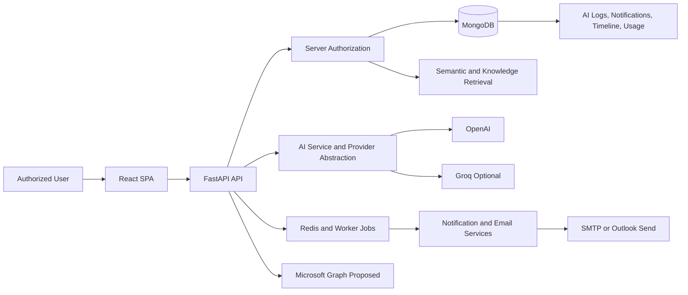
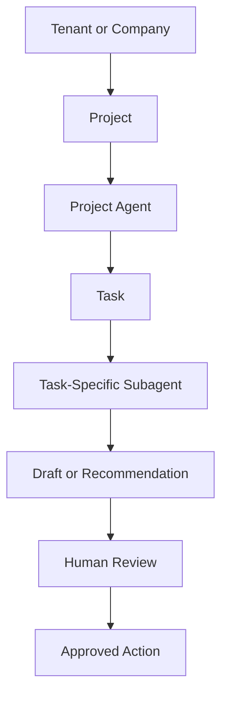
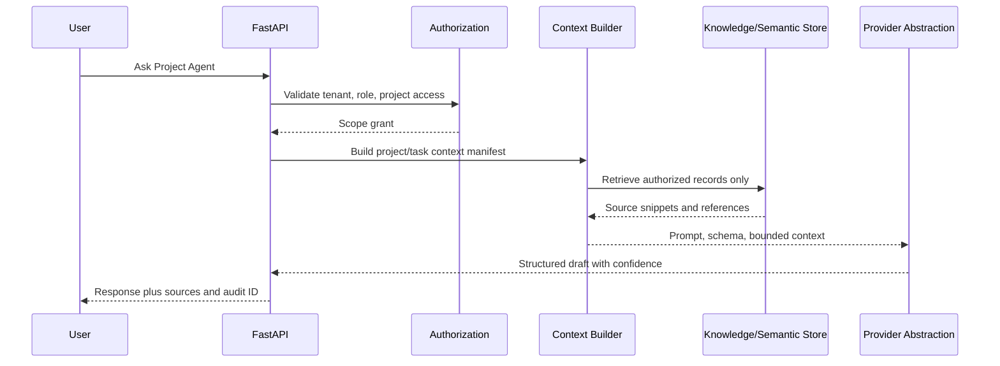
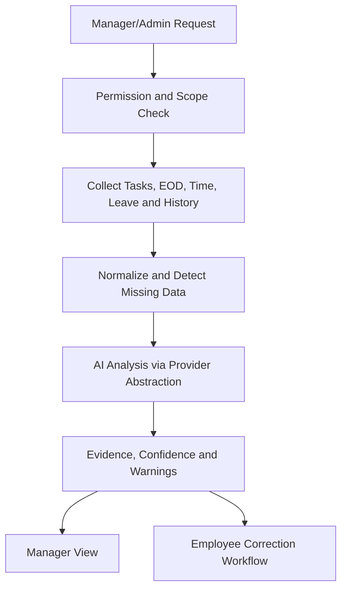
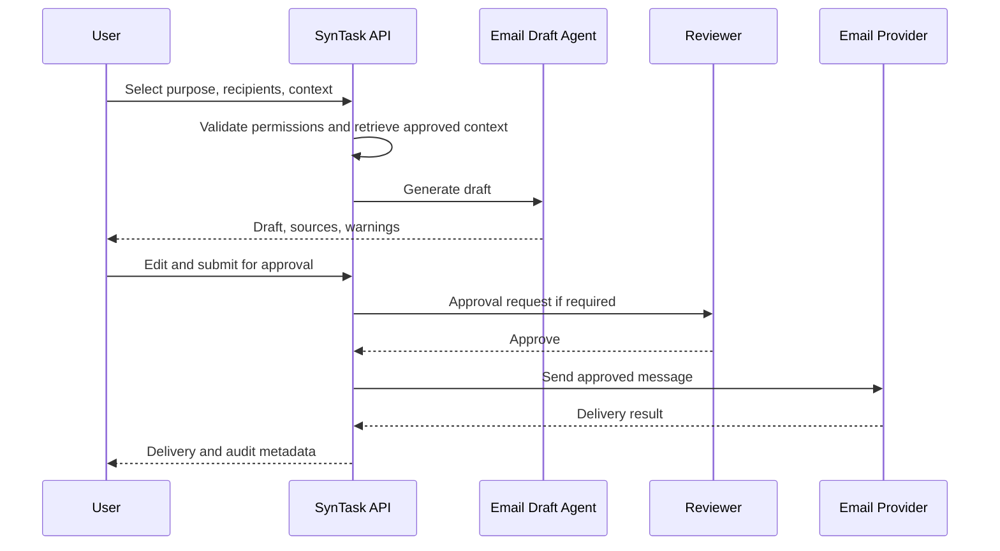
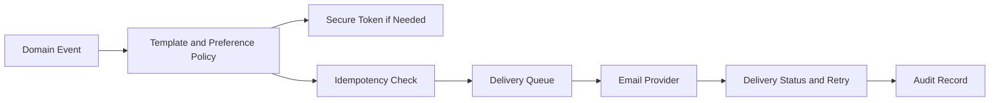
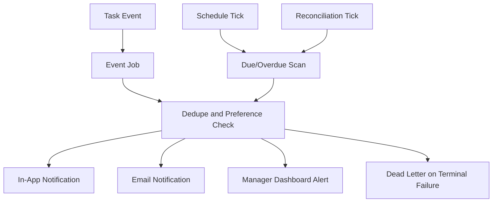
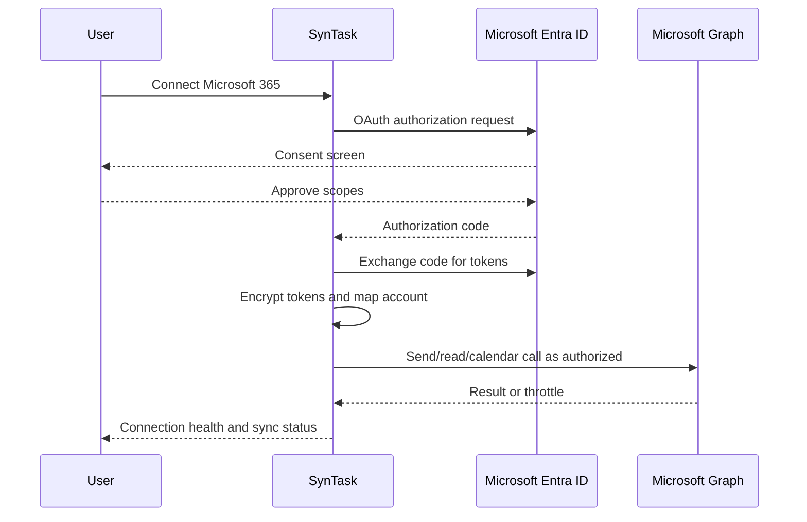
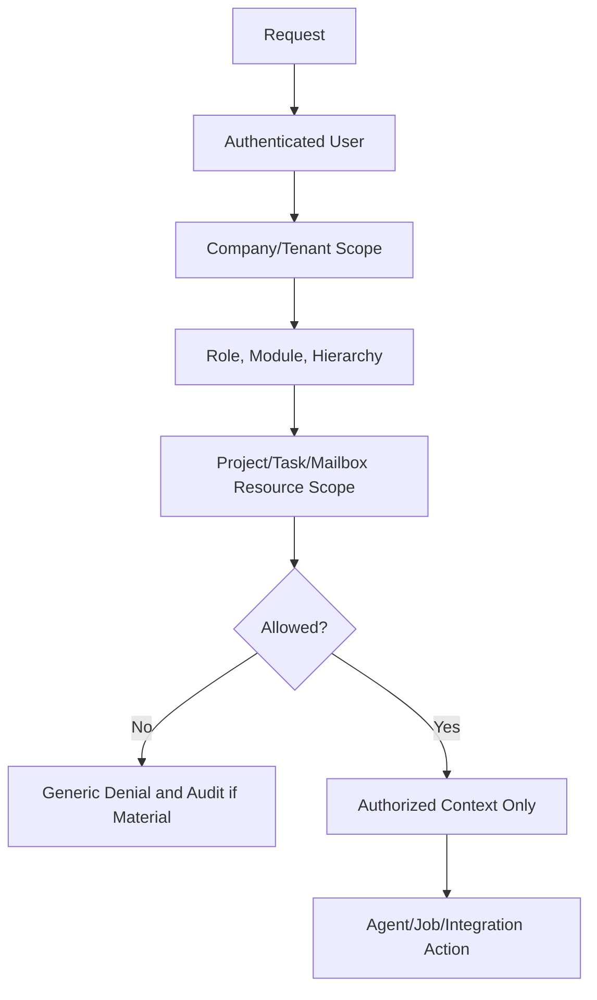

# SynTask Product Requirements Document

Status: baseline plus proposed AI-enabled Phase 2 scope
Version: 1.1
Last reviewed: 2026-07-18
Product owner: to be assigned

## Table of contents

1. [Product definition](#1-product-definition)
2. [Repository assessment](#2-repository-assessment)
3. [Personas and authority](#3-personas-and-authority)
4. [Product-wide requirements](#4-product-wide-requirements)
5. [AI-enabled Phase 2 scope](#5-ai-enabled-phase-2-scope)
6. [Agent operating model](#6-agent-operating-model)
7. [Project Agent specification](#7-project-agent-specification)
8. [Task Performance Agent specification](#8-task-performance-agent-specification)
9. [OpenAI versus Groq decision](#9-openai-versus-groq-decision)
10. [Email Draft Agent specification](#10-email-draft-agent-specification)
11. [Transactional email requirements](#11-transactional-email-requirements)
12. [Background-job and notification requirements](#12-background-job-and-notification-requirements)
13. [Microsoft 365 integration](#13-microsoft-365-integration)
14. [Architecture and data flows](#14-architecture-and-data-flows)
15. [Security, privacy, audit and cost controls](#15-security-privacy-audit-and-cost-controls)
16. [User stories and acceptance criteria](#16-user-stories-and-acceptance-criteria)
17. [Rollout plan](#17-rollout-plan)
18. [Dependencies, risks, metrics and traceability](#18-dependencies-risks-metrics-and-traceability)
19. [Open product decisions](#19-open-product-decisions)

## 1. Product definition

SynTask is a multi-tenant B2B operations platform combining project delivery, tasks, support, CRM/sales, client and financial workflows, workforce operations, recruitment, collaboration, AI assistance, subscriptions, and platform administration.

### Executive summary

Phase 1 behavior remains the foundation: tenant-aware users, projects, tasks, EOD reports, meetings, notifications, CRM, dashboards, and AI assistance must continue to work without workflow replacement. The next AI-enabled scope extends this platform with project-scoped agents, management-grade task-performance analysis, company-aware email drafting, transactional and automated notifications, and Microsoft 365 integration.

These capabilities are **Proposed** unless explicitly labelled Existing or Partially Existing. AI output is a draft or recommendation by default. External communication, employee-affecting management action, deadline changes, assignment changes, and provider fallback require explicit product and permission rules before implementation.

### Business objective

1. Reduce manual project coordination and repetitive communication work.
2. Give managers evidence-based operational insight without creating simplistic employee scoring.
3. Improve reliability of task, meeting, account and deadline notifications.
4. Add enterprise-friendly Microsoft 365 connectivity using least-privilege access.
5. Keep AI behavior auditable, tenant-isolated, configurable, and provider-abstracted.

### Problem statement

Growing agencies and project teams lose context across projects, tasks, EOD reports, meetings, email threads, and manager reviews. Existing AI surfaces are useful but broad; they do not yet define isolated project agents, task-scoped subagents, contextual performance analysis, or explicit email approval paths. Notification behavior also needs idempotent event/job design to avoid missed reminders or spam.

### Current non-goals

- Microservices solely for organizational preference.
- Payroll or statutory accounting unless separately approved.
- Treating frontend route guards as security controls.
- Claiming HA, compliance, or disaster recovery without verification evidence.
- AI-only business logic hidden in prompts.
- Fully autonomous HR decisions, disciplinary decisions, salary decisions, termination decisions, external communication, project deletion, or cross-tenant analysis.

## 2. Repository assessment

Repository search on 2026-07-18 found the following:

| Area | Evidence | Status |
|---|---|---|
| Canonical product document | `docs/product/PRD.md` is linked from `docs/DOCUMENTATION_INDEX.md` as Product requirements. | Existing |
| Named Phase 2 AI document | `SynTask_Phase_2_AI_Agents_Workflows_and_User_Stories.md` was not present in `rg --files`. | Missing |
| AI provider abstraction | `backend/app/ai/provider.py`, `backend/app/ai/providers/openai.py`, `backend/app/ai/providers/groq.py`, `backend/app/ai/service.py`. | Existing |
| Structured output support | OpenAI provider passes `response_format`; service comments note Groq response-format differences. | Partially Existing |
| AI logs and memory | `backend/app/models/ai_log.py`, `ai_memory.py`, `ai_conversation.py`, `backend/app/ai/logger.py`, `memory.py`. | Existing / Partial |
| Semantic retrieval | `backend/app/semantic/*`, `backend/app/knowledge/*`, semantic tests. | Existing |
| Task-specific agent | `backend/app/ai/agents/task_breakdown.py`. | Partially Existing |
| Project Agent | No dedicated project-scoped agent model/service found. | Proposed |
| Task Performance Agent | No management-grade performance-analysis agent found. | Proposed |
| Email Draft Agent | Existing email services/composer and notification email endpoints, but no company-specific approval-first AI draft agent found. | Proposed |
| Transactional email | `backend/app/core/email.py`, `backend/app/services/notification_service.py`, `backend/app/api/v1/endpoints/notification_emails.py`. | Partially Existing |
| Automated notifications | `backend/app/core/deadline_checker.py`, `backend/app/worker/celery_app.py`, `backend/app/worker/tasks/notification_tasks.py`, automation service. | Partially Existing |
| Microsoft 365 | No Microsoft Graph integration files found. Existing Zoom and SMTP integrations exist. | Proposed |
| Meetings | `backend/app/models/meeting.py`, `backend/app/api/v1/endpoints/meetings.py`, `frontend/src/pages/Meetings.jsx`. | Existing |
| Projects and tasks | Project/task models, endpoints, services, tests, user flows. | Existing |
| EOD and time tracking | EOD, time tracking, timesheet models/endpoints/pages. | Existing |

### Documentation relationships and mismatches

- Single source of truth for the next AI-enabled product scope: this document.
- Supporting references: [AI and Productivity User Flows](../user-flows/ai-productivity.md), [AI Product Audit](../product-audit/ai.md), [Architecture Overview](../architecture/ARCHITECTURE.md), [Detailed Architecture](../architecture/DETAILED_ARCHITECTURE.md), [API documentation](../../backend/API_DOCUMENTATION.md), and [Database schema](../../backend/DATABASE_SCHEMA.md).
- The requested Phase 2 AI agents document name is not present, so this PRD is canonical instead of creating a duplicate.
- `docs/IMPLEMENTATION_PLAN.md` contains a terse phase list and does not define this AI-enabled Phase 2 scope.
- AI Chat, AI Hub, AI Prioritization, Creative Director, task breakdown, and sales/lead intelligence overlap. This document defines the proposed Project Agent, Task-Specific Subagent, Task Performance Agent, and Email Draft Agent boundaries.

## 3. Personas and authority

| Persona | Goal | Expected scope |
|---|---|---|
| Super Admin | Operate SaaS | Cross-tenant plans, companies, usage and billing; tenant content only under explicit support policy |
| Company Admin | Govern one company | Users, departments, modules, projects, notification rules, Microsoft integration policy and tenant data |
| Manager | Oversee organizational scope | Permitted descendants, departments, projects, delivery scope, performance analysis |
| Lead | Coordinate execution | Authorized employees, delivery resources, project/task execution |
| Project Manager | Deliver a project | Project members, tasks, risks, project agent outputs and approved project communications |
| Employee | Complete work | Owned, assigned, participating or shared resources; task subagent support |
| Client/signatory | Complete constrained external actions | Token/portal-scoped actions only |
| Candidate | Discover/apply for jobs | Public careers and candidate-owned tracking |
| Anonymous careers visitor | Browse published vacancies by company and apply | Public `/careers` directory and company-specific career pages require no login, expose only public published jobs, and resolve tenants by stable company slug rather than user session or database id. |
| Candidate with submitted application | Track own hiring progress without employee login | Application submission collects date of birth, returns a tracking ID and one-time temporary password/PIN, and offers printable credentials. Public tracking requires both values and shows only public-safe progress milestones, stage details, candidate-owned profile details, job basics, current resume metadata, scheduled interview details, interview result summaries, and offer status summaries; candidates can update their own profile fields and replace the application resume from `/careers/track`. HR notes, private feedback, recruiter-only data, and internal record ids remain hidden. Temporary credential records are removed when the application journey reaches terminal HR states. |

Access is the intersection of authentication, active status, company, enabled module, role, hierarchy, ownership, membership, project authorization, mailbox/calendar consent where applicable, and capability. Backend enforcement is mandatory.

For local acceptance testing, the `admin@demo.com` development fixture is assigned every canonical module by the idempotent demo-admin seed. This fixture convenience does not alter production entitlement rules or tenant/resource authorization; testers must obtain a fresh session after reseeding.

## 4. Product-wide requirements

| ID | Requirement | Acceptance summary |
|---|---|---|
| CORE-001 | Tenant isolation | Every tenant-owned operation is company-scoped; foreign identifiers expose no protected data |
| CORE-002 | Authorization | Backend evaluates role, hierarchy, module and resource scope |
| CORE-003 | Auditability | Privileged/material changes record actor, tenant, action, resource and time |
| CORE-004 | Lifecycle | Records have documented states and reject invalid transitions |
| CORE-005 | List usability | Large lists provide scoped filtering, pagination and safe export where required |
| CORE-006 | Error handling | Stable API errors and recoverable user messages |
| CORE-007 | Accessibility | Core journeys meet WCAG 2.1 AA expectations |
| CORE-008 | Observability | Requests/jobs carry correlation context without sensitive logging |
| CORE-009 | Data governance | Sensitive domains have retention, deletion and export rules |
| CORE-010 | Responsive UX | Approved desktop and mobile/tablet workflows function correctly |
| CORE-011 | AI human approval | AI output that changes records or sends communication remains draft/recommendation until approved |
| CORE-012 | Provider abstraction | AI business logic depends on provider contracts, not provider-specific SDK behavior |
| CORE-013 | Job idempotency | Background and event jobs are deduplicated and retryable |
| CORE-014 | Global time consistency | Timestamps are stored in UTC and displayed through saved user timezone and format settings |
| CORE-015 | Sidebar overview navigation | Main module landing pages summarize authorized operational signals, filter locally, and link only to existing permitted routes without changing backend authorization |
| CORE-016 | In-app SOP Library | Every authenticated user can open SOP Library from the sidebar; general guides are universal, module-specific articles follow existing module visibility, and reading SOPs never grants feature access |

Existing module requirements from Phase 1 remain valid: identity, tenant administration, projects, tasks, CRM, clients, finance, attendance, leave, EOD, timesheets, recruitment, support, chat, meetings, notifications, AI and creative assistance continue to require tenant isolation, backend authorization, lifecycle validation, auditability and safe provider failure behavior. Sidebar options with distinct routes or independent visibility are independently configurable through granular module keys, including Work keys such as `projects`, `tasks`, `scheduled_work`, `time_tracking`, `daily_updates`, `content_calendar`, and `automation_rules`, Sales/CRM keys such as `leads`, `sales_pipeline`, `clients`, `companies`, `contacts`, `meta_messages`, and `meta_settings`, workforce keys such as `attendance`, `live_attendance`, `attendance_reports`, and `leave_management`, and finance keys such as `invoices` and `transactions`. Legacy parent permissions such as `task`, `tasks_projects`, `sales_crm`, `attendance_leaves`, `invoicing_ledger`, and `ai_agents` continue to grant their related route groups for compatibility. Endpoint-level company, hierarchy, assignment, membership, and project-scoped Lead checks constrain the records and actions. Chat is treated as global task-workspace communication: users with `chat`, `task`, or `tasks_projects` module access may use same-tenant chat and group APIs, while user search and group membership remain company-scoped.

Clients remain backward compatible with existing Client pages, project links, invoices, and workspace payloads. When a Client originates from CRM, `Client.crm_company_id` is the canonical relationship to `CRMCompany`; `company_name` stays as display/cache data. Sales conversion also carries the won lead's commercial value into the Client budget when the Client has no budget yet. Won lead conversion creates or reuses only a same-tenant Client, repairs stale lead `client_id` references, and links generated Projects by the actual lead id. Contacts shown in Client context come from the existing CRM contacts linked to that CRM Company. Manual Clients without a resolved CRM Company remain usable, and migration/backfill reports unresolved or ambiguous Clients instead of linking them by unsafe guesses.

Client lifecycle foundation: converted Clients start in `new` instead of being forced directly to `active`; current lifecycle states are `new`, `onboarding`, `active`, `at_risk`, `on_hold`, `renewal_due`, `churned`, and `archived`. Legacy `inactive` records remain readable and transition as `on_hold`. `new -> onboarding -> active` is mandatory, while post-activation movement is conditional and backend-approved rather than a fixed sequence. The Clients section exposes an Overview tab at `/clients`, plus top stage tabs and dedicated stage URLs for each lifecycle state; each stage tab filters the existing Client list by the backend `status_filter`. Activation blockers surface exact missing prerequisites such as Primary Contact, Account Owner, Requirements, and Kickoff Meeting in a guided popup, and conditional operational or terminal changes collect a required reason where configured. During `onboarding`, the Client Workspace exposes secondary layer tabs backed by `ClientOnboarding` and `ClientOnboardingItem`; linked Contacts, Documents, Projects, Meetings, Files, and Finance records remain the source of truth. Required item readiness is calculated in the backend, optional items do not block activation, and blocker responses guide the user to the exact secondary tab. Status-only selectors cannot create fake completion: payment terms require actual terms rather than budget alone, primary contact requires a same-tenant CRM Contact marked primary, requirements come from structured onboarding metadata rather than legacy notes, assets use requirement rows plus submissions with internal verification and required assets count ready only when verified, access comes from safe references, team readiness derives from actual Client/Project assignments, kickoff completion requires a completed Meeting, and start readiness requires an explicit actor/timestamp confirmation. The final Onboarding Document tab generates a PDF snapshot from verified onboarding data, excludes sensitive credentials and internal-only details, and marks stale documents when source onboarding data changes. Each item retains validation metadata, timestamps, ownership/link metadata, and audit history. The lifecycle state-transition foundation introduced in Phase 2 continues to validate allowed transitions and preserve the existing Sales Won -> Client, Project, Tasks, Kickoff, Invoice, and Client Workspace flow; later Client Workspace phases extend that foundation rather than replacing it.

Client Workspace Phase 4 exposes Overview, Details, Contacts, Services, Projects, Tasks, Meetings, Files/Documents, Finance, Activity, and existing Onboarding where lifecycle state requires it. Details edits reuse Client and CRM-sourced fields for company, owners, type, start date, value, address/location, industry, commercial summary, and relationship information. Contacts reuse the existing `SalesContact`/`CRMCompany` relationship; adding/editing contacts uses CRM Contacts APIs, primary contact uses the existing contact flag, and Client-specific roles are lightweight relationship metadata on the Client. Services use `ClientService` as the Client -> Service -> Project layer; Projects remain canonical execution records and are linked rather than duplicated. Sales Won conversion seeds or refreshes the sold service from the existing `SalesProspect.source_lead_id` once per lead, so repeated conversion does not duplicate services.

Client Workspace Phase 5 adds Deliverables as the Client-facing output layer under `Client -> ClientService -> Project`. Deliverables link to existing Work Tasks and files instead of duplicating task/file systems. Statuses are `planned`, `in_production`, `internal_review`, `client_review`, `revision_required`, `approved`, and `delivered`; approval states are `not_sent`, `sent`, `viewed`, `approved`, and `revision_requested`. Sending for Client Review prefers a Client contact with role `Approver`, stores sent/history metadata, and creates a secure token hash following existing public-link patterns. Approval and revision requests update timestamps, revision note/count, and history. Safe service/project unlinking is blocked when Deliverables depend on that relationship. Tenant isolation is required for Client, service, contact, project, owner, team, deliverable, and linked task ids. Conditional operational or terminal lifecycle changes collect a required reason where configured. Client health, renewal automation, churn analytics, communication/activity redesign, and AI remain future phases.

Client Workspace Phase 6 adds relationship history surfaces for Communication, Meetings, Files, and Activity without creating duplicate communication or storage systems. Communication aggregates same-tenant CRM activity email/call/meeting/follow-up records and supported Meta Inbox messages through explicit Client, CRM Company, CRM Contact, and Project relationships; internal notes remain separate from client-facing communication. Meetings can be linked by `client_id`, `project_id`, or `contact_id`, and Client Workspace excludes unrelated account-owner meetings. Files aggregate existing Client document references and Deliverable file references under Agreements, Requirements, Brand Assets, Reports, Invoices, Deliverables, or Other categories without copying files between Client and Project records. Activity is a chronological, filterable Client feed across lifecycle/onboarding, services, projects, tasks, deliverables, meetings, communication, files, and invoice/payment events where existing APIs support them. Tenant isolation is mandatory for each source query. Renewal/churn and finance redesign remain future phases.

Client Workspace Phase 7 completes the commercial lifecycle by expanding Finance and adding renewal/churn actions without replacing existing finance systems. Finance summaries aggregate contract/client value, monthly value, invoiced, paid, outstanding, overdue, next invoice, payment terms, and billing frequency from existing Invoices/payments, Client Services, Client fields, and signed/completed MSAs. Renewal metadata tracks renewal date, contract/service end date, owner, status, value, notes, payment terms, billing frequency, and append-only history. Renewal Due clients can start renewal, update terms, mark renewed back to Active, or mark churned. Churn requires reason and end date, records notes and lost value, optionally ends active Client Services, and preserves all Client history. Archive is allowed from Churned and is non-destructive.

Client Workspace Phase 8 adds explainable Client Health, Next Action, and Escalation without changing lifecycle semantics. Health levels are `healthy`, `attention_needed`, `at_risk`, and `critical`, calculated from existing overdue Tasks, Deliverables, approval delays, overdue invoice/payment data, communication inactivity, missed meetings, renewal risk, and revision volume where data exists. Health stores score, level, reasons, source tabs, signal counts, history, and level-change history in `Client.lifecycle_metadata`; lifecycle status remains separate and is not silently changed. Each operational Client receives a generated next action with owner, due date, priority, related entity, and status. At-risk or critical health creates one open escalation for the unresolved issue key, assigned to the account owner/assigned user where available, and duplicate escalations are avoided. Phase 9 overview/insights/automation redesign remains future scope.

Client Workspace Phase 9 adds the Client management layer for Overview, Insights, Saved Views, and built-in automation. Clients Overview now consumes server-side tenant-scoped KPIs for total clients, active clients, lifecycle At Risk, Renewal Due, outstanding revenue, MRR/recurring value, active projects, and average Client Health. Needs Attention and Daily Actions use source-linked Client Health, Finance, Deliverable, Meeting, Communication, Renewal, and Next Action data. Client Insights are separate from Sales reporting and summarize client lifecycle mix, churn rate/reasons, renewals, risk/critical health, delayed delivery, and top clients by value. Saved views store filter JSON only in `client_saved_views`. Built-in Client automation reuses existing Task, Notification, and AutomationExecution systems for overdue payment follow-up, renewal discussion, health escalation, approval delay, and inactivity follow-up with idempotency keys.

Client Workspace Phase 10 completes AI Client Intelligence and final cleanup. The Overview includes an AI Client Brief built from the existing same-tenant Client Workspace context: client since/lifecycle, Phase 8 Health and reasons, active services/projects, pending deliverables, finance aggregates, recent client-facing communication, meetings, renewal, and next action. Authorized users can ask questions about one Client and receive grounded answers with source references; recommendations explain why but never execute actions. Health explanations use Phase 8 Health as the source of truth. Internal-note bodies, file contents, credentials, secrets, and restricted finance detail are excluded from AI context. Admin/lead cleanup audit reports retained canonical systems and avoids destructive data deletion.

Global time acceptance: browser timezone is detected on first login when no preference exists; navbar clock exposes timezone, automatic/manual time, 12/24-hour format, and seconds display; Admin and Super Admin can edit these settings; edits stay local until Save is clicked; changed settings reveal Save and Cancel actions; Save shows a loading state while the update request is in flight; Cancel restores saved settings; non-admin users are read-only; backend business time uses `ClockService`; frontend display and UTC serialization use `timeService`; settings mutate only the authenticated user.

### Super Admin platform operations

Status: Implemented baseline as of 2026-07-23.

Super Admin can manage platform companies, tenant operations, and CRM Clients from separate `/super-admin` sidebar entries. `/super-admin/companies` opens the existing Companies page and company creation form, `/super-admin/tenants` opens tenant operations, and `/super-admin/clients` opens the existing CRM Clients page. Backend enforcement uses `get_current_super_admin` on all superadmin routes. Tenant-owned data remains company-scoped; cross-tenant client users are retrieved only by explicit Super Admin tenant endpoints.

Implemented capabilities:

- Companies, Tenants, and Clients appear as separate Super Admin sidebar options with their respective existing pages and actions.
- Company list and tenant detail show user counts, subscription state, plan limits, usage, and feature flags.
- Super Admin can add a company from the dashboard, Companies page, or Tenants page through the existing company registration form and approval/admin setup flow.
- Company lifecycle actions are status-safe in tenant Table and Grid views: pending companies expose Approve and Reject, active companies expose Suspend, suspended companies expose Reactivate, and cancelled companies expose no lifecycle action. Bulk lifecycle actions are available only for compatible same-status selections.
- First-time company approval uses `/api/v1/companies/{company_id}/approve` as the canonical provisioning flow. It validates pending status, creates the first company admin, associates the admin with the company, creates the selected subscription/plan, provisions enabled modules, sets `approved_by` and `approved_at`, activates the company, and attempts the existing welcome email. `/api/v1/superadmin/tenants/{company_id}/approve` is deprecated.
- Super Admin can list tenant users and trigger a password reset email for a selected user. Reset tokens are stored hashed and expire through the existing reset-password flow.
- Super Admin can suspend a tenant with reason, notes, and optional admin notification. Suspended non-superadmin users receive a `403` response with `account_suspended`; login shows a suspension support message. Super Admin can reactivate suspended tenants.
- Super Admin can create and edit subscription plans with monthly/yearly price, user/project/storage limits, enabled modules, and feature labels.
- Super Admin can assign a plan to a tenant with monthly/yearly billing and optional custom user limit.
- Super Admin can generate invoices, list invoices, and send invoice email notices to the tenant admin or company billing email.
- Super Admin dashboard and billing views show revenue, MRR, active and overdue subscriptions, invoice status, and revenue trend data.
- Super Admin can view usage summary across tenants and expand a tenant for users, projects, tasks, storage, and monthly API request counts.
- Super Admin can toggle per-tenant feature flags from tenant detail or a global matrix page. Feature flags are stored in `feature_flags`.
- Material Super Admin actions are recorded in `audit_logs`: password reset, suspend, activate, assign plan, generate invoice, send invoice, and feature toggle.

Acceptance criteria:

- Given a Super Admin session, when `/super-admin/tenants` loads, then company rows include user counts and suspended tenants have visible suspended status.
- Given a Super Admin session, when the sidebar renders, then Companies, Tenants, and Clients all appear as distinct options.
- Given Super Admin clicks Add Company from dashboard, Companies, or Tenants, then the existing company creation form opens and posts to the current company registration backend.
- Given a pending company, when Super Admin approves from the Tenants page, then the admin setup form is required and canonical company approval creates the admin and subscription before the company becomes active.
- Given invalid lifecycle calls such as pending suspend, cancelled activate, or active reactivate, then UI controls are unavailable and backend APIs return a 4xx error without changing company status.
- Given a tenant user row, when Super Admin confirms reset password, then a reset token is stored and an email send is attempted.
- Given a suspended tenant, when a company user logs in, then API access is denied with `account_suspended` and the frontend shows a support message.
- Given invoice data, when Super Admin generates an invoice, then a billing transaction is created and appears in invoice list.
- Given a feature toggle, when Super Admin changes it, then only that tenant's feature flag changes and the action is audited.

## 5. AI-enabled Phase 2 scope

**Partially Existing, 2026-07-25:** Milestone 12 introduced a unified personal AI workspace gateway at `POST /api/v1/ai-assistant/chat`. It is a controlled rollout path behind `VITE_UNIFIED_AI_ASSISTANT_ENABLED=false` by default on the frontend and existing backend `ai_agents`/Agent Platform gates. The gateway creates or validates server-owned conversation and Working Memory session identifiers, validates submitted workspace context against backend authorization, builds a sectioned Personal ContextPackage, applies backend role capability packs, and deterministically routes to governed agent profiles. The existing AI Chat page now presents the personal AI workspace metadata when available: selected agent, routing reason, confidence, warnings, citations, memory status, proposal-only status, and missing/conflicting data. Personal AI memory controls are available at `/api/v1/ai-assistant/memory*` and reuse `UserMemory` for user-owned professional preferences only. Complete legacy parity, full rollout, and broad production verification remain open until Milestone 12 evidence marks them complete.

| Feature | Status | Product behavior |
|---|---|---|
| Project Agent | Proposed | One isolated agent context per project, created lazily when AI is enabled for a project. |
| Task-Specific Subagents | Proposed / Partial | Temporary scoped execution units for research, writing, email drafting, breakdown, review, risk, meeting summary, and technical analysis. Existing task breakdown provides partial precedent. |
| Task Performance Agent | Proposed | Management/admin analysis of tasks, EOD, time, blockers, workload and data quality. |
| Company-specific Email Draft Agent | Proposed | Authorized users generate drafts using approved company/project/client context; sending always requires approval. |
| Transactional Email | Partially Existing / Proposed expansion | Account, verification and meeting lifecycle emails with idempotency, secure tokens and audit. |
| Automated Notifications | Partially Existing / Proposed expansion | Event-driven, scheduled and reconciliation jobs for due dates, priorities and escalations. |
| Google Workspace Module | Existing / Expanded | Native SynTask workspace for connected Gmail, Calendar, Meet, Drive-linked files, settings, and task/calendar syncing using the existing Google OAuth identity flow. |
| Microsoft 365 Integration | Proposed | OAuth, Outlook send/read with consent, calendar sync, connection health, and later Teams/OneDrive/SharePoint. |

Out of scope: autonomous email sending from AI generation alone, cross-tenant or unrelated-project agent access, broad Microsoft tenant or mailbox access without feature justification, hidden surveillance metrics, private-message analysis, autonomous HR outcomes, and automatic provider fallback for management analysis before evaluation.

## 6. Agent operating model

- Authorized users create projects, boards, sprints, epics, tasks and subtasks.
- Project boards show separate Manager and Leader assignment fields; Company Admin assigns the Manager, and Company Admin or Manager can assign/change the Leader.
- Employees assigned as a project Leader keep their global Employee role but receive the effective Lead permissions for that project only. They can see the project in list/dashboard widgets, view all project tasks, create/schedule tasks, manage task details/assignment/status, and use Lead-level project board workstream actions for that project. Replacing or clearing `lead_id` removes those project-scoped permissions immediately because every protected request recalculates the effective project role from the current project record.
- Task details show the project Lead as read-only context and expose Employee assignment for permitted task reassignment.
- Task details show a color-coded status indicator and status selector so task state is scannable without relying on text alone. Task status is backend-owned and must follow the strict execution workflow: `todo`, `assigned`, `in_progress`, `in_review`, `revision_required`, `approved`, `completed`, and `cancelled`.
- Task details surface the latest revision reason in a dedicated color-coded panel: red while the task waits in Revision Required and amber while the assignee reworks an earlier revision request. The panel shows the reviewer's written reason (with a fallback message when none was recorded), who requested it, when, and the review round.
- Selecting Revision Required from the task detail status dropdown opens a modal that requires a written revision reason before the semantic request-revision endpoint runs; the reason-less generic status call never produces a backend validation error from this selector.
- Assigned tasks start in `assigned`; unassigned tasks start in `todo`. Review-required project tasks must be started, submitted for review, approved by a distinct authorized reviewer, then completed. Required checklist items and incomplete same-tenant dependencies block review submission and completion. Non-review tasks, including Sales follow-up tasks, can complete from `in_progress`.
- Task list/detail responses expose reviewer, review requirement, review round, allowed actions, checklist, dependencies, and blocker metadata. Changelog access uses task visibility rules, so same-company users without assignment, hierarchy, watcher, or project permission cannot read hidden task history.
- Workspace calendars show tasks only for the assigned employee in `my_calendar`, scheduled by task due date with creation date fallback. Task calendar entries resolve project names from logical project keys such as `PROJ-101` or MongoDB `_id` without exposing raw database IDs as the primary project reference.
- Admin/Sub Admin/Manager users can schedule project creation; Admin/Sub Admin/Manager/Lead users can schedule task creation. Employee project Leads can see tasks they create even when the task is assigned to another employee. Scheduled jobs are company-scoped, execute every minute, move through pending/running/completed/failed/cancelled states, and notify the scheduling user after completion, cancellation, or terminal failure. Pending scheduled project and task placeholders appear only for the scheduling creator before publish with UTC-backed publish time/countdown display.
- Workflow transitions are validated and recorded in history.
- Assignment candidates are restricted by company, hierarchy, project membership and policy.
- Comments, files, watchers, links, components, versions and time records remain tenant/resource bound.
- Automation/webhooks are idempotent or safely retryable and expose terminal failures.

Acceptance: create-to-close succeeds for each role; Employee project Leads can perform Lead actions only in their assigned project; normal project members cannot perform Lead-only actions; old Leads lose permissions after replacement; employee task creators retain list visibility after assigning work to another employee; scheduled project/task creation runs once at the requested future time; pending scheduled project/task placeholders are visible only to their creator before publish with the publish time shown; review-required tasks cannot skip approval, checklist/dependency blockers prevent premature submission/completion, invalid transitions and foreign-tenant access fail, hidden task changelogs remain inaccessible, and concurrent board changes do not silently lose data.

### Sales Discovery, Audit, and Quotation Drafting

SynTask supports a pre-conversion Discovery & Audit Workspace inside the existing CRM lead workspace. Discovery and Audit remain Sales-domain artifacts linked to the existing lead; they do not create Clients, Projects, separate quotations, or separate contracts.

- Discovery captures business information, current marketing, pain points, goals, budget context, decision-maker details, competitors, timeline, and a salesperson summary with `draft`, `in_progress`, and `completed` states. Partial saves are allowed.
- Audit captures manual website, Google presence, social, SEO, competitor, SWOT, finding, and recommendation data with `audit_source` ready for future `manual`/`ai`/`hybrid` population. Optional social platforms do not block completion.
- `SalesProspect` remains authoritative for lead identity and shared qualification fields. Discovery budget, decision-maker, and timeline inputs sync to the existing lead fields when supplied; the structured workspace stores context without duplicating lead ownership or commercial truth.
- Generate Quotation Draft creates a normal `crm_documents` quotation in `draft` status. The action validates minimum identity/problem/goal/recommendation data, maps proposal-included recommendations to existing Sales Products when possible, and returns unmapped recommendations for manual product selection. Unmapped required lines must be priced before send/share. Discovery budget is pricing context only and never becomes quotation price automatically.
- Generated quotations store a Discovery/Audit source snapshot with document ids, versions, and update timestamps. Later Discovery/Audit edits do not mutate generated, sent, accepted, or historical quotation documents.
- Quotation lifecycle is authoritative for Proposal status. Server-side quotation changes synchronize the lead's Proposal status, and users cannot manually mark authoritative Proposal outcomes through the generic stage-status API.
- Negotiation has a dedicated lead workspace section between Proposal and Agreement. It unlocks only at the `negotiation` stage, focuses after a successful Proposal -> Negotiation move, keeps Agreement locked until `negotiation_status = accepted`, keeps `negotiation_status` manually editable by authorized users, shows accepted quotation context when available, and saves negotiation terms through the scoped Negotiation API. Existing equivalent lead fields are reused for final amount, delivery timeline, notes, and next follow-up; negotiation-only terms are first-class Sales lead fields. Negotiation automation may suggest obvious inner statuses such as `waiting_internal` or `final_offer`, but manual status changes remain valid and audited. Negotiation updates record activity timeline entries and preserve company/ownership authorization.
- Contracts continue to use the existing Agreement/Contract workspace. The contract builder prefills from the accepted quotation plus Negotiation final terms, with negotiated amount, discount, scope, payment terms, delivery timeline, and client conditions overriding outdated quotation values where supported by the existing contract form. Contract lifecycle is authoritative for Agreement status, including synchronizing valid contract acceptance to Agreement signed.
- Lead workspace sections are stage-aware: future Discovery/Audit/Proposal/Negotiation/Agreement sections remain visible but locked until the required sales stage; Documents and Activity remain accessible as repository/history surfaces.
- Access remains tenant-scoped by `company_id` and lead ownership fields. Super Admin, Admin, Sub Admin, Manager, Lead, and Employee users follow existing Sales access conventions, with backend checks authoritative.
Agents extend Phase 1 and run through server-side authorization, tenant-safe retrieval, provider abstraction, structured audit, token budgets, timeouts, prompt versioning, and human approval for material actions.

Each agent or subagent run includes tenant ID, authorized user ID, role/capability snapshot, project ID where applicable, task ID where applicable, prompt version, model, provider, allowed tools, context-source manifest, token budget, timeout, approval requirement, idempotency key, and audit record.

Provider timeout, invalid structured output, missing source context, authorization failure, or tool failure must produce a safe terminal state. Retried runs use backoff and idempotency keys. Generated assumptions are labelled as assumptions, not facts.

## 7. Project Agent specification

**Proposed.** A Project Agent exists independently for every AI-enabled project. Recommended creation is **lazy activation** when an authorized user first enables or invokes AI for the project. This avoids unused agent state, reduces cost, and makes consent/configuration explicit. Automatic creation at project creation can be added later if tenant policy requires AI on by default.

The Project Agent is not merely a Project Planning Agent. It is a project-contained intelligence layer that understands only information the authorized user can access within that project: objective, client information relevant to the project, members, roles, scope, milestones, tasks/subtasks, deadlines, dependencies, meetings, decisions, comments, files and approved knowledge, EOD reports, time tracking, task activity, delivery risks, and project history.

Responsibilities: summarize state and delivery risk, explain blockers and changes with source references, draft recommendations/status updates/meeting summaries/task breakdowns, start scoped task subagents, maintain bounded project memory, and escalate missing data or confidence issues.

The Project Agent must not access another tenant's information, access unrelated projects, assign or reassign employees without authorization, modify deadlines automatically unless explicitly allowed, send external communication without approval, delete project records, or treat generated assumptions as confirmed facts.

### Task-Specific Subagent model

**Proposed / Partially Existing.** A subagent is a temporary or scoped execution unit, not necessarily a permanently deployed independent service. Examples include Research, Content Writing, Email Draft, Task Breakdown, QA/Review, Risk Analysis, Meeting Summary, and Technical Analysis subagents.

Every subagent inherits tenant ID, project ID, task ID, authorized user identity, role permissions, allowed tools, context boundaries, token budget, execution timeout, and audit requirements.

Hierarchy: Company/Tenant -> Project -> Project Agent -> Task -> Task-Specific Subagent -> Draft/Recommendation -> Human Review -> Approved Action.

- Ticket/chat/meeting visibility is participant, team and tenant scoped.
- Ticket creation is limited to Employees and Leads. Employees may assign a ticket to a Lead, Sub Admin, or Admin; Leads, Sub Admins, and Admins may assign to any same-company user. Cross-company assignment is rejected.
- Meeting creation shows searchable selectable junior participants by creator role, stores participant IDs internally, rejects durations outside 1-60 minutes, and limits ordinary meeting visibility to hosts and invited participants.
- Meeting records support host/admin update, reschedule, start, complete, cancel, and delete actions with meeting domain events.
- Google Workspace pages reuse the authenticated Google account to show account state, Gmail activity, Calendar events, Meet links, Drive-linked files, and connection diagnostics without introducing a second login system.
- Reminder engine creates company-scoped notifications for assigned task deadlines and assigned content due dates at 3 days, 2 days, tomorrow, today, and daily overdue intervals until completion/submission.
- Authenticated workspace pages poll for due-tomorrow and due-today task/content reminders, perform duplicate-safe reminder catch-up, and show a sound-backed in-app popup with a cancel/dismiss control; overdue reminders remain in the notification panel.
- Workspace Calendar and Content Calendar render backend-provided due tones: assigned blue, within 3 days yellow, tomorrow orange, today red, and overdue dark red.
- Delivery records preference, channel, retry and terminal failure where material.
- Unread/read and actionable/informational states are clear.
- Provider failure does not corrupt the primary record.
Inputs: user question or trigger, resource IDs, purpose, constraints, approved context source manifest, requested output schema, token budget, timeout, and approval policy.

Outputs: answer/draft/recommendation, source references, assumptions, missing data, confidence level, structured JSON where required, proposed actions, approval status, audit ID, token/cost metadata.

Memory and retrieval: retrieval starts with tenant/project/task authorization; approved knowledge, project files, comments, decisions, meetings, EOD reports and task history are retrieved through semantic/knowledge services where available; long-term memory is project bounded and archived when the project closes; prompt injection from files, emails, comments, or user-provided content is treated as untrusted data.

## 8. Task Performance Agent specification

**Proposed.** The Task Performance Agent operates at the management and administration layer. It analyzes operational performance for individual employee, team, department, project, date range, task type, and priority level.

Inputs include tasks assigned/completed/overdue/reopened/blocked, priority, estimated versus actual time, EOD reports, task-tracking history, status changes, deadline changes, dependencies, workload distribution, approval delays, QA rejection/rework, available attendance or leave context, and data completeness.

Performance must be contextual. Task count alone is not performance. High-complexity work cannot be compared directly with low-complexity work. Leave, blockers, dependencies, reassignment, approval delays and changing requirements must be considered.

AI output is advisory and must not independently determine salary, promotion, termination, punishment, or disciplinary action. Employee-facing and management-facing views may expose different detail based on permissions.

Required outputs: performance summary, completed versus pending work, overdue-task analysis, workload and capacity indicators, recurring blocker detection, delivery-risk alerts, data-quality warnings, supporting task references, recommended management actions, confidence level, and a "why this was generated" explanation.

Required safeguards: role-based access, tenant isolation, audit logging, explainability, bias and fairness controls, no hidden surveillance metrics, no private-message analysis, no autonomous HR decisions, employee dispute/correction workflow, and configurable data-retention rules.

## 9. OpenAI versus Groq decision

SynTask already has an AI provider abstraction with OpenAI and Groq providers. The service layer includes provider selection and notes that OpenAI supports `response_format` behavior more directly than Groq in current code comments. Groq must be treated as an inference platform serving supported models, not as one single model.

No current provider pricing, model limits, rate limits, or compliance commitments are included here because they were not verified from official sources during this documentation-only repository update. Any future pricing/capability table must include an "as of" date and official source links.

| Criterion | OpenAI initial production fit | Groq optional fit | Decision note |
|---|---|---|---|
| Structured-output reliability | Stronger fit for management-grade JSON/schema workflows based on existing code support | Needs per-model validation | Do not rely on speed alone |
| Reasoning quality | Preferred for Project Agent and Task Performance Agent | Evaluate for lower-risk summaries | Use internal test set |
| Context-window requirements | Validate selected model against project/task context size | Model-dependent | Avoid invented limits |
| Response latency | Good enough subject to monitoring | Often attractive for latency | Latency is not the only criterion |
| Model availability | Provider-managed model portfolio | Platform hosts supported models | Track configured model IDs |
| Cost | Verify before release | Verify before release | No unverified prices in docs |
| Rate limits | Verify contract/plan | Verify contract/plan | Design backoff and queues |
| Data handling | Requires vendor review | Requires vendor review | Document tenant policy |
| Enterprise controls | Preferred until vendor review proves otherwise | Evaluate | Security review gates production |
| Observability | Capture provider/model/tokens/errors | Capture provider/model/tokens/errors | Same log schema |
| JSON/schema compliance | Preferred for structured analysis | Validate per model | Block fallback until comparable |
| Provider stability | Production candidate | Candidate for experimentation/fallback | Use abstraction |
| Fallback support | Primary route | Optional lower-risk fallback | Require evaluation dataset |
| Ease of integration | Already implemented | Already implemented | Keep business logic provider-neutral |

Recommendation: use the existing provider abstraction. Use OpenAI as the initial production provider for the Project Agent and management-grade Task Performance Agent when structured output and reasoning reliability are primary requirements. Keep Groq as an optional cost/latency-optimized provider for suitable lower-risk workloads, experimentation, or fallback after evaluation. Require an internal evaluation dataset before automatic fallback because different models may produce inconsistent analysis.

Evaluation plan: anonymized SynTask scenarios for EOD summarization, overdue-task explanation, workload analysis, blocker detection, structured JSON generation, hallucination rate, latency, cost per analysis, manager acceptance rate, tenant-isolation failures, prompt-injection resistance, and refusal/uncertainty quality.

## 10. Email Draft Agent specification

**Proposed.** A company-specific Email Draft Agent is available to authorized employees. It generates drafts only; it never sends an email automatically merely because it generated a draft.

Approved context may include company name/profile, brand tone, signature format, approved templates, department, employee role, project/task/client/meeting context, previous thread when authorized, communication policies, prohibited statements, and legal/compliance disclaimers.

Supported draft types include internal communication, client update, meeting follow-up, task reminder, project status email, escalation email, request for information, approval request, deadline-change request, and general business email.

Required flow: user selects purpose and context -> system retrieves authorized company/project context -> agent generates a draft -> user reviews and edits -> user explicitly approves -> email provider sends the message -> SynTask stores delivery and audit metadata.

Requirements include input fields, output schema, template handling, tone controls, recipient validation, attachment handling, draft editing, human approval, audit history, privacy boundaries, prompt-injection protection, sensitive-data masking, failure and retry handling.

Distinctions: AI-assisted email drafting creates human-reviewed drafts; transactional system emails are event-triggered system messages; scheduled notification emails are background reminders/escalations; direct Microsoft 365 mailbox integration sends or reads mailbox/calendar data only under explicit OAuth permission.

## 11. Transactional email requirements

**Partially Existing / Proposed expansion.** Meeting events include meeting created, updated, rescheduled, cancelled, participant added, reminder, and follow-up if enabled.

Account events include employee/user invited, account created, email verification link, verification success, verification link expired, resend verification, password setup, and password reset where already supported.

Each event defines triggering event, intended recipient, template, required variables, delivery status, retry policy, idempotency key, expiration time where applicable, security requirements, audit record, bounce/failure handling, and user notification preferences.

Security requirements: single-use verification tokens, short token expiry, secure random token generation, hashed token storage where applicable, no passwords in email, no secrets in URLs other than narrowly scoped secure tokens, rate limiting, resend throttling, generic responses to prevent account enumeration, tenant-aware branding and links.

## 12. Background-job and notification requirements

**Partially Existing / Proposed expansion.** Automated task notification scenarios include due-date reminder, due today, overdue, urgent task assigned, highest-priority task assigned, high-priority task assigned, priority increased to urgent/highest, deadline approaching, deadline changed, repeated overdue escalation, and manager escalation when configured.

| Option | Fit | Risks |
|---|---|---|
| Traditional cron | Simple periodic checks | Weak per-tenant/user state and retry semantics |
| Persistent job scheduler | Better scheduled job tracking | Requires operational discipline |
| Delayed queue jobs | Good for due-date reminders | Must handle deadline changes and cancellation |
| Event-driven notifications | Best for assignment and priority changes | Can miss derived time-based reminders |
| Periodic reconciliation | Best safety net | Can spam without dedupe |

Recommendation: hybrid architecture with event-driven jobs for assignment, priority changes and due-date changes; scheduled jobs for upcoming deadlines and overdue checks; periodic reconciliation to recover missed jobs.

Each job defines job name, trigger, schedule, timezone handling, recipient, channel, escalation rules, deduplication, idempotency, retry with backoff, dead-letter handling, job locking, horizontal scaling, quiet hours, weekend/holiday behavior, tenant preferences, user preferences, notification history, monitoring and alerting.

Spam prevention: one notification per event, bounded reminder frequency, configured escalation interval, skip completed/cancelled tasks, handle reassigned tasks and changed deadlines, honor muted projects, user timezone and organization timezone.

Recommended channels: in-app notification, email, Microsoft Teams if enabled later, and manager dashboard alert.

## 13. Microsoft 365 integration

**Proposed.** Microsoft 365 integration uses official Microsoft APIs: Microsoft Entra ID authentication and consent, Microsoft Graph API, Outlook email, Outlook calendar, Microsoft Teams, OneDrive, and SharePoint when required by product direction.

MVP: connect Microsoft 365 account, OAuth authorization, send approved email, read required mailbox/thread data only when explicitly authorized, create or update calendar meetings, sync meeting changes, store connection health and last-sync status.

Later scope: Teams notifications, OneDrive project-file synchronization, SharePoint document access, shared mailbox support, advanced tenant-wide admin consent, webhook subscriptions and delta synchronization at scale.

Requirements: delegated versus application permissions, least-privilege permission selection, user consent, admin consent, OAuth callback, token encryption, token refresh, token revocation, connection status, webhook validation, subscription renewal, delta sync, rate limits and throttling, retry behavior, duplicate-event handling, SynTask tenant mapping, user mapping, shared mailboxes, audit logging, data-retention boundaries, disconnect and data cleanup, and failure recovery.

Do not document broad permissions such as full mailbox or full tenant access unless a specific feature requires them and the justification is recorded. Use placeholders only: `MICROSOFT_CLIENT_ID`, `MICROSOFT_CLIENT_SECRET`, `MICROSOFT_TENANT_ID`, `MICROSOFT_REDIRECT_URI`, `MICROSOFT_WEBHOOK_SECRET`.

SynTask tenant means the company/account boundary inside SynTask. Microsoft Entra tenant means the Microsoft identity directory. SynTask user means the application actor. Microsoft account means the connected identity. Connected mailbox/calendar means the Outlook resources authorized by OAuth. Project-level authorization means SynTask permission to use project context, independent of Microsoft account ownership.

## 14. Architecture and data flows

### Cross-feature high-level architecture

### Agent hierarchy

### Project Agent context retrieval

### Task Performance Agent analysis

### Email Draft Agent approval and send

### Transactional email event flow

### Scheduled and event-driven notification flow

### Microsoft 365 OAuth and Graph integration

### Permission and tenant isolation

Data model impact is proposed only: future implementation should add or extend records for project agent settings, agent runs, prompt versions, context manifests, approval records, email drafts, delivery events, notification job state, Microsoft connection state, encrypted token metadata, sync cursors, webhook subscriptions and employee correction/dispute records. This documentation update does not modify schemas.

API impact is proposed only: future APIs should expose project-agent enablement, agent runs, draft creation/approval, performance analysis requests, notification rule configuration, job failure review, Microsoft connect/disconnect/callback/status, and audit read endpoints. This documentation update does not add API routes.

Proposed event names: `project.agent.enabled`, `project.agent.run.requested`, `task.subagent.run.requested`, `task.performance.analysis.requested`, `email.draft.created`, `email.approval.requested`, `email.approved`, `meeting.created`, `meeting.updated`, `account.verification.requested`, `task.due_soon`, `task.overdue`, `task.priority_increased`, `microsoft.connection.created`, `microsoft.connection.revoked`, `microsoft.sync.failed`.

## 15. Security, privacy, audit and cost controls

Human approval is required before external email send, deadline modification, assignment/reassignment, client-visible status update, management action based on performance output, provider fallback for high-risk analysis, and any action with low confidence or missing required evidence.

AI audit records include tenant, user, role snapshot, project/task IDs, provider, model, prompt version, context manifest, tools requested/executed, output schema version, token counts, cost estimate where available, latency, retries, failure reason, approval status and final action.

Use server-side secret management and placeholders only: `OPENAI_API_KEY`, `OPENAI_PROJECT_AGENT_MODEL`, `OPENAI_SUBAGENT_MODEL`, `GROQ_API_KEY`, `AI_TIMEOUT`, `AI_MAX_TOKENS`. Tenant-level usage limits, model configuration, prompt versioning, token/cost logging, retry/timeout policies, structured outputs, provider failure behavior and optional future provider fallback are required before rollout.

Private messages are excluded from Task Performance Agent analysis unless a future policy explicitly permits a constrained, consented use case. Sensitive data is masked from prompts where not needed. Project files, email threads and Microsoft data are treated as untrusted input and must not override system instructions.

## 16. User stories and acceptance criteria

| Story ID | Persona | Story | Preconditions | Trigger | Primary flow | Alternative flow | Permission checks | Acceptance criteria | Audit requirement | Failure behavior |
|---|---|---|---|---|---|---|---|---|---|---|
| AI-P2-001 | Project Manager | As a project manager, I want to ask the Project Agent for project risks so I can plan delivery. | User has project access and AI enabled. | User asks risk question. | Retrieve authorized context, generate risk summary, show sources. | Missing data produces warning. | Tenant, project membership, role. | Given project context exists, when asked for risks, then response includes risks, sources, assumptions and confidence. | Agent run logged. | Timeout returns retryable error and no action. |
| AI-P2-002 | Employee | As an employee, I want a task-specific subagent to break down my task so I can execute faster. | User is assigned or authorized for task. | User requests breakdown. | Subagent inherits scope and returns steps. | Low confidence requests clarification. | Tenant, task access, tool allowlist. | Given an assigned task, when breakdown is requested, then output contains steps and no unrelated project data. | Subagent run logged. | Authorization failure returns generic denial. |
| AI-P2-003 | Manager | As a manager, I want contextual task-performance analysis so I can identify blockers. | Manager has team/project scope. | Manager selects scope/date range. | Collect task/EOD/time data, analyze, show evidence. | Missing data warning shown. | Tenant, hierarchy, department/project scope. | Given a valid scope, when analysis runs, then summary includes evidence, warnings, confidence and recommended actions. | Analysis logged. | Invalid scope denied. |
| AI-P2-004 | Employee | As an employee, I want to dispute incorrect performance data so my record can be corrected. | Analysis references employee work. | Employee opens correction flow. | Employee submits correction with evidence. | Manager requests more info. | Employee can view own referenced data. | Given disputed data, when correction is submitted, then status and audit trail are visible. | Dispute and review logged. | Missing evidence keeps dispute open. |
| AI-P2-005 | Employee | As an employee, I want a company-specific email draft so I can communicate in approved tone. | User has email-draft permission. | User selects purpose/context. | Agent creates editable draft with warnings. | Unsupported context omitted with notice. | Tenant, project/task/client/thread access. | Given authorized context, when draft is generated, then it includes subject, body, sources and approval state. | Draft logged. | Recipient validation failure blocks approval. |
| AI-P2-006 | Manager | As a manager, I want to approve an external AI-drafted email before it is sent. | Draft requires approval. | Employee submits draft. | Manager reviews, edits/approves, provider sends. | Manager rejects with reason. | Approval capability and project/client scope. | Given approval is required, when approved, then only approved content is sent. | Approval and delivery logged. | Provider failure records failed delivery. |
| AI-P2-007 | New Employee | As a new employee, I want an account-verification email so I can activate securely. | User invited/created. | Account event emitted. | Token generated, email sent, token consumed once. | Expired token allows throttled resend. | Tenant branding and invite scope. | Given a new account, when verification is sent, then token is single-use and short-lived. | Token issuance/use logged. | Generic error prevents enumeration. |
| AI-P2-008 | Meeting Participant | As a participant, I want meeting notifications so I know schedule changes. | User is participant. | Meeting created/updated/cancelled. | Transactional event queues notification. | User preference suppresses email but keeps in-app if configured. | Tenant and participant scope. | Given a meeting update, when event fires, then each participant receives at most one notification. | Delivery logged. | Retry/backoff on provider failure. |
| AI-P2-009 | Task Owner | As a task owner, I want approaching-deadline notifications so I can act in time. | Task has due date and active status. | Scheduled scan finds due soon. | Dedupe and preference checks, notify owner. | Muted project suppresses non-critical reminder. | Task ownership/access. | Given a due task, when scan runs, then owner receives one reminder per policy. | Job and delivery logged. | Job lock prevents duplicate sends. |
| AI-P2-010 | Manager | As a manager, I want overdue-task escalation when configured so I can unblock delivery. | Escalation policy enabled. | Task repeatedly overdue. | Notify owner, then manager after interval. | Completed/reassigned task cancels escalation. | Manager hierarchy/project scope. | Given repeated overdue state, when interval passes, then manager alert references task evidence. | Escalation logged. | Dead-letter after terminal failures. |
| AI-P2-011 | Microsoft 365 User | As a user, I want to connect Outlook so approved emails and meetings can sync. | Microsoft integration enabled. | User starts connect. | OAuth consent, token exchange, encrypted storage, status shown. | Admin consent required message shown. | SynTask user active and scope allowed. | Given consent succeeds, when callback completes, then connection health is visible. | Connection event logged. | Failed exchange stores no usable token. |
| AI-P2-012 | Microsoft 365 User | As a user, I want to disconnect Microsoft 365 so SynTask stops access. | Existing connection. | User clicks disconnect. | Revoke token where possible, remove sync jobs, mark disconnected. | Provider revocation fails but local access disabled. | User owns connection or admin policy allows. | Given disconnect, when completed, then no further Graph calls occur. | Revocation logged. | Cleanup retry is scheduled. |
| AI-P2-013 | Administrator | As an admin, I want to review failed AI runs so I can diagnose issues. | Failed run exists. | Admin opens run log. | Filter by tenant/project/provider/status. | Sensitive prompt data masked. | Admin/support policy scope. | Given failed runs, when reviewed, then error, provider and retry status are visible without secrets. | Review logged if material. | Missing permission denies. |
| AI-P2-014 | Administrator | As an admin, I want to review failed scheduled jobs so notifications are reliable. | Failed/dead-letter job exists. | Admin opens job monitor. | Inspect job, retry/cancel if allowed. | Retry blocked if idempotency conflict. | Admin/job capability. | Given failed job, when retried, then same idempotency key prevents duplicates. | Action logged. | Unsafe retry denied. |
| AI-P2-015 | Tenant Administrator | As a tenant admin, I want to configure notification rules so users are not spammed. | Tenant admin access. | Admin edits rules. | Configure channels, quiet hours, intervals, escalation. | Invalid interval rejected. | Tenant admin role. | Given valid rules, when saved, then future jobs honor tenant/user preferences. | Config change logged. | Existing jobs reconciled safely. |

## 17. Rollout plan

| Phase | Scope |
|---|---|
| Phase A - Foundation | Repository/documentation reconciliation, AI-provider abstraction validation, tenant-safe context retrieval, agent-run logs, prompt/version registry, approval workflow, event/job infrastructure, notification delivery reliability. |
| Phase B - Communication | Transactional account emails, meeting notifications, Email Draft Agent, notification preferences, audit and delivery tracking. |
| Phase C - Project Intelligence | Project Agent, task-specific subagents, project context and memory, project-level permissions, Project Agent workspace. |
| Phase D - Management Intelligence | Task Performance Agent, EOD and task-tracking analysis, explainability, employee correction/dispute workflow, management dashboards. |
| Phase E - Microsoft 365 | OAuth connection, Outlook email, Outlook calendar, sync health, webhook and retry handling. |
| Phase F - Automation Hardening | Due-date and priority automation, escalation policies, reconciliation jobs, monitoring, cost optimization, provider evaluation and optional fallback. |

Repository evidence supports this sequence because provider abstraction, semantic retrieval, notifications and Celery scaffolding exist partially, but approval records, Microsoft connection state and agent-specific data models are not yet present.

## 18. Dependencies, risks, metrics and traceability

Dependencies: provider security review, Microsoft app registration and permission review, tenant settings model, prompt registry, structured audit schema, job scheduler decision, notification template registry, delivery provider reliability, and internal AI evaluation dataset.

| Risk | Mitigation |
|---|---|
| Tenant leakage in AI context | Server-side scope checks, context manifests, negative tests |
| Overconfident performance output | Evidence, confidence, missing data warnings, dispute workflow |
| Notification spam | Idempotency, dedupe, quiet hours, tenant/user preferences |
| Provider inconsistency | Evaluation dataset, no automatic high-risk fallback until validated |
| Microsoft over-permissioning | Least-privilege scopes and documented justification |
| Prompt injection | Treat external/user content as data, not instructions |
| Cost overruns | Tenant limits, token budgets, model routing, usage reports |

Success metrics: weekly active tenant workflows completed, AI output accepted/rejected ratio, manager acceptance rate for performance analysis, correction/dispute resolution time, email draft approval/send completion, notification delivery success, duplicate notification rate, overdue reduction after reminders, Microsoft connection success, sync failure recovery time, AI cost per accepted output, and tenant-isolation test pass rate.

| Requested capability | Canonical section |
|---|---|
| Executive summary, business objective, problem, product scope | Sections 1 and 5 |
| Existing-state assessment | Section 2 |
| Personas, roles, permissions | Sections 3, 6 and 15 |
| Project Agent and Task-Specific Subagents | Sections 6, 7 and 14 |
| Task Performance Agent | Sections 8, 9 and 14 |
| OpenAI versus Groq | Section 9 |
| Email Draft Agent | Section 10 |
| Transactional email | Section 11 |
| Background jobs and notifications | Section 12 |
| Microsoft 365 | Section 13 |
| User stories and acceptance | Section 16 |
| Architecture, data flow, API/data/event impact | Section 14 |
| Security, privacy, approval, audit, cost, retries | Sections 6, 12 and 15 |
| Rollout phases | Section 17 |
| Dependencies, risks, metrics, open questions | Sections 18 and 19 |

## 19. Open product decisions

1. Subscription/module entitlement catalogue and limits.
2. Formal permission matrix for every module/action.
3. Browser/device and accessibility support policy.
4. Retention/deletion periods by domain.
5. Availability, recovery and response commitments by plan.
6. Financial jurisdiction, tax, currency and rounding rules.
7. AI provider data processing and customer opt-out policy.
8. Exact Project Agent activation policy by tenant: lazy default versus automatic creation.
9. Approval thresholds for AI-drafted external communication.
10. Microsoft delegated scopes for MVP and whether tenant admin consent is required by customer segment.
11. Employee correction/dispute SLA and reviewer ownership.
12. Notification quiet-hours defaults and escalation intervals.
# Work Module Phase 1 Project Foundation

Implemented behavior: Project foundation data is backend-owned. Client-facing projects require a same-company client, internal projects may omit a client, and every new operational project requires a Project Owner using the existing `lead_id` field. Project priority is business priority (`low`, `medium`, `high`, `critical`) and deadline urgency is reported separately. Project health is derived as `healthy`, `needs_attention`, or `at_risk` from deadline, task overdue, completion, and activity signals.

Access rules: Admin, Sub Admin, and Manager roles can manage company projects; Project Owners can view and manage assigned project execution according to existing project permissions; project members can view only permitted projects; users from another company cannot access projects by Mongo `_id`, logical `project_id`, client link, or query/filter manipulation.

Acceptance criteria: creation rejects missing owner, invalid owner, cross-company client, invalid priority, and invalid date ranges; client-facing creation rejects missing client; internal creation without client succeeds; illegal lifecycle transitions return 400; `cancelled` is terminal; client workspace project visibility derives from `Project.client_id`; project list and workspace display owner, client, status, priority, health, progress, and deadline urgency.

# Work Module Phase 4 Work Requests and Scheduled Work

Implemented behavior: Work Requests are operational request records for new work, changes, approvals, deadline extensions, resources, blockers, leave/availability, client requests, and other work coordination. They do not replace Support Tickets. A request is company-scoped, can reference a project, task, client, or related entity, follows `submitted`, `under_review`, `approved`, `rejected`, `converted`, and `cancelled`, and can be converted into a Task or Project after approval/review. Scheduled Work supports one-time and recurring jobs. Recurring schedules can generate future Tasks or Projects, preserve occurrence history, and can be paused or resumed without deleting history.

Access rules: Work Request APIs require the Work/Tasks module gate and authenticated same-company access. The requester, assigned reviewer/resolver, admins, managers, and project-authorized users can view or act according to role and context. Context validation rejects cross-tenant project, task, client, and reviewer references. Scheduled Work remains company-scoped; project scheduling is limited to management roles, while task scheduling can include authorized Leads for their permitted project.

Acceptance criteria: users can create, filter, review, approve, reject, cancel, and convert Work Requests; deadline/resource/blocker/client request types require their contextual fields; converted requests retain source linkage; users from another company cannot view or convert requests by id or filter. Scheduled Jobs can be one-time or recurring, recurring jobs calculate the next occurrence from recurrence and timezone rules, monthly schedules clamp invalid month days, paused jobs do not run, resumed jobs advance missed runs instead of backfilling, and each execution writes occurrence history.

# Work Module Phase 5 Time Tracking and Project Control

Implemented behavior: Time Tracking separates backend-authoritative live timer sessions from finalized Time Logs. Employees can start, pause, resume, and stop one active timer, and stopping creates the canonical `TimeLog` with `source=timer`. Manual entries remain supported and create `source=manual` logs with positive-duration and maximum-duration validation. Time reports aggregate finalized logs by employee, task, project, client, and source.

Project completion is centrally validated before a project can become `completed`, including legacy status updates. Readiness checks required project tasks, pending review/revision/approved-not-completed tasks, unresolved dependency blockers, open blocker Work Requests, active project timers, project lifecycle eligibility, and project owner/manager authority. Tasks may be marked `required_for_project_completion=false` for optional work. Project completion records `completed_at` and `completed_by`; archiving remains historical/read-mostly and does not delete Tasks, Time Logs, Work Requests, or Scheduled Work history.

Acceptance criteria: active timer state survives browser refresh through `GET /time-tracking/active`; duplicate active timers return a conflict; blocked, completed, cancelled, archived-project, completed-project, or cancelled-project tasks cannot start timers; task completion is blocked while an active timer exists; manual entries reject zero, negative, or excessive durations; reporting is server-side and company-scoped. Direct project completion through status update and semantic completion routes both use the same readiness gate.

# Work Module Phase 6 Task Workspace Redesign

Implemented behavior: The Work > Tasks workspace navigates tasks through lifecycle tabs (`todo`, `assigned`, `in_progress`, `in_review`, `revision_required`, `approved`, `completed`, `cancelled`, plus All Tasks). `scheduled` is not a Task lifecycle status and is removed from lifecycle navigation; Scheduled Work remains a separate Work area that generates normal Tasks later. Below the lifecycle tabs, a Needs Attention area exposes the non-status attention conditions `blocked`, `overdue`, `due_today`, and `critical` as quick filters. Status (workflow lifecycle), health (schedule/risk), and blocked (execution continuity) stay separate fields; `blocked` is never a TaskStatus. The previous Tasks-by-Stage card navigation was replaced by these lifecycle tabs; only one canonical lifecycle navigation exists.

Access rules: The status summary endpoint (`GET /tasks/status-summary`) applies the same company isolation, RBAC, manager/team/project scope, and employee visibility as the Task list; counts are backend-computed over the full accessible set, never from paginated frontend pages. Company A counts never include Company B tasks. Task list filtering (lifecycle status, attention conditions, project, assignee, priority, search, due range) happens server-side; status changes continue to flow exclusively through the existing TaskWorkflow service.

Acceptance criteria: each lifecycle tab reflects its exact `status_filter` mapping and preserves URL state (`/work/tasks?status=in_progress`, `?attention=blocked`, `?project_id=...`); browser refresh and Back/Forward preserve filters; lifecycle tabs combine with advanced filters; blocked/overdue/due-today/critical counts represent all accessible tasks; List and Board views share the same filter state; deep links from Work Overview and other modules land on the filtered Task list; loading, empty, and error states render instead of blank pages; regression coverage confirms create/edit/assign/reassign/dependencies/checklists/comments/attachments/timer/review/revision/approval/completion/cancellation and Scheduled Work remain intact.

# Work Module Phase 7 Project Workspace Task Workspace

Implemented behavior: The Project Workspace Tasks tab (same route as the existing Project board, `tab=tasks`) provides the same lifecycle-tab Task experience as Work > Tasks, scoped to the current Project: All Tasks / To Do / Assigned / In Progress / In Review / Revision Required / Approved / Completed / Cancelled, plus Needs Attention quick views (Blocked / Overdue / Due Today / Critical). Counts come from the existing `GET /tasks/status-summary` endpoint with `project_id`, which resolves the Project and matches tasks by logical `project_id`, Mongo `_id`, or `project_object_id`; there is one Task domain viewed through two scopes (global vs project), not a second Task system. `Scheduled` is not a lifecycle tab. List and Board views share the same backend-filtered dataset, with the project fixed in the query context (no Project filter offered). Status changes always go through the existing TaskWorkflow status route. Lifecycle stages render as a color-coded stage pipeline (each stage a status-tinted node chip, filled when active, with arrows between consecutive stages `To Do → … → Completed`); All Tasks and Cancelled remain separate quick chips. List rows also offer a role-aware "move to next stage" control: it surfaces only the transitions the current actor may perform next (assignee starts work, submits for review, resumes after revision, or completes non-review tasks; reviewers and workflow managers approve or request revision on In Review tasks; task managers assign unassigned To Do tasks, complete approved tasks, or reopen completed tasks). Options that are valid for the actor but not reachable from the task's current status (for example Approve / Request revision while an in_progress review-required task has not been submitted) render disabled with an explanatory tooltip or inline reason. In Review rows always show a generic Next stage modal that lists Approve and Request revision together; both are selectable for the assigned reviewer and for workflow managers (an admin can approve a task another reviewer was assigned to), and the assignee can never approve their own task. When several next stages are valid at once a picker modal asks which to take; options that need input (assignee for Assign, reason for Request revision) open a requirement modal before the semantic endpoint runs. Every enabled action calls the existing semantic TaskWorkflow endpoints, so backend transition rules and authorization stay authoritative.

Access rules: The same company isolation, RBAC, manager/team/project scope, and employee visibility as the global Task list apply to every project-scoped list/count call; an unknown or cross-company project id resolves to zero rows rather than leaking data. Task creation inside the workspace binds `project_id` automatically and keeps existing creation/transition rules.

Acceptance criteria: lifecycle tabs reflect exact `status_filter` values with project-scoped counts; attention conditions stay separate from lifecycle statuses and combine with them; URL preserves workspace tab, status, attention, search, filters, and List/Board view (`?tab=tasks&status=in_review&attention=blocked&view=list`); refresh and Back/Forward preserve state; template-generated Tasks appear in tabs after apply; task transitions refresh project counts, Project board/overview, and Work Overview from the single Task source of truth; Project completion readiness and progress rules remain unchanged; list-row stage controls respect actor role rules (assignee vs reviewer vs manager/creator), show not-yet-valid transitions disabled with reasons rather than hidden, open a picker when several next stages are valid, collect assignee/reason requirements before Assign / Request revision, and never bypass backend workflow validation; tests cover project isolation, company isolation, role scopes, combined filters, count/list consistency, and the stage-option role/transition matrix.
