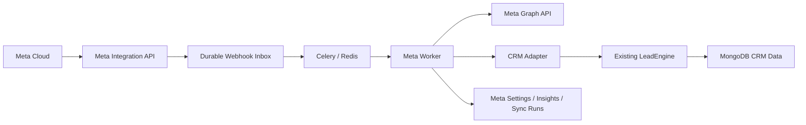
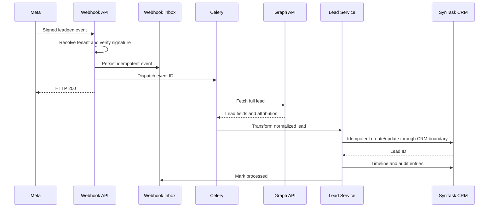

# Meta API Integration Design

**Status:** Approved architecture; implementation not started  
**Date:** 2026-07-20  
**Approach:** Option B — modular integration  
**System:** SynTask CRM

## 1. Purpose

Add a production-safe Meta integration that receives Facebook Lead Ads leads, preserves advertising attribution, synchronizes read-only marketing performance, processes Meta webhooks, and establishes an inbound-only WhatsApp/Messenger foundation.

The integration must remain isolated from core CRM controllers and must be removable or disabled without taking SynTask CRM offline.

## 2. Discovered System Context

SynTask uses:

- FastAPI with versioned routes under `/api/v1`.
- MongoDB with Beanie document models.
- Redis and Celery for asynchronous work.
- React 18, Vite, React Query, Zustand, and Tailwind CSS.
- JWT authentication, role checks, module checks, and `company_id` tenant isolation.
- `SalesProspect` as the canonical CRM lead document.
- `LeadEngine` for lead normalization, duplicate detection, creation, and timeline publication.
- Fernet helpers backed by `ENCRYPTION_KEY` for sensitive values.
- Docker Compose and GitHub Actions for deployment and CI.

Existing outgoing webhook models describe SynTask-to-third-party delivery. Meta inbound events require a separate model because their lifecycle, security checks, retry behavior, and idempotency semantics differ.

## 3. Scope

### Included

- Per-tenant Meta configuration.
- Encrypted storage for database-held tokens and secrets.
- Meta webhook verification.
- `X-Hub-Signature-256` validation over raw request bytes.
- Durable inbound event storage and idempotent asynchronous processing.
- Facebook Lead Ads ingestion.
- Lead attribution fields and indexes.
- Read-only Marketing API synchronization.
- Admin connection status, test connection, manual synchronization, webhook health, and errors.
- CRM lead source and attribution display.
- CRM timeline events for Meta ingestion and synchronization.
- Incoming WhatsApp/Messenger event persistence and CRM contact association.
- Draft-only outgoing responses with human approval required.
- Structured logs, correlation IDs, audit records, health state, and operational counters.
- Tests, documentation, deployment instructions, migrations, and rollback instructions.

### Excluded

- Campaign creation, editing, publishing, pausing, or deletion.
- Ad-set or ad modification.
- Budget or bid modification.
- Automatic campaign optimization.
- Automatic WhatsApp or Messenger sending.
- AI-triggered external sending.
- General-purpose integration/plugin framework.
- Replacing existing CRM lead, timeline, authentication, notification, or deployment systems.

## 4. Architecture

Create an isolated package:

```text
backend/app/integrations/meta/
    __init__.py
    api.py
    client.py
    config_service.py
    health_service.py
    lead_service.py
    insights_service.py
    webhook_service.py
    tasks.py
    models.py
    schemas.py
    signatures.py
    transformers.py
```

Responsibilities:

- `api.py`: public webhook and authenticated admin endpoints.
- `client.py`: read-only Meta Graph API HTTP client, timeouts, pagination, retry classification, and rate-limit handling.
- `config_service.py`: tenant configuration validation, encryption, masking, and audit writes.
- `health_service.py`: connection and integration-health aggregation.
- `webhook_service.py`: verification, signature checks, event extraction, persistence, idempotency, and queue dispatch.
- `lead_service.py`: Meta lead lookup, CRM mapping, tenant-safe upsert, and timeline/audit publication.
- `insights_service.py`: incremental read-only campaign insight synchronization.
- `tasks.py`: Celery entry points with bounded retries and status transitions.
- `models.py`: integration settings, webhook inbox, insights, sync-run, and inbound conversation documents.
- `schemas.py`: request and response contracts that never expose decrypted secrets.
- `signatures.py`: constant-time verification using raw request bytes.
- `transformers.py`: provider payloads to stable internal data transfer objects.

The package may call existing SynTask services through narrow interfaces. Existing CRM modules must not import Meta modules.

## 5. Component Flow



Meta failures stay inside the integration boundary. The global and tenant kill switches stop new processing without changing existing CRM behavior.

## 6. Tenant Resolution

Public Meta webhooks do not carry a SynTask login. Tenant resolution therefore uses server-controlled mappings:

- Each enabled integration configuration belongs to one `company_id`.
- Each configured Meta Page ID and Lead Form ID maps to exactly one enabled tenant.
- Compound unique indexes prevent one Page/Form identity from being active for multiple tenants.
- Webhook URL contains no tenant ID, token, or secret.
- Unknown or ambiguous mappings are persisted as rejected events without CRM writes.
- Super admins must select an explicit tenant before reading or changing tenant configuration.

Every integration-owned document stores `company_id` after successful tenant resolution. Cross-tenant negative tests are mandatory.

## 7. Configuration Model

`MetaIntegrationSettings` stores:

- `company_id`
- `enabled`
- `page_id`
- encrypted `page_access_token`
- `business_id`
- `ad_account_id`
- encrypted `system_user_token`
- `lead_form_id`
- `whatsapp_business_id`
- `default_lead_owner_id`
- `last_connection_test_at`
- `last_connection_status`
- `last_error_code`
- `last_error_at`
- `last_webhook_at`
- `last_lead_sync_at`
- `last_insights_sync_at`
- creation and update actor/timestamps

Environment variables provide deployment defaults and emergency controls:

```text
META_INTEGRATION_ENABLED=false
META_APP_ID=
META_APP_SECRET=
META_VERIFY_TOKEN=
META_PAGE_ID=
META_PAGE_ACCESS_TOKEN=
META_BUSINESS_ID=
META_AD_ACCOUNT_ID=
META_SYSTEM_USER_TOKEN=
META_LEAD_FORM_ID=
META_WHATSAPP_BUSINESS_ID=
```

`META_APP_ID`, `META_APP_SECRET`, and `META_VERIFY_TOKEN` are deployment-wide values for one SynTask Meta app. Keeping the signing secret global allows SynTask to validate the raw webhook body before parsing it or trusting any tenant-routing fields. Supporting multiple Meta apps is outside this design.

Tenant-specific page, system-user, and future messaging tokens may be stored in the database and are encrypted with existing Fernet helpers. APIs return only presence flags and masked identifiers. Secrets, tokens, signatures, and full webhook payloads must not appear in logs.

Activation requires:

- global integration flag enabled;
- tenant integration enabled;
- valid deployment App ID, App Secret, Verify Token, tenant Page ID, access token, Lead Form ID, and default CRM lead owner;
- configured owner belonging to the same tenant;
- unique Page/Form mapping;
- successful connection test.

## 8. Webhook API

Routes follow existing versioning:

```text
GET  /api/v1/integrations/meta/webhook
POST /api/v1/integrations/meta/webhook
```

### Verification

`GET` validates:

- `hub.mode == "subscribe"`
- constant-time equality between `hub.verify_token` and deployment `META_VERIFY_TOKEN`

Valid requests return the exact `hub.challenge`. Invalid requests return an authentication error without revealing which value failed.

### Event ingestion

`POST` performs this order:

1. Read raw request body with a strict size limit.
2. Validate `X-Hub-Signature-256` with deployment `META_APP_SECRET`.
3. Parse JSON only after signature success.
4. Resolve tenant integration from stable Page/Form identifiers.
5. Derive deterministic provider event keys.
6. Insert events into the durable webhook inbox.
7. Dispatch asynchronous tasks.
8. Return HTTP 200.

Duplicate insertions return HTTP 200 and do not dispatch duplicate work. Invalid signatures return an authentication error and never create CRM data.

## 9. Webhook Inbox

`MetaWebhookEvent` stores:

- `id`
- `company_id`
- `provider`
- `provider_event_id`
- `event_type`
- `object_type`
- `object_id`
- `payload`
- `payload_sha256`
- `status`
- `attempt_count`
- `correlation_id`
- `received_at`
- `queued_at`
- `processing_started_at`
- `processed_at`
- `next_retry_at`
- `error_code`
- redacted `error_message`
- `created_at`
- `updated_at`

Statuses:

```text
received
queued
processing
processed
retry_pending
failed
rejected
```

A unique index on provider, tenant, and provider event ID enforces idempotency. When Meta omits a stable event ID, the service derives one from provider, object identity, event timestamp, and payload hash.

## 10. Lead Ads Workflow



Field mapping:

| Meta | SynTask |
|---|---|
| full name | `first_name`, `last_name`, `prospect_name` |
| email | `email` |
| phone | `country_code`, `phone` |
| campaign ID | `meta_campaign_id` |
| ad-set ID | `meta_adset_id` |
| ad ID | `meta_ad_id` |
| form ID | `meta_form_id` |
| lead ID | `meta_lead_id` |
| created time | `meta_created_time` |
| consent | `meta_consent` |
| provider | `source = "meta_lead_ads"` |

Required additive lead fields:

- `meta_lead_id`
- `meta_campaign_id`
- `meta_adset_id`
- `meta_ad_id`
- `meta_form_id`
- `meta_created_time`
- `meta_consent`
- `meta_attribution`

`meta_lead_id` is the primary provider idempotency key. Existing tenant-scoped phone/email duplicate logic remains secondary. A Meta event matching an existing CRM lead links attribution to that lead instead of creating another record.

SynTask currently requires a phone number and assigned owner for every lead. Initial activation therefore requires Meta form phone mapping and a valid tenant default owner. Missing phone or owner sends the event to failed/quarantine state for manual review; fabricated placeholder data is forbidden.

## 11. Marketing Insights

`MetaMarketingInsight` stores tenant-scoped daily snapshots:

- account, campaign, ad-set, and ad IDs/names
- date range and attribution window
- spend
- impressions
- clicks
- conversions
- leads
- revenue when supplied and attributable
- calculated CPL
- calculated ROAS
- source currency
- fetched timestamp

Sync can start from:

- tenant admin `Sync Now`;
- scheduled Celery job;
- retry of a failed sync run.

The client exposes read methods only. It contains no create, update, delete, budget, bid, publish, pause, or resume operations.

Incremental synchronization uses the last successful cursor/date, bounded page sizes, provider rate-limit headers, exponential backoff with jitter, and a maximum retry count.

## 12. Admin API and UI

Authenticated admin endpoints:

```text
GET    /api/v1/integrations/meta/settings
PUT    /api/v1/integrations/meta/settings
POST   /api/v1/integrations/meta/test-connection
POST   /api/v1/integrations/meta/sync
GET    /api/v1/integrations/meta/health
GET    /api/v1/integrations/meta/sync-runs
GET    /api/v1/integrations/meta/webhook-events
POST   /api/v1/integrations/meta/webhook-events/{event_id}/retry
```

All authenticated endpoints require company-admin or super-admin access, explicit tenant resolution, and audit logging. Retry actions operate only on events owned by the selected tenant.

CRM settings UI shows:

- enabled state;
- masked App ID and configured-secret presence;
- Page and Ad Account connection state;
- webhook state and last event;
- last lead and insights synchronization;
- last redacted error;
- Test Connection;
- Sync Now;
- failed event list and controlled retry.

## 13. CRM UI

Lead list and workspace show:

- source badge `Meta Lead Ads`;
- campaign, ad set, ad, and form identifiers;
- Meta Lead ID;
- consent status;
- Meta creation time.

CRM timeline adds:

- `Lead received from Meta`
- `Meta attribution updated`
- `Marketing data synced`
- `WhatsApp message received`
- `Messenger message received`

Timeline data remains tenant-scoped and uses existing CRM timeline boundaries.

## 14. WhatsApp and Messenger Foundation

Incoming webhook events:

- use the same signature validation and durable inbox;
- resolve tenant from configured WhatsApp Business/Page identity;
- match CRM contacts using provider identity and normalized phone;
- persist inbound conversation/message records;
- add CRM timeline events;
- notify authorized users.

Outgoing behavior:

- AI and users may create or edit drafts.
- Drafts store approval state.
- No automatic sending occurs.
- No real Meta sender is registered with the existing `sendWhatsAppMessage` interface in this project phase.
- Future sending requires a separate approved design, an explicit human approval record, permission checks, audit logging, and a send-time confirmation.

## 15. Security

- Validate webhook signatures before parsing or processing.
- Use constant-time secret comparisons.
- Encrypt sensitive database fields with existing Fernet helpers.
- Mask all secrets in API responses and UI.
- Redact tokens, secrets, signatures, personal fields, and raw payloads from logs.
- Apply request-body limits and endpoint-specific rate limits.
- Enforce tenant ownership on every query and mutation.
- Reject unknown tenant mappings.
- Use least-privilege Meta tokens.
- Store correlation IDs, not secrets, in logs.
- Audit configuration reads that reveal masked state, configuration changes, connection tests, manual syncs, retries, lead writes, and approval actions.
- Keep Marketing API operations read-only.
- Keep outgoing messaging disabled.

## 16. Reliability and Error Handling

- Persist before queueing.
- Acknowledge valid duplicate webhooks with HTTP 200.
- Use bounded Celery retries with exponential backoff and jitter.
- Classify errors as validation, authentication, permission, rate limit, transient provider, permanent provider, tenant mapping, or CRM write failure.
- Store redacted error codes/messages on event and sync-run documents.
- Retry only transient classes automatically.
- Failed permanent events remain visible to admins.
- CRM writes and event completion use idempotent operations so worker restarts are safe.
- Health state distinguishes disabled, unconfigured, degraded, and healthy.

## 17. Observability

Every webhook creates one correlation ID propagated through:

```text
webhook request -> durable event -> Celery task -> Graph request -> CRM write -> audit/timeline
```

Structured log fields:

- `integration`
- `provider`
- `company_id`
- `event_id`
- `correlation_id`
- `operation`
- `attempt`
- `duration_ms`
- `outcome`
- `error_code`

Operational counters:

- webhooks received, rejected, duplicated, processed, failed;
- Graph requests, rate limits, retries, failures, latency;
- leads created, linked, updated, quarantined;
- sync runs started, completed, failed, duration;
- messages received and unmatched.

Metrics are exposed through a small provider-neutral interface. If no production metrics backend is available, structured logs and health responses remain the initial implementation; no unverified monitoring vendor is introduced.

## 18. Feature Flags and Emergency Disable

Controls:

- global `META_INTEGRATION_ENABLED`;
- tenant `MetaIntegrationSettings.enabled`;
- separate `lead_sync_enabled`;
- separate `insights_sync_enabled`;
- separate `inbound_messaging_enabled`;
- outgoing messaging remains unavailable.

Emergency disable order:

1. Set global Meta integration flag false.
2. Stop new queue dispatch.
3. Pause Meta Celery task routing.
4. Keep stored events and CRM data intact.
5. Disable Meta webhook subscriptions if incident response requires it.

## 19. Migration Strategy

SynTask has no Alembic-style migration framework. Use explicit idempotent MongoDB migration scripts following existing repository conventions.

Migrations:

1. Add optional Meta fields to existing lead documents only when needed.
2. Create integration collections and compound indexes.
3. Create unique provider and Page/Form mapping indexes.
4. Verify counts, index definitions, and duplicate conflicts before enabling integration.

Scripts support dry-run, tenant filtering where relevant, repeated execution, clear output, and nonzero exit status on failure.

No destructive transformation runs during application startup.

## 20. Deployment

Deployment order:

1. Back up MongoDB.
2. Deploy code with global flag disabled.
3. Run migration dry-run.
4. Run migrations and verify indexes.
5. Start backend and Celery worker.
6. Verify existing health and regression suites.
7. Configure one internal/test tenant.
8. Configure Meta dashboard callback and subscriptions.
9. Test verification, signature rejection, duplicate delivery, and lead ingestion.
10. Enable tenant lead synchronization.
11. Enable insights synchronization after lead ingestion is stable.
12. Expand tenant rollout gradually.

## 21. Rollback

Code rollback:

- disable global flag;
- revert application release;
- keep additive fields and collections readable but inactive.

Worker rollback:

- stop Meta task dispatch and task routing;
- allow unrelated Celery tasks to continue.

Configuration rollback:

- disable tenant configuration;
- rotate/revoke Meta tokens if compromise is suspected;
- remove Meta webhook subscriptions if needed.

Database rollback:

- preserve event and attribution records by default;
- remove new indexes only when they block the prior release;
- run documented rollback scripts only after backup verification;
- never delete ingested CRM leads automatically.

Frontend rollback:

- remove Meta routes/navigation while backend remains disabled.

## 22. Test Strategy

Unit tests:

- verification token success/failure;
- signature success/failure and malformed headers;
- raw-body verification;
- tenant mapping;
- event-key derivation;
- payload transformation;
- token masking/encryption;
- read-only client contract;
- retry classification;
- CPL and ROAS calculations.

Integration tests:

- valid webhook persistence and quick acknowledgement;
- duplicate delivery;
- unknown tenant mapping;
- cross-tenant Page/Form conflict;
- lead creation;
- existing-lead attribution linking;
- missing phone quarantine;
- invalid default owner;
- token expiration;
- Graph API failure and retry;
- worker restart during CRM write;
- insights incremental sync;
- admin permissions;
- negative cross-tenant access;
- outgoing message remains unsent.

Frontend tests:

- admin guard;
- masked secrets;
- connection and health states;
- Test Connection and Sync Now states;
- lead attribution rendering;
- failed event retry permissions;
- no outbound Send action.

Phase gate commands must include repository CI equivalents:

```text
pytest -q tests test_*.py
npm run lint
npm test
npm run build
docker build -t syntask-backend:ci ./backend
docker build -t syntask-frontend:ci ./frontend
```

## 23. Phased Delivery

### Phase A — Foundation

Package boundary, configuration, encryption, models, indexes, feature flags, audit hooks, health contract.

### Phase B — Webhook Inbox

Verification, signature validation, tenant mapping, durable events, idempotency, Celery dispatch, retry visibility.

### Phase C — Lead Ads

Graph lead retrieval, mapping, duplicate reconciliation, CRM adapter, attribution, timeline, admin failure handling.

### Phase D — Marketing Insights

Read-only client, incremental snapshots, scheduled and manual sync, rate-limit handling.

### Phase E — UI

Admin settings/health and CRM attribution/timeline surfaces.

### Phase F — Messaging Foundation

Inbound WhatsApp/Messenger events, contact association, timeline, drafts, approval-state model, no sending.

### Phase G — Certification

Security, performance, regression, deployment, rollback, documentation, production readiness, and Go/No-Go.

Each phase must pass its own tests, lint, type/build checks where applicable, backward-compatibility review, documentation update, and rollback verification before the next phase starts.

## 24. Investor Narrative

The integration converts Meta advertising activity into traceable SynTask revenue operations:

```text
Ad spend
  -> verified lead capture
  -> automatic CRM record
  -> campaign attribution
  -> sales ownership and follow-up
  -> pipeline and revenue visibility
  -> campaign ROI reporting
```

Commercial value:

- shorter lead response time;
- fewer manual imports and lost leads;
- measurable campaign-to-revenue attribution;
- safer scaling through isolated, disableable infrastructure;
- foundation for human-governed AI qualification and messaging;
- no automated spending or messaging risk.

## 25. Acceptance Criteria

The design is implemented only when:

- Meta can be globally and per-tenant disabled.
- Valid webhooks acknowledge quickly and process asynchronously.
- Invalid signatures cannot persist actionable events or create CRM records.
- Duplicate events cannot duplicate CRM leads.
- Every CRM write is tenant-scoped and traceable by correlation ID.
- Tokens remain encrypted and never appear in logs, UI, or API responses.
- Marketing synchronization cannot mutate Meta campaigns.
- WhatsApp/Messenger cannot send automatically.
- Existing APIs, CRM behavior, authentication, RBAC, tests, and deployment remain compatible.
- Migrations are idempotent and rollback instructions are verified.
- Required documentation and production evidence are complete.
