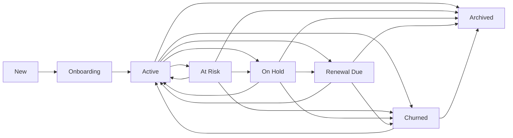

# Clients and Billing User Flows

## Flow Diagram

```mermaid
flowchart TD
  A[Authenticated user] --> B[/clients]
  A --> C[/invoices]
  A --> D[/ledger]
  A --> E[/subscriptions]
  B --> F[Client detail / related projects]
  C --> G[Invoice detail / actions]
```

## Clients
- How the user reaches it: main navigation or sales/CRM adjacent links.
- What they can do: manage clients, inspect details, open related records.
- What happens after every action:
  - Create/edit opens a guided modal sequence with two steps: Contact setup for required identity fields, then Client details for ownership, budget, schedule, address, tags, and notes.
  - Required name and email format validation run before the user can continue to Details or submit.
  - Create/update operations refresh the list/detail.
  - Draft preservation: partially filled values in the create form are kept as a draft when the modal is closed by the cross button, Escape, backdrop, or Cancel, and are restored the next time the form opens, so the user does not need to re-enter them. The draft is cleared only after a successful client creation.
- Backend APIs called: clients APIs and linked document/project endpoints.
- Timeline events created: client lifecycle should be reflected where backend events exist.
- Notifications sent: none explicitly in the frontend.
- Related modules updated: Projects, Invoices, CRM Companies.

### Client lifecycle transitions

`New -> Onboarding -> Active` is sequential. After `Active`, transitions are conditional and are read from the backend lifecycle rules endpoint. Activation requires Primary Contact, Account Owner, Requirements, and Kickoff Meeting. Configured operational or terminal transitions require a reason; archived clients have no destination unless a future authorized restore flow is added.

## Invoices
- How the user reaches it: main navigation.
- What they can do: create and manage invoices.
- What happens after every action: invoice creation/update refreshes billing data.
- Backend APIs called: invoice CRUD/billing endpoints.
- Timeline events created: invoice-related activity may be logged through billing/audit systems.
- Notifications sent: billing notifications may be emitted by backend rules.
- Related modules updated: Ledger, Subscriptions, Clients.

## Ledger
- How the user reaches it: main navigation.
- What they can do: review accounting-like ledger entries.
- What happens after every action: filters or refreshes requery the ledger feed.
- Backend APIs called: ledger APIs.
- Timeline events created: not central.
- Notifications sent: none explicitly in the frontend.
- Related modules updated: Invoices, Billing analytics.

## Subscriptions
- How the user reaches it: main navigation.
- What they can do: review plans, upgrade, confirm payment.
- What happens after every action: plan selection or payment actions update subscription state.
- Backend APIs called: plan list, current subscription, payment intent, payment confirmation.
- Timeline events created: subscription state changes may be logged by billing/admin systems.
- Notifications sent: payment/subscription status notifications may be produced by backend.
- Related modules updated: Super Admin plans, Billing Revenue.
