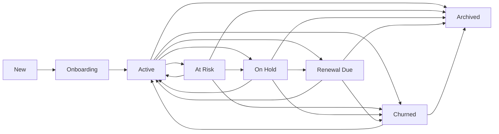

# Clients and Billing User Flows

## Flow Diagram

```mermaid
flowchart TD
  A[Authenticated user] --> B[/clients]
  A --> C[/invoices]
  A --> D[/ledger]
  A --> E[/subscriptions]
  B --> F[Client detail / related projects]
  C --> G[Invoice detail / actions]
```

## Clients
- How the user reaches it: main navigation or sales/CRM adjacent links.
- What they can do: manage clients, inspect details, open related records.
- Workspace sections: Overview, Details, Contacts, Services, Deliverables, Projects, Tasks, Meetings, Files/Documents, Finance, Activity, plus Onboarding when applicable.
- What happens after every action:
  - Create/edit opens a guided modal sequence with two steps: Contact setup for required identity fields, then Client details for ownership, budget, schedule, address, tags, and notes.
  - Required name and email format validation run before the user can continue to Details or submit.
  - Create/update operations refresh the list/detail. The create/edit modal does not close on accidental outside clicks; explicit Cancel or Close still exits. In edit mode, Save Details stores the filled fields without changing lifecycle stage, while Update Client saves and continues the lifecycle action when one is pending. When a lifecycle blocker opens the edit form, a successful Update retries the original stage move with the updated client data instead of forcing the user to click the same stage action again. If Kickoff Meeting is missing, the warning popup includes an inline kickoff scheduler; after scheduling succeeds, the original activation retry runs automatically, and the saved kickoff meeting appears in the client workspace Meetings tab. The workspace overview shows saved primary contact email and phone details.
  - Draft preservation: partially filled values in the create form are kept as a draft when the modal is closed by the cross button, Escape, backdrop, or Cancel, and are restored the next time the form opens, so the user does not need to re-enter them. The draft is cleared only after a successful client creation.
- Backend APIs called: clients APIs and linked document/project endpoints.
- Timeline events created: client lifecycle should be reflected where backend events exist.
- Notifications sent: none explicitly in the frontend.
- Related modules updated: Projects, Invoices, CRM Companies.

### Client lifecycle transitions

`New -> Onboarding -> Active` is sequential. After `Active`, transitions are conditional and are read from the backend lifecycle rules endpoint. Activation requires the backend-calculated onboarding items for payment terms, primary contact, requirements, project creation, team/account owner assignment, kickoff completion, and initial start readiness. The activation response identifies each missing item, its current status, reason, destination tab, and action label; the Client list and workspace status controls show a blocking warning instead of failing the page, and each action opens the matching onboarding tab directly. Configured operational or terminal transitions require a reason; archived clients have no destination unless a future authorized restore flow is added.

### Client onboarding workspace
When a Client is in `onboarding`, its workspace exposes secondary tabs for Overview, Commercial, Contacts, Requirements, Documents, Assets & Access, Project & Team, Kickoff, and Onboarding Document. Existing CRM Contacts, CRM Documents, Projects, Meetings, and Client files are linked as source records; onboarding items do not duplicate them. Status-only dropdowns cannot complete entity-backed or structured-data-backed requirements. Commercial readiness requires deal value, billing frequency, actual payment terms, and engagement start details; budget alone is not enough. Primary Contact readiness requires an existing same-tenant `SalesContact` on the linked `CRMCompany` marked primary; the Contacts tab can select an existing CRM Contact or open an inline add-contact form that saves through the CRM Contacts API, while editing legacy Client name/email/phone cannot satisfy it. Requirements are stored as structured onboarding metadata with business objective, scope, deliverables, audience, and deadlines as required fields; legacy `client.notes` remains readable but is not completion evidence. Brand assets use asset requirements plus asset submissions under onboarding metadata. A submission can come from WhatsApp, Email, Manual Upload, Drive, Client Portal, Physical, or Other, can include files or just a note/reference, and can map one file/submission to multiple requirements or multiple files to one requirement. Required asset readiness counts only verified requirements; received assets can move to replacement required and then back through received to verified. Access rows store status and safe references only; unrelated agreements, invoices, generic documents, notes, passwords, tokens, and plaintext secrets never satisfy access or asset readiness.

Project readiness derives from an actual linked Project. Team readiness derives from a linked Project plus real Client account owner/assignment or Project lead/assignment/team members. Kickoff uses an existing linked/safely matched Meeting where `scheduled` is partial and `completed` is complete; duplicate kickoff meetings are not required. Start readiness requires explicit confirmation stored with `ready`, `confirmed_by`, `confirmed_at`, and optional note; a start date alone is not operational readiness. The Onboarding Document tab generates or regenerates a PDF snapshot from current verified onboarding data and excludes sensitive credentials and internal-only notes. If verified onboarding data changes after generation, the client document is marked stale and the UI shows `Update Available / Regeneration Required`. Each item stores required/optional state, layer status, completion percentage, owner/link metadata, timestamps, validation data, and audit entries.

The onboarding list view shows compact progress and the next required action beside onboarding-stage Clients. Required progress is calculated as completed required items divided by total required items; optional layers never block activation. Tenant isolation is enforced by the Client and linked-record company key, and onboarding edits use the existing company-admin/lead permission gate.

### Client profile, contacts, and services
The Client Workspace Details tab edits canonical Client fields for company/account name, account owner, sales owner, client type, start date, value, address/location, industry, and notes that belong to the client relationship. Commercial summary and relationship information are stored in `Client.lifecycle_metadata.profile`; CRM Company and CRM Contact identity fields remain in their existing collections and are not copied into a separate client profile store.

The Contacts tab lists contacts from the linked same-tenant CRM Company using existing `SalesContact` records. Users can add or edit CRM contacts, mark one contact as primary, and assign relationship roles: Primary Contact, Decision Maker, Finance Contact, Project Contact, Technical Contact, and Approver. Primary contact remains the `SalesContact.is_primary_contact` flag. Other roles are lightweight relationship metadata under `Client.lifecycle_metadata.contact_roles`, keyed by contact id. Contacts from another tenant or unrelated CRM Company are rejected.

The Services tab manages `ClientService` records beneath a Client. A service captures name/type, status, pricing or value, billing cycle, start/end dates, service owner, team, linked Project ids, source Sales lead/category, and notes. Service status can move through planned, active, paused, and ended. Existing Projects can be linked to services and remain the execution source of truth; project records are not duplicated. Sales Won handoff carries the sold service/category from the source lead into one idempotent Client Service record and links the generated/existing Project when available.

### Client deliverables and approval
The Deliverables tab tracks Client-facing outputs beneath the selected Client Service and Project. A Deliverable is distinct from a Task: for example, `Instagram Reel #04` is the Deliverable while `Write Script`, `Edit Video`, and `Internal Review` are existing Work Tasks linked to it. The tab shows Deliverable, Service, Project, Owner, Due Date, Status, Approval, and Revision count, with filters for project, service, status, approval state, and due/overdue.

Deliverable creation requires a same-tenant Client Service and Project. If the Project is already known, the Client does not need to be selected again; the backend validates that Service, Project, Client, and tenant match and links the Project to the Service when safe. Users can link multiple existing Work Tasks or create a new Work Task from the Deliverable row; the Task remains in the Work module and opens through the existing project/task routes.

Deliverable statuses move through `planned -> in_production -> internal_review -> client_review -> revision_required -> approved -> delivered` with backend transition checks. Starting Client Review stores approver/contact, sent timestamp, review token hash, and approval history, preferring a Client contact with role `Approver`. Approval marks the Deliverable approved; revision request stores the note, timestamp, history entry, and increments revision count. Approved Deliverables can then be marked delivered.

### Client communication, meetings, files, and activity
The Communication tab shows client-facing relationship communication from existing CRM activity records and supported Meta Inbox messages. Records are associated through explicit same-tenant Client, CRM Company, CRM Contact, and Project relationships; account owner alone is not enough to include a conversation. Email, call, meeting, follow-up, and supported message channels show channel, contact, sender/receiver, timestamp, preview, and related project/service where present. Internal notes are shown in a separate panel and are not mixed into client-facing communication.

The Meetings tab schedules and completes meetings through the existing Meeting API. Client Workspace meetings resolve by explicit `client_id`, `project_id`, or `contact_id` links plus legacy kickoff/project context. Unrelated meetings are excluded even if the account owner hosted or attended them. Meeting creation validates same-tenant Client, Project, and CRM Contact references.

The Files tab aggregates references from existing Client documents and Deliverable linked files. Categories are Agreements, Requirements, Brand Assets, Reports, Invoices, Deliverables, and Other. Files are referenced in place; the flow does not copy the same file into both Client and Project records just to make it visible in the workspace.

The Activity tab is a chronological, lazy-loaded Client relationship feed with filters for All, Communication, Meetings, Work, Files, and Finance. Sources include Client creation/lifecycle and onboarding changes, Services, Projects, Tasks, Deliverables, Meetings, Communication, file/document additions, and existing invoice/payment events where available. Every source query is tenant scoped by the Client company key and existing linked-record authorization rules.

### Client finance, renewal, and churn
The Finance tab summarizes commercial data from existing Invoices, Invoice payment records, Client Services, Client fields, and signed/completed MSAs. It shows contract/client value, monthly value, total invoiced, total paid, outstanding, overdue amount/count, next invoice, payment terms, and billing frequency. Invoices and payments remain the source of truth; the Client record stores no duplicate invoice or payment rows.

Renewal tracking is lightweight Client lifecycle metadata. Users can save renewal date, contract/service end date, renewal owner, status, value, payment terms, billing frequency, and notes. Starting renewal moves the Client to `renewal_due` only when action is required. Marking renewed preserves the previous renewal snapshot in history, updates supplied value/dates, and returns the Client to `active`.

Churn requires a reason and end date. Supported reasons are Price, Budget, Poor Service, Delivery Delay, Communication Issue, Competitor, No Longer Needed, Business Closed, and Other. Churn records notes and lost value where supplied or calculable, preserves Contacts, Services, Projects, Tasks, Deliverables, Communication, Files, Finance, and Activity, and may safely move active Client Services to Ended. Churned Clients can be archived as historical records; archive does not delete Client data.

### Client health, next action, and escalation
The Client Overview shows Client Health separately from lifecycle stage. Health is calculated from existing same-tenant records: overdue Tasks, overdue Deliverables, Client approval delays, overdue invoices/payments, communication inactivity, missed meetings, renewal risk, and deliverable revision volume where data exists. The user sees both score and level, plus source-linked reasons such as Finance, Deliverables, Meetings, Communication, or Tasks.

Each operational Client receives one generated next action with owner, due date, priority, related entity, and status. Completing the action updates `Client.lifecycle_metadata.client_next_action` and closes the matching open health escalation metadata. At Risk or Critical health creates one open escalation per unresolved issue key, assigned to the account owner or assigned Client owner where available. Escalations recommend action but do not silently change lifecycle; users must use the existing authorized lifecycle transition flow to move a Client to At Risk.

### Client overview, insights, saved views, and automation
The Clients Overview dashboard uses backend aggregation rather than loading all Clients into the browser for management KPIs. It shows tenant-scoped totals for Clients, active Clients, lifecycle At Risk, Renewal Due, outstanding revenue, MRR, active Projects, and average Client Health. Needs Attention items link back to the relevant Client Workspace source tab for overdue payment, critical health, delayed delivery, approval delay, renewal, inactivity, or escalation.

Client Insights stay separate from Sales pipeline reporting. They summarize new, active, churned, renewal, churn reason, revenue/MRR, outstanding, risk/critical health, delayed delivery, and top Client value data where existing Client/Finance records support it. Saved views persist only filter JSON in `client_saved_views`; they do not copy Client records. Built-in automation reuses existing Tasks, Notifications, and AutomationExecution idempotency for payment follow-up, renewal reminders, health escalation, approval delay, and no-activity follow-up.

### AI client intelligence
Client Workspace Overview includes an AI Client Brief generated from the same tenant-scoped workspace data the user can already access. The brief summarizes lifecycle, Health and reasons, active services/projects, pending deliverables, finance aggregates, recent client-facing communication, last/next meeting, renewal, and current next action. Users can ask about what happened recently, what to do next, Health, risk, renewal, or upsell; answers include source references and do not execute actions. Internal-note bodies, file contents, secrets, and credential-like values are excluded or redacted before AI context is built. Admins and leads can run the cleanup audit endpoint to confirm canonical Phase 0-9 Client systems are in use without deleting data.

## Invoices
- How the user reaches it: main navigation.
- What they can do: create and manage invoices.
- What happens after every action: invoice creation/update refreshes billing data.
- Backend APIs called: invoice CRUD/billing endpoints.
- Timeline events created: invoice-related activity may be logged through billing/audit systems.
- Notifications sent: billing notifications may be emitted by backend rules.
- Related modules updated: Ledger, Subscriptions, Clients.

## Ledger
- How the user reaches it: main navigation.
- What they can do: review accounting-like ledger entries.
- What happens after every action: filters or refreshes requery the ledger feed.
- Backend APIs called: ledger APIs.
- Timeline events created: not central.
- Notifications sent: none explicitly in the frontend.
- Related modules updated: Invoices, Billing analytics.

## Subscriptions
- How the user reaches it: main navigation.
- What they can do: review plans, upgrade, confirm payment.
- What happens after every action: plan selection or payment actions update subscription state.
- Backend APIs called: plan list, current subscription, payment intent, payment confirmation.
- Timeline events created: subscription state changes may be logged by billing/admin systems.
- Notifications sent: payment/subscription status notifications may be produced by backend.
- Related modules updated: Super Admin plans, Billing Revenue.
