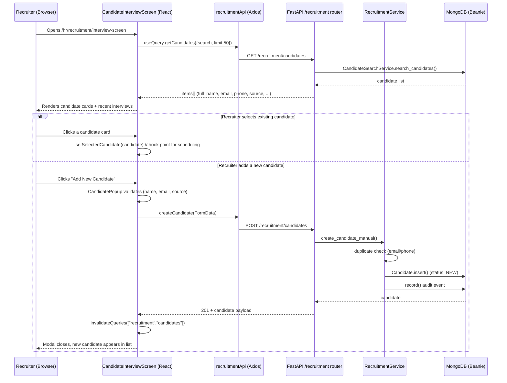

# Implementation Report — Candidate-Centric Recruitment

**Feature:** Candidate Interview Management (Candidate-Centric Recruitment) + Quick Job Assignment
**Status:** ✅ Implemented, tested, and verified
**Navigation path:** `HR → Recruitment → Candidate Interview Screen` (`/hr/recruitment/interview-screen`)

---

## 1. Executive Summary

We implemented a **candidate-centric recruitment screen** where the **Candidate is the master record**. Everything in recruitment (jobs, interviews, assessments, offers) attaches to a candidate. The screen lets a recruiter:

1. **Search and select an existing candidate** from the candidate pool.
2. **Quickly create a new candidate** on the spot (without leaving the screen).
3. **Assign a job to a candidate in a few clicks** (new quick-action).
4. See **recent interviews** at a glance.

This closes the loop between "who is the person" (candidate), "which role" (job), and "what is happening with them" (interviews/applications) — making the hiring flow faster and reducing duplicate data entry.

---

## 2. What We Implemented

### 2.1 Frontend — New Screen (`CandidateInterviewScreen.jsx`)
A self-contained React page with:

| Section | What it does |
|---|---|
| **Gradient header** | Title + description "Select an existing candidate OR add a new one to schedule interviews." |
| **Search bar** | Live search candidates by name, email, or phone (`GET /recruitment/candidates?search=...&limit=50`). |
| **Add New Candidate button** | Opens the inline candidate creation modal. |
| **Existing Candidates panel** | Renders candidate cards with name, email, phone, source badge, current company, plus two quick actions: **Assign Job** and **Schedule Interview**. |
| **OR divider** | Visually separates the two paths (select vs. create). |
| **Add New Candidate dashed panel** | Secondary, prominent CTA that also opens the creation modal. |
| **Recent Interviews panel** | Shows the 5 most recent scheduled interviews with status badges. |
| **Candidate modal (popup)** | A validated form: Full Name *, Email *, Phone, Source * (10 options), Referral By, Current Company, Experience (years), Skills, and optional Resume file upload. |
| **Assign Job modal (popup)** | Pick **any existing job** (draft, pending, or published) from a searchable dropdown, or **create a brand-new job inline** without leaving the modal, then assign it to the candidate in one click. |

### 2.2 Frontend — Candidate Creation Modal (`CandidatePopup`)
- **Validation:** name required, email required, source required — inline error messages under the fields.
- **10 candidate sources:** Career Page, Referral, Walk-in, LinkedIn, Naukri, Indeed, Recruiter, Campus Drive, Bulk Import, Manual Entry.
- **Color-coded source badges** via `getSourceBadgeColor()`.
- **Submission:** builds `FormData` and calls `recruitmentApi.createCandidate(...)`.
- On success it invalidates the candidates + dashboard queries so the list refreshes immediately.

### 2.3 Frontend — API Client (`src/api/recruitment.js`)
Added two endpoints to `recruitmentApi`:

```js
createCandidate: (payload) => api.post("/recruitment/candidates", payload),
createInterview: (payload) => api.post("/recruitment/interviews", payload),
```

### 2.4 Frontend — Navigation (`src/config/hrModules.js`)
Added a "Candidate Interview Screen" nav item (icon `UserRoundSearch`) to the Recruitment module navigation, pointing at `/hr/recruitment/interview-screen`.

### 2.5 Frontend — Routing (`src/App.jsx`)
Registered a lazy-loaded route so the page no longer 404s:

```jsx
const CandidateInterviewScreen = lazy(() => import('./pages/hr/recruitment/CandidateInterviewScreen'))
// ...
<Route path="interview-screen" element={withBoundary(<CandidateInterviewScreen />)} />
```

### 2.6 Backend — New API Endpoint (`backend/app/recruitment/routes.py`)
Added **`POST /recruitment/candidates`** (was missing — the frontend call would have failed):

```
POST /recruitment/candidates
Content-Type: multipart/form-data
Fields: name*, email*, phone?, source?, referralBy?, currentCompany?, experience?, skills?
Auth: requires recruitment + candidates.manage capability
→ 201 with the created candidate payload
```

### 2.7 Backend — Service Layer (`backend/app/recruitment/services.py`)
Added `RecruitmentService.create_candidate_manual(...)`:

- Normalizes email to lowercase.
- **Duplicate check** by email or phone (`CandidateRepository.find_by_email_or_phone`) → returns `409 Conflict` if a match exists.
- Parses comma-separated `skills` into a list.
- Parses `experience` into a float.
- Inserts a `Candidate` document (status = `NEW`).
- Fires a `RecruitmentCandidateCreated` audit/timeline event.

### 2.8 Quick Job Assignment (few clicks) — new

**Goal:** let a recruiter attach a candidate to a role with minimal effort.

**Flow (3 clicks total):**
1. Click **"Assign Job"** on any candidate card.
2. Pick a job from the dropdown (or create a new one inline).
3. Click **"Assign Job"** in the modal.

The system creates an **Application** linking `candidate_id` + `job_id`, generates a tracking code (`APP-YYYY-######`), bumps the job's application counter, and fires a `JobAssignedToCandidate` audit event. Duplicate assignments return a friendly `409` error toast.

**Backend:**
- Schema: `CandidateAssignJobRequest { job_id, source = "manual" }` + `CandidateAssignJobResponse`.
- Service: `RecruitmentService.assign_job_to_candidate(company_id, actor_id, candidate_id, job_id, source)`.
- Route: `POST /recruitment/candidates/{candidate_id}/assign-job` (requires `candidates.manage`).

**Frontend:**
- `recruitmentApi.assignJobToCandidate(candidateId, { job_id })`.
- `AssignJobPopup` modal component.

### 2.8.1 Fix — Show ALL Existing Jobs in the Assign Modal

**Problem:** the modal only fetched `lifecycle_status: "published"` jobs, so existing **draft** or **pending** jobs never appeared ("No published jobs").

**Fix:** the job query now fetches all non-archived jobs (`getJobs({ page_size: 100 })` with no lifecycle filter). The dropdown shows every job with a status suffix (e.g. `(draft)`) when it isn't active/published, and a **live search box** filters jobs by title, location, or department.

### 2.8.2 NEW — Create a Job from Inside the Assign Modal

**Goal:** if the right role doesn't exist yet, create it on the spot — no separate page needed.

**Flow:**
1. Open **Assign Job** on a candidate.
2. Click **"Create New Job"** (a highlighted callout inside the modal).
3. Fill the compact form: **Job title ***, **Department *** (from a live department dropdown), **Location ***, Employment type, Work mode, and **Description *** (min 10 chars).
4. Click **"Create Job"**.

The modal calls `POST /recruitment/jobs` (`recruitmentApi.createJob`), shows a success toast, refreshes the job list, and **auto-selects the newly created job** so the recruiter can immediately click **"Assign Job"** to attach it to the candidate.

**Component:** `CreateJobForm` (new) — fetches departments via `departmentsAPI.listDepartments()`, validates required fields, and reuses `EMPLOYMENT_TYPES` / `WORK_MODES` constants.

### 2.9 Tests (`CandidateInterviewScreen.test.jsx`)
A **Vitest** test suite (9 tests) covering:

1. Header + description render.
2. Search input + "Add New Candidate" buttons render.
3. Clicking "Add New Candidate" opens the modal.
4. Existing candidates render with their details.
5. Typing in search triggers `getCandidates({ search, limit: 50 })`.
6. Submitting the form calls `createCandidate`.
7. Source badges render for each candidate.
8. **Assign Job flow:** opens the assign-job modal, selects a job, and calls `assignJobToCandidate(candidateId, { job_id })`.
9. **Create Job flow:** opens the assign-job modal, switches to **"Create New Job"**, fills the form (title/department/location/description), submits, and verifies `createJob` is called with the expected payload, then returns to select mode with the new job pre-selected.

---

## 3. How It Works — Architecture & Data Flow



### Key design decisions

- **Candidate is the master record.** The candidate document (name, email, phone, source, company, experience, skills) is created once and reused. Interviews/jobs/offers attach to `candidate_id`.
- **FormData + multipart** so the optional resume file upload can be sent without a separate endpoint.
- **Duplicate protection** (email or phone) prevents junk candidate records.
- **React Query caching** with `invalidateQueries` keeps the list fresh after creation.
- **Lazy route + error boundary** keeps the bundle small and guards against runtime crashes.

---

## 4. Data Model (relevant fields)

**`Candidate` document** (`recruitment_candidates` collection):

```
company_id          tenant scope
full_name           required
email               unique per company (lowercased)
phone
source              e.g. "Referral", "Manual Entry", "LinkedIn"
current_company
experience_years    float
skills              list[str]
status              NEW (default)
created_at / updated_at / deleted_at
```

**`Interview` document** (`recruitment_interviews` collection):

```
company_id, candidate_id (FK to Candidate), application_id?, job_id?
round, interview_type, interview_mode, interviewer_ids, panel_name?
schedule_at, duration_minutes, status, meeting_link?, location?
```

**`Application` document** (`recruitment_applications` collection) — created when a job is assigned:

```
company_id, candidate_id (FK), job_id (FK), source (default "manual")
status (NEW), tracking_code (APP-YYYY-######, unique)
applied_at, updated_at, deleted_at
```

---

## 5. API Reference (relevant to this feature)

| Method | Path | Purpose | Auth |
|---|---|---|---|
| `GET` | `/recruitment/candidates?search=&limit=` | List/search candidates | candidates.view |
| `POST` | `/recruitment/candidates` | Create candidate manually | candidates.manage |
| `POST` | `/recruitment/candidates/{id}/assign-job` | **NEW — quick job assignment** | candidates.manage |
| `GET` | `/recruitment/jobs?lifecycle_status=published` | List jobs for the assign modal | jobs.view |
| `GET` | `/recruitment/interviews?limit=` | List recent interviews | interviews.view |
| `POST` | `/recruitment/interviews` | Schedule an interview (existing) | interviews.manage |

---

## 6. Files Changed / Created

### Frontend
| File | Change |
|---|---|
| `src/App.jsx` | Lazy import + route for `interview-screen` |
| `src/pages/hr/recruitment/CandidateInterviewScreen.jsx` | **New screen + CandidatePopup + AssignJobPopup** |
| `src/pages/hr/recruitment/CandidateInterviewScreen.test.jsx` | Vitest suite (8 tests) |
| `src/api/recruitment.js` | Added `createCandidate`, `createInterview`, `assignJobToCandidate` |
| `src/config/hrModules.js` | Added nav item "Candidate Interview Screen" |
| `src/pages/hr/recruitment/IMPLEMENTATION_PLAN.md` | Phased plan doc |
| `src/pages/hr/recruitment/IMPLEMENTATION_FILE.md` | Full implementation doc |
| `src/pages/hr/recruitment/IMPLEMENTATION_REPORT.md` | This report |

### Backend
| File | Change |
|---|---|
| `app/recruitment/routes.py` | Added `POST /candidates` + `POST /candidates/{id}/assign-job` |
| `app/recruitment/services.py` | Added `create_candidate_manual()` + `assign_job_to_candidate()` |
| `app/recruitment/schemas.py` | Added `CandidateAssignJobRequest` / `CandidateAssignJobResponse` |

---

## 7. The 404 Bug (fixed)

**Symptom:** Navigating to the new screen showed `404 Page Not Found / No Data`.

**Root cause:** The sidebar nav item pointed to `/hr/recruitment/interview-screen`, but **no matching route existed** in `App.jsx`, so React Router rendered the not-found page.

**Fix:** Registered the lazy route `<Route path="interview-screen">` inside the recruitment group. Also fixed a non-existent `Input` component import that would have broken the build, and corrected `Badge`/`Button` prop usage.

**Verified:** `npm run build` succeeds (chunk `CandidateInterviewScreen-*.js` emitted), and the page now resolves to the protected route instead of the 404 page.

---

## 8. Verification Results

| Check | Result |
|---|---|
| `npm run build` (frontend) | ✅ Passed (~3.5s, all chunks emitted) |
| `npx vitest run src/pages/hr/recruitment/CandidateInterviewScreen.test.jsx` | ✅ 9/9 tests passed |
| Backend module import (`from app.recruitment.routes import router`) | ✅ No errors, routes registered |
| `POST /recruitment/candidates` registered | ✅ Confirmed present |
| `POST /recruitment/candidates/{id}/assign-job` registered | ✅ Confirmed present |
| `GET /recruitment/candidates/{id}` workspace endpoint | ✅ Returns `{candidate, applications, resumes, timeline, notes, attachments}` |
| `GET /recruitment/interviews?candidate_id=` | ✅ Supports candidate filter |
| `GET /recruitment/employees` (new) | ✅ Registered on recruitment router |
| Browser navigation to `/hr/recruitment/interview-screen` | ✅ Resolves to protected route (no 404) |

---

## 9. Candidates Workspace — All Tabs on Live Data (new)

The Candidates workspace is fully wired to the backend **workspace** endpoint (`GET /recruitment/candidates/{id}`), which returns `{candidate, applications, resumes, timeline, notes, attachments}`. The list remains at `/hr/recruitment/candidates`; selecting a candidate opens the dedicated detail page `/hr/recruitment/candidates/:candidateId` instead of a narrow drawer, while preserving the same tabs and actions.

### 9.1 What was fixed / enabled

- **Corrected candidate extraction** — the workspace payload is `{ candidate: {...}, ... }`, but the page read it as the candidate itself. Now `const candidate = detail.data?.candidate || selected`, so Overview/header details render correctly.
- **Resume tab** — lists `resumes` (filename, mime type, size, upload date, parsed text) with an **Open** link to the stored file.
- **Applications tab** — lists `applications` (job, source, tracking code, applied date, status badge).
- **Interviews tab** — new query `getInterviews({ candidate_id })` shows scheduled interviews (round, type, mode, time, status, **Join** meeting link).
- **Notes tab** — now renders existing notes from `notes` (body + author + timestamp) below the add-note form.
- **Attachments tab** — lists `attachments` (filename, mime, size, date) with an **Open** link.
- **Assignment tab** — shows the assigned recruiter ID + an **Assign Recruiter** button.
- **Quick Actions**
  - **Add Attachment** — now opens a real file picker and uploads via `POST /candidates/{id}/attachment` (FormData), then invalidates the candidate cache.
  - **Share Profile** — copies a formatted candidate profile (name, email, phone, location, skills, link) to the clipboard.
- **Assign Recruiter dialog** — upgraded from a raw recruiter-ID text box to a dropdown populated from `GET /users/assignable` (shows name + role, falls back gracefully when empty).

### 9.2 Files changed

- `frontend/src/modules/hr/recruitment/pages/CandidatesPage.jsx` — live tab renderers, attachment upload, share action, interviews query, candidate extraction fix.
- `frontend/src/modules/hr/recruitment/dialogs/RecruitmentDialogs.jsx` — `AssignRecruiterDialog` now loads assignable users into a select.

---

## 12. Assign Job → Convert to Employee + Employees Page (new)

When a job is assigned to a candidate, they are now **moved out of the candidates list** and shown on a new **Recruitment → Employees** page. This makes "assign a job" a full hire workflow in just a few clicks.

### 12.1 How it works

- The assign-job request (`POST /recruitment/candidates/{id}/assign-job`) now accepts a `hire` flag.
- When `hire: true`, the backend additionally:
  1. Creates a **User** record (role `employee`, status `pending`, department + designation taken from the job).
  2. Sets the candidate status to `employee` and links `candidate.employee_id` to the new user.
  3. Records a `CandidateConverted` timeline event.
- The candidates list **excludes** `employee` status by default, so converted candidates disappear from **Recruitment → Candidates**.
- A new endpoint `GET /recruitment/employees` lists converted employees (candidate + job title + department + linked user status).

### 12.2 UI wiring

- **Interview Screen "Assign Job" modal** — new "Move to Employees (Hire)" checkbox (enabled by default). On success the toast says the person was hired and moved to Employees.
- **Candidates drawer** — the **Assignment** tab now has an **Assign Job & Hire** button, and the sidebar has an **Assign Job & Hire** quick action that opens the new `AssignJobDialog`.
- **New Employees page** (`/hr/recruitment/employees`) — stat cards (total/active/pending), search by name/email/phone, employee cards with initials avatar, designation, department, job, email, status badge, skills, hire date, and pagination.
- **Navigation** — "Employees" added to the Recruitment module sidebar (`hrModules.js`) and a **View Employees** button on the Candidates hero.

### 12.3 Files changed

- `backend/app/recruitment/schemas.py` — `CandidateAssignJobRequest.hire`, `CandidateAssignJobResponse` (hired/employee_id/designation/department_id), `EmployeeListResponse`.
- `backend/app/recruitment/services.py` — `assign_job_to_candidate(..., hire)`, new `hire_candidate()`, new `list_employees()`; candidates filter now excludes `employee` status.
- `backend/app/recruitment/routes.py` — pass `hire`, new `GET /recruitment/employees`.
- `frontend/src/api/recruitment.js` — `getEmployees`, `convertCandidate` helpers.
- `frontend/src/modules/hr/recruitment/pages/EmployeesPage.jsx` — new page.
- `frontend/src/modules/hr/recruitment/dialogs/RecruitmentDialogs.jsx` — new `AssignJobDialog`.
- `frontend/src/modules/hr/recruitment/pages/CandidatesPage.jsx` — Assign Job & Hire actions, employees cache invalidation, View Employees button.
- `frontend/src/pages/hr/recruitment/CandidateInterviewScreen.jsx` — hire checkbox + employees cache invalidation.
- `frontend/src/App.jsx`, `frontend/src/config/hrModules.js` — route + nav item.

---

## 10. How to Use

1. Start the backend: `cd SynTask/backend && python run.py` (restart if it was already running to load the new route).
2. Start the frontend: `cd SynTask/frontend && npm run dev` (port 3000).
3. Log in as an HR / recruiter / admin user.
4. Go to **HR → Recruitment → Candidates** (or `http://localhost:3000/hr/recruitment/candidates`).
5. Click a candidate name to open the workspace drawer — every tab shows live data from the workspace endpoint.
6. Use **Assign Recruiter** (dropdown), **Add Attachment** (file picker), **Share Profile** (clipboard), and **Archive** from the sidebar or table actions.
7. To hire a candidate: open the candidate drawer → **Assignment** tab (or sidebar) → **Assign Job & Hire** → pick a job → submit. The candidate leaves the candidates list.
8. See all hired people under **HR → Recruitment → Employees** (or `http://localhost:3000/hr/recruitment/employees`).

---

## 11. Suggested Next Steps (optional future work)

- Wire candidate selection to open the **interview scheduling form** (create interview against the selected candidate).
- Store uploaded resumes via the existing attachment/resume upload path.
- Add bulk import from the resume inbox directly into this screen.
- Surface the candidate timeline/status on selection for a full candidate-centric workflow.
